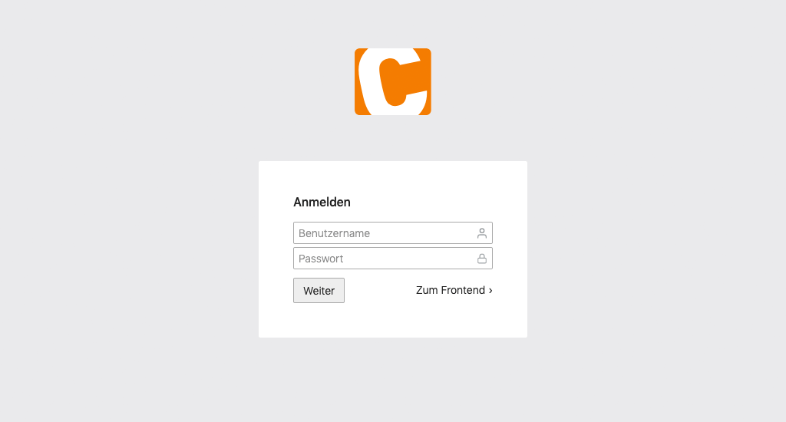
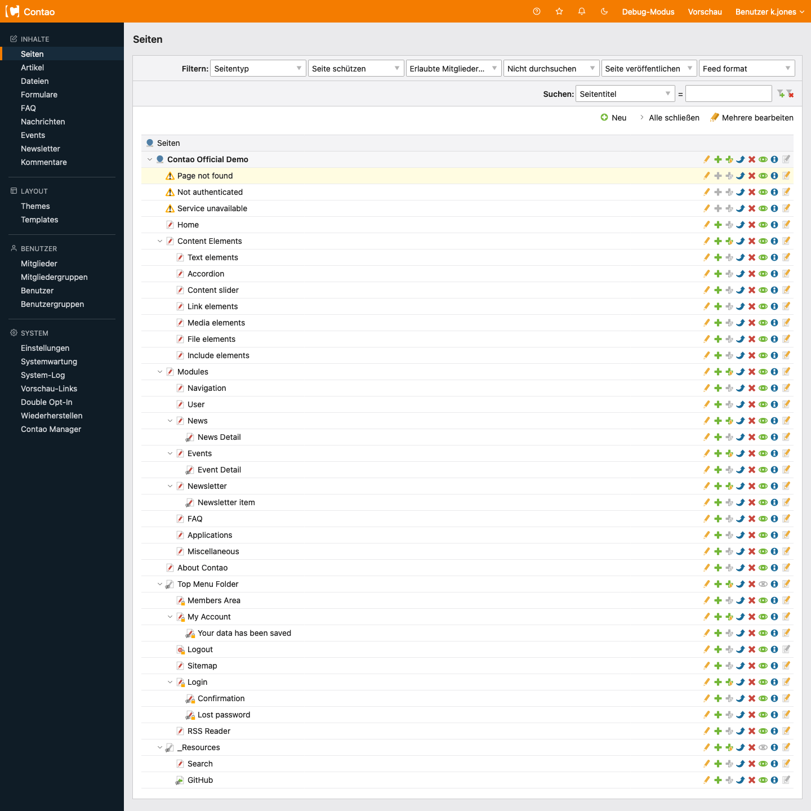
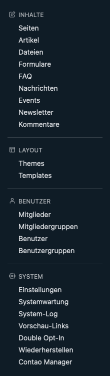
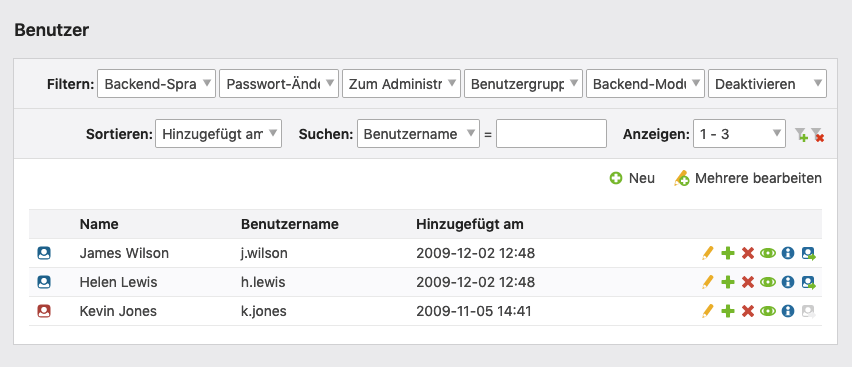
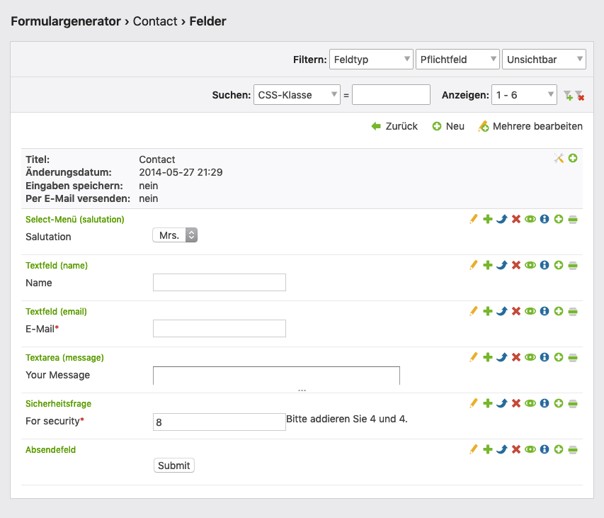

# Contao 5.x — Administrationsbereich (Backend)

Quellen:
- https://docs.contao.org/5.x/manual/de/administrationsbereich/aufruf-und-aufbau-des-backends/
- https://docs.contao.org/5.x/manual/de/administrationsbereich/backend-tastaturkuerzel/
- https://docs.contao.org/5.x/manual/de/administrationsbereich/datensaetze-auflisten/
- https://docs.contao.org/5.x/manual/de/administrationsbereich/datensaetze-bearbeiten/

---

## Backend aufrufen

URL: `https://www.example.com/contao/` (oder individueller Backend-Pfad)

Login mit Benutzername und Passwort. Die Sprache der Backend-Oberfläche richtet sich nach der Browser-Standardsprache.

**Brute-Force-Schutz**: Nach drei falschen Passwörtern wird das Konto für 5 Minuten gesperrt.



---

## Aufbau des Backends

Das Backend gliedert sich in drei Bereiche:

```
┌─────────────────────────────────────────┐
│  INFOBEREICH (oben)                     │
├──────────────┬──────────────────────────┤
│              │                          │
│ NAVIGATION   │   ARBEITSBEREICH         │
│ (links)      │   (rechts)               │
│              │                          │
└──────────────┴──────────────────────────┘
```

### Der Infobereich

Wichtige Links im oberen Bereich:

| Element | Funktion |
|---------|---------|
| Contao-Logo | Zur Backend-Startseite |
| Handbuch | Öffnet die Dokumentation |
| Favorit speichern *(ab 5.1)* | Aktuelle URL als Favorit speichern |
| Hinweise | Modal mit Benachrichtigungen (z. B. Wartungsmodus) |
| Design *(ab 5.1)* | Hell/Dunkel-Modus wählen |
| Debug-Modus | Debug-Modus ein-/ausschalten |
| Vorschau | Frontend in neuem Fenster öffnen |
| Benutzer-Menü | Profil, Sicherheit (2FA), Favoriten, Abmelden |

### Der Navigationsbereich

Links sind Backend-Module in ausklappbaren Gruppen:

| Gruppe | Enthält |
|--------|---------|
| **Inhalte** | Artikel, Nachrichten, Events, Kommentare, Formulare |
| **Layout** | Theme-Manager, Module, Seitenlayouts, Stylesheets, Bildgrößen |
| **Benutzerverwaltung** | Backend-Benutzer, Frontend-Mitglieder |
| **System** | Einstellungen, Wartung, Dateiverwaltung |

Die Navigation wird dynamisch anhand der Benutzerrechte generiert. Nicht freigegebene Module erscheinen nicht.

### Der Arbeitsbereich

Hier werden alle Aufgaben erledigt. Nach dem Login zeigt die Backend-Startseite:
- Datum des letzten Logins
- Übersicht der Tastaturkürzel
- Zuletzt bearbeitete Inhaltsversionen

### Der Vorschaubereich

Über den „Vorschau"-Link erreichbar. Erkennbar an der **Frontend-Preview-Bar** und `preview.php` in der URL.

Optionen in der Vorschaubar:
- **URL kopieren**: Kopiert die URL ohne `preview.php`
- **URL teilen**: Erstellt einen Vorschau-Link zum Teilen
- **Mitglied**: Vorschau als bestimmtes Frontend-Mitglied (für geschützte Bereiche)
- **Nicht veröffentlicht**: Unveröffentlichte Elemente anzeigen/ausblenden

---

## Backend-Tastaturkürzel

Tastenkombinationen beschleunigen die Arbeit erheblich. Format: Windows/Linux | Mac

### Allgemeine Kürzel

| Kürzel | Funktion |
|--------|---------|
| `Alt+Shift+h` / `Ctrl+Opt+h` | Zur Backend-Startseite |
| `Alt+Shift+q` / `Ctrl+Opt+q` | Abmelden |
| `Alt+Shift+b` / `Ctrl+Opt+b` | Zurück zur vorherigen Seite |
| `Alt+Shift+n` / `Ctrl+Opt+n` | Neuen Datensatz erstellen |
| `Alt+Shift+e` / `Ctrl+Opt+e` | Mehrfachbearbeitung aktivieren |
| `Alt+Shift+f` / `Ctrl+Opt+f` | Frontend-Vorschau öffnen |

### Kürzel im Bearbeitungsmodus

| Kürzel | Funktion |
|--------|---------|
| `Alt+Shift+s` / `Ctrl+Opt+s` | Speichern |
| `Alt+Shift+c` / `Ctrl+Opt+c` | Speichern und schließen |
| `Alt+Shift+n` / `Ctrl+Opt+n` | Speichern und neuen Datensatz erstellen |
| `Alt+Shift+d` / `Ctrl+Opt+d` | Speichern und duplizieren |
| `Alt+Shift+e` / `Ctrl+Opt+e` | Speichern und Kindelemente bearbeiten |
| `Alt+Shift+g` / `Ctrl+Opt+g` | Speichern und zurück |

### Kürzel im Mehrfachbearbeitungsmodus

| Kürzel | Funktion |
|--------|---------|
| `Alt+Shift+s` | Ausgewählte Felder bearbeiten |
| `Alt+Shift+d` | Ausgewählte Datensätze löschen |
| `Alt+Shift+c` | Ausgewählte Datensätze kopieren |
| `Alt+Shift+x` | Ausgewählte Datensätze verschieben |
| `Alt+Shift+v` | Ausgewählte Datensätze überschreiben |
| `Alt+Shift+a` | Aliase generieren |
| `Shift` | Mehrere Checkboxen gleichzeitig auswählen |

### Klicken und Bearbeiten

Direktes Bearbeiten durch Klick:

| Aktion | Windows/Linux | macOS |
|--------|-------------|-------|
| Element bearbeiten | `Ctrl + Klick` | `Cmd + Klick` |
| Kindelemente bearbeiten | `Ctrl + Shift + Klick` | `Cmd + Shift + Klick` |

---

## Datensätze auflisten

Contao speichert alle Website-Informationen in einer Datenbank. Die Darstellung variiert je nach Modul.





### Drei Ansichten

#### Listenansicht

Datensätze aus einer einzelnen Tabelle, typischerweise alphabetisch mit Buchstaben-Gruppierung.



#### Elternansicht (Parent View)

Datensätze in Eltern-Kind-Beziehungen (z. B. Artikel mit Inhaltselementen). Zeigt nur Kindelemente des ausgewählten Elternelements.



#### Baumansicht (Tree View)

Hierarchische Strukturen wie Dateisystem oder Seitenstruktur. Dargestellt als aufklappbarer Baum.


### Sortieren und Filtern

Mehrere Filter können gleichzeitig aktiv sein. Aktive Filter erscheinen **gelb hervorgehoben**.

| Option | Funktion |
|--------|---------|
| **Filter** | Datensätze nach Kriterien einschränken |
| **Sortieren** | Sortierspalte wählen |
| **Suchen** | Volltextsuche; Regex unterstützt (z. B. `^a` = beginnt mit „A") |
| **Anzeigen** | Datensätze pro Seite (Standard: 30) |

### Navigationssymbole

Standard-Symbole in allen Ansichten:

| Symbol | Funktion |
|--------|---------|
| Bearbeiten | Datensatz öffnen und bearbeiten |
| Duplizieren | Kopie des Datensatzes erstellen |
| Löschen | Datensatz in Papierkorb verschieben |
| Veröffentlichen/Deaktivieren | Sichtbarkeit im Frontend togglen |
| Informationen | Details anzeigen |

Zusätzliche Symbole je nach Ansicht (Baumansicht z. B. für Unterseiten kopieren, nach/unterhalb einfügen).

### Zwischenablage

Funktioniert im Hintergrund automatisch. Ermöglicht das Duplizieren und Verschieben von Datensätzen über Elternelement-Grenzen hinweg (ähnlich Copy/Paste).

### Gelöschte Datensätze wiederherstellen

Gelöschte Datensätze landen im virtuellen Papierkorb.  
Pfad: **System → Wiederherstellen**  
Datensätze können an ihren ursprünglichen Speicherort zurück verschoben werden.

---

## Datensätze bearbeiten

### Sticky-Tab-Navigation *(ab Contao 5.3)*

Bei langen Formularen mit mehreren Legenden (Abschnitten) wird automatisch eine **Tab-Navigation** generiert. Klicken springt direkt zum Abschnitt — kein langes Scrollen mehr nötig.

### Der Picker

Das Picker-Werkzeug wird an vielen Stellen eingesetzt:

| Verwendung | Verfügbar seit |
|-----------|---------------|
| Links in Inhaltselementen einfügen/bearbeiten | 4.x |
| Bildgrößen in Inhaltselementen | 5.3 |
| Quellelemente in Inhaltselementen | 4.x |
| Weiterleitungsziele in News/Events (Typ „Seite"/„Artikel") | 5.3 |

### Speicheroptionen

| Button | Aktion | Weiterleitung |
|--------|--------|--------------|
| **Speichern** | Speichern | Formular neu laden |
| **Speichern und schließen** | Speichern + schließen | Zurück zur Listenansicht |
| **Speichern und neu** | Speichern | Neues leeres Formular |
| **Speichern und duplizieren** | Speichern + Kopie erstellen | Formular der Kopie |
| **Speichern und bearbeiten** | Speichern | Zu Kindeinträgen |
| **Speichern und Kindelement bearbeiten** *(5.3)* | Speichern | Verschachtelte Kindelemente |
| **Speichern und zurück** | Speichern | Übergeordnete Seite |

### Mehrere Datensätze auf einmal bearbeiten

1. „Mehrere bearbeiten" klicken → Navigationssymbole werden zu Checkboxen
2. Datensätze per Checkbox auswählen (`Shift` für Mehrfachauswahl)
3. Operation wählen:

| Operation | Funktion |
|-----------|---------|
| **Bearbeiten** | Felder ausgewählter Datensätze gemeinsam bearbeiten |
| **Löschen** | Ausgewählte Datensätze löschen |
| **Kopieren** | Per Zwischenablage duplizieren |
| **Verschieben** | Per Zwischenablage verschieben |
| **Überschreiben** | Bestehende Werte ersetzen |
| **Aliase generieren** | Aliase neu berechnen |

#### Modi beim Überschreiben

| Modus | Wirkung |
|-------|---------|
| Ausgewählte Werte hinzufügen | Bestehende Werte behalten, neue hinzufügen |
| Ausgewählte Werte entfernen | Ausgewählte Werte aus bestehenden entfernen |
| Bestehende Einträge überschreiben | Alle bestehenden Werte durch neue ersetzen |

### Versionsverwaltung

Contao erstellt bei jedem Speichern automatisch eine neue Version.

- Dropdown-Menü erscheint, wenn mehrere Versionen vorhanden sind
- Zeigt Datum und Ersteller jeder Version
- **Wiederherstellen**: Frühere Version wiederherstellen
- **Diff-Symbol**: Vergleich der aktuellen Version mit einer früheren (zeigt geänderte Felder)
