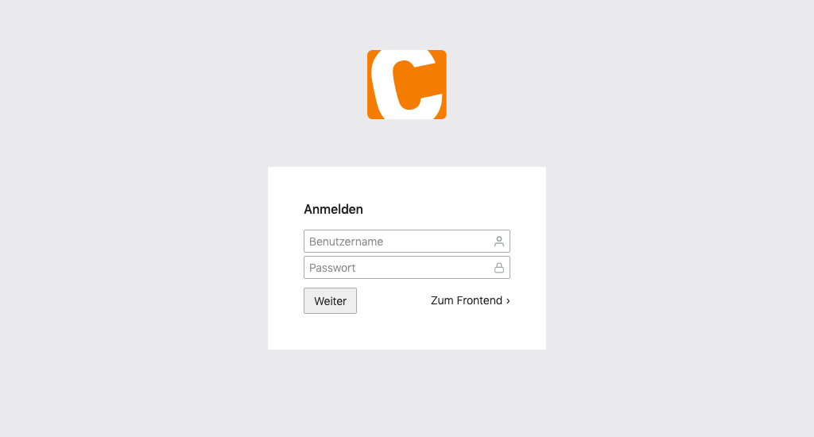
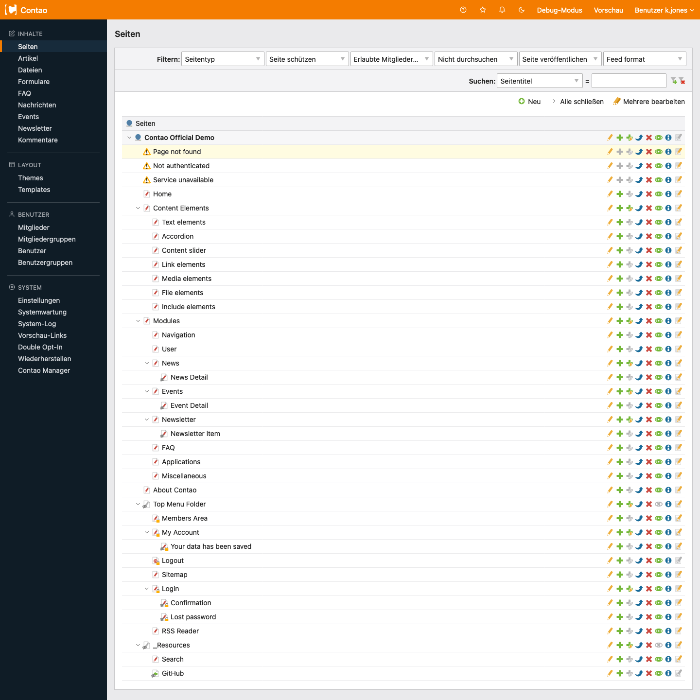
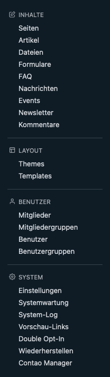
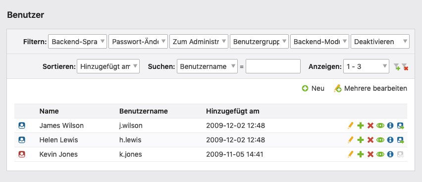
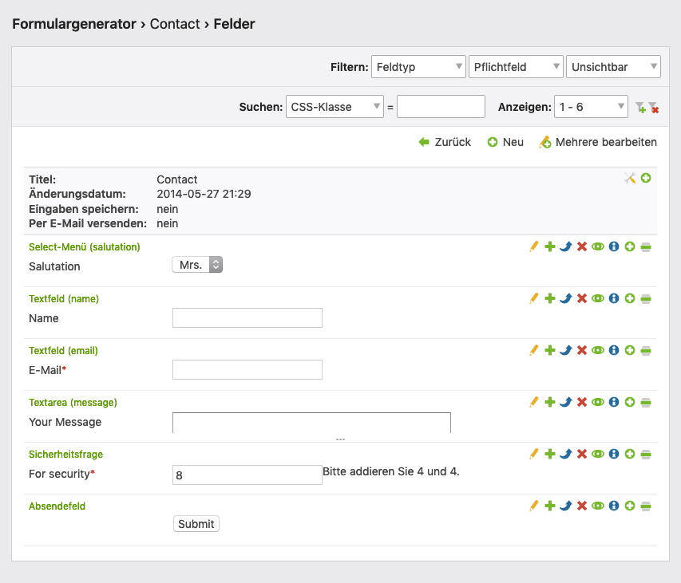

# Contao 5.x — Administration area (backend)

Sources:
- https://docs.contao.org/5.x/manual/de/administrationsbereich/aufruf-und-aufbau-des-backends/
- https://docs.contao.org/5.x/manual/de/administrationsbereich/backend-tastaturkuerzel/
- https://docs.contao.org/5.x/manual/de/administrationsbereich/datensaetze-auflisten/
- https://docs.contao.org/5.x/manual/de/administrationsbereich/datensaetze-bearbeiten/

---

## Contents

- [Calling up the backend](#calling-up-the-backend)
- [Structure of the backend](#structure-of-the-backend)
- [Backend keyboard shortcuts](#backend-keyboard-shortcuts)
- [Listing records](#listing-records)
- [Editing records](#editing-records)

## Calling up the backend

URL: `https://www.example.com/contao/` (or an individual backend path)

Log in with user name and password. The language of the backend interface follows the browser's default language.

**Brute force protection**: after three wrong passwords the account is locked for 5 minutes.



---

## Structure of the backend

The backend is divided into three areas:

```
┌─────────────────────────────────────────┐
│  INFO AREA (top)                        │
├──────────────┬──────────────────────────┤
│              │                          │
│ NAVIGATION   │   WORK AREA              │
│ (left)       │   (right)                │
│              │                          │
└──────────────┴──────────────────────────┘
```

### The info area

Important links in the upper area:

| Element | Function |
|---------|---------|
| Contao logo | To the backend start page |
| **Handbuch** (Manual) | Opens the documentation |
| **Favorit speichern** (Save favourite) *(as of 5.1)* | Save the current URL as a favourite |
| **Hinweise** (Notices) | Modal with notifications (e.g. maintenance mode) |
| **Design** *(as of 5.1)* | Choose light/dark mode |
| **Debug-Modus** (Debug mode) | Switch debug mode on/off |
| **Vorschau** (Preview) | Open the frontend in a new window |
| User menu | Profile, Sicherheit (Security, 2FA), favourites, log out |

### The navigation area

On the left are the backend modules in expandable groups:

| Group | Contains |
|--------|---------|
| **Inhalte** (Content) | Articles, news, events, comments, forms |
| **Layout** | Theme-Manager, modules, Seitenlayouts (page layouts), stylesheets, image sizes |
| **Benutzerverwaltung** (User Management) | Backend users, frontend members |
| **System** | Settings, maintenance, Dateiverwaltung (File Management) |

The navigation is generated dynamically based on the user rights. Modules that have not been granted do not appear.

### The work area

All tasks are carried out here. After login the backend start page shows:
- Date of the last login
- Overview of the keyboard shortcuts
- Most recently edited content versions

### The preview area

Reachable via the "Vorschau" (Preview) link. Recognisable by the **frontend preview bar** and `preview.php` in the URL.

Options in the preview bar:
- **URL kopieren** (Copy URL): copies the URL without `preview.php`
- **URL teilen** (Share URL): creates a preview link for sharing
- **Mitglied** (Member): preview as a specific frontend member (for protected areas)
- **Nicht veröffentlicht** (Unpublished): show/hide unpublished elements

---

## Backend keyboard shortcuts

Key combinations speed up the work considerably. Format: Windows/Linux | Mac

### General shortcuts

| Shortcut | Function |
|--------|---------|
| `Alt+Shift+h` / `Ctrl+Opt+h` | To the backend start page |
| `Alt+Shift+q` / `Ctrl+Opt+q` | Log out |
| `Alt+Shift+b` / `Ctrl+Opt+b` | Back to the previous page |
| `Alt+Shift+n` / `Ctrl+Opt+n` | Create a new record |
| `Alt+Shift+e` / `Ctrl+Opt+e` | Activate multi-editing |
| `Alt+Shift+f` / `Ctrl+Opt+f` | Open the frontend preview |

### Shortcuts in edit mode

| Shortcut | Function |
|--------|---------|
| `Alt+Shift+s` / `Ctrl+Opt+s` | Speichern (Save) |
| `Alt+Shift+c` / `Ctrl+Opt+c` | Save and close |
| `Alt+Shift+n` / `Ctrl+Opt+n` | Save and create a new record |
| `Alt+Shift+d` / `Ctrl+Opt+d` | Save and duplicate |
| `Alt+Shift+e` / `Ctrl+Opt+e` | Save and edit child elements |
| `Alt+Shift+g` / `Ctrl+Opt+g` | Save and go back |

### Shortcuts in multi-edit mode

| Shortcut | Function |
|--------|---------|
| `Alt+Shift+s` | Edit the selected fields |
| `Alt+Shift+d` | Delete the selected records |
| `Alt+Shift+c` | Copy the selected records |
| `Alt+Shift+x` | Move the selected records |
| `Alt+Shift+v` | Overwrite the selected records |
| `Alt+Shift+a` | Generate aliases |
| `Shift` | Select several checkboxes at once |

### Click and edit

Direct editing by clicking:

| Action | Windows/Linux | macOS |
|--------|-------------|-------|
| Edit an element | `Ctrl + click` | `Cmd + click` |
| Edit child elements | `Ctrl + Shift + click` | `Cmd + Shift + click` |

---

## Listing records

Contao stores all website information in a database. The presentation varies depending on the module.





### Three views

#### List view

Records from a single table, typically alphabetically with letter grouping.



#### Parent view (Elternansicht)

Records in parent-child relationships (e.g. articles with content elements). Shows only the child elements of the selected parent element.



#### Tree view (Baumansicht)

Hierarchical structures such as the file system or the Seitenstruktur (Page Structure). Presented as an expandable tree.


### Sorting and filtering

Several filters can be active at the same time. Active filters appear **highlighted in yellow**.

| Option | Function |
|--------|---------|
| **Filter** | Restrict records by criteria |
| **Sortieren** (Sort) | Choose the sort column |
| **Suchen** (Search) | Full text search; regex supported (e.g. `^a` = starts with "A") |
| **Anzeigen** (Display) | Records per page (default: 30) |

### Navigation icons

Standard icons in all views:

| Icon | Function |
|--------|---------|
| Edit | Open and edit a record |
| Duplicate | Create a copy of the record |
| Delete | Move the record to the recycle bin |
| Publish/deactivate | Toggle visibility in the frontend |
| Information | Show details |

Additional icons depending on the view (in the tree view, for example, for copying subpages, pasting after/below).

### Clipboard

Works automatically in the background. Allows records to be duplicated and moved across parent element boundaries (similar to copy/paste).

### Restoring deleted records

Deleted records end up in the virtual recycle bin.  
Path: **System → Wiederherstellen** (Restore)  
Records can be moved back to their original storage location.

---

## Editing records

### Sticky tab navigation *(as of Contao 5.3)*

For long forms with several legends (sections) a **tab navigation** is generated automatically. Clicking jumps directly to the section — no more long scrolling.

### The picker

The picker tool is used in many places:

| Use | Available since |
|-----------|---------------|
| Inserting/editing links in content elements | 4.x |
| Image sizes in content elements | 5.3 |
| Source elements in content elements | 4.x |
| Redirect targets in news/events (type "Seite"/"Artikel") | 5.3 |

### Save options

| Button | Action | Redirect |
|--------|--------|--------------|
| **Speichern** (Save) | Save | Reload the form |
| **Speichern und schließen** (Save and close) | Save + close | Back to the list view |
| **Speichern und neu** (Save and new) | Save | New empty form |
| **Speichern und duplizieren** (Save and duplicate) | Save + create a copy | Form of the copy |
| **Speichern und bearbeiten** (Save and edit) | Save | To the child entries |
| **Speichern und Kindelement bearbeiten** (Save and edit child element) *(5.3)* | Save | Nested child elements |
| **Speichern und zurück** (Save and go back) | Save | Parent page |

### Editing several records at once

1. Click "Mehrere bearbeiten" (Edit multiple) → the navigation icons turn into checkboxes
2. Select records via checkbox (`Shift` for multiple selection)
3. Choose an operation:

| Operation | Function |
|-----------|---------|
| **Bearbeiten** (Edit) | Edit the fields of the selected records together |
| **Löschen** (Delete) | Delete the selected records |
| **Kopieren** (Copy) | Duplicate via the clipboard |
| **Verschieben** (Move) | Move via the clipboard |
| **Überschreiben** (Overwrite) | Replace existing values |
| **Aliase generieren** (Generate aliases) | Recalculate the aliases |

#### Modes when overwriting

| Mode | Effect |
|-------|---------|
| Add the selected values | Keep existing values, add the new ones |
| Remove the selected values | Remove the selected values from the existing ones |
| Overwrite existing entries | Replace all existing values with the new ones |

### Version management

Contao automatically creates a new version every time you save.

- A dropdown menu appears when several versions exist
- Shows the date and creator of each version
- **Wiederherstellen** (Restore): restore an earlier version
- **Diff icon**: comparison of the current version with an earlier one (shows the changed fields)
