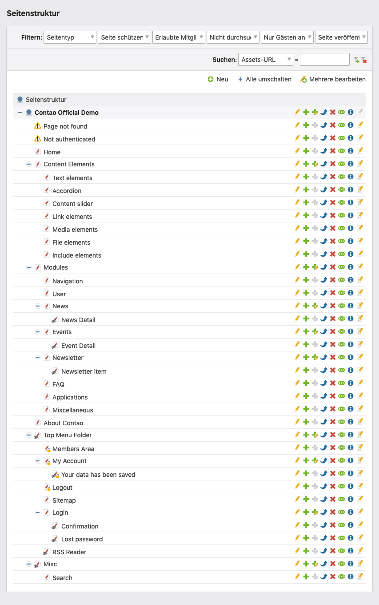
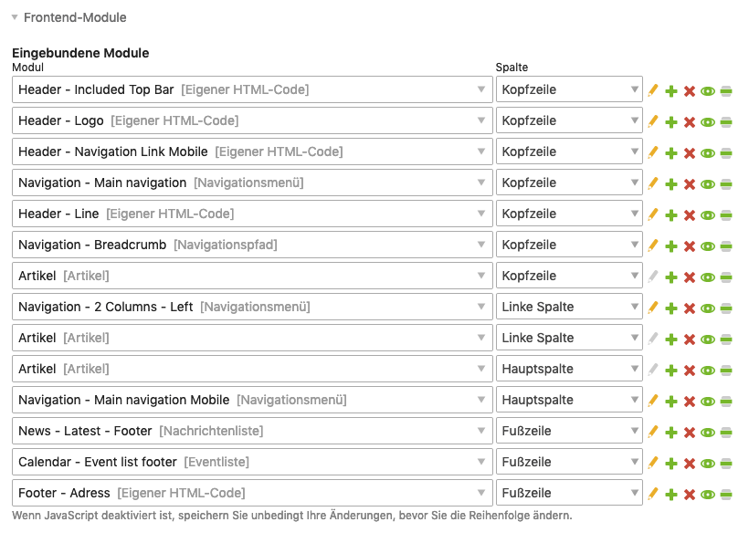
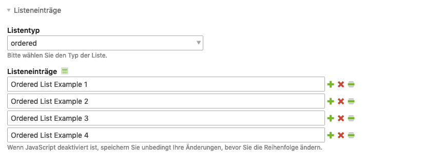

# Contao 5.x — Introduction (Overview)

Sources:
- https://docs.contao.org/5.x/manual/de/einleitung/
- https://docs.contao.org/5.x/manual/de/einleitung/contao-open-source-cms/
- https://docs.contao.org/5.x/manual/de/einleitung/das-contao-netzwerk/
- https://docs.contao.org/5.x/manual/de/einleitung/contao-im-schnelldurchlauf/

---

## Contents

- [What is Contao?](#what-is-contao)
- [Contao at a glance](#contao-at-a-glance)
- [The Contao network](#the-contao-network)

## What is Contao?

Contao is a **web content management system (WCMS)** published as open source software under the **LGPL** (Lesser General Public License). It is designed for managing online content and enables users without HTML knowledge to maintain professional websites.

### Classification as a CMS

A content management system (CMS) manages content and offers:
- Collaborative work by multiple users
- Version management with an undo function
- Precise access rights per user
- Workflows (e.g. an editor creates, the editor-in-chief publishes)
- Abstraction of complex tasks (forms, maps)
- 24/7 access via web browser

### Open source and licence

Contao is licensed under the **LGPL** (originally GPL). The essential difference:
- GPL: extensions would also have to be published as open source
- LGPL: third-party developers may develop proprietary extensions for Contao

Basic rights under the LGPL/GPL:
1. Use the program
2. Modify it freely
3. Duplicate it
4. Distribute it
5. Make it publicly accessible

Obligations: copyright notices must be preserved; no redistribution under other licences.

---

## Contao at a glance

### Backend and frontend

Contao is divided into two areas:
- **Backend** (`/contao`): administration area where articles are written and pages are managed
- **Frontend**: the actual website for visitors

Backend access: URL of the website + `/contao` → log in with user name and password.

### Benutzer (users) vs. Mitglieder (members)

| Term | Description |
|---------|-------------|
| **Benutzer** (Users) | People with backend access (editors, administrators) |
| **Mitglieder** (Members) | People with frontend access (only needed for protected areas) |

### Seitenstruktur (Page Structure) as the central element

Contao is **page-based**. The Seitenstruktur (Page Structure) is the central element:
- Visitors call up pages, not individual posts
- Pages are organised hierarchically (parent/child pages)
- Navigation menus are generated automatically from the structure
- Properties (layout, access rights) are inherited by subpages

### Seitenlayouts (Page layouts)

Every page is linked to a **Seitenlayout** (Page layout), which:
- Divides the page into layout sections (header, main column, footer etc.)
- Dynamically generates a virtual template
- Embeds the CSS formatting

Standard layout sections: header, left column, main column, right column, footer.

### Frontend modules

**Frontend modules** are placed inside the activated layout sections:
- Modules are executed in order and generate HTML
- Contao contains module types for navigation, user management, forms etc.
- Further modules via extensions

### Themes

Finished designs can be exported and imported as **Themes**:
- Contains stylesheets, frontend modules, page layouts and files
- Portable between Contao installations

### Articles and content elements

- **Article**: container for page content, each assigned to one page
- **Content elements**: types within an article (text, images, tables, links etc.)
- Several articles are possible per page, assigned to different layout sections
- Drag & drop for repositioning elements

**Exception**: dynamic content such as news or events is managed in separate modules.

---

## The Contao network

### Official resources

| Resource | URL |
|-----------|-----|
| Project website | contao.org |
| Extensions | extensions.contao.org |
| Development (monorepo) | github.com/contao/contao |
| Manual | docs.contao.org |
| Events | contao.org/de/veranstaltungen.html |
| Network overview | contao.org/de/netzwerk.html |

### Project website contao.org — areas

- **Entdecken** (Discover): features, news, demo, events, case studies, team (all important information in one place)
- **Download**: program downloads, logos, release plan
- **Partner**: agencies and service providers
- **Support**: FAQ, bug reporting, network
- **Verein** (Association): the Contao association, founded in Switzerland in 2012, promotes the project through events, communication and funding

### Community

- **German-language forum**: community.contao.org/de/
- **Slack**: Contao Slack workspace
- **Social media**: Facebook, Instagram, LinkedIn, Pinterest, Twitter/X, YouTube

### Development

- **GitHub monorepo**: github.com/contao/contao — transparent development with monthly public calls
- **Reporting issues**: first check whether the bug has already been reported, whether the latest stable version is being used, and how it can be reproduced

### Bug reporting — checklist

1. Has the bug already been reported? (search the issues)
2. Is the latest stable Contao version being used?
3. How can the bug be reproduced in a fresh installation?
4. How can it be reproduced in the online demo?
