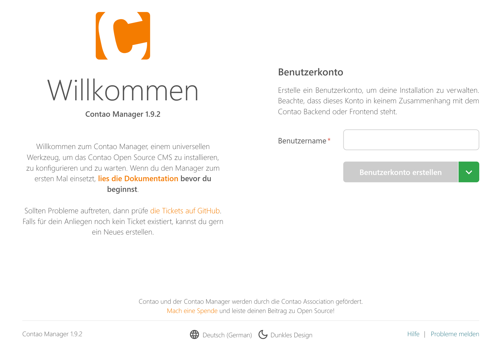

# Contao 5.x — Installation

Quellen:
- https://docs.contao.org/5.x/manual/de/installation/systemvoraussetzungen/
- https://docs.contao.org/5.x/manual/de/installation/contao-installieren/
- https://docs.contao.org/5.x/manual/de/installation/contao-aktualisieren/
- https://docs.contao.org/5.x/manual/de/installation/contao-manager/
- https://docs.contao.org/5.x/manual/de/installation/erweiterungen-installieren/
- https://docs.contao.org/5.x/manual/de/anleitungen/lokale-installation/ddev/
- https://docs.contao.org/5.x/manual/de/anleitungen/lokale-installation/devilbox/
- https://docs.contao.org/5.x/manual/de/anleitungen/lokale-installation/laragon/
- https://docs.contao.org/5.x/manual/de/anleitungen/lokale-installation/xampp/

---

## Systemvoraussetzungen

### Empfohlene Versionen

| Software | Mindestversion | Empfohlen |
|----------|---------------|-----------|
| PHP | 8.1 | 8.4+ (neueste Patch-Version) |
| MySQL | 5.7.6 / MariaDB 10.4.3 | 8.0+ |

### Erforderliche PHP-Erweiterungen

DOM, PCRE, Intl, PDO, ZLIB, JSON, Curl, Mbstring, GD, File Information.
Ab PHP 8.3: zusätzlich **Sodium**.

### Bildverarbeitung

Contao wählt automatisch eine Bildverarbeitungsbibliothek:
- GD: erforderlich (Standard)
- ImageMagick oder GraphicsMagick: bessere Leistung

### MySQL-Anforderungen

- Tabellenformat: **InnoDB**
- Zeichensatz: **UTF8mb4**
- Mindestversion ab Contao 5.6: MySQL 5.7.6 oder MariaDB 10.4.3

### Webserver-Konfiguration

- **Document Root** muss auf den `public/`-Unterordner zeigen
- URL-Rewriting muss aktiviert sein (alle Anfragen durch `index.php`)
- Pro Contao-Installation wird eine eigene (Sub)Domain benötigt

---

## Installation

### Weg 1: Contao Manager (empfohlen für Einsteiger)

#### Schritt 1 — Contao Manager installieren

1. `contao-manager.phar` von contao.org herunterladen
2. Datei in `public/` umbenennen zu `contao-manager.phar.php`
3. Per FTP/SFTP auf den Server hochladen

#### Schritt 2 — Manager aufrufen und konfigurieren

URL: `https://www.example.com/contao-manager.phar.php`



Grundkonfiguration:
- Neuen Manager-Benutzer anlegen (unabhängig vom späteren Contao-Benutzer)
- PHP-Binary-Pfad wird automatisch erkannt
- **Composer Resolver Cloud** aktivieren (wenn Server wenig RAM hat): Abhängigkeiten werden in der Cloud der Contao Association aufgelöst

#### Schritt 3 — Contao installieren

Im Manager: Gewünschte Version wählen → Initiale Konfiguration → „Installieren" klicken.
Installation dauert mehrere Minuten. Konsolenausgabe über Icon einsehbar.

#### Schritt 4 — Datenbank aktualisieren

Contao Installtool öffnen → Datenbankänderungen prüfen und ausführen.

---

### Weg 2: Kommandozeile (Composer)

#### Voraussetzungen

SSH-Zugang zum Server, Composer installiert.

#### Installation

```bash
# SSH verbinden
ssh benutzername@example.com
cd www

# Contao installieren (example = Zielverzeichnis, 5.7 = Version)
php composer.phar create-project contao/managed-edition example 5.7
```

#### Hosting konfigurieren

Document Root auf `/www/example/public` zeigen lassen.

#### Datenbank aktualisieren

```bash
php vendor/bin/contao-console contao:migrate

# Optional: Datenbank anlegen
php vendor/bin/contao-console doctrine:database:create
```

Datenbankverbindung in `config/parameters.yaml` oder `.env`:
```yaml
parameters:
    database_host: localhost
    database_port: 3306
    database_user: root
    database_password: null
    database_name: contao
```

#### Backend-Benutzer anlegen

```bash
php vendor/bin/contao-console contao:user:create
```

---

## Contao aktualisieren

### Update-Zyklus (Semantic Versioning)

| Typ | Beispiel | Bedeutung |
|-----|---------|-----------|
| **Major-Release** | 5.x | Vollständig neue Version, Breaking Changes möglich |
| **Minor-Release** | 5.7 | Neue Funktionen, kleinere Anpassungen nötig |
| **Bugfix-Release** | 5.7.1 | Fehlerbehebung, problemlos |
| **LTS** | 4.13, 5.3 | 3 Jahre Bugfixes + 1 Jahr Sicherheitsupdates |

**Vor jedem Update:** Backups von `composer.json`, `composer.lock` und der Datenbank erstellen!

### Update per Contao Manager

**Bugfix-Update**: Im Manager „Pakete aktualisieren" klicken.

**Minor-Update**: Zahnrad-Symbol neben „Contao Open Source CMS" → gewünschte Version eingeben → „Pakete aktualisieren" → „Änderungen anwenden".

Danach Installtool öffnen und Datenbankänderungen ausführen.

### Update per Kommandozeile

**Bugfix-Update**:
```bash
composer update
```

**Minor-Update** — zuerst `composer.json` anpassen:
```json
{
    "require": {
        "contao/manager-bundle": "5.7.*"
    }
}
```
Dann:
```bash
composer update
vendor/bin/contao-console contao:migrate
```

### Lokales Update (ohne Composer Resolver Cloud)

Nützlich wenn der Hosting-Server zu wenig RAM für `composer update` hat:

1. `composer.json` und `composer.lock` vom Server lokal kopieren
2. Lokal `composer update` ausführen (spart Server-Ressourcen)
3. Aktualisierte `composer.lock` zurück auf Server kopieren
4. Auf Server: `composer install` (nur installieren, nicht auflösen)
5. Datenbank aktualisieren

Für abweichende PHP-Versionen in `composer.json`:
```json
"config": {
    "platform": {
        "php": "8.2.99"
    }
}
```

---

## Der Contao Manager

### Funktionen

- Contao installieren und aktualisieren
- Erweiterungen suchen, installieren und entfernen
- Cache leeren (Systemwartung)
- Benutzer einladen (ab Manager 1.9)

### Häufige Probleme

#### Passwort vergessen

1. Per FTP `contao-manager/users.json` löschen
2. Manager URL aufrufen → neuen Admin-Benutzer anlegen
3. Falls Login-Maske trotzdem erscheint: Cookies löschen oder Inkognito-Modus verwenden

#### Manager hängt

Datei `contao-manager/task.json` löschen → Manager sollte wieder funktionieren.

#### Manager umbenennen (`.phar`-Datei)

Beliebiger Dateiname möglich. In `config/config.yaml` eintragen:
```yaml
contao_manager:
    manager_path: dein-name.phar.php
```
Danach App-Cache leeren.

### Manager-Benutzerrollen (ab Version 1.9)

| Rolle | Berechtigungen |
|-------|---------------|
| READ | Pakete anzeigen, Logs lesen |
| UPDATE | Pakete aktualisieren, Wartungsaufgaben |
| INSTALL | Pakete installieren, Systemeinstellungen |
| ADMIN | Vollzugriff inkl. Benutzerverwaltung |

---

## Erweiterungen

### Suchen

- Website: extensions.contao.org
- Im Contao Manager: Suchfeld in bestehender Installation
- Kommandozeile: `php composer.phar search <suchbegriff>`

### Installation per Contao Manager

1. Im Manager einloggen
2. Erweiterung suchen (z. B. „EasyThemes")
3. „Hinzufügen" klicken (für weitere Erweiterungen wiederholen)
4. „Pakete" Tab → „Änderungen anwenden"
5. Nach Abschluss: Installtool für Datenbank-Update

### Installation per Kommandozeile

```bash
# Einzelne Erweiterung
php composer.phar require terminal42/contao-easy_themes

# Mehrere Erweiterungen
php composer.phar require terminal42/notification_center terminal42/contao-leads

# Datenbank aktualisieren
php vendor/bin/contao-console contao:migrate
```

---

## Lokale Entwicklungsumgebungen

### DDEV (empfohlen, plattformübergreifend)

**Voraussetzung**: Docker installiert.

#### Setup per Composer

```bash
mkdir contao && cd contao

# DDEV konfigurieren
ddev config --project-type=php --docroot=public --webserver-type=apache-fpm --php-version=8.2

# Contao 5.7 installieren
ddev composer create-project contao/managed-edition:5.7

# Datenbankverbindung und Mailer setzen
ddev dotenv set .env.local --database-url=mysql://db:db@db:3306/db --mailer-dsn=smtp://localhost:1025

# Datenbank migrieren
ddev exec contao-console contao:migrate --no-interaction

# Admin-Benutzer anlegen
ddev exec contao-console contao:user:create \
    --username=admin --name=Administrator \
    --email=admin@example.com --language=de \
    --password=Password123 --admin

# Backend öffnen
ddev launch contao
```

#### Nützliche DDEV-Befehle

| Befehl | Funktion |
|--------|---------|
| `ddev start` / `ddev stop` | Projekt starten/stoppen |
| `ddev poweroff` | Alle Container stoppen |
| `ddev ssh` | Container-Shell öffnen |
| `ddev describe` | Services und Zugangsdaten anzeigen |
| `ddev xdebug on` | XDebug aktivieren |

#### DDEV-Cronjob einrichten (ab Contao 5.5)

```bash
ddev add-on get ddev/ddev-cron
```

Datei `/.ddev/web-build/contao.cron` anlegen:
```
* * * * * php /var/www/html/vendor/bin/contao-console contao:cron
```

Dann: `ddev restart`

#### Datenbank-Tools

```bash
# Adminer
ddev add-on get ddev/ddev-adminer && ddev restart

# phpMyAdmin
ddev add-on get ddev/ddev-phpmyadmin && ddev restart
```

---

### Docker Devilbox

**Voraussetzung**: Docker und Docker Compose installiert.

#### Konfiguration (`.env`-Datei)

```
HTTPD_DOCROOT_DIR=public
HTTPD_SERVER=apache-2.4
PHP_SERVER=8.2
MYSQL_SERVER=mariadb-10.3
```

**Wichtig**: Einträge nicht löschen, nur kommentieren/auskommentieren.

#### Devilbox starten

```bash
# Erstmaliger Start (Vordergrund für Fehlererkennung)
docker-compose up httpd php mysql

# Folgestarts im Hintergrund
docker-compose up -d httpd php mysql
```

#### Devilbox stoppen

```bash
docker-compose stop
docker-compose rm -f
```

#### Contao installieren

1. Verzeichnis in `data/www/contao4/` anlegen
2. Unterordner `public/` erstellen
3. Contao Manager (`contao-manager.phar.php`) hineinkopieren
4. In `/etc/hosts`: `127.0.0.1 contao4.loc` eintragen
5. Im Browser: `http://contao4.loc/contao-manager.phar.php`

#### Datenbank-Zugangsdaten (Devilbox)

| Eintrag | Wert |
|---------|------|
| Host | mysql |
| Benutzername | root |
| Passwort | (leer) |

---

### Laragon (Windows)

#### Voraussetzungen

Windows 7–10, Symlink-Berechtigung für normalen Benutzer einrichten (via Polsedit: Richtlinie „Create symbolic links").

#### Installation

1. `laragon-wamp.exe` von github.com/leokhoa/laragon herunterladen
2. Installieren, Services starten
3. Composer global installieren
4. `laragon\usr\laragon.ini` anpassen: `QuickSettings` um `sys_temp_dir` erweitern
5. PHP Memory Limit auf `-1` setzen

#### Contao über Laragon installieren

Menü → Neue Website → „Contao 4.9 Website…" (oder entsprechende Version) → Projektname eingeben.

Laragon erstellt automatisch:
- Datenbank mit dem Projektnamen
- Virtuellen Host `projektname.local`

#### URLs nach Installation

| Ziel | URL |
|------|-----|
| Frontend | http://mycompany.local/ |
| Backend | http://mycompany.local/contao |
| Installtool | http://mycompany.local/contao/install |
| Manager | http://mycompany.local/contao-manager.phar.php |

---

### XAMPP (Windows)

#### Konfiguration

1. XAMPP Portable entpacken, `setup_xampp.bat` ausführen
2. `xampp-control.exe` als Administrator starten
3. In `apache\php.ini`: `memory_limit = -1` und `extension=intl` aktivieren
4. In `httpd.conf` am Ende hinzufügen (ThreadStackSize erhöhen):

```apache
<IfModule mpm_winnt_module>
    ThreadStackSize 8388608
</IfModule>
```

#### Composer installieren

In XAMPP-Shell:
```bash
php -r "copy('https://getcomposer.org/installer', 'composer-setup.php');"
php composer-setup.php
php -r "unlink('composer-setup.php');"
```

#### Contao installieren

```bash
php ../composer.phar create-project contao/managed-edition demo 5.7
```

#### vHost konfigurieren (empfohlen)

In `\apache\conf\extra\httpd-vhosts.conf`:
```apache
<VirtualHost *:80>
  DocumentRoot "D:\vhost\demo\public"
  ServerName demo.local
  <Directory D:\vhost\demo>
    Options +FollowSymlinks
    AllowOverride All
    Require all granted
  </Directory>
</VirtualHost>
```

In `C:\Windows\System32\drivers\etc\hosts`:
```
127.0.0.1 demo.local
```
