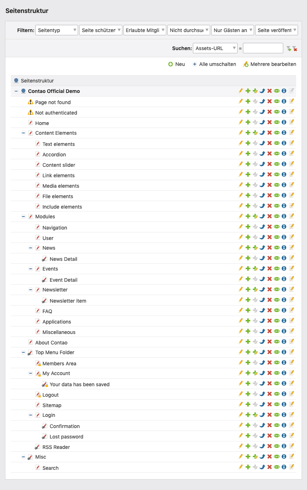
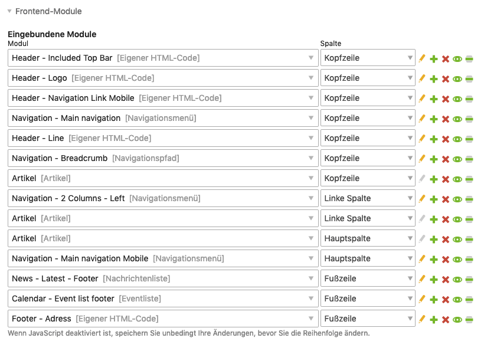
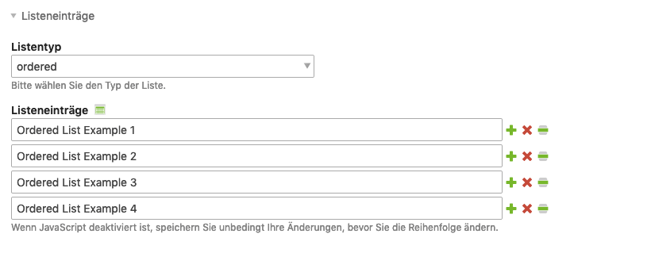

# Contao 5.x — Einleitung (Überblick)

Quellen:
- https://docs.contao.org/5.x/manual/de/einleitung/
- https://docs.contao.org/5.x/manual/de/einleitung/contao-open-source-cms/
- https://docs.contao.org/5.x/manual/de/einleitung/das-contao-netzwerk/
- https://docs.contao.org/5.x/manual/de/einleitung/contao-im-schnelldurchlauf/

---

## Was ist Contao?

Contao ist ein **Web-Content-Management-System (WCMS)**, das unter der **LGPL** (Lesser General Public License) als Open-Source-Software veröffentlicht wird. Es ist für die Verwaltung von Online-Inhalten konzipiert und ermöglicht Benutzern ohne HTML-Kenntnisse die Pflege professioneller Websites.

### Einordnung als CMS

Ein Content Management System (CMS) verwaltet Inhalte und bietet:
- Kollaboratives Arbeiten mehrerer Benutzer
- Versionsverwaltung mit Rückgängig-Funktion
- Präzise Zugriffsrechte pro Benutzer
- Workflows (z. B. Redakteur erstellt, Chefredakteur veröffentlicht)
- Abstraktion komplexer Aufgaben (Formulare, Karten)
- 24/7-Zugriff über Webbrowser

### Open Source und Lizenz

Contao wird unter der **LGPL** lizenziert (ursprünglich GPL). Der wesentliche Unterschied:
- GPL: Erweiterungen müssten auch als Open Source veröffentlicht werden
- LGPL: Drittentwickler dürfen proprietäre Erweiterungen für Contao entwickeln

Grundrechte unter der LGPL/GPL:
1. Das Programm verwenden
2. Es frei verändern
3. Es vervielfältigen
4. Es verbreiten
5. Es öffentlich zugänglich machen

Pflichten: Urheberrechtshinweise müssen erhalten bleiben; keine Weitergabe unter anderen Lizenzen.

---

## Contao im Schnelldurchlauf

### Backend und Frontend

Contao gliedert sich in zwei Bereiche:
- **Backend** (`/contao`): Administrationsbereich, in dem Artikel geschrieben und Seiten verwaltet werden
- **Frontend**: Die eigentliche Website für Besucher

Backend-Zugang: URL der Website + `/contao` → Login mit Benutzername und Passwort.

### Benutzer vs. Mitglieder

| Begriff | Beschreibung |
|---------|-------------|
| **Benutzer** | Personen mit Backend-Zugang (Redakteure, Administratoren) |
| **Mitglieder** | Personen mit Frontend-Zugang (nur bei geschützten Bereichen nötig) |

### Die Seitenstruktur als zentrales Element

Contao ist **seitenbasiert**. Die Seitenstruktur ist das zentrale Element:
- Besucher rufen Seiten auf, keine einzelnen Beiträge
- Seiten sind hierarchisch organisiert (Eltern-/Kindseiten)
- Navigationsmenüs werden automatisch aus der Struktur generiert
- Eigenschaften (Layout, Zugriffsrechte) werden an Unterseiten vererbt

### Seitenlayouts

Jede Seite ist mit einem **Seitenlayout** verknüpft, das:
- Die Seite in Layoutbereiche aufteilt (Kopfzeile, Hauptspalte, Fußzeile etc.)
- Ein virtuelles Template dynamisch erzeugt
- CSS-Formatierung einbettet

Standard-Layoutbereiche: Kopfzeile, linke Spalte, Hauptspalte, rechte Spalte, Fußzeile.

### Frontend-Module

Innerhalb der aktivierten Layoutbereiche werden **Frontend-Module** platziert:
- Module werden der Reihe nach ausgeführt und erzeugen HTML
- Contao enthält Modultypen für Navigation, Benutzerverwaltung, Formulare etc.
- Weitere Module via Erweiterungen

### Themes

Fertige Designs können als **Themes** exportiert und importiert werden:
- Enthält Stylesheets, Frontend-Module, Seitenlayouts und Dateien
- Portierbar zwischen Contao-Installationen

### Artikel und Inhaltselemente

- **Artikel**: Container für Seiteninhalt, jeweils einer Seite zugeordnet
- **Inhaltselemente**: Typen innerhalb eines Artikels (Text, Bilder, Tabellen, Links etc.)
- Pro Seite sind mehrere Artikel möglich, die verschiedenen Layoutbereichen zugeordnet werden
- Drag & Drop für Neupositionierung von Elementen

**Ausnahme**: Dynamische Inhalte wie Nachrichten oder Events werden in separaten Modulen verwaltet.

---

## Das Contao-Netzwerk

### Offizielle Ressourcen

| Ressource | URL |
|-----------|-----|
| Projektwebseite | contao.org |
| Erweiterungen | extensions.contao.org |
| Entwicklung (Monorepo) | github.com/contao/contao |
| Handbuch | docs.contao.org |
| Veranstaltungen | contao.org/de/veranstaltungen.html |
| Netzwerk-Übersicht | contao.org/de/netzwerk.html |

### Projektwebseite contao.org — Bereiche

- **Entdecken**: Features, News, Demo, Events, Fallstudien, Team (alle wichtigen Infos an einem Ort)
- **Download**: Programm-Downloads, Logos, Veröffentlichungsplan
- **Partner**: Agenturen und Dienstleister
- **Support**: FAQ, Fehlermeldung, Netzwerk
- **Verein**: Der 2012 in der Schweiz gegründete Contao-Verein fördert das Projekt durch Events, Kommunikation und Finanzierung

### Community

- **Deutschsprachiges Forum**: community.contao.org/de/
- **Slack**: Contao-Slack-Workspace
- **Social Media**: Facebook, Instagram, LinkedIn, Pinterest, Twitter/X, YouTube

### Entwicklung

- **GitHub Monorepo**: github.com/contao/contao — transparente Entwicklung mit monatlichen öffentlichen Calls
- **Issues melden**: Erst prüfen ob der Fehler bereits gemeldet wurde, ob die neueste stabile Version verwendet wird, und wie er reproduzierbar ist

### Fehlermeldung — Checkliste

1. Wurde der Fehler bereits gemeldet? (Issues durchsuchen)
2. Wird die neueste stabile Contao-Version verwendet?
3. Wie kann der Fehler in einer frischen Installation reproduziert werden?
4. Wie kann er in der Online-Demo reproduziert werden?
