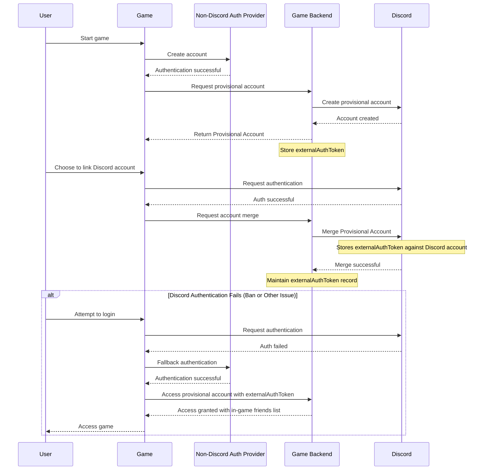
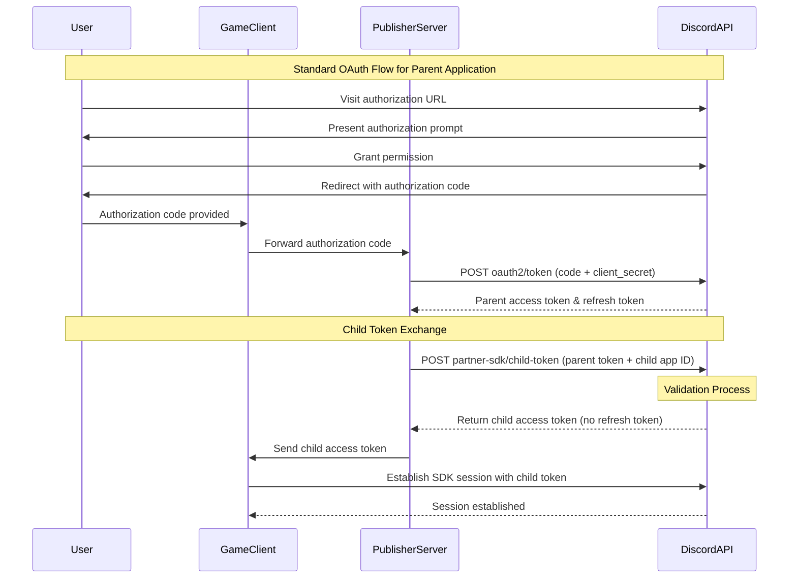
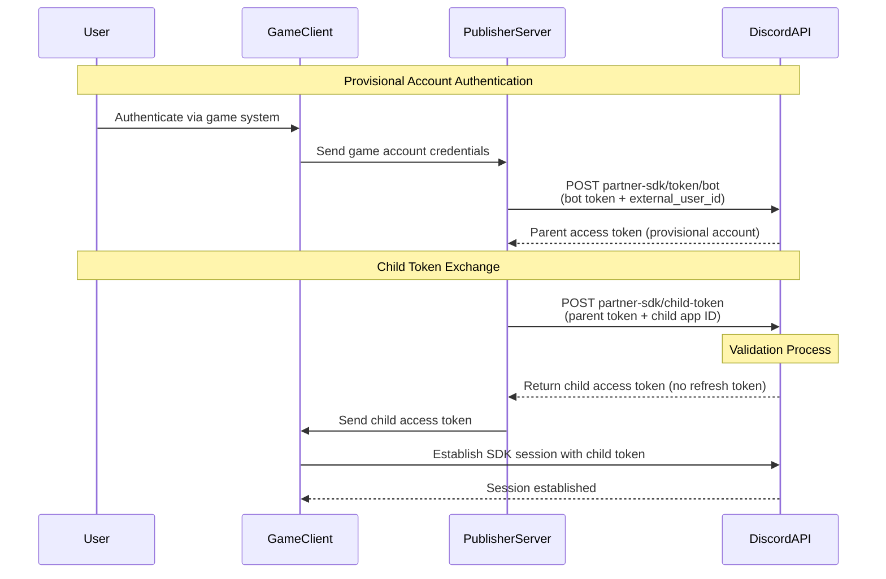

# Discord Social SDK — Account Linking

Distilled from these five pages under
`docs.discord.com/developers/discord-social-sdk/development-guides/`, retrieved 2026-08-26:
`account-linking-with-discord`, `account-linking-on-mobile`, `account-linking-on-consoles`,
`account-linking-from-discord`, `publisher-level-account-linking`.

## Contents

- [Account Linking from Your Game](#account-linking-from-your-game)
  - [Authentication flow](#our-authentication-flow)
  - [Requesting Access Tokens](#requesting-access-tokens)
  - [Working with Tokens](#working-with-tokens)
  - [Refreshing Access Tokens](#refreshing-access-tokens)
  - [When Refresh Fails](#when-refresh-fails)
  - [Revoking Access Tokens](#revoking-access-tokens)
  - [Recommended Integration Path](#recommended-integration-path)
- [Account Linking on Mobile](#account-linking-on-mobile)
  - [Configure OAuth2 Redirect URI](#configure-oauth2-redirect-uri-mobile)
  - [Unity Setup](#unity-setup-mobile)
  - [Unreal Engine Setup](#unreal-engine-setup-mobile)
  - [C++ Standalone Setup](#c-standalone-setup-mobile)
  - [Understanding PKCE for Mobile](#understanding-pkce-for-mobile)
  - [Public client flow](#authentication-flow-for-public-clients)
  - [Confidential client flow](#authentication-flow-for-confidential-clients)
  - [Mobile troubleshooting](#mobile-troubleshooting)
- [Account Linking on Consoles](#account-linking-on-consoles)
- [Account Linking from Discord (entry points)](#account-linking-from-discord-entry-points)
- [Publisher Level Account Linking](#publisher-level-account-linking)
- [Symbols and change logs](#symbols-and-change-logs)

---

## Account Linking from Your Game

Source: `/development-guides/account-linking-with-discord`.

This guide explains how to authenticate users with their existing Discord accounts via OAuth2,
enabling seamless login and access to Discord features. New to account linking? The platform overview
is `/developers/platform/account-linking`.

### Flexible Account Options

If a player does not have a Discord account, you can use the SDK to **create a provisional account**
instead so that they can still access your game's features (see PROVISIONAL-ACCOUNTS.md). For the
recommended integration flow — provisional account first, Discord-linked account second — see
[Recommended Integration Path](#recommended-integration-path).

### Prerequisites

- Read Core Concepts to understand: OAuth2 authentication flow, Discord application setup, SDK
  initialization.
- Set up your development environment with: Discord application created in the Developer Portal,
  Discord Social SDK downloaded and configured, basic SDK integration working (initialization and
  connection).

**This feature requires the Default Presence Scopes** (`openid` and `sdk.social_layer_presence`). Use
`Client::GetDefaultPresenceScopes` when configuring your OAuth2 flow.

### Our Authentication Flow

OAuth2 is the standard authentication flow that allows users to sign in using their Discord account:

1. **Request authorization**: your game sends an authentication request to Discord.
2. **User Approval**: the user approves the request, granting access to your application.
3. **Receive Authorization Code**: after approval, Discord redirects the user to your app with an
   authorization code.
4. **Exchange for Tokens**: the authorization code is exchanged for:
   - Access Token, which is valid for **~7 days**
   - Refresh Token, used to obtain a new access token

**The OAuth2 flow requires a user's account to be verified.**

#### OAuth2 using the Discord Social SDK

- If the Discord client has **overlay support (Windows only)**, the OAuth2 login modal appears in your
  game instead of opening a browser.
- The SDK automatically handles redirects, simplifying the authentication flow.
- Some security measures, such as **CSRF protection**, are built-in, but you should always follow best
  practices to secure your app.

### Requesting Access Tokens

#### Step 0: Configure OAuth2 Redirects

You must **register the correct redirect URIs** for your app in the Discord Developer Portal
(`https://discord.com/developers/applications/select/oauth2`).

| Platform    | Redirect URI |
| ----------- | ------------ |
| **Desktop** | `http://127.0.0.1/callback` |
| **Mobile**  | `discord-APP_ID:/authorize/callback` *(replace `APP_ID` with your Discord application ID)* |

#### Step 1: Request Authorization

Use `Client::Authorize` to initiate authorization and allow the user to approve access.

**Authorization Scopes.** One of the required arguments to `Client::Authorize` is scopes — the set of
permissions your game is requesting from the user. Two helper methods cover the most common cases:

| Helper Method | Scopes Requested | Features Enabled |
| --- | --- | --- |
| `Client::GetDefaultPresenceScopes` | `openid sdk.social_layer_presence` | Account linking, friends list, rich presence |
| `Client::GetDefaultCommunicationScopes` | `openid sdk.social_layer` | All of the above, plus lobbies, voice chat, direct messaging, and linked channels |

Start with `Client::GetDefaultPresenceScopes` unless you know you need the communication features. You
can always add more scopes later.

**Authorization Code Verifier.** If you are using `Client::GetToken` in Step 4, you need to specify a
"code challenge" and "code verifier" in your requests. `Client::CreateAuthorizationCodeVerifier`
generates both for you.

```cpp
// Create a code verifier and challenge if using GetToken
auto codeVerifier = client->CreateAuthorizationCodeVerifier();
discordpp::AuthorizationArgs args{};
args.SetClientId(YOUR_DISCORD_APPLICATION_ID);
args.SetScopes(discordpp::Client::GetDefaultPresenceScopes());
args.SetCodeChallenge(codeVerifier.Challenge());

client->Authorize(args, [client, codeVerifier](discordpp::ClientResult result, std::string code, std::string redirectUri) {
  if (!result.Successful()) {
    std::cerr << "❌ Authorization Error: " << result.Error() << std::endl;
  } else {
    std::cout << "✅ Authorization successful! Next step: exchange code for an access token \n";
  }
});
```

#### Step 2: User Approval

After calling `Client::Authorize`, the SDK will open a browser window, Discord client, or an in-game
overlay to prompt the user to approve the request.

#### Step 3: Receiving the Authorization Code

Once the user approves, Discord redirects the user back to your app with an authorization code you can
exchange for an access token.

#### Step 4: Exchanging the Authorization Code for an Access Token

**Server-to-Server Get Token Exchange.** If your application uses a backend server and does **not**
have `Public Client` enabled, exchange the authorization code manually using the Discord API:

```python
import requests

API_ENDPOINT = 'https://discord.com/api/v10'
CLIENT_ID = 'YOUR_CLIENT_ID'
CLIENT_SECRET = 'YOUR_CLIENT_SECRET'

def exchange_code(code, redirect_uri, code_verifier):
    data = {
        'grant_type': 'authorization_code',
        'code': code,
        'redirect_uri': redirect_uri,
        'code_verifier': code_verifier
    }
    headers = {'Content-Type': 'application/x-www-form-urlencoded'}
    r = requests.post(f'{API_ENDPOINT}/oauth2/token', data=data, headers=headers, auth=(CLIENT_ID, CLIENT_SECRET))
    r.raise_for_status()
    return r.json()
```

Example response:

```json
{
  "access_token": "<access token>",
  "token_type": "Bearer",
  "expires_in": 604800,
  "refresh_token": "<refresh token>",
  "scope": "sdk.social_layer"
}
```

**Token Exchange for Public Clients.** Requires enabling **Public Client** for your app; most games
will not want to ship with this enabled. If your app has no backend server, enable `Public Client` in
the Developer Portal and use `Client::GetToken`, which needs the code verifier from Step 1:

```cpp
client->GetToken(YOUR_DISCORD_APPLICATION_ID, code, codeVerifier.Verifier(), redirectUri,
  [client](discordpp::ClientResult result,
    std::string accessToken,
    std::string refreshToken,
    discordpp::AuthorizationTokenType tokenType,
    int32_t expiresIn,
    std::string scope) {
    std::cout << "🔓 Access token received! Establishing connection...\n";
    // Next step: Update the token in the client and connect to Discord
  });
```

### Working with Tokens

Set the token in the SDK with `Client::UpdateToken`. Store the player's access and refresh tokens.
`access_token` values do expire; use the `refresh_token` to refresh.

```cpp
client->UpdateToken(discordpp::AuthorizationTokenType::Bearer, ACCESS_TOKEN_VALUE, [client](discordpp::ClientResult result) {
  client->Connect();
);
```

(The closing brace/paren of that snippet is malformed upstream; reproduced verbatim.)

### Refreshing Access Tokens

**Access tokens expire after 7 days**, requiring refresh tokens to get a new one.

**Server-to-Server Token Refresh:**

```python
import requests

API_ENDPOINT = 'https://discord.com/api/v10'
CLIENT_ID = 'YOUR_CLIENT_ID'
CLIENT_SECRET = 'YOUR_CLIENT_SECRET'

def refresh_token(refresh_token):
    data = {
        'grant_type': 'refresh_token',
        'refresh_token': refresh_token
    }
    headers = {'Content-Type': 'application/x-www-form-urlencoded'}
    r = requests.post(f'{API_ENDPOINT}/oauth2/token', data=data, headers=headers, auth=(CLIENT_ID, CLIENT_SECRET))
    r.raise_for_status()
    return r.json()
```

**Refreshing Access Tokens for Public Clients** (requires Public Client) — the easiest way is
`Client::RefreshToken`:

```cpp
client->RefreshToken(
      YOUR_DISCORD_APPLICATION_ID, GetRefreshToken(),
      [client](discordpp::ClientResult result, std::string accessToken,
               std::string refreshToken,
               discordpp::AuthorizationTokenType tokenType, int32_t expiresIn,
               std::string scope) {
        if (!result.Successful()) {
          std::cout << "❌ Error refreshing token: " << result.Error()
                    << std::endl;
          return;
        }

        // Update token and connect
        UpdateToken(client, refreshToken, accessToken);
      });
```

### When Refresh Fails

A stored refresh token can become invalid between sessions for several reasons:

- The user revoked your application from their *User Settings → Authorized Apps* page.
- You called the unmerge or token revocation endpoint.
- The user's Discord account was banned (ban-driven unmerge).
- The access and refresh tokens expired or otherwise became invalid, with no revocation, unmerge, or
  ban involved.

**In every one of these cases the response on `/oauth2/token` with `grant_type=refresh_token` is
identical:**

- **HTTP status:** `400`
- **Body:** `{ "error": "invalid_grant", "error_description": "Invalid \"refresh_token\" in request" }`

There is no ban-specific or unlink-specific error code on this path. `invalid_grant` only tells you the
refresh token is no longer valid server-side — not *why*.

#### Recovering from `invalid_grant`

Because `invalid_grant` doesn't distinguish the cases, the robust pattern is to **attempt the
provisional account fallback first, then handle error `530010`**:

1. Drop the stored Discord tokens for the user and attempt the provisional account flow.
2. **If the provisional flow succeeds**, a revocation, unmerge, or ban had already reverted the linked
   account to a provisional account. The player stays in-game even though their Discord link is gone.
3. **If the provisional flow returns error code `530010`** — *"User account is non-provisional and
   should be authed through OAuth2"* — the tokens simply expired or became invalid and the user
   **still has a linked Discord account**. The token-exchange endpoint deliberately blocks linked users
   from the provisional path. Prompt the player to re-run the OAuth2 authorization flow instead.

**Tip:** to be notified when a user's authorization for your app is revoked — whether by an unlink, a
token revocation, or a Discord account ban — integrate the `APPLICATION_DEAUTHORIZED` webhook event
(`/developers/events/webhook-events#application-deauthorized`). That gives a proactive signal rather
than discovering the change the next time a refresh fails.

### Revoking Access Tokens

A user's authorization can be revoked by your own backend, by the user from Discord's UI, or by
Discord itself when an account is banned. Regardless of how it is triggered:

- The user's access and refresh tokens are **immediately invalidated**. Any subsequent refresh on
  `/oauth2/token` returns `HTTP 400` with `error: "invalid_grant"`.
- An `APPLICATION_DEAUTHORIZED` webhook is fired to your app.

**For Discord Social SDK-integrated apps, every revocation path is mechanically an unmerge**: the
merged Discord account reverts to a new provisional account carrying the original
`external_auth_token`. This holds whether revocation comes from `/oauth2/token/revoke`,
`Client::RevokeToken`, the user removing your app from Discord's UI, or a ban. **Only ban-driven
unmerges create a *restricted* provisional account** — the others create an unrestricted one that can
be re-merged freely.

**Warning: when any valid access or refresh token is revoked, all of your application's access and
refresh tokens for that user are immediately invalidated.**

**Server-to-Server Token Revocation:**

```python
import requests

API_ENDPOINT = 'https://discord.com/api/v10'
CLIENT_ID = 'YOUR_CLIENT_ID'
CLIENT_SECRET = 'YOUR_CLIENT_SECRET'

def revoke_token(access_or_refresh_token):
    data = {'token': access_or_refresh_token}
    headers = {'Content-Type': 'application/x-www-form-urlencoded'}
    r = requests.post(f'{API_ENDPOINT}/oauth2/token/revoke', data=data, headers=headers, auth=(CLIENT_ID, CLIENT_SECRET))
    r.raise_for_status()
```

**Revoking Access Tokens for Public Clients** (requires Public Client) — `Client::RevokeToken`
invalidates all access and refresh tokens for the user; they cannot be used again:

```cpp
client->RevokeToken(YOUR_DISCORD_APPLICATION_ID,
                    accessToken, // Can also use refresh token
                    [](const discordpp::ClientResult &result) {
                      if (!result.Successful()) {
                        std::cout
                            << "? Error revoking token: " << result.Error()
                            << std::endl;
                        return;
                      }

                      std::cout
                          << "? Token successfully revoked! User logged out."
                          << std::endl;
                      // Handle successful logout (clear stored tokens,
                      // redirect to login, etc.)
                    });
```

#### Out-of-Band Revocation

Two paths sever the user's Discord link without your code calling any unmerge or revoke endpoint:

- The user removes your app from their Discord *User Settings → Authorized Apps* page (a
  user-initiated unmerge).
- The user's Discord account is banned (a ban-driven unmerge, with an additional
  cross-platform-restricted state on the new provisional account).

Subscribe to `APPLICATION_DEAUTHORIZED` to be notified when either happens. If you miss the webhook,
the next token use will fail and your game should fall back to the provisional account flow.

### Recommended Integration Path

**The recommended path is that your game has a primary authentication other than Discord that
initially sets up a provisional account, and has the player link their Discord account to this primary
authentication.** This protects your users' game access and data if they encounter issues with their
Discord account, such as a permanent or temporary ban.

1. Create an account through a **non-Discord authentication provider**, and create a provisional
   account attached to it.
2. When users later authenticate through Discord to link their account, have your game back end
   execute the merge of their provisional account with their Discord account.
3. The account merging process internally stores the `externalAuthToken` from the provisional account
   against their Discord account. **If a ban of the Discord account happens, that `externalAuthToken`
   will be attached to the new provisional account that is created in its stead, with the original
   Discord account's in-game friends**, and will be available through the authentication provider the
   account was initially set up with.
4. Your game back end should **maintain the record of the `externalAuthToken` against the user
   account, even after the account merging process**, since it is needed to authenticate via a
   provisional account should Discord authentication fail for a ban, or any other reason.

Sequence diagram (upstream Mermaid, verbatim):



**Warning: if you use Discord as the primary or sole authentication mechanism for your game, you risk
players permanently losing access to their in-game data if their Discord account is banned**, as there
is no way to migrate them to a provisional account that is connected to an external authentication
provider.

---

## Account Linking on Mobile

Source: `/development-guides/account-linking-on-mobile`.

Mobile authentication uses **deep linking**. When the Discord mobile app is installed, users are
automatically redirected to Discord to authorize your game, then returned to your game via a custom
URL scheme.

**As of Discord Social SDK 1.5, mobile account linking has been significantly simplified through
native deep-link authentication support.**

### Key Differences from Desktop Authentication

- **Custom URL schemes** (deep links) are required instead of HTTP redirects.
- **PKCE (Proof Key for Code Exchange) is mandatory** for all mobile apps using deep links, regardless
  of whether you're using a public or confidential client.
- **Platform-specific configuration** is required (`Info.plist` for iOS, `AndroidManifest.xml` for
  Android).

### Mobile prerequisites

- Read Core Concepts (OAuth2 flow, Discord application setup, SDK initialization).
- Discord application created in the Developer Portal.
- **Discord Social SDK version 1.5 or higher** downloaded and configured.
- Basic account linking flow working on desktop.

### Configure OAuth2 Redirect URI (mobile)

| Platform | Redirect URI |
| --- | --- |
| **Mobile (iOS & Android)** | `discord-YOUR_APP_ID:/authorize/callback` *(replace `YOUR_APP_ID` with your Discord application ID)* |

**Warning: the redirect URI must use your application ID in the format
`discord-YOUR_APP_ID:/authorize/callback`. Do not use `http://127.0.0.1/callback` on mobile.**

### Unity Setup (mobile)

Follow the Unity Getting Started guide (GETTING-STARTED-UNITY.md) for general setup, plus these
mobile-specific configurations.

#### iOS Configuration

**1. Configure URL Scheme in Unity Project Settings.** To enable `Client::Authorize` support:

1. Open Project Settings: `Edit -> Project Settings...`
2. Navigate to the `Player` section
3. Select the `iOS` tab
4. Under `Other Settings`, locate `Supported URL Schemes`
5. Add `discord-YOUR_APP_ID` to the list (e.g., if your application ID is `123456`, add
   `discord-123456`)

**2. Set Microphone Usage Description.** In the same Player settings page:

1. Set `Microphone Usage Description` to a valid description
2. This string will be displayed by iOS when microphone permissions are requested
3. Required for voice support

**3. Configure Info.plist for Deep Linking.** For native authentication to work, update your
`Info.plist` to include the `discord` scheme:

```
<key>LSApplicationQueriesSchemes</key>
<array>
  <string>discord</string>
</array>
```

This allows your app to detect if the Discord mobile app is installed and deep-link into it for
authentication.

**4. Enable Background Voice Support (Optional).** To enable voice support while your game is
backgrounded:

1. Edit your `Info.plist` to enable the appropriate background modes
2. A build postprocessor is supplied in the Unity sample project (downloads page) that you may copy
   into your own project, located at `Assets/Scripts/Editor/VoicePostBuildProcessor.cs`

**For background voice, configure *Audio, AirPlay, and Picture in Picture* mode, NOT Voice over IP.**
Reference: Apple's "Configuring your app for Media Playback"
(`https://developer.apple.com/documentation/avfoundation/configuring-your-app-for-media-playback?language=objc`).

#### Android Configuration

**1. Configure Custom URL Scheme.** `Client::Authorize` requires an activity with a custom URL scheme
in your application manifest:

1. An example build processor is provided in the Unity sample project at
   `Assets/Scripts/Editor/AndroidPostBuildProcessor.cs`
2. Alternatively, manually add an intent filter to your `AndroidManifest.xml`:

```
<activity android:name="com.discord.socialsdk.AuthenticationActivity"
android:exported="true">
  <intent-filter>
    <action android:name="android.intent.action.VIEW" />
    <category android:name="android.intent.category.DEFAULT" />
    <category android:name="android.intent.category.BROWSABLE" />
    <data android:scheme="discord-YOUR_APP_ID" />
  </intent-filter>
</activity>
```

Replace `YOUR_APP_ID` with your actual Discord application ID (e.g.,
`discord-1234567890123456789`).

**2. Add androidx.browser Dependency.** Authorization requires `androidx.browser` as a Gradle
dependency:

- If you use **Google External Dependency Manager**, a suitable dependencies XML file is provided as
  part of the Unity plugin.
- Otherwise, add this dependency manually to your `build.gradle`:

```
dependencies {
    implementation 'androidx.browser:browser:1.8.0'
    // Your other dependencies...
}
```

**3. Android Permissions.** The Android SDK uses the following permissions:

```
<uses-permission android:name="android.permission.INTERNET" />
<uses-permission android:name="android.permission.RECORD_AUDIO" />
<uses-permission android:name="android.permission.FOREGROUND_SERVICE" />
<uses-permission android:name="android.permission.FOREGROUND_SERVICE_MICROPHONE" />
<uses-permission android:name="android.permission.FOREGROUND_SERVICE_MEDIA_PLAYBACK" />
<uses-permission android:name="android.permission.MODIFY_AUDIO_SETTINGS" />
<uses-permission android:name="android.permission.BLUETOOTH" /> <!-- SDK <= 30 -->
<uses-permission android:name="android.permission.BLUETOOTH_CONNECT" /> <!-- SDK >= 31 -->
```

**If your application does not use voice features, you may remove all permissions except `INTERNET`**
using the `tools:node="remove"` attribute in your `AndroidManifest.xml`
(`https://developer.android.com/build/manage-manifests#node_markers`).

Following the Unity getting-started guide? Continue with Step 8: Connect the SDK to Discord.

### Unreal Engine Setup (mobile)

Follow the Unreal Engine Getting Started guide (GETTING-STARTED-UNREAL.md) for general setup. For
mobile, **you only need to configure your Discord Application ID in the project settings**:

1. Open **Project Settings** (`Edit -> Project Settings...`)
2. Search for `discord` in the search bar
3. Under the **Discord Social SDK** section, enter your **Discord Application ID**

[Image: Unreal Engine Discord Application ID Setting]

This setting configures the custom URL scheme (`discord-YOUR_APP_ID`) for deep linking on both iOS and
Android platforms automatically.

Following the Unreal getting-started guide? Continue with Step 6: Initialize the SDK
(DiscordLocalPlayerSubsystem).

### C++ Standalone Setup (mobile)

The Discord Social SDK may be used as a C++ library in a standard iOS or Android project.

#### iOS Setup

**1. Create and Configure Xcode Project**

1. Create an Objective-C iOS project in Xcode
2. Add `discord_partner_sdk.xcframework` to your project

**2. Configure Build Settings**

1. Add the xcframework to `Build Phases -> Link Binary with Libraries` if needed
2. In the `General` tab, under `Frameworks, Libraries and Embedded Content`: set
   `discord_partner_sdk.xcframework` to **Embed & Sign**

**3. Configure Background Audio (Optional).** To maintain voice connectivity while backgrounded:

1. Configure background audio modes in your `Info.plist` using the `Signing & Capabilities` tab
2. Select *Audio, AirPlay, and Picture in Picture*, **not** Voice over IP
3. See Apple's "Configuring your app for Media Playback"

**4. Register URL Scheme.** To enable `Client::Authorize` support, register the URL scheme in
`Info.plist`:

```
<key>CFBundleURLTypes</key>
<array>
    <dict>
        <key>CFBundleURLSchemes</key>
        <array>
            <string>discord-YOUR_APP_ID</string>
        </array>
    </dict>
</array>
<key>LSApplicationQueriesSchemes</key>
<array>
    <string>discord</string>
</array>
```

Replace `YOUR_APP_ID` with your application ID from the Discord Developer Portal (e.g., if your app ID
is `123456`, register `discord-123456`).

**5. Include SDK Headers.** In a C++ or Objective-C++ (`.mm`) source file:

```cpp
#define DISCORDPP_IMPLEMENTATION // Define this in exactly ONE file
#include <discord_partner_sdk/discordpp.h>
```

**Warning: `DISCORDPP_IMPLEMENTATION` must be defined in exactly one file** in your codebase to expand
necessary implementation code.

**6. Run Callbacks in Game Loop.** In your main game loop:

```cpp
discordpp::RunCallbacks();
```

#### Android Setup

**1. Create Android Project.** Create an Android game project based on the **Game Activity (C++)**
template.

**2. Add SDK as Dependency.** Add `discord_partner_sdk.aar` as a dependency in your Gradle project:

1. Add the AAR to a directory (e.g., `app/libs`)
2. In your `app/build.gradle`, add to dependencies:

```
dependencies {
    implementation files("libs/discord_partner_sdk.aar")
}
```

**3. Enable Prefab.** Ensure Prefab is enabled in your Gradle build. See "Native Dependencies in AARs"
(`https://developer.android.com/build/native-dependencies#native-dependencies-aars`).

**4. Configure CMake.** In your `CMakeLists.txt`:

```
find_package(discord_partner_sdk REQUIRED CONFIG)
target_link_libraries(your_target discord_partner_sdk::discord_partner_sdk)
```

**5. Include SDK Headers.** In your C++ source:

```cpp
#define DISCORDPP_IMPLEMENTATION // Define this in exactly ONE file
#include "discordpp.h"
```

**6. Initialize SDK in Activity.** In the `onCreate` method for your main activity (Java/Kotlin):

```
com.discord.socialsdk.DiscordSocialSdkInit.setEngineActivity(this);
```

**7. Run Callbacks in Game Loop.** In your main C++ loop:

```cpp
discordpp::RunCallbacks();
```

**8. Configure Authorization Support.** To support `Client::Authorize`:

1. Add `androidx.browser` dependency (**version 1.8 or later**) to your `build.gradle`:

```
dependencies {
    implementation 'androidx.browser:browser:1.8.0'
    // Your other dependencies...
}
```

2. Add the `AndroidManifest.xml` activity registration:

```
<activity android:name="com.discord.socialsdk.AuthenticationActivity"
android:exported="true">
  <intent-filter>
    <action android:name="android.intent.action.VIEW" />
    <category android:name="android.intent.category.DEFAULT" />
    <category android:name="android.intent.category.BROWSABLE" />
    <data android:scheme="discord-YOUR_APP_ID" />
  </intent-filter>
</activity>
```

Following the C++ getting-started guide? Continue with Step 9: Connect the SDK to Discord.

### Understanding PKCE for Mobile

**What is PKCE?** PKCE (Proof Key for Code Exchange, pronounced "pixie") is a security extension to
OAuth2 that prevents authorization code interception attacks. It requires both the client and server
to prove they're part of the same authentication flow.

**Critical Requirement: PKCE is mandatory for all mobile applications that use custom URL schemes
(deep links), regardless of whether you're using a public client or a confidential client with
server-side token exchange.** Custom URL schemes don't have the same security guarantees as HTTPS
redirects, making them vulnerable to interception attacks without PKCE.

**How PKCE Works:**

1. **Client generates a code verifier**: a cryptographically random string
2. **Client creates a code challenge**: a hashed version of the verifier
3. **Client sends code challenge** with the authorization request
4. **Server stores the code challenge** with the authorization code
5. **Client sends code verifier** when exchanging the authorization code for a token
6. **Server verifies** that the verifier matches the stored challenge

The SDK handles generation of verifier and challenge via
`Client::CreateAuthorizationCodeVerifier`.

### Authentication Flow for Public Clients

Requires **Public Client** enabled; most games will not want to ship with this enabled.

**Step 1: Create Code Verifier and Challenge**

```cpp
// Generate code verifier and challenge
auto codeVerifier = client->CreateAuthorizationCodeVerifier();
```

**Step 2: Request Authorization**

```cpp
discordpp::AuthorizationArgs args{};
args.SetClientId(YOUR_DISCORD_APPLICATION_ID);
args.SetScopes(discordpp::Client::GetDefaultPresenceScopes());
args.SetCodeChallenge(codeVerifier.Challenge());

client->Authorize(args, [client, codeVerifier](
    discordpp::ClientResult result,
    std::string code,
    std::string redirectUri) {
  if (!result.Successful()) {
    std::cerr << "❌ Authorization Error: " << result.Error() << std::endl;
  } else {
    std::cout << "✅ Authorization successful! Exchanging code for token...\n";
    // Proceed to Step 3
  }
});
```

**Step 3: User Approval.** After calling `Client::Authorize`, the SDK will:

- Deep-link into the Discord mobile app if installed
- Or open a browser if Discord is not installed
- Present the authorization screen to the user

**Step 4: Exchange Authorization Code for Token**

```cpp
client->GetToken(
    YOUR_DISCORD_APPLICATION_ID,
    code,
    codeVerifier.Verifier(),  // Critical: Pass the verifier
    redirectUri,
    [client](discordpp::ClientResult result,
        std::string accessToken,
        std::string refreshToken,
        discordpp::AuthorizationTokenType tokenType,
        int32_t expiresIn,
        std::string scope) {
      if (!result.Successful()) {
        std::cerr << "❌ Error getting token: " << result.Error() << std::endl;
        return;
      }

      std::cout << "🔓 Access token received! Establishing connection...\n";

      // Update token and connect
      client->UpdateToken(tokenType, accessToken, [client](discordpp::ClientResult result) {
        client->Connect();
      });
    });
```

### Authentication Flow for Confidential Clients

If your application has a backend server and uses a confidential client (with client secret), you
**must still implement PKCE on mobile**, but the token exchange happens on your server.

**Client-Side Step 1: Create Code Verifier and Challenge**

```cpp
// Generate code verifier and challenge
auto codeVerifier = client->CreateAuthorizationCodeVerifier();
```

**Client-Side Step 2: Request Authorization**

```cpp
discordpp::AuthorizationArgs args{};
args.SetClientId(YOUR_DISCORD_APPLICATION_ID);
args.SetScopes(discordpp::Client::GetDefaultPresenceScopes());
args.SetCodeChallenge(codeVerifier.Challenge());

client->Authorize(args, [client, codeVerifier](
    discordpp::ClientResult result,
    std::string code,
    std::string redirectUri) {
  if (!result.Successful()) {
    std::cerr << "❌ Authorization Error: " << result.Error() << std::endl;
  } else {
    std::cout << "✅ Authorization successful!\n";

    // Send BOTH the authorization code AND the code verifier to your server
    SendToServer(code, redirectUri, codeVerifier.Verifier());
  }
});
```

**Critical: you must send the code verifier (not the challenge) to your server along with the
authorization code.** The server needs the verifier to complete the token exchange.

**Server-Side Implementation.** Your server must include the `code_verifier` parameter when exchanging
the authorization code:

```python
import requests

API_ENDPOINT = 'https://discord.com/api/v10'
CLIENT_ID = 'YOUR_CLIENT_ID'
CLIENT_SECRET = 'YOUR_CLIENT_SECRET'

def exchange_code(code, redirect_uri, code_verifier):
    """
    Exchange authorization code for access token with PKCE verification.

    IMPORTANT: The code_verifier parameter is REQUIRED for mobile apps,
    even when using confidential clients with client secrets.
    """
    data = {
        'grant_type': 'authorization_code',
        'code': code,
        'redirect_uri': redirect_uri,
        'code_verifier': code_verifier,  # Required for mobile deep links
    }
    headers = {'Content-Type': 'application/x-www-form-urlencoded'}

    r = requests.post(
        f'{API_ENDPOINT}/oauth2/token',
        data=data,
        headers=headers,
        auth=(CLIENT_ID, CLIENT_SECRET)
    )
    r.raise_for_status()
    return r.json()
```

Example response:

```json
{
  "access_token": "<access token>",
  "token_type": "Bearer",
  "expires_in": 604800,
  "refresh_token": "<refresh token>",
  "scope": "sdk.social_layer"
}
```

**Client-Side: Update Token.** Once your server returns the access token:

```cpp
// Receive access token from your server
void OnTokenReceived(const std::string& accessToken) {
  client->UpdateToken(
      discordpp::AuthorizationTokenType::Bearer,
      accessToken,
      [client](discordpp::ClientResult result) {
    if (result.Successful()) {
      client->Connect();
    }
  });
}
```

### Working with tokens on mobile

Store the access and refresh tokens for the player to use in future sessions. `access_token`s
generally expire after **7 days**; use the `refresh_token` — see
[Refreshing Access Tokens](#refreshing-access-tokens).

### Mobile troubleshooting

**iOS: Authorization Opens Browser Instead of Discord App.** The authorization flow opens a browser
instead of deep-linking to the Discord mobile app.

1. Verify that `LSApplicationQueriesSchemes` includes `discord` in your `Info.plist`
2. Ensure the Discord mobile app is installed on the device
3. Check that your redirect URI is correctly configured as `discord-YOUR_APP_ID:/authorize/callback`

**Android: Deep Link Not Working.** After authorization, the app doesn't receive the callback.

1. Verify your `AndroidManifest.xml` has the correct intent filter
2. Ensure the `android:scheme` matches your redirect URI: `discord-YOUR_APP_ID`
3. Check that your activity is set to launch mode `singleTask` or `singleTop` if you need to handle
   multiple intents

**Token Exchange Fails with "invalid_grant".** Server-side token exchange returns an `invalid_grant`
error.

1. **Most common**: you forgot to include the `code_verifier` parameter in the token exchange request
2. Verify you're sending the verifier (from `codeVerifier.Verifier()`), not the challenge
3. Ensure the code hasn't expired (codes are short-lived)
4. Check that the redirect URI matches exactly what was used in the authorization request

---

## Account Linking on Consoles

Source: `/development-guides/account-linking-on-consoles`.

This guide covers **OAuth2 device authorization** for console users. You learn how to:

- Initiate OAuth2 device authorization
- Handle user authentication via QR codes or manual entry
- Exchange the device code for an access token
- Implement automatic token handling with the SDK

**To use the Discord Social SDK in your console games, you will need to request middleware approval
and be an approved developer for the target console**
(`https://support-dev.discord.com/hc/en-us/articles/30209074764183`).

### OAuth2 Device Authorization Flow

Console users cannot authenticate via a web browser. Instead:

1. The game requests a device code from Discord.
2. To approve the authorization request, the user scans a QR code or enters a user code at
   `discord.com/activate`.
3. Your game polls the Discord API to exchange the device code for an access token.

The SDK can manage this process automatically or allow manual token handling. **The OAuth2 flow
requires a user's account to be verified.**

[Image: Authorization screen from using OpenAuthorizeDeviceScreen and GetTokenFromDevice]

### Automatic Token Handling

Requires **Public Client** enabled; most games will not want to ship with this enabled.

A single call to `Client::GetTokenFromDevice` handles the entire authorization process, including
polling for the access token. Then authenticate with `Client::UpdateToken` and call
`Client::Connect`.

```cpp
discordpp::DeviceAuthorizationArgs args{};
args.SetClientId(APPLICATION_ID);
args.SetScopes(discordpp::Client::GetDefaultPresenceScopes());

client->GetTokenFromDevice(args, [client](
  discordpp::ClientResult result,
  std::string accessToken,
  std::string refreshToken,
  discordpp::AuthorizationTokenType tokenType,
  int32_t expiresIn,
  std::string scope) {
    if (result.Successful()) {
      std::cout << "🔓 Access token received! Establishing connection...\n";
      client->UpdateToken(discordpp::AuthorizationTokenType::Bearer, accessToken, [client](discordpp::ClientResult result) {
        client->Connect();
      });
    } else {
      std::cerr << "❌ Failed to get token from device \n";
    }
  });
```

### Manual Flow for Console Authorization

Same OAuth2 device authorization flow, but you handle the polling and token exchange:

1. Request a device code from Discord
2. Display the user verification information or open the authorization screen (optional)
3. Poll for the user's authorization
4. Exchange the device code for an access token
5. Handle the token response and close authorization screen (optional)

#### Step 1: Request a Device Code from Discord

```python
import requests

API_ENDPOINT = "https://discord.com/api/v10"
CLIENT_ID = "YOUR_CLIENT_ID"
CLIENT_SECRET = "YOUR_CLIENT_SECRET"
SCOPE = "sdk.social_layer"

def authorize_device():
    data = {"scope": SCOPE}
    headers = {"Content-Type": "application/x-www-form-urlencoded"}
    
    response = requests.post(f"{API_ENDPOINT}/oauth2/device/authorize", data=data, headers=headers, auth=(CLIENT_ID, CLIENT_SECRET))
    response.raise_for_status()
    return response.json()
```

Example response:

```json
{
  "device_code": "<device code>",
  "user_code": "<user code>",
  "verification_uri": "https://discord.com/activate",
  "verification_uri_complete": "https://discord.com/activate?user_code=<user code>",
  "expires_in": 300,
  "interval": 5
}
```

#### Step 2: Display Authorize Screen with QR Code and User Code

```cpp
client->OpenAuthorizeDeviceScreen(user_code);
```

You can also display the `verification_uri_complete`, or the `verification_uri` with `user_code`, in
your game's interface to allow the user to enter the code manually.

Once the user approves from a web browser or their mobile device, the `device_code` from Step 1 is
ready to be exchanged for an access token.

#### Step 3: Poll for User's Authorization

While the user completes the authorization request, your game must poll the Discord OAuth2 token
endpoint to exchange the device code for a valid access token. **Poll using the provided `interval`
until the code expires after `expires_in` or succeeds.** If the code expires, start over with a new
authorization request or cancel the authorization.

#### Step 4: Exchange Device Code for Access Token

```python
def exchange_device_code(device_code):
    data = {
        "grant_type": "urn:ietf:params:oauth:grant-type:device_code",
        "device_code": device_code
    }
    headers = {"Content-Type": "application/x-www-form-urlencoded"}
    
    response = requests.post(f"{API_ENDPOINT}/oauth2/token", data=data, headers=headers, auth=(CLIENT_ID, CLIENT_SECRET))
    response.raise_for_status()
    return response.json()
```

#### Step 5: Handle Token Response

The API returns an access token to be used with `Client::UpdateToken` and `Client::Connect`.

```json
{
  "access_token": "<access token>",
  "token_type": "Bearer",
  "expires_in": 604800,
  "refresh_token": "<refresh token>",
  "scope": "sdk.social_layer"
}
```

If you followed the manual flow, call `Client::CloseAuthorizeDeviceScreen` to close the authorization
screen.

#### Complete Python example for manual token authorization

```python
import requests
import json
import time

API_ENDPOINT = 'https://discord.com/api/v10'
CLIENT_ID = 'YOUR_CLIENT_ID'
CLIENT_SECRET = 'YOUR_CLIENT_SECRET'
SCOPE = 'sdk.social_layer'

def authorize_device():
  data = {
    'scope': SCOPE
  }
  headers = {
    'Content-Type': 'application/x-www-form-urlencoded'
  }
  r = requests.post('%s/oauth2/device/authorize' % API_ENDPOINT, data=data, headers=headers, auth=(CLIENT_ID, CLIENT_SECRET))
  r.raise_for_status()
  return r.json()

def exchange_device_code(device_code):
  print("Attempting to exchange device code for access token...")
  data = {
      "grant_type": "urn:ietf:params:oauth:grant-type:device_code",
      "device_code": device_code
    }
  headers = {"Content-Type": "application/x-www-form-urlencoded"}
    
  r = requests.post('%s/oauth2/token' % API_ENDPOINT, data=data, headers=headers, auth=(CLIENT_ID, CLIENT_SECRET))
  r.raise_for_status()
  response = r.json()
  return r.json()

def poll_token_exchange(device_code, interval, expires_in):
  start_time = time.time()
  
  while time.time() - start_time < expires_in:
    try:
      print("Checking for authorization...")
      result = exchange_device_code(device_code)
      return result
    except requests.exceptions.HTTPError as e:
      if e.response.status_code == 400:
        # Authorization is pending, wait and try again
        print(f"Waiting {interval} seconds for user to authorize...")
        time.sleep(interval)
      else:
        # Some other error occurred
        raise e
  
  raise Exception(f"Authorization timed out after {expires_in} seconds")

# Step 1: Get device authorization details
device_auth = authorize_device()

# Step 2: Display authorization details to user
print("\nPlease visit:", device_auth["verification_uri_complete"])

# Step 3: Poll for token exchange
try:
    access_token = poll_token_exchange(
        device_auth["device_code"],
        device_auth["interval"],
        device_auth["expires_in"]
    )
    print("\nSuccess! Access Token:", access_token["access_token"])
except Exception as e:
    print("\nError:", str(e))

# Step 4: Use the access token with discordpp::Client::UpdateToken and discordpp::Client::Connect
```

Note the polling contract this reveals: **while the user has not yet approved, the token endpoint
returns HTTP 400** — treat 400 as "authorization pending" and retry after `interval`.

### Working with tokens on consoles

```cpp
client->UpdateToken(discordpp::AuthorizationTokenType::Bearer, accessToken, [client](discordpp::ClientResult result) {
  client->Connect();
});
```

Store the access and refresh tokens for future sessions. `access_token` values do expire; use the
`refresh_token` per [Refreshing Access Tokens](#refreshing-access-tokens).

---

## Account Linking from Discord (entry points)

Source: `/development-guides/account-linking-from-discord`.

Discord can show prompts and buttons throughout the Discord client that encourage users to link their
accounts with your game. These are called **entry points** for account linking. Higher account linking
rates lead to better social features, improved engagement, and a stronger connection between your game
and Discord users.

### Prerequisites

- **Discord application setup**: created a Discord application in the Developer Portal; configured
  OAuth2 settings with appropriate redirect URLs.
- **Implemented account linking in your game**: SDK downloaded and integrated; SDK initialization
  working (can connect to Discord); basic account linking flow already implemented.
- **Development environment ready**: game can successfully authenticate users with Discord OAuth2.

### What are Entry Points?

Entry points are buttons, prompts, and UI elements that Discord shows throughout the Discord client to
encourage account linking — "Link your account" buttons that appear in various places where users
might see your game.

**Discord automatically chooses which entry points to show** based on what features you've implemented
and whether your game is currently running. [Image: Account Linking from Discord Entry Points]

Some of the current Discord entry points:

- **Game Detection** — Discord detects the player is playing your game and provides an entry point to
  link if they haven't already. [Image: Discord entry points for account linking]
- **Game Invites** — players are optionally able to link when receiving an invite for your game, which
  helps them get set up and playing with their friends faster. [Image: Game Invite entry points for
  account linking]
- **Claiming Game Shop Items** — players need to account link when redeeming items from your Game Shop
  to be able to receive their in-game rewards. [Image: Game Shop entry points for account linking]

### Account Linking Flows

Discord provides two flows for account linking from the client. When a user clicks an entry point,
Discord chooses one of the currently available flows, in this **priority order**:

1. Connected game flow
2. Web flow

You can implement one or both flows.

### Connected Game Flow

**Discord's preferred flow.** It sends the user into your game client to begin the account linking
flow.

**Prerequisites:**

- Upgrade to **SDK version 1.6 or higher**
- Implement account linking in your game

**Implementation.** SDK 1.6+ adds two methods on the Client object:
`Client::RegisterAuthorizeRequestCallback` and `Client::RemoveAuthorizeRequestCallback`. These enable
and disable this flow while your game is running.

**Warning: before calling `Client::RegisterAuthorizeRequestCallback`, ensure
`Client::SetApplicationId` has been called.** This ensures that your game is properly identifying
itself to the Discord client and that all requests are associated with the correct application.

Calling `Client::RegisterAuthorizeRequestCallback` with a callback function signals to the Discord
client that your game is running and able to start the account linking process. **Run this as soon as
your game is able to handle an account link**, for instance just after your user has logged in or
reached the main menu.

When a user clicks one of the account linking entry points in their Discord client, the SDK runs your
callback. Treat this as if the user had just clicked one of your in-game account linking buttons and
begin the authorization flow right away.

**When your game receives this callback, the user is most likely focused on the Discord client, not
the game client.** Make sure to pull focus or otherwise alert the user that something is happening in
the game. The Discord client will notify them to check the game as well. For a more seamless
experience, pull them back into the game.

Calling `Client::RemoveAuthorizeRequestCallback` signals to the Discord client that your game is no
longer able to start the account linking process. **Call this whenever your game client is entering a
state where starting the account linking process wouldn't work**, for instance if the player enters a
match, logs out, or is in some other full screen flow like a cutscene.

You can test and debug this flow using the built-in developer tools in the Discord client (see
HOW-TO-GUIDES.md → Debug & Log → Client Tools).

```cpp
// If you haven't already
client.SetApplicationId("123456789");

client.RegisterAuthorizeRequestCallback([client, myGameAuthorizationHandler]() {
	// Pull focus into your game using native APIs
	// ...

	// Run your normal authorization flow
	myGameAuthorizationHandler.StartDiscordAccountLink();
});
```

#### Connected Game Best Practices

- When a user clicks the account link button in their Discord client, **this is a high intent action.
  Skip any extra upsells until after the user has linked their account** — any extra steps increase
  drop-off. Show upsells after they've linked to reaffirm the new features and any rewards unlocked.
- **Enable and disable the callback at the appropriate times.** If a user clicks an entry point and it
  launches the account linking flow in the middle of a match, this interrupts gameplay.
- **Don't check if the user is already linked** — the Discord client handles hiding the entry point for
  users that have already linked. This keeps your implementation simpler and reduces surface for
  issues.

### Web Flow

An alternative to the connected game flow: send users to a webpage to begin account linking.

**At this time, this flow is only available to select partners.**

**Prerequisites:**

- Implement the standard OAuth2 flow (`/developers/topics/oauth2`) on your website
- Set your **Connection Entrypoint URL** in the Developer Portal to the URL that starts your OAuth2
  web flow

**Requirements for your webpage:**

- If the user isn't signed in to their game account, it should prompt them to sign in and then take
  them immediately back to the authorization flow.
- The authorization should request **the same scopes** that you request in your game.
- After authorization is complete, the token should be saved to the user's account the same way you
  would during in-game authorization so that it's ready the next time the user launches their game.
- If the user is currently in game, send an update to their client with the token and call
  `Client::UpdateToken` to sign them in right away without needing to restart their game.

---

## Publisher Level Account Linking

Source: `/development-guides/publisher-level-account-linking`.

**Publisher Level Account Linking requires Discord approval.** To inquire about access, speak to your
Discord account representative or use `https://discord.com/developers/contact-us`.

### Overview

Publisher Level Account Linking enables a developer with multiple games to have a **single
authorization flow across all games in their portfolio**. Players authenticate through a publisher
application instead of authenticating separately for each game.

This is done by establishing a **parent-child application hierarchy** between the publisher
application (parent) and game applications (children). Once established, the publisher application
performs player authentication, and its game application is used to connect and utilize the Discord
Social SDK.

### Benefits

**For Publishers:** centralized account management — manage user authorization at the publisher level.

**For Players:** simplified experience (reduced friction when playing multiple games from the same
publisher); richer social features (access enriched friend data and activity across the publisher's
game catalog).

### Is Publisher Level Account Linking Right for You?

| **Good Fit** | **Poor Fit** |
| --- | --- |
| Publishers with cohesive portfolios where games share a centralized account system **and** a publisher-level social experience (shared friends list across games). | Publishers with disparate game portfolios that share only a centralized login but have no cross-game social features. |

When a player links their Discord account to a publisher account and that publisher shares a social
graph across games, the authorization feels natural — players already understand that their friends in
one game appear across all games in the portfolio.

#### Key Behaviors to Understand

**Authorization is all-or-nothing at the publisher level:**

- When a player links their Discord account to the publisher application, that authorization applies
  to **all** child game applications under the publisher.
- Players **cannot opt out** of the Discord connection for individual games while remaining linked at
  the publisher level.
- Revoking authorization disconnects the Discord account from the publisher account, affecting all
  games.

**Relationships exist at the publisher level, not per-game:** game friend lists exist at the publisher
level — there are **no per-game sandboxed friend lists**. If you need separate friend lists per game,
Publisher Level Account Linking is not the right solution.

**Warning: this is a one-way architectural decision.** Once child applications are linked to a parent
publisher application, **data is deleted and the relationship cannot be reverted**. Evaluate carefully
before migrating existing applications.

### How It Works

Two types of applications:

1. **Publisher application (parent)**: executes OAuth2 account linking and manages user authorization.
2. **Game application (child)**: uses child access tokens obtained from the parent for Social SDK
   operations.

The flow:

1. User authenticates once through the publisher application using standard OAuth2.
2. Developer exchanges the parent access token for a child access token using the
   `/partner-sdk/child-token` endpoint.
3. Child token is used to initialize the Discord Social SDK for the specific game.
4. All Social SDK operations are now performed with the child token.

Responsibility split:

| **Action** | **Publisher Application (Parent)** | **Game Application (Child)** |
| --- | :--: | :--: |
| Discord account authentication | yes | no |
| Provisional account authentication | yes | no |
| Issues parent access tokens with refresh tokens | yes | no |
| Exchange parent tokens for child token | yes | no |
| Used to connect to Social SDK | no | yes |
| Operates in context of specific game | no | yes |

### Prerequisites

- A Discord application configured as the publisher (parent) with OAuth2 enabled
- One or more Discord applications configured as games (children)
- Social SDK integration enabled for all applications
- Contact with Discord to establish the parent-child relationships between applications

### Application Configuration

**1. Configure the Publisher Application** (standard OAuth2 guidelines):

1. Navigate to the Developer Portal
2. Select your publisher application
3. Configure OAuth2 redirect URIs on the OAuth2 settings page
4. Enable the Social SDK integration
5. Note your Client ID and Client Secret

**2. Configure Game Applications.** For each game application:

1. Create a new application in the Developer Portal
2. Enable Social SDK integration
3. **Do not configure OAuth2 redirect URIs** — game applications don't need them
4. Note the application's Client ID

Game applications do not require OAuth2 configuration since they use child tokens obtained from the
parent application.

**3. Establish Parent-Child Relationships.** **You will need to contact Discord** to link your game
applications to your publisher application. Provide Discord with:

- Parent application ID (publisher)
- Child application IDs (games)

Discord will configure the relationships in their systems to enable token exchange.

**Warning:** publisher applications and game applications are restricted from certain actions once the
parent-child relationship is established. If existing applications are being migrated to either
publisher or game applications, **some flows may be broken as soon as the relationship is
configured**. Discuss this with Discord before initiating the migration. Alternatively, create new
applications for both publisher and game applications.

When you establish a link, the **child application has the following data deleted**:

| **Data Type** | **Action** |
| --- | --- |
| OAuth2 tokens | All tokens for the child app are deleted |
| Lobbies | All lobbies associated with the child app are deleted |
| User Application Identities | Deleted for all users |
| Provisional accounts | All provisional users are deleted |
| Game Relationships | Removed for all users associated with the app |

**The parent application is unaffected** — existing tokens remain valid since they can still be used
in normal OAuth2 flows.

**4. Match Confidentiality Settings.** Child applications must match the confidentiality setting of
the parent application:

- If the parent is a **confidential client** (has a client secret), all children must be confidential
  clients.
- If the parent is a **public client**, all children must be public clients.

### Implementing Token Exchange

Publisher Level Account Linking supports both provisional accounts (for users without Discord
accounts) and standard OAuth2 (for users with linked Discord accounts).

**Linked Discord Account Flow** (upstream Mermaid, verbatim):



**Provisional Account Flow:**



### Obtaining the Parent Access Token

Before you can exchange tokens, obtain a parent access token through Discord OAuth2 authorization, or
provisional account authorization, using the **publisher application ID**. **Always use the publisher
application ID for all authentication operations.**

**Warning: OAuth2 and Provisional account calls using child (game) application IDs will fail.** Only
the publisher application can be used for user authorization.

Follow the standard Account Linking with Discord or Using Provisional Accounts flow, using your
publisher application id. This provides a parent access token and refresh token.

### Exchanging Parent Token for Child Token

**Important Token Usage Restrictions:**

- Parent access tokens **cannot** be used to connect to Discord via the Social SDK — **only** child
  access tokens can.
- Child applications cannot be used for OAuth2 account linking flows — child access tokens can **only**
  be acquired through the token exchange flow.
- When making direct calls to Discord server APIs, **use the child access token** for Bearer
  authorization.

### POST /partner-sdk/child-token

Exchange a parent access token for a child token. JSON body with
`parent_access_token`, `child_application_id`, `parent_client_secret`.

```python
import requests

API_ENDPOINT = 'https://discord.com/api/v10'
PARENT_ACCESS_TOKEN = 'parent_token_here'
CHILD_APPLICATION_ID = '987654321098765432'
PARENT_CLIENT_SECRET = 'your_parent_client_secret'

def exchange_for_child_token(parent_token, child_app_id, parent_client_secret):
    response = requests.post(
        f'{API_ENDPOINT}/partner-sdk/child-token',
        headers={
            'Content-Type': 'application/json'
        },
        json={
            'parent_access_token': parent_token,
            'child_application_id': child_app_id,
            'parent_client_secret': parent_client_secret
        }
    )
    response.raise_for_status()
    return response.json()

# Exchange the token
child_token_data = exchange_for_child_token(
    PARENT_ACCESS_TOKEN,
    CHILD_APPLICATION_ID,
    PARENT_CLIENT_SECRET
)

print(f"Child access token: {child_token_data['access_token']}")
print(f"Expires in: {child_token_data['expires_in']} seconds")
```

Token exchange response:

```json
{
  "access_token": "child_application_access_token",
  "token_type": "Bearer",
  "expires_in": 604800,
  "scope": "sdk.social_layer"
}
```

Response fields:

| Field | Description |
| --- | --- |
| `access_token` | The child access token to use with the Social SDK |
| `token_type` | Always "Bearer" |
| `expires_in` | Token expiry time in seconds (matches parent token expiry) |
| `scope` | OAuth2 scopes for the token |

**Warning: no refresh token is returned from the child token endpoint.** When you need a new child
token, re-exchange using the parent token.

### Integrating with the Social SDK

**Use the Publisher Application ID for Authorization** — when your game needs to initiate
authorization, always use the **publisher application ID**, not the game application ID:

```cpp
// Use the PUBLISHER_APPLICATION_ID for authorization
discordpp::AuthorizationArgs args{};
args.SetClientId(PUBLISHER_APPLICATION_ID);  // Parent app ID, not child
args.SetScopes(discordpp::Client::GetDefaultPresenceScopes());

client->Authorize(args, [](discordpp::ClientResult result, std::string code, std::string redirectUri) {
    if (result.Successful()) {
        std::cout << "✅ Authorization successful!" << std::endl;
        // Exchange code for parent token, then exchange parent token for child token
    }
});
```

**Connect the SDK with the Child Token:**

```cpp
#include <discord-social-sdk/discord.h>

void InitializeSDKWithChildToken(const std::string& childAccessToken) {
    // Create SDK client instance
    auto client = std::make_shared<discordpp::Client>();

    // Update the client with the child token
    client->UpdateToken(
        discordpp::AuthorizationTokenType::Bearer,
        childAccessToken,
        [client](discordpp::ClientResult result) {
            if (result.Successful()) {
                std::cout << "✅ Token updated successfully!" << std::endl;

                // Connect to Discord
                client->Connect();
            } else {
                std::cerr << "❌ Failed to update token: " << result.Error() << std::endl;
            }
        }
    );
}
```

Once connected, all Social SDK operations execute in the context of the game (child) application.

### Token Lifecycles

**Token Expiration** — game token expirations are tied to their parent publisher tokens:

- Game tokens expire at the **same time** as the publisher token.
- Game token `expires_in` matches the publisher token's remaining lifetime.
- No refresh tokens are provided for game tokens.

**Publisher Token Refresh** — when publisher application tokens are refreshed:

- Existing game tokens remain valid.
- Game tokens will still expire at the **original** publisher token expiry time.
- To get a new game token with updated expiry, re-exchange using the refreshed publisher token.

**Publisher Token Revoked** — when publisher application tokens are revoked:

- All associated child game tokens are **immediately invalidated**.
- Any active SDK sessions using game tokens will be disconnected.

### Revoking Access Tokens (publisher setup)

**Token Issuance vs. Revocation:**

- **Game tokens are issued by the publisher application** — the `/partner-sdk/child-token` endpoint
  uses the publisher application's credentials.
- **Revocation uses the token's associated application ID:**
  - **Publisher token revocation** → use the **parent publisher application ID**
  - **Game token revocation** → use the **child game application ID**

**When revoking a token, always use the application ID that the token represents, not the application
ID that issued it.**

**Revoking Publisher Tokens:**

```python
import requests

API_ENDPOINT = 'https://discord.com/api/v10'
PARENT_CLIENT_ID = 'YOUR_PARENT_CLIENT_ID'
PARENT_CLIENT_SECRET = 'YOUR_PARENT_CLIENT_SECRET'

def revoke_parent_token(parent_token):
    data = {'token': parent_token}
    headers = {'Content-Type': 'application/x-www-form-urlencoded'}
    r = requests.post(
        f'{API_ENDPOINT}/oauth2/token/revoke',
        data=data,
        headers=headers,
        auth=(PARENT_CLIENT_ID, PARENT_CLIENT_SECRET)
    )
    r.raise_for_status()
```

**Warning: revoking a publisher token will invalidate all publisher access and refresh tokens for that
user, and will also immediately invalidate all associated game tokens.** Any active SDK sessions using
game tokens will be disconnected.

**Revoking Game Tokens:**

```python
import requests

API_ENDPOINT = 'https://discord.com/api/v10'
CHILD_CLIENT_ID = 'YOUR_CHILD_CLIENT_ID'
CHILD_CLIENT_SECRET = 'YOUR_CHILD_CLIENT_SECRET'

def revoke_child_token(child_token):
    data = {'token': child_token}
    headers = {'Content-Type': 'application/x-www-form-urlencoded'}
    r = requests.post(
        f'{API_ENDPOINT}/oauth2/token/revoke',
        data=data,
        headers=headers,
        auth=(CHILD_CLIENT_ID, CHILD_CLIENT_SECRET)
    )
    r.raise_for_status()
```

### Alternatives for Publishers Without a Shared Social Graph

If your studio operates a centralized publisher account system but doesn't have a shared social graph
across games, you can still build your own centralized backend system that manages **per-game Discord
application IDs** with the standard authentication model. This lets you reuse Social SDK integration
logic across titles while keeping each game's Discord connection separate.

There is also potential to build a publisher account settings UI that lets players link, unlink, and
manage which Discord account is connected to each game, giving players finer-grained control.

**The trade-off** is that players will need to authorize each game individually, and it requires more
development — but it also provides players more control over which games they link to their Discord
accounts, which may make more sense for your studio or game specific needs.

---

## Symbols and change logs

### Doxygen anchors

Base `https://discord.com/developers/docs/social-sdk/`.

| Symbol | Anchor |
| --- | --- |
| `Client::Authorize` | `classdiscordpp_1_1Client.html#ace94a58e27545a933d79db32b387a468` |
| `Client::CreateAuthorizationCodeVerifier` | `classdiscordpp_1_1Client.html#aba6adc1f978e7bf4c5433c560e1ad704` |
| `Client::GetDefaultCommunicationScopes` | `classdiscordpp_1_1Client.html#a71499da752fbdc2d4326ae0fd36c0dd1` |
| `Client::GetDefaultPresenceScopes` | `classdiscordpp_1_1Client.html#a7648bd1d2f7d9a86ebd0edb8bef12b5c` |
| `Client::GetToken` | `classdiscordpp_1_1Client.html#aaee636f91fb1ea3465157c20313b702c` |
| `Client::RefreshToken` | `classdiscordpp_1_1Client.html#a187af0f99f94b3b9a4ad4302f6a443e7` |
| `Client::UpdateToken` | `classdiscordpp_1_1Client.html#a606b32cef7796f7fb91c2497bc31afc4` |
| `Client::Connect` | `classdiscordpp_1_1Client.html#a873a844c7c4c72e9e693419bb3e290aa` |
| `Client::GetTokenFromDevice` | `classdiscordpp_1_1Client.html#a4a9c666b2d30bae0a16f5afd7ccee60d` |
| `Client::OpenAuthorizeDeviceScreen` | `classdiscordpp_1_1Client.html#af29a13acc992a75fc0870051ff68575b` |
| `Client::CloseAuthorizeDeviceScreen` | `classdiscordpp_1_1Client.html#a4fcdd697702d086a8170a2d60a69acb8` |
| `Client::RegisterAuthorizeRequestCallback` | `classdiscordpp_1_1Client.html#a5f34b873e127a446c9ab549e4588ccd7` |
| `Client::RemoveAuthorizeRequestCallback` | `classdiscordpp_1_1Client.html#ab7e48864b0cedf3e8572a228ca401f2a` |
| `Client::SetApplicationId` | `classdiscordpp_1_1Client.html#ad452335c06b28be0406dab824acccc49` |

Also used without a linked anchor: `Client::RevokeToken`, `AuthorizationArgs` with
`SetClientId`/`SetScopes`/`SetCodeChallenge`, `DeviceAuthorizationArgs` with
`SetClientId`/`SetScopes`, `AuthorizationTokenType::Bearer`, `ClientResult`.

### HTTP endpoints touched by these pages

| Method + path | Purpose |
| --- | --- |
| `POST /oauth2/token` (`grant_type=authorization_code`) | Exchange the authorization code (with `code_verifier` on mobile) |
| `POST /oauth2/token` (`grant_type=refresh_token`) | Refresh an access token |
| `POST /oauth2/token` (`grant_type=urn:ietf:params:oauth:grant-type:device_code`) | Exchange a console device code |
| `POST /oauth2/token/revoke` | Revoke an access or refresh token |
| `POST /oauth2/device/authorize` | Start console device authorization; returns `device_code`, `user_code`, `verification_uri`, `verification_uri_complete`, `expires_in`, `interval` |
| `POST /partner-sdk/child-token` | Publisher parent→child token exchange |
| `POST /partner-sdk/token/bot` | Provisional account token via bot token + `external_user_id` (see PROVISIONAL-ACCOUNTS.md) |

API base for all of them: `https://discord.com/api/v10`.

### Change logs

**Account Linking from Your Game:**

| Date           | Changes                                                     |
| -------------- | ----------------------------------------------------------- |
| June 9, 2026   | Clarify `invalid_grant` recovery and the `530010` error     |
| May 22, 2026   | Add out-of-band revocation and recommended integration path |
| March 17, 2025 | initial release                                             |

**Account Linking on Mobile:**

| Date             | Changes         |
| ---------------- | --------------- |
| January 26, 2026 | Initial release |

**Account Linking on Consoles:**

| Date           | Changes         |
| -------------- | --------------- |
| March 17, 2025 | Initial release |

**Account Linking from Discord:**

| Date              | Changes         |
| ----------------- | --------------- |
| December 16, 2025 | initial release |

**Publisher Level Account Linking:**

| Date              | Changes         |
| ----------------- | --------------- |
| Febraury 18, 2026 | Initial release |

(The typo "Febraury" is upstream's.)
