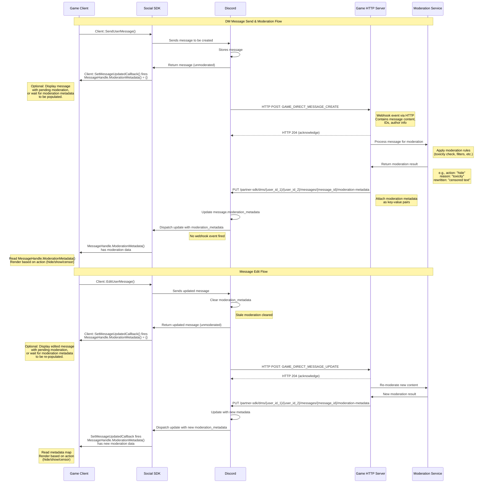

# Discord Social SDK — How-To Guides

Distilled from six pages under `docs.discord.com/developers/discord-social-sdk/how-to/`, retrieved
2026-08-26: `debug-log`, `handle-rate-limits`, `integrate-moderation`,
`handle-special-characters-display-names`, `use-with-discord-apis`, `market-your-integration`.
(The seventh how-to page, `voice-muting-for-blocked-players`, is in VOICE-CHAT.md.)

## Contents

- [Debug & Log](#debug--log)
- [Handle Rate Limits](#handle-rate-limits)
- [Integrate Moderation](#integrate-moderation)
- [Handle Special Characters in Display Names](#handle-special-characters-in-display-names)
- [Use with Discord APIs](#use-with-discord-apis)
- [Market Your Integration](#market-your-integration)
- [Symbols and change logs](#symbols-and-change-logs)

---

## Debug & Log

Source: `/how-to/debug-log`.

### Debugging symbols

**Debugging symbols are hosted at `https://storage.googleapis.com/discord-public-symbols`.** If using
Visual Studio, add this link to the pdb locations under `Tools > Options > Debugging > Symbols`.

**You won't be able to browse files using that link, but that's ok.** Individual files are accessible
under the domain, and the URL functions properly as a symbol server, so it works in Visual Studio.

### Logging

Access Discord's logs with **`Client::AddLogCallback`**. **`Client::SetLogDir`** writes the SDK's logs
to that directory if set.

**For production builds, use `ERROR (4)` or `WARN (3)` severity levels. For development builds, you can
use `INFO (2)` or `VERBOSE (1)` severity levels to get more detailed logs.** (These are the numeric
values of the `LoggingSeverity` enum the SDK uses.)

```cpp
client->AddLogCallback([](auto message, auto severity) {
  std::cout << "[" << EnumToString(severity) << "] " << message << std::endl;
}, discordpp::LoggingSeverity::Info);
```

### Voice Logging

**The voice subsystem (including the underlying WebRTC infrastructure) has its own dedicated logging
separate from the main SDK log stream.** Two options:

- **`Client::SetVoiceLogDir`** — writes voice logs to disk in the specified directory.
- **`Client::AddVoiceLogCallback`** — delivers voice log messages to a callback in your application.

**These can be used together, but `Client::SetVoiceLogDir` MUST be called immediately after Client
construction, before any call that initializes the voice subsystem (including
`Client::AddVoiceLogCallback`). Calling it after the voice subsystem has started has no effect.**

```cpp
// Must be called right after constructing the client, before anything else
client->SetVoiceLogDir("/path/to/log/dir", discordpp::LoggingSeverity::Info);

// Can be called any time after construction
client->AddVoiceLogCallback([](auto message, auto severity) {
  std::cout << "[Voice][" << EnumToString(severity) << "] " << message << std::endl;
}, discordpp::LoggingSeverity::Info);
```

**Voice logs are generated by the voice subsystem and WebRTC layer independently of the main SDK logs
captured by `Client::AddLogCallback`.** If you are diagnosing voice or call quality issues, enable
voice logging **in addition to** the main log callback.

### Audio Logging

For diagnosing issues with **acoustic echo cancellation (AEC)**, use **`Client::SetAecDump`**. This
enables diagnostic recording of audio input and output waveform data, invaluable when troubleshooting
echo, feedback, or other audio processing problems.

`Client::SetAecDump` enables or disables AEC diagnostic recording. **When enabled, the input and output
waveform data will be written to the log directory (the same directory specified by
`Client::SetLogDir`).**

```cpp
// Enable AEC diagnostic recording
client->SetAecDump(true);

// ... perform voice chat operations to reproduce the issue ...

// Disable AEC diagnostic recording when done
client->SetAecDump(false);
```

**When to use:**

- Users report echo or feedback during voice chat
- Audio quality issues that may be related to echo cancellation
- Testing AEC performance in different environments
- Debugging audio processing pipeline issues

**Warning: AEC dump files can become large quickly as they contain raw waveform data. Remember to
disable the diagnostic recording once you've captured the necessary data for analysis.**

### Client Tools

**The Discord client includes built-in developer tools** to help you diagnose issues and test features
of the Discord Social SDK. To enable them:

1. Navigate to `Settings > Advanced` and toggle on **Application Test Mode**.
2. Enter your Application ID and ignore the rest of the options in this modal, then click **Activate**.
3. Once enabled, **a new wrench icon appears in the upper right corner of your client**. Click it to
   open the developer tools.

**Account Linking tab.** This tab shows you the status of each of the on-platform account linking flows
and provides a quick option to start the account linking flow **without needing to find one of the
entry points within the client**. See ACCOUNT-LINKING.md → Account Linking from Discord.

---

## Handle Rate Limits

Source: `/how-to/handle-rate-limits`.

**When an SDK operation is rate limited, the callback receives a failed `ClientResult` where
`ClientResult::Retryable` is `true` and `ClientResult::RetryAfter` contains the number of seconds to
wait before retrying.**

### Checking the Result

Every SDK operation that makes a network request passes a `ClientResult` to its callback. **Always check
`ClientResult::Successful` first.** If the operation failed, inspect `ClientResult::Retryable` to decide
whether to retry:

```cpp
client->SendLobbyMessage(lobbyId, message, [](discordpp::ClientResult result, uint64_t messageId) {
  if (result.Successful()) {
    return;
  }

  if (result.Retryable()) {
    float delaySeconds = result.RetryAfter();
    // Schedule a retry after delaySeconds — see below
  } else {
    std::cerr << "Unrecoverable error: " << result.ToString() << "\n";
  }
});
```

**`ClientResult::Retryable` is set for rate limit responses (HTTP 429) as well as transient network
errors. It is `false` for permission errors, validation failures, and other non-recoverable failures —
don't retry those.**

### Implementing Retry Logic

**Use `ClientResult::RetryAfter` as the minimum delay before your next attempt. Retrying before this
elapses will trigger continued rate limiting.**

```cpp
void SendMessageWithRetry(
    std::shared_ptr<discordpp::Client> client,
    uint64_t lobbyId,
    std::string message,
    int attemptsLeft)
{
  client->SendLobbyMessage(lobbyId, message,
    [client, lobbyId, message, attemptsLeft](discordpp::ClientResult result, uint64_t messageId) {
      if (result.Successful()) {
        std::cout << "Message sent\n";
        return;
      }

      if (result.Retryable() && attemptsLeft > 1) {
        float delay = result.RetryAfter();
        ScheduleCallback(delay, [client, lobbyId, message, attemptsLeft]() {
          SendMessageWithRetry(client, lobbyId, message, attemptsLeft - 1);
        });
      } else {
        std::cerr << "Failed after retries: " << result.ToString() << "\n";
      }
    });
}
```

**`ScheduleCallback` here represents whatever timer mechanism your engine provides** (e.g. a delayed
task queue, coroutine sleep, or engine tick callback).

`ClientResult` therefore exposes at least `Successful()`, `Retryable()`, `RetryAfter()` (float,
seconds), `Error()` and `ToString()`.

### Rate Limit Reference

For rate limits and applying for increased limits, see CORE-CONCEPTS.md → Communication Features. For
general information on how Discord rate limiting works, see `/developers/topics/rate-limits` — call the
Skill tool with "discord-rest".

---

## Integrate Moderation

Source: `/how-to/integrate-moderation`.

This guide helps you:

- Better understand your moderation responsibilities
- Implement **server-side** moderation for text content using Discord's moderation metadata API
- Implement **client-side** moderation for audio content with the Discord Social SDK

Prerequisites: a basic understanding of how the SDK works; a basic understanding of your game's
communication features; familiarity with provisional accounts; reviewed the Discord Social SDK Terms
(`https://support-dev.discord.com/hc/en-us/articles/30225844245271-Discord-Social-SDK-Terms`).

### Your Moderation Responsibilities

**Moderation on Discord.** Discord's Community Guidelines (`https://discord.com/guidelines`) and Terms
of Service (`https://discord.com/terms`) apply to any content that is rendered on Discord, including:

- Text messages, audio, and video sent within Discord's platform
- Text messages that appear on Discord (such as in DMs or Linked Channels) after being sent by players
  in your game (**whether they have linked their Discord account or are using a provisional account**)

**Discord can take various actions against such content on Discord for violating its terms or policies,
including through Discord platform-wide account bans and restrictions.** Actions against a player's
Discord account **will not affect their separate account in the game**; however, **if a player's Discord
account is banned, they will no longer have access to the SDK features that require an account
connection.**

**Game Developer's Responsibility.** Your terms and policies apply to the content in your game. You are
responsible for:

- Ensuring you comply with the Discord Social SDK Terms
- Creating game-specific content policies and enforcing them
- In-game content moderation for messages or audio within your game
- Implementing appropriate UIs for reporting and moderation; this includes **providing players a way to
  report issues or violations of your policies and reviewing and taking appropriate action on such
  reports**

**Warning: you are responsible for any third-party moderation toolkits or services you use for your
game and will ensure you comply with any applicable terms and laws, including obtaining consents from
players as necessary for processing their data using such moderation services.**

### Server-Side Chat Moderation

**Discord's moderation metadata API lets your backend evaluate messages and attach application-scoped
`moderation_metadata` to them.** The metadata is persisted by Discord and delivered to active game
sessions via realtime `GAME_DIRECT_MESSAGE_UPDATE` or `LOBBY_MESSAGE_UPDATE` Webhook Events — **no
polling required**. **Metadata is never exposed to other applications and is not included in other API
endpoints or Gateway events.**

#### How It Works

1. Your backend receives a webhook event when a message is created or updated.
2. Your moderation system evaluates the message and updates the `moderation_metadata` on the message via
   the Discord API to indicate what action should be taken (hide, blur, replace, etc.).
3. Discord persists the metadata and dispatches an update event to relevant game client participants via
   the Social SDK.
4. The game client is notified of the update via `Client::SetMessageUpdatedCallback`, and retrieves
   `MessageHandle::ModerationMetadata` from the specified `MessageHandle` in the firing callback, and
   renders the message accordingly.
5. **If the message content is edited, Discord clears the moderation metadata before dispatching a new
   update, indicating the message needs to be re-moderated.**

Upstream sequence diagram, verbatim:



**While this sequence diagram demonstrates moderation for direct messaging, the same flow applies to
lobby messages** — with the appropriate Social SDK methods, Webhook Event types and API paths.

Note the SDK method `Client::EditUserMessage` appears in this diagram for the edit flow.

#### Webhook Events

Subscribe to the following events (`/developers/events/webhook-events#subscribing-to-events`) on your
app's webhook to receive messages for moderation:

| Event | Description |
| --- | --- |
| `GAME_DIRECT_MESSAGE_CREATE` | Fired when a DM is created in a Social SDK session |
| `GAME_DIRECT_MESSAGE_UPDATE` | Fired when a DM is updated (content edit) |
| `LOBBY_MESSAGE_CREATE` | Fired when a message is created in a lobby |
| `LOBBY_MESSAGE_UPDATE` | Fired when a lobby message is updated (content edit) |

See the Webhook Events reference (`/developers/events/webhook-events`) for full event schemas.

**Metadata-only updates do NOT fire webhook events — they are delivered only via realtime SDK callbacks
to active game sessions.**

#### Applying Moderation Decisions

**DM messages:** `PUT /partner-sdk/dms/{user_id_1}/{user_id_2}/messages/{message_id}/moderation-metadata`
with a `Bot` token. **`user_id_1` and `user_id_2` are the two DM participants; order does not matter.**

```python
import requests

API_ENDPOINT = 'https://discord.com/api/v10'
BOT_TOKEN = 'YOUR_BOT_TOKEN'

def apply_dm_moderation(user_id_1, user_id_2, message_id, metadata):
  r = requests.put(
    f'{API_ENDPOINT}/partner-sdk/dms/{user_id_1}/{user_id_2}/messages/{message_id}/moderation-metadata',
    headers={
      'Authorization': f'Bot {BOT_TOKEN}',
      'Content-Type': 'application/json',
    },
    json=metadata
  )
  r.raise_for_status()

# Instruct the client to hide this message — moderation service flagged it as toxic
metadata = {
  'action': 'hide',   # client will not render this message
  'reason': 'toxicity',  # logged by the client for reporting purposes
}
apply_dm_moderation(user_id_1, user_id_2, message_id, metadata)

# Alternatively, instruct the client to show this message — moderation service approved it
metadata = {
  'action': 'show',  # client will render the message normally
}
apply_dm_moderation(user_id_1, user_id_2, message_id, metadata)
```

**Lobby messages:** `PUT /lobbies/{lobby_id}/messages/{message_id}/moderation-metadata` with a `Bot`
token.

```python
import requests

API_ENDPOINT = 'https://discord.com/api/v10'
BOT_TOKEN = 'YOUR_BOT_TOKEN'

def apply_lobby_moderation(lobby_id, message_id, metadata):
  r = requests.put(
    f'{API_ENDPOINT}/lobbies/{lobby_id}/messages/{message_id}/moderation-metadata',
    headers={
      'Authorization': f'Bot {BOT_TOKEN}',
      'Content-Type': 'application/json',
    },
    json=metadata
  )
  r.raise_for_status()

# Instruct the client to replace the message content with a policy reminder
metadata = {
  'action': 'replace',  # client will display replacement text instead of the original
  'replacement': 'Be kind to others!',  # the text the client will render in place of the message
}
apply_lobby_moderation(lobby_id, message_id, metadata)
```

**Both endpoints return `HTTP 204: No Content` on success.**

#### Moderation Metadata Fields

**The metadata body is a free-form key–value map.** Use any keys your client understands. Common
conventions:

| Key | Example values | Purpose |
| --- | --- | --- |
| `action` | `hide`, `show`, `blur`, `replace` | How the client should render the message |
| `reason` | `toxicity`, `spam` | Why the action was taken (useful for logging) |
| `replacement` | any string | Text to display instead of the original message |
| `severity` | `low`, `medium`, `high` | Optional severity classification |

**Limits: up to 5 keys per message; key length ≤ 1024 characters; value length ≤ 2000 characters** (the
maximum Discord message length, so values can contain modified message content).

**Moderation metadata is application scoped — only your application can read it, even for messages that
are visible in Discord.**

#### Handling Moderation Metadata on the Client

Register `Client::SetMessageUpdatedCallback` to receive metadata updates. Access the metadata through
`MessageHandle::ModerationMetadata`, which returns the key–value map written by your backend.

```cpp
client->SetMessageUpdatedCallback([&client](uint64_t messageId) {
    if (auto message = client->GetMessageHandle(messageId)) {
        auto metadata = message->ModerationMetadata();
        if (metadata.empty()) {
            // No moderation decision yet — render as pending, normally, or hide completely,
            // depending on your moderation requirements
            renderPendingModeration(message);
            return;
        }
        auto action = metadata.count("action") ? metadata.at("action") : "show";
        if (action == "hide") {
            hideMessage(messageId);
        } else if (action == "show") {
            renderMessage(message);
        } else if (action == "replace") {
            renderMessage(messageId, metadata.at("replacement"));
        } else if (action == "blur") {
            renderBlurred(message);
        } else {
            std::cerr << "Unknown moderation action: " << action << "\n";
            renderMessage(message);  // fall back to rendering normally
        }
    }
});
```

**While moderation is in progress, consider not rendering new messages, or rendering in a "pending
moderation" state to avoid briefly displaying unmoderated content.**

#### Handling Content Edits

**When a message is edited, Discord automatically clears the stored `moderation_metadata` and dispatches
a new update notification for the message.**

`Client::SetMessageUpdatedCallback` will fire with an **empty metadata map** for the edited message, and
your backend will receive a `GAME_DIRECT_MESSAGE_UPDATE` or `LOBBY_MESSAGE_UPDATE` webhook event for the
edit, which you can use to trigger re-moderation of the new content.

**While re-moderation is in progress, consider not rendering the new, updated message, or rendering in a
"pending moderation" state** to avoid briefly displaying unmoderated content.

### Handling Users with Banned Discord Accounts

**Discord Platform Bans.** When a player's Discord account is banned by Discord — whether temporarily or
permanently — **they will no longer be able to authenticate to your app via Discord, their existing
`Client` is disconnected, their OAuth2 tokens are invalidated, and an `APPLICATION_DEAUTHORIZED` webhook
is fired.**

**A ban is mechanically an unmerge that Discord initiates** — the OAuth2 tokens are deleted and a **new
cross-platform-restricted provisional account** takes the place of the linked Discord identity. See
PROVISIONAL-ACCOUNTS.md → Ban-Driven Unmerge for the full lifecycle, and ACCOUNT-LINKING.md →
Out-of-Band Revocation for the auth-side observable signals and recommended integration architecture.

**Discord Server Bans.** If you wish to tie your in-game moderation policies to a specific Discord
server that you own, such as your official community server, **you can retrieve ban information for your
Discord Server via the REST APIs**:

- `{guild.id}/guilds/{guild.id}/bans` — Get Guild Bans (`/developers/resources/guild#get-guild-bans`);
  the path is printed with that leading `{guild.id}/` upstream.
- `/guilds/{guild.id}/bans/{user.id}` — Get Guild Ban (`/developers/resources/guild#get-guild-ban`).

Call the Skill tool with "discord-rest" for those endpoints.

### Voice Chat Moderation

**The Discord Social SDK provides access to audio streams for in-game voice calls**, allowing you to
implement audio moderation for your game's voice chat. The data for the call is available through
`Client::StartCallWithAudioCallbacks`, and can be passed to your voice moderation system.

```cpp
// Example: Capturing local voice chat audio for asynchronous moderation.

// Callback for local users' audio with moderation
auto capturedCallback = [](int16_t const* data,
                     uint64_t samplesPerChannel, int32_t sampleRate,
                     uint64_t channels) {
    // Call the moderation function
    moderateCapturedVoice(data, samplesPerChannel);
};

// Start the call with our moderation callback
auto call = client->StartCallWithAudioCallbacks(lobbyId, receivedCallback, capturedCallback);
```

---

## Handle Special Characters in Display Names

Source: `/how-to/handle-special-characters-display-names`.

The Social SDK **recommends using an account's Display Name in the Unified Friends List** (see
RELATIONSHIPS-AND-FRIENDS.md → Step 1: Fetch Relationships; the SDK member is
`UserHandle::DisplayName`, Doxygen anchor
`classdiscordpp_1_1UserHandle.html#af6447fa2011bfa4fcd7e55bc56847f5c`). **However, Display Names support
a large set of characters across the Unicode spec, and some of these characters may not be supported in
a game's specified font.**

Three options, each with the tradeoffs upstream states:

### Use a font family that supports Unicode

A family such as **Noto** (`https://notofonts.github.io/`) aims to have broad Unicode support. If a font
cannot render a Display Name, consider rendering it with a **fallback font**, or in the extreme case,
choose a font with broad Unicode support for the Friends List.

**Tradeoffs:**

- One font family may not include 100% overlap with what Discord supports.
- A font that supports Unicode may not mesh with your game's aesthetics.
- **Engine support is limited, especially for characters that rely on UTF surrogate pairs.**

### Map the Unicode characters to ASCII

A library such as **Unidecode** (`https://metacpan.org/pod/Text::Unidecode`, ported to many languages)
can map many Unicode characters to an ASCII equivalent. If you detect that a Display Name has characters
that cannot be rendered, consider passing it through a library to transliterate the Display Name to
ASCII.

**Tradeoffs:**

- **This may result in unintended transliterations.** It is impossible to create a perfect mapping
  between Unicode and ASCII in every situation. Libraries try their best, but this approach **may
  unintentionally create an inaccurate or even offensive display name** in some instances.
- **Libraries will not have 100% coverage.** Some Unicode characters may not have a map to an ASCII
  character. If someone's Display Name is `ʕ•͡-•ʔ` what would it map to?
- Most libraries assume English is the target language.
- **Users may not appreciate their display names being changed without their knowledge or consent.**

### Use the Discord Username as a Fallback

If a Display Name is not renderable at all, consider falling back to the user's **`Username`**
(`UserHandle::Username`, Doxygen anchor
`classdiscordpp_1_1UserHandle.html#a0eda41fe18b50bce373fb5a1b88cb411`).

**Tradeoffs:**

- This can **break immersion** in a game if a friend had expected to rely on their Display Name from
  within the game.
- **Some users consider their Username to be more private information** and do not expect it to be shared
  by others (such as when someone is streaming and their friends list is visible).

Note: this page links the two `UserHandle` members via a `docs/slayer-sdk/` path rather than the usual
`docs/social-sdk/` path — an upstream inconsistency, not a different class.

---

## Use with Discord APIs

Source: `/how-to/use-with-discord-apis`.

The Discord Social SDK provides **client-side** functionality. **However, if you use a game backend, you
should interact with Discord's HTTP APIs for server-side operations when possible.**

Prerequisites: a Discord application created in the Developer Portal; access to your application's bot
token; required OAuth2 scopes configured.

### Authentication Types

**Bot Token Authentication** — for server-to-server communication:

```bash
curl -X GET https://discord.com/api/v10/users/@me \
  -H "Authorization: Bot YOUR_BOT_TOKEN"
```

**Always prefix your bot token with `Bot ` in the Authorization header!**

**Bearer Token Authentication** — for authenticated user actions:

```bash
curl -X GET https://discord.com/api/v10/users/@me \
  -H "Authorization: Bearer USER_ACCESS_TOKEN"
```

### Common API Operations

**OAuth2 Token Exchange** — exchange an authorization code for an access token:

```python
# filepath: /your/backend/auth.py
import requests

def exchange_code(code, redirect_uri):
    data = {
        'client_id': 'YOUR_CLIENT_ID',
        'client_secret': 'YOUR_CLIENT_SECRET',
        'grant_type': 'authorization_code',
        'code': code,
        'redirect_uri': redirect_uri
    }
    
    response = requests.post('https://discord.com/api/v10/oauth2/token', data=data)
    return response.json()
```

**User Information** — get information about the authenticated user:

```python
def get_user_info(access_token):
    headers = {'Authorization': f'Bearer {access_token}'}
    response = requests.get('https://discord.com/api/v10/users/@me', headers=headers)
    return response.json()
```

### Using the OpenAPI Specification

You can use the **Discord OpenAPI Spec** (`https://github.com/discord/discord-api-spec`) to generate a
client in your preferred backend language. A good tool for that is
`https://openapi-generator.tech/`. In Python, for example:

```python
import openapi_client
import os
from pprint import pprint
 
configuration = openapi_client.Configuration(host = "https://discord.com/api/v10")
configuration.api_key['BotToken'] = 'Bot ' + os.environ["API_KEY"]
with openapi_client.ApiClient(configuration) as api_client:
    api_instance = openapi_client.DefaultApi(api_client)
 
    request = openapi_client.CreateLobbyRequest()
    request.metadata={'foo':'bar'}
    pprint(api_instance.create_lobby(request))
```

### Best Practices

1. **Token Security**
   - Never expose bot tokens in client-side code
   - Store tokens securely
2. **Rate Limiting**
   - Respect Discord's rate limits (`/developers/topics/rate-limits`)
   - Implement exponential backoff
   - Cache responses when appropriate
3. **Error Handling**
   - Handle HTTP errors gracefully
   - Implement retry logic for transient failures
   - Log API errors for debugging

---

## Market Your Integration

Source: `/how-to/market-your-integration`.

This toolkit provides guidelines and best practices for a go-to-market plan to make players aware of the
integration, answer their questions, and use Discord brand guidelines appropriately.

**As the developer, the choice and ownership of marketing your integration with the Discord Social SDK
to your players is yours. As a reminder, you may not make any statement that suggests a partnership
with, sponsorship by, or endorsement by Discord without Discord's prior written approval in each
instance.**

### Announcement Goals And Messaging

Announcing **Discord Social SDK** features to your players has two goals:

- **For Players:** drive awareness of how playing with friends is easier by linking your Discord
  account.
- **For Developer:** encourage more persistent social interaction between your players.

**Player-facing messaging of Discord Social SDK is different from how Discord frames it to developers.**

Discord's guidance **focuses on features that encourage Discord account linking** — the most important
step for you and your players to experience the benefits of the integration
(`https://discord.com/developers/social-sdk`). **If your announcements do not focus on Discord Social
SDK features that require account linking, you can still generally use this guidance and the brand
guidelines.**

#### A Note on the Product Name

**Technically, the full product name is "Discord Social SDK".** However, Discord recommends announcing
this integration to your players with **more casual language**, and in most cases **sharing the full
product name with players is not needed**.

**If you decide to mention the full "Discord Social SDK" product name, after mentioning it once you may
refer to it as the "SDK"** for the remainder of your announcements.

#### Key Message to Players

> Link your Discord account and play with friends more easily.

#### Key Benefits to Players

- **Find your friends** — link your Discord account to see who's playing and easily join them. From the
  game, invite your friends to join—even if they're offline.
- **Stay connected** — keep the conversation going by syncing messages and friends lists to Discord.

### Detailed Feature Descriptions

**In most cases, players won't need to know the actual "Feature Name"**, but referencing the description
and use cases below is helpful for them.

| Feature Name | Short Description | Use Cases |
| --- | :-- | :-- |
| **Rich Presence** | Shows on Discord which games players are currently playing. | Knowing what your friends are doing in-game, so you know if they'd be available to play together<br /><br />Joining a game directly from a friend's profile (similar to game invites) |
| **Unified Friends List** | Players can access their Discord friends list from within the game. Includes friend tiers. | Sending game invites directly to friends from in-game<br /><br />Knowing which of your friends is playing, and who isn't playing but is online and could play<br /><br />Not having to re-create your friends list social in a new game that you play |
| **Deeplink Game Invites** | Users can send invites that link directly to specific game instances or parts of a game. | Challenging users to specific game instances |
| **Flexible Account Requirements** | Users can choose to link their Discord account to unlock deeper integrated features such as the Unified Friends List and Rich Presence, but can also take advantage of the in-game social features without linking an account through an innovative "provisional account." | Account linking: Automatic Discord-based sign in, or, linking of your Discord account to a game account.<br />Take full advantage of the Discord integration<br /><br />Provisional accounts: Provisional accounts let you use Discord's voice and text chat features while playing connected games - without needing to create a Discord account first. |
| **Cross-Platform Messaging** | Allows players to communicate seamlessly both in-game and through Discord, even without a Discord account. | DMing your friends when they're in-game and out of game<br /><br />Receiving messages from your friends when you aren't playing.<br /><br />In-game text chat for guilds, matches, lobbies, etc. |
| **Linked Channels** | Players can link their in-game group chat with in-Discord channels, providing persistent group chats. | In-game guild/group chat mirrored in your guild's/group's Discord server<br /><br />No more feeling isolated from the broader group if you're online when everyone else isn't, or vice-versa |
| **Discord Voice Chat** | High quality voice chat powered by Discord available directly in the game. | In-game voice chat for guilds, matches, lobbies, etc. |

### Integration Announcement Plan Recommendations

Channel recommendations for announcing the integration (upstream marks the first two as "Best"):

- **In-Game Messaging or Reward (Best)** — display a pop-up screen, banner, or CTA informing players of
  the recent update, prompting them to link their Discord account, and possibly reward them.
- **Announcement Video (Best)** — show the integration and benefits in action through a video.
- **Individual Blog Post** — create a blog post to outline the integration in more detail.
- **Patch Notes** — include the Discord integration details and images as a key update.
- **Social Media** — use other social channels to spread the word.
- **Discord Server Announcement** — in your main announcements channel in Discord, post a message to let
  your community know. Create a dedicated space for players to discuss feedback.
- **Creator Partnership** — partner with a creator to walk through the integration with their community.
- **Paid Media** — run paid ads to encourage people to link their Discord account.
- **Press** — pitch your story to relevant press outlets. **For any press inquiries, loop in
  `press@discord.com`.**
- **Support Ticket Setup** — ensure you have a new support ticket category set up so players can easily
  troubleshoot any problems, such as a "Discord account linking" category.

#### Discord Social Handles to Tag

- X: `@discord` (`https://x.com/discord?lang=en`)
- Instagram: `@discord` (`https://www.instagram.com/discord/?hl=en`)
- TikTok: `@discord` (`https://www.tiktok.com/@discord?lang=en`)
- YouTube: `@discord` (`https://www.youtube.com/@discord/shorts`)
- LinkedIn: `@discord` (`https://www.linkedin.com/company/discord`)

### Discord Brand Assets & Guidance

**When using Discord Marks and Brand Assets, you must always comply with Discord's Brand Guidelines**
(`https://discord.com/branding`). **You may not make any statement that suggests a partnership with,
sponsorship by, or endorsement by Discord without Discord's prior written approval in each instance.**

#### Discord Logo and Wordmark

- Download link: `https://discord.com/branding`
- **Guidance for Discord Social SDK:** when using the logo or wordmark in your CTA buttons in-game, in
  social and blog post visual assets, **review the Logo & Symbol sections of the brand guidelines**. If
  you're not sure about use or have questions, reach out to your Discord point of contact.
- Also refer to the in-game **Connection Points** and **Overall Flow** design guidance (see
  DESIGN-GUIDELINES.md → Connection Points and Signing in with Discord → Before the user connects).
- **Usage Guidance:** Logo Usage Do's and Don'ts — `https://discord.com/branding`, click "View Brand
  Kit" then "Logo" then "Usage".

#### Discord Bumper Splash Animation

Downloads:

- 3 second bumper splash animation video —
  `https://cdn.discordapp.com/assets/content/edbc1f6c8b7b0ea968888a2588ff552c2f8b2090fc2aa13e97e224427d5ad03c.mov`
- 3 second bumper splash animation audio (TV) —
  `https://cdn.discordapp.com/assets/content/efe58ff7a83b8063a0b60f41f171932ce7d26de78fe2e2c2c531e26edadac3d4.wav`
- 3 second bumper splash animation audio (Streaming) —
  `https://cdn.discordapp.com/assets/content/f3070170acd3f62b08ba9a63ab71080f6f7a72be5c84b74d1b247b4767696045.wav`

**Best Practice Guidance:** this can be used as an intro splash video to your game, video launch
announcement of the SDK, or game trailer content where Discord Social SDK features are shown. **You
should not use this splash video in your content if Discord Social SDK features aren't present in the
content.**

**Usage Guidance:** when using this splash animation in your video, **always include it at the beginning
of the video. This splash video should never go in the middle or end of your content.** **Using the 3
second video is preferred by Discord, but 1 second and 2 second options are available.**

### Legal Brand Guidelines

**DISCORD, DISCORD NITRO, the "Clyde" Logo and any other trademark owned by Discord and its affiliates
(the "Discord Marks") and other brand materials such as logos, trade dress, the Discord look and feel,
and other aesthetic features unique to the brand (the "Brand Assets") are the exclusive property of
Discord Inc. You must have permission from Discord before using any of the Discord Marks or Brand Assets
except as permitted here in this document.**

See the Discord Brand Guidelines (`https://discord.com/branding`) for additional legal guidelines.

---

## Symbols and change logs

### Doxygen anchors

Base `https://discord.com/developers/docs/social-sdk/`.

| Symbol | Anchor |
| --- | --- |
| `Client::AddLogCallback` | `classdiscordpp_1_1Client.html#af78996cff24a40f5dc7066beed16692c` |
| `Client::AddVoiceLogCallback` | `classdiscordpp_1_1Client.html#ac4f9b459f853ef7270d1bfc12509ede5` |
| `Client::SetAecDump` | `classdiscordpp_1_1Client.html#a3a05b2cafaa546d915a5249c63f4059f` |
| `Client::SetLogDir` | `classdiscordpp_1_1Client.html#a23bd5802dfa3072201ea864ee839c001` |
| `Client::SetVoiceLogDir` | `classdiscordpp_1_1Client.html#a48c6b7e8bbc2b632a935acafc6a5f7a7` |
| `ClientResult` | `classdiscordpp_1_1ClientResult.html#a685015ca8d29a50d47fd1ed5d469ac2e` |
| `ClientResult::Retryable` | `classdiscordpp_1_1ClientResult.html#a0d220638f4a36c0b8b731f601e0ac02d` |
| `ClientResult::RetryAfter` | `classdiscordpp_1_1ClientResult.html#ac739adca52b90d6b4cbed5753c30fd65` |
| `ClientResult::Successful` | `classdiscordpp_1_1ClientResult.html#aef3b1aca3cd156daf488ca13ae87313b` |
| `Client` | `classdiscordpp_1_1Client.html#a91716140c699d8ef0bdf6bfd7ee0ae13` |
| `Client::SetMessageUpdatedCallback` | `classdiscordpp_1_1Client.html#aa01cf3c15403f29780dabfcfaf3b1dcd` |
| `Client::StartCallWithAudioCallbacks` | `classdiscordpp_1_1Client.html#abcaa891769f9e912bfa0e06ff7221b05` |
| `MessageHandle` | `classdiscordpp_1_1MessageHandle.html#ae25595b43bc74b0c4c92c5165d16382f` |
| `MessageHandle::ModerationMetadata` | `classdiscordpp_1_1MessageHandle.html#afb9ae126f6b1f0de006f2be8e3688205` |
| `UserHandle::DisplayName` | `classdiscordpp_1_1UserHandle.html#af6447fa2011bfa4fcd7e55bc56847f5c` |
| `UserHandle::Username` | `classdiscordpp_1_1UserHandle.html#a0eda41fe18b50bce373fb5a1b88cb411` |

Also used without a linked anchor: `Client::SendUserMessage`, `Client::EditUserMessage`,
`Client::SendLobbyMessage`, `Client::GetMessageHandle`, `ClientResult::ToString`,
`ClientResult::Error`, `discordpp::EnumToString`, `LoggingSeverity` (`Info`; plus the documented
severity levels `VERBOSE (1)`, `INFO (2)`, `WARN (3)`, `ERROR (4)`).

### HTTP endpoints on these pages

| Method + path | Auth | Purpose |
| --- | --- | --- |
| `PUT /partner-sdk/dms/{user_id_1}/{user_id_2}/messages/{message_id}/moderation-metadata` | `Bot` | Set DM moderation metadata; returns 204 |
| `PUT /lobbies/{lobby_id}/messages/{message_id}/moderation-metadata` | `Bot` | Set lobby message moderation metadata; returns 204 |
| `GET /users/@me` | `Bot` or `Bearer` | Current bot/user info |
| `POST /oauth2/token` | body credentials | Authorization-code exchange |
| `GET /guilds/{guild.id}/bans` | `Bot` | Get Guild Bans |
| `GET /guilds/{guild.id}/bans/{user.id}` | `Bot` | Get Guild Ban |

### Change logs

**Debug & Log:**

| Date              | Changes                   |
| ----------------- | ------------------------- |
| March 17, 2025    | initial release           |
| November 17, 2025 | add client tools          |
| May 4, 2026       | add voice logging section |

**Handle Rate Limits:**

| Date           | Changes         |
| -------------- | --------------- |
| April 27, 2026 | Initial release |

**Integrate Moderation:**

| Date         | Changes                                                                     |
| ------------ | --------------------------------------------------------------------------- |
| May 22, 2026 | Move platform-ban lifecycle details to the Account Linking guide            |
| Feb 20, 2026 | Replaced client-side message moderation with server-side message moderation |
| May 22, 2025 | initial release                                                             |

**Handle Special Characters in Display Names:**

| Date          | Changes                         |
| ------------- | ------------------------------- |
| June 17, 2025 | special characters how-to added |

**Use with Discord APIs:**

| Date           | Changes         |
| -------------- | --------------- |
| March 17, 2025 | Initial Release |

**Market Your Integration:**

| Date          | Changes          |
| ------------- | ---------------- |
| July 22, 2025 | initial creation |
