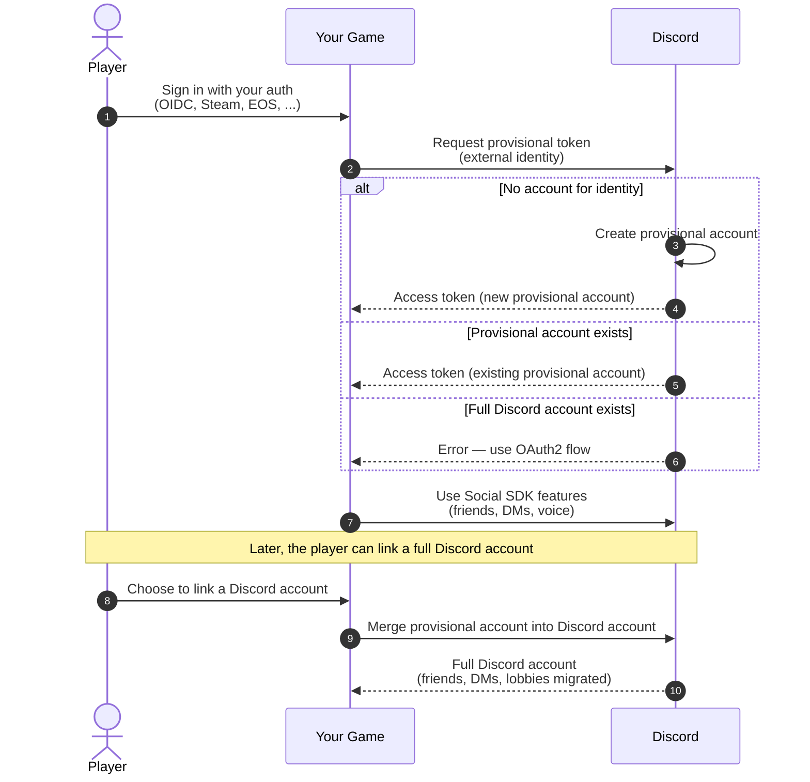
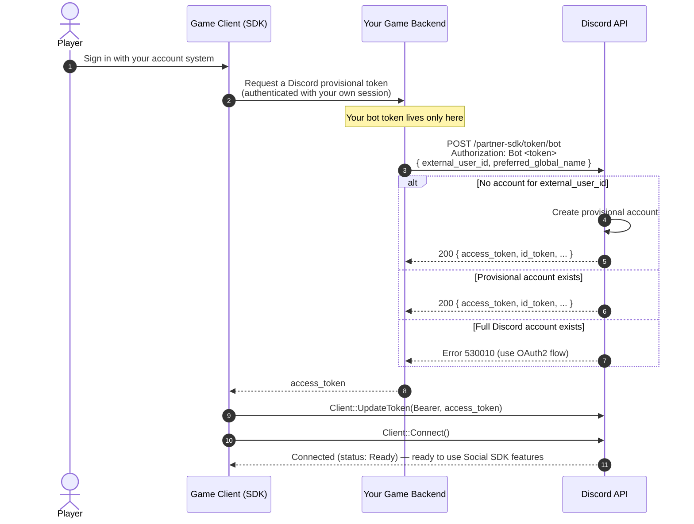
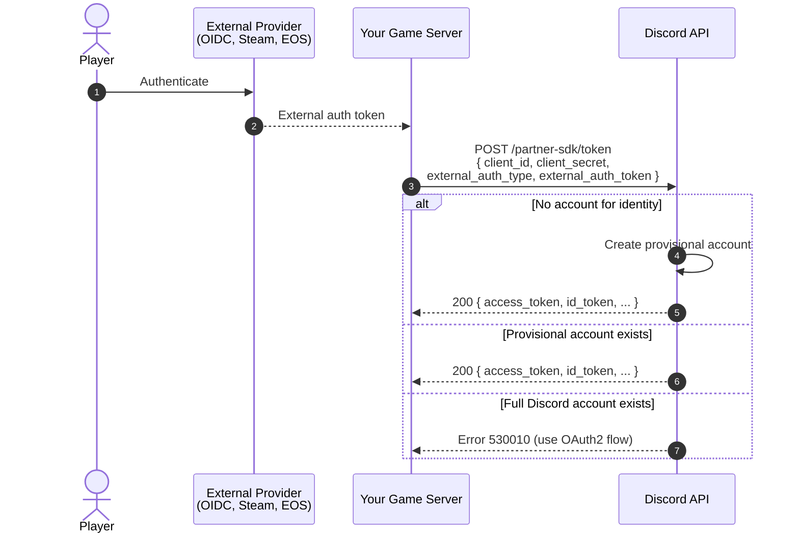
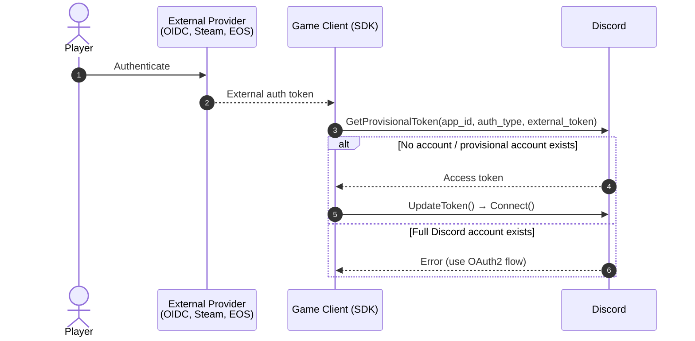
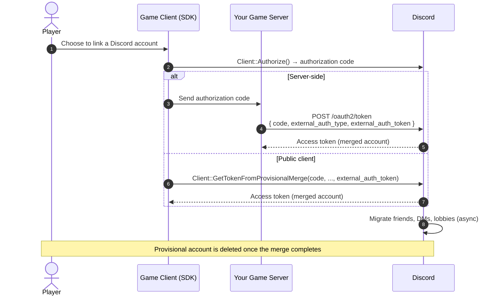
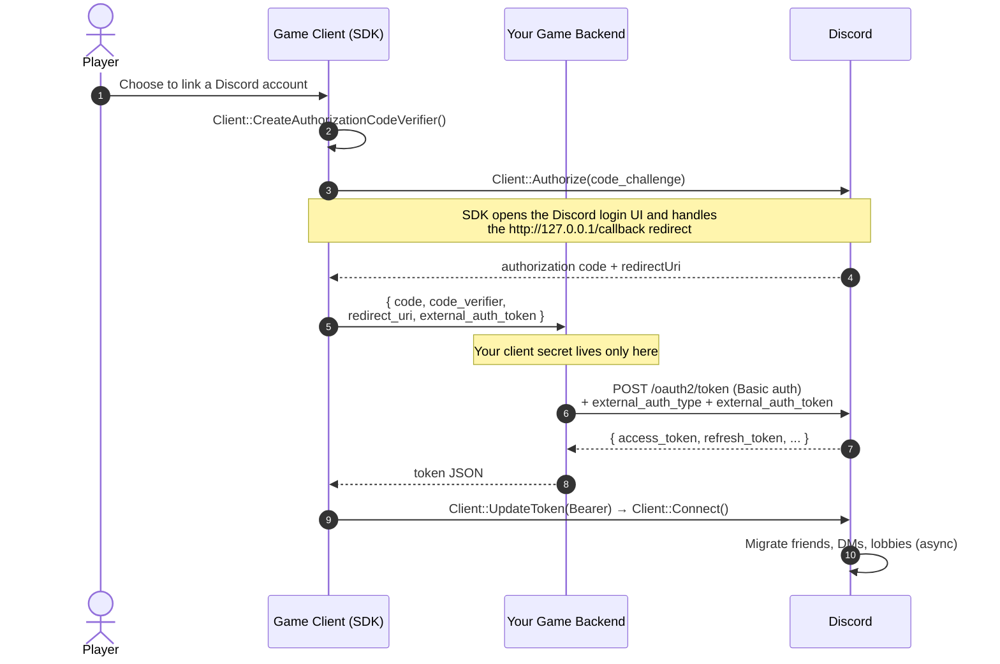
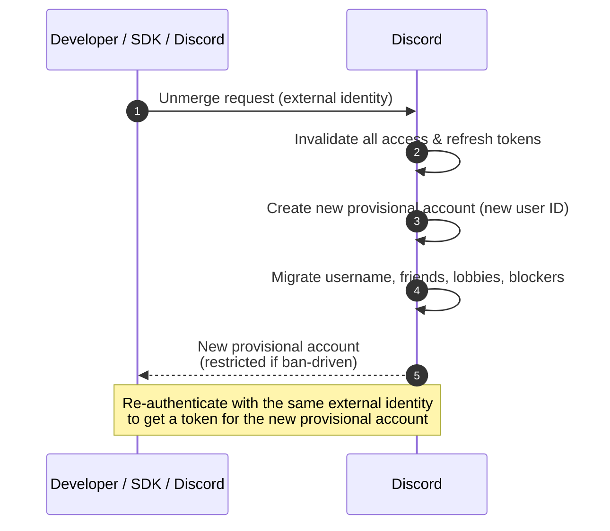

# Discord Social SDK — Provisional Accounts

Distilled from all 8 pages under
`docs.discord.com/developers/discord-social-sdk/development-guides/provisional-accounts/`, retrieved
2026-08-26: `overview`, `identity-providers`, `bot-token-endpoint`, `external-credentials-exchange`,
`public-client`, `managing-accounts`, `merging-accounts`, `unmerging-accounts`.

## Contents

- [Overview](#overview)
- [Choosing an Authentication Method](#choosing-an-authentication-method)
- [Configuring Identity Providers](#configuring-identity-providers)
  - [External Auth Types](#external-auth-types)
  - [OIDC Integration Requirements](#oidc-integration-requirements)
- [Bot Token Endpoint (recommended)](#bot-token-endpoint-recommended)
- [External Credentials Exchange](#external-credentials-exchange)
- [Public Client Integration](#public-client-integration)
- [Error codes for provisional account creation](#error-codes-for-provisional-account-creation)
- [Managing Provisional Accounts](#managing-provisional-accounts)
- [Merging Accounts](#merging-accounts)
- [Unmerging Accounts](#unmerging-accounts)
- [Endpoint and symbol index](#endpoint-and-symbol-index)
- [Change logs](#change-logs)

---

## Overview

Source: `/provisional-accounts/overview`.

**Provisional accounts let players use Social SDK features in your game without linking a Discord
account**, so all players can have a consistent gameplay experience. With provisional accounts,
players can:

- Add friends and communicate with other players
- Join voice chats in game lobbies
- Send direct messages to other players
- Appear in friends lists and game lobbies

**Terminology:** *linking* is the player-facing action of connecting a Discord account, and *merging*
is the operation that carries it out — the provisional account's data is merged into the Discord
account. They describe the same flow from different angles.

### Prerequisites

- A basic understanding of how the SDK works (Getting Started guides).
- An external authentication provider set up for your game.

### What Are Provisional Accounts?

Think of provisional accounts as **temporary Discord accounts** that:

- Work only with your game
- Can be merged into a full Discord account later
- Persist between game sessions
- Use your game's authentication system

They are "placeholder" Discord accounts for the user that your game owns and manages. For existing
Discord users who have added a provisional account as a game friend, the provisional account appears
in their friend list, allowing DMs and text/voice interaction in lobbies.

### Benefits

- **Instant Access**: players can use social features immediately
- **Seamless Experience**: works the same for all players
- **Easy Linking**: simple to merge into a full Discord account
- **Data Persistence**: friends and history are preserved
- **Cross-Platform**: works on all supported platforms

### Provisional Account Lifecycle



### Implementing Provisional Accounts

Whichever method you choose, **creating a provisional account and requesting an access token for it
always happens in a single step.** You provide external authentication that uniquely identifies the
user, and Discord finds a user associated with that identifier:

- If there is **no account** associated with the identity, a new provisional account is created along
  with a new access token for the user.
- If there is a **provisional account** associated with the identity, an access token is returned.
- If there is an **existing full Discord account** associated with the identity, the request is
  aborted.

Once authentication is complete, you can use the access token as you would a full Discord user's
access token.

---

## Choosing an Authentication Method

Discord offers a number of authentication methods; which you use depends on how your game and account
system are set up:

1. Use the **Bot Token Endpoint** if your game has an account system which uniquely identifies users.
   **This is the recommended approach when possible.**
2. Use **Server Authentication with External Credentials Exchange** if you have a hard requirement for
   a server side custom OIDC integration.
3. Use the **Public Client Integration** method if you don't have a server authoritative backend, and
   therefore require using a Public Client for authentication.

**If you are using (2) or (3), you must configure your identity provider before being able to create
provisional accounts.**

---

## Configuring Identity Providers

Source: `/provisional-accounts/identity-providers`.

**If you are using the Bot Token Endpoint, no Identity Provider configuration is required.**

Open the Discord app for your game in the Developer Portal. Find the **External Auth** page under the
`Discord Social SDK` section in the sidebar
(`https://discord.com/developers/applications/select/social-sdk/external-auth-providers`).

Click on `Add Auth Provider` and choose the type of provider you're using (Steam, OIDC, etc.). Fill in
the required details for your provider.

Supported provider types:

- OpenID Connect (OIDC)
- Steam Session Tickets
- Epic Online Services (EOS)
- Unity
- Apple
- PlayStation Network (PSN)

### External Auth Types

Providers are represented in Discord's systems by the following types (the `external_auth_type`
values):

| Type | Description |
| --- | --- |
| `OIDC` | OpenID Connect ID token |
| `STEAM_SESSION_TICKET` | A Steam auth ticket for web generated with discord as the identity |
| `EPIC_ONLINE_SERVICES_ACCESS_TOKEN` | Access token for Epic Online Services. Supports EOS Auth access tokens |
| `EPIC_ONLINE_SERVICES_ID_TOKEN` | ID token for Epic Online Services. Supports both EOS Auth + Connect ID tokens |
| `UNITY_SERVICES_ID_TOKEN` | Unity Services authentication ID token |
| `APPLE_ID_TOKEN` | Apple sign-in authentication ID token |
| `PLAYSTATION_NETWORK_ID_TOKEN` | PlayStation Network account authentication ID token |
| `DISCORD_BOT_ISSUED_ACCESS_TOKEN` | An access token for a user authenticated via the Bot Token Endpoint |

In the C++ SDK these appear as `discordpp::AuthenticationExternalAuthType::<Type>` (e.g.
`AuthenticationExternalAuthType::OIDC`).

### OIDC Integration Requirements

Discord validates your configuration and tokens against the requirements below — both when saving your
OIDC configuration in the Developer Portal and at runtime when tokens are exchanged.

#### Issuer URL Requirements

| Requirement | Details |
| --- | --- |
| HTTPS scheme | Must use `https://` — HTTP is not permitted |
| No query parameters | The URL must not contain a `?` character |
| No fragment | The URL must not contain a `#` character |
| No embedded credentials | The URL must not contain a username or password |
| Public hostname | The hostname must have at least two segments (e.g. `example.com`). Bare hostnames such as `localhost` are not permitted |
| No private or reserved TLDs | The hostname must not end in `.local`, `.arpa`, `.internal`, or `.localhost` |
| No IP addresses | The hostname must not be a bare IP address (e.g. `192.168.1.1`) |

**Non-standard ports (e.g. `:8080`) are permitted.**

#### OIDC Discovery Document Requirements

Discord fetches your OIDC configuration from `{issuer_url}/.well-known/openid-configuration` per
RFC 8414 (`https://www.rfc-editor.org/rfc/rfc8414`). This endpoint must:

- Be accessible over HTTPS
- **Not require HTTP redirects** — Discord does not follow redirects when fetching this document or
  your JWKS endpoint
- Return a valid JSON object (not an array)

Required fields:

| Field | Type | Requirement |
| --- | --- | --- |
| `issuer` | HTTPS URL | Must exactly match the issuer URL used to fetch the document |
| `jwks_uri` | HTTPS URL | URI to your JWKS signing key endpoint |
| `id_token_signing_alg_values_supported` | Array of strings | Must contain at least one supported algorithm |

`authorization_endpoint` and `token_endpoint` are **accepted but not used** by Discord.

#### Supported Signing Algorithms

Your ID tokens must be signed using an **asymmetric** algorithm:

| Algorithm family | Algorithms |
| --- | --- |
| RSA | `RS256`, `RS384`, `RS512` |
| ECDSA | `ES256`, `ES384`, `ES512` |
| RSA-PSS | `PS256`, `PS384`, `PS512` |

**Symmetric (HMAC) algorithms such as `HS256` are not supported.** Any unsupported algorithms listed
in `id_token_signing_alg_values_supported` are silently ignored.

#### ID Token Requirements

The OIDC ID token passed as `external_auth_token` must meet all of the following:

| Requirement | Details |
| --- | --- |
| `kid` header | The JWT header must include a `kid` (Key ID) field that matches a key in your JWKS |
| Signing algorithm | Must use one of the supported algorithms listed in your discovery document |
| `iss` claim | Must exactly match the configured issuer URL |
| `sub` claim | Required — the unique user identifier from your identity provider |
| `aud` claim | Must include the client ID configured for this application in the Developer Portal |
| `exp` claim | Required — token must not be expired |
| `iat` claim | Required — token must have been issued within the past **7 days** |

The optional `preferred_username` claim (**1–32 characters**) sets the provisional account's display
name if present. See [Setting Display Names](#setting-display-names).

---

## Bot Token Endpoint (recommended)

Source: `/provisional-accounts/bot-token-endpoint`.

**This is the preferred method of authentication** — the simplest and most flexible choice for most
provisional account integrations. Use it if your game has an account system which uniquely identifies
users. You pass your account system's unique ID for the user, and Discord returns an access token,
creating a provisional account for that identity if one does not already exist. **No identity provider
configuration is required for this method.**

**Warning: your bot token is a privileged secret — it must stay on your backend and never ship in the
game client.** The client receives only the provisional `access_token` your backend returns.

### POST /partner-sdk/token/bot

Server-side creation of a provisional token. Authenticated with `Authorization: Bot <BOT_TOKEN>`.
JSON body: `external_user_id` (your account system's unique id), `preferred_global_name` (optional,
your account system's display name for the user).

```python
# filepath: your_game/server/auth.py
import requests
from models import GameAccount

def get_provisional_token(game_account: GameAccount):
  response = requests.post(
    'https://discord.com/api/v10/partner-sdk/token/bot',
    headers={
      'Content-Type': 'application/json',
      'Authorization': 'Bot <BOT_TOKEN>' # your application's bot token
    },
    json={
      'external_user_id': game_account.id,       # your account system's unique id
      'preferred_global_name': game_account.display_name, # your account system's display name for the user
    }
  )
  return response.json()
```

**Bot Token Endpoint Response** (upstream renders this as a Python block):

```python
{
  "access_token": "<access token>",
  "id_token": "<id token>",
  "token_type": "Bearer",
  "expires_in": 604800,
  "scope": "sdk.social_layer"
}
```

### Client: Connect With the Token

The game client receives the `access_token` from your backend — **it never sees the bot token** — and
passes it straight to the SDK. Set your application ID, call `Client::UpdateToken` with the token as a
`Bearer` token, then `Client::Connect`:

```cpp
// filepath: your_game/client/connect.cpp
// `accessToken` was returned by YOUR backend, not requested directly from Discord.
client->SetApplicationId(DISCORD_APPLICATION_ID);

client->UpdateToken(discordpp::AuthorizationTokenType::Bearer, accessToken,
    [client](discordpp::ClientResult result) {
      if (result.Successful()) {
        client->Connect();
      } else {
        std::cerr << "Failed to update token: " << result.Error() << '\n';
      }
    });
```

### How the Integration Fits Together

Because your bot token never reaches the client, the client can't call Discord's bot token endpoint
directly. Your server brokers the request:

1. The player signs in with your own account system, as they normally would.
2. The game client asks **your backend** for a Discord provisional token.
3. Your backend calls Discord's `/partner-sdk/token/bot` endpoint — authenticated with your bot token —
   passing the player's `external_user_id` (and optional `preferred_global_name`), and returns the
   resulting `access_token` to the client.
4. The client hands that token to the SDK with `Client::UpdateToken` and calls `Client::Connect`.



---

## External Credentials Exchange

Source: `/provisional-accounts/external-credentials-exchange`.

**Use the Bot Token Endpoint if your game has an account system that uniquely identifies users.** It is
simpler, requires no identity provider configuration, and is the recommended approach for most
integrations. Use External Credentials Exchange **only if you have a hard requirement for a
server-side custom OIDC integration**. If you don't have a server-authoritative backend, use Public
Client Integration instead.

Before using this method, you must configure your identity provider in the Developer Portal.

### POST /partner-sdk/token

JSON body: `client_id`, `client_secret`, `external_auth_type` (see
[External Auth Types](#external-auth-types)), `external_auth_token`.

```python
# filepath: your_game/server/auth.py
import requests

def get_provisional_token(external_token: str):
  response = requests.post(
    'https://discord.com/api/v10/partner-sdk/token',
    json={
      'client_id': CLIENT_ID,
      'client_secret': CLIENT_SECRET,
      'external_auth_type': EXTERNAL_AUTH_TYPE,  # See External Auth Types
      'external_auth_token': external_token
    }
  )
  return response.json()
```

**External Credentials Exchange Response:**

```python
{
  "access_token": "<access token>",
  "id_token": "<id token>",
  "token_type": "Bearer",
  "expires_in": 604800,
  "scope": "sdk.social_layer"
}
```

**Warning: if you are using OIDC, you may see a `refresh_token` in this response. Using it via the
OAuth2 `refresh_token` grant is deprecated** — re-authenticate using a fresh provider token instead.

### How the Flow Works



---

## Public Client Integration

Source: `/provisional-accounts/public-client`.

**Requires enabling Public Client for your app. Most games will not want to ship with this enabled.**
Use Public Client Integration only if you don't have a server-authoritative backend.

Before using this method, you must configure your identity provider in the Developer Portal.

```cpp
// filepath: your_game/auth_manager.cpp
void AuthenticateUser(std::shared_ptr<discordpp::Client> client) {
    // Get your external auth token (Steam, OIDC, etc.)
    std::string externalToken = GetExternalAuthToken();

    // Get provisional token from Discord
    client->GetProvisionalToken(DISCORD_APPLICATION_ID,
        discordpp::AuthenticationExternalAuthType::OIDC,
        externalToken,
        [client](discordpp::ClientResult result, std::string accessToken, std::string refreshToken, discordpp::AuthorizationTokenType tokenType, int32_t expiresIn, std::string scope) {
        if (result.Successful()) {
            std::cout << "🔓 Provisional token received! Establishing connection...\n";
            client->UpdateToken(discordpp::AuthorizationTokenType::Bearer, accessToken, [client](discordpp::ClientResult result) {
                client->Connect();
            });
        } else {
            std::cerr << "❌ Provisional token request failed: " << result.Error() << std::endl;
        }
    });
}
```

### How the Flow Works



---

## Error codes for provisional account creation

This table appears identically on the bot-token-endpoint, external-credentials-exchange and
public-client pages.

| Code | Meaning | Solution |
| --- | --- | --- |
| 530000 | Application not configured | Contact Discord support to enable provisional accounts for your application |
| 530001 | Expired ID token | Request a new token from your identity provider |
| 530004 | Token too old | Request a new token (tokens over 1 week old are rejected) |
| 530006 | Username generation failed | Retry the operation (temporary error) |
| 530007 | Invalid client secret | Verify or regenerate your client secret in the Developer Portal |
| 530010 | User account non-provisional | User already linked to Discord account - use standard OAuth2 flow |

If you are using OIDC, you may encounter more specific errors (on the
external-credentials-exchange and public-client pages):

| Code | Meaning | Solution |
| --- | --- | --- |
| 530002 | Invalid issuer | Verify the `iss` claim in your ID token exactly matches the issuer URL in your OIDC configuration |
| 530003 | Invalid audience | Verify the `aud` claim in your ID token includes the client ID in your OIDC configuration |
| 530008 | OIDC configuration not found | Verify your issuer URL is correct, accessible over HTTPS, and serves a valid discovery document without HTTP redirects |
| 530009 | OIDC JWKS not found | Verify your JWKS endpoint is accessible over HTTPS without HTTP redirects |
| 530020 | Invalid OIDC JWT token | Verify your ID token is properly signed and uses a supported algorithm |
| 530027 | Missing `kid` header | Ensure your ID token includes a `kid` (Key ID) header in the JWT header identifying the signing key |

---

## Managing Provisional Accounts

Source: `/provisional-accounts/managing-accounts`.

### Access Tokens

Each authentication method returns a Discord access token that **expires after 7 days**. You use it
with the SDK just like a full Discord user's access token.

### Refreshing Access Tokens

Discord recommends generating a new access token whenever a user starts a session; you can also be
notified when the access token is about to expire.

Use `Client::SetTokenExpirationCallback` to receive a callback when the current token is about to
expire or has expired. When the token expires, **re-call the same method you used originally** to
obtain a new access token, then pass it to `Client::UpdateToken`.

**When the token expires, the SDK will still receive updates**, such as new messages sent in a lobby,
and any voice calls will continue to be active. **However, any new actions, such as sending a message
or adding a friend, will fail.** You can get a new token and pass it to `Client::UpdateToken` without
interrupting the user's experience.

```cpp
// Register a callback to handle token expiration
client->SetTokenExpirationCallback([client](discordpp::AuthorizationTokenType tokenType) {
    // Re-acquire a new token using the same method you used originally.
    // For example, if you used GetProvisionalToken:
    std::string externalToken = GetExternalAuthToken(); // get a fresh token from your identity provider
    client->GetProvisionalToken(DISCORD_APPLICATION_ID,
        discordpp::AuthenticationExternalAuthType::OIDC,
        externalToken,
        [client](discordpp::ClientResult result, std::string accessToken, std::string refreshToken,
                 discordpp::AuthorizationTokenType tokenType, int32_t expiresIn, std::string scope) {
            if (result.Successful()) {
                // Pass the new access token to UpdateToken — no reconnect needed
                client->UpdateToken(discordpp::AuthorizationTokenType::Bearer, accessToken, [](discordpp::ClientResult result) {
                    if (result.Successful()) {
                        std::cout << "✅ Token refreshed successfully\n";
                    }
                });
            } else {
                std::cerr << "❌ Failed to refresh provisional token: " << result.Error() << std::endl;
            }
        });
});
```

**If you are using Server Authentication with OIDC, a `refresh_token` is returned but using it via the
OAuth2 `refresh_token` grant is deprecated.** Re-authenticate using a fresh provider token instead.

### Storing Access Tokens

It is suggested that **these provisional tokens are not stored**, and instead you invoke the token
function each time the game is launched and when these tokens are about to expire. Should you choose to
store one, it is recommended that provisional account tokens be **differentiated from "full" Discord
account tokens**.

### Setting Display Names

Using these credentials, Discord creates a limited Discord account just for your game and tries to set
the username as follows:

- For **Bot issued tokens**, the `preferred_global_name` you specified will be used.
- For **OIDC**, a provisional account's display name will be the value of the `preferred_username`
  claim, if specified in the ID token. This field is optional and should be **between 1 and 32
  characters**. If not specified, the user's display name defaults to the user's unique username, which
  Discord generates on creation.
- For **Steam session tickets** (`https://partner.steamgames.com/doc/features/auth`), the display name
  of the user's Steam account is used.
- For **EOS Auth** access tokens or ID tokens
  (`https://dev.epicgames.com/docs/epic-account-services/auth/auth-interface`), the name of the user's
  Epic account is used. **EOS Connect ID Tokens do not expose any username**, so the game must
  configure the display name with `Client::UpdateProvisionalAccountDisplayName`.
- For **Unity Services ID Tokens** (`https://services.docs.unity.com/docs/client-auth/`), the display
  name of the user's Unity Player Account is used.

To set the display name explicitly:

```cpp
client->UpdateProvisionalAccountDisplayName("CoolPlayer123", [](discordpp::ClientResult result) {
    if (result.Successful()) {
      std::cout << "✅ Display name updated\n";
    }
  }
);
```

---

## Merging Accounts

Source: `/provisional-accounts/merging-accounts`.

When a player wants to link their account to your game, merging converts their provisional account to
a full Discord account via authenticating with their Discord account. It is a special version of the
access token request flow where the provisional user's external identity is included.

**Rate limit:** unlike other API rate limits, **the merge operation has a strict per-user limit** since
account merging is not something Discord expects to happen frequently. Under normal circumstances, a
player will only ever link their account once. **If you are testing your merge integration, add your QA
users to your application's App Testers list**
(`https://discord.com/developers/applications/select/testers`) to avoid hitting rate limits during
testing.

### How Merging Works

Regardless of whether you merge server-side or from a public client, the flow starts with the standard
`Client::Authorize` step and ends with Discord migrating the provisional account's data into the full
Discord account.



### Merging Provisional Accounts for Servers

Merging still begins on the client with `Client::Authorize`, but the token exchange must run on your
backend because it requires your **client secret** — which must never ship in the game client.

1. The client creates a PKCE verifier and calls `Client::Authorize` with its code challenge. The SDK
   opens the Discord login UI and handles the redirect at `http://127.0.0.1/callback` itself, then
   returns the authorization `code` and the `redirectUri` to your callback.
2. The client sends the `code`, the PKCE `code_verifier`, the `redirectUri`, and the provisional
   account's `external_auth_token` to your backend.
3. Your backend exchanges the code at `/oauth2/token` — authenticated with your client ID and secret —
   adding `external_auth_type` and `external_auth_token`, and returns Discord's token JSON to the
   client.
4. The client passes the returned access token to `Client::UpdateToken` and calls `Client::Connect`.
   The token exchange completes immediately, but **Discord migrates the account's data
   asynchronously**.



#### Client: Start the Authorization Flow

```cpp
// filepath: your_game/client/merge.cpp
auto codeVerifier = client->CreateAuthorizationCodeVerifier();

discordpp::AuthorizationArgs args{};
args.SetClientId(YOUR_DISCORD_APPLICATION_ID);
// Request the scopes your features need — communication scopes are required to send DMs.
args.SetScopes(discordpp::Client::GetDefaultCommunicationScopes());
args.SetCodeChallenge(codeVerifier.Challenge());

// The provisional account's external_auth_token. For the Bot Token Endpoint this is
// the access_token you received when the provisional account was created.
std::string externalAuthToken = GetProvisionalAccessToken();

client->Authorize(args, [client, codeVerifier, externalAuthToken](
    discordpp::ClientResult result, std::string code, std::string redirectUri) {
  if (!result.Successful()) {
    std::cerr << "❌ Authorization Error: " << result.Error() << std::endl;
    return;
  }

  // POST { code, code_verifier, redirect_uri, external_auth_token } to YOUR backend,
  // which holds the client secret and performs the /oauth2/token merge exchange.
  std::string accessToken =
      MergeOnBackend(code, codeVerifier.Verifier(), redirectUri, externalAuthToken);

  // Connect with the merged account's access token — no reconnect of the flow needed.
  client->UpdateToken(discordpp::AuthorizationTokenType::Bearer, accessToken,
      [client](discordpp::ClientResult result) {
        if (result.Successful()) {
          client->Connect();
        } else {
          std::cerr << "❌ Failed to update token: " << result.Error() << std::endl;
        }
      });
});
```

#### Backend: Exchange the Code for a Merged Token

Extend the standard OAuth2 token exchange by posting to `/oauth2/token` with two additional
parameters — `external_auth_type` and `external_auth_token`. Discord uses these to identify the
provisional account and merge it into the full Discord account associated with the provided
authorization code or device code.

**If you created the provisional account using the Bot Token Endpoint, use
`DISCORD_BOT_ISSUED_ACCESS_TOKEN` as the `external_auth_type` and the `access_token` returned by that
endpoint as the `external_auth_token` — NOT the `external_user_id`.**

If you used External Credentials Exchange, the `external_auth_token` is the same credential you
provided when creating the provisional account — for example, your OIDC identity token, Steam session
ticket, or EOS access token.

**Why:** the bot-issued `external_auth_token` is the **access token**, because the merge runs through
the OAuth2 `/oauth2/token` endpoint and the token is what proves the external identity. This differs
from the bot unmerge endpoint, which is authenticated by your bot token and therefore identifies the
account by `external_user_id` instead.

### POST /oauth2/token (merge — Desktop & Mobile)

Request body parameters:

| Parameter | Description |
| --- | --- |
| `grant_type` | Must be `authorization_code`. This is the standard OAuth2 authorization code grant — the authorization code from the `Client::Authorize` flow is exchanged for an access token. |
| `code` | The authorization code returned to your server after the user completes the `Client::Authorize` flow. |
| `redirect_uri` | The redirect URI from the authorization request. The SDK returns this in the `Client::Authorize` callback — forward it to your backend unchanged; it must match exactly. |
| `code_verifier` | The PKCE code verifier from `Client::CreateAuthorizationCodeVerifier`, forwarded from the client. Required because `Client::Authorize` sends a code challenge. |
| `external_auth_type` | The type of external identity provider. See External Auth Types. |
| `external_auth_token` | The external identity token. For example, for `OIDC`, this is the OIDC identity token. For `DISCORD_BOT_ISSUED_ACCESS_TOKEN`, this is the `access_token` returned by the Bot Token Endpoint (not the `external_user_id`). |

```python
import requests

API_ENDPOINT = 'https://discord.com/api/v10'
CLIENT_ID = '332269999912132097'
CLIENT_SECRET = 'YOUR_CLIENT_SECRET'
# See External Auth Types for all supported values
EXTERNAL_AUTH_TYPE = 'DISCORD_BOT_ISSUED_ACCESS_TOKEN'

def exchange_code_with_merge(code, redirect_uri, code_verifier, external_auth_token):
  data = {
    'grant_type': 'authorization_code',
    'code': code,
    'redirect_uri': redirect_uri,
    'code_verifier': code_verifier,           # PKCE verifier forwarded from the client
    'external_auth_type': EXTERNAL_AUTH_TYPE,
    'external_auth_token': external_auth_token
  }
  headers = {
    'Content-Type': 'application/x-www-form-urlencoded'
  }
  r = requests.post('%s/oauth2/token' % API_ENDPOINT, data=data, headers=headers, auth=(CLIENT_ID, CLIENT_SECRET))
  r.raise_for_status()
  return r.json()
```

### POST /oauth2/token (merge — Console)

Request body parameters:

| Parameter | Description |
| --- | --- |
| `grant_type` | Must be `urn:ietf:params:oauth:grant-type:device_code`. This is the RFC 8628 device authorization grant, used for consoles and devices without a browser. |
| `device_code` | The device code from the device authorization flow. See Account Linking on Consoles. |
| `external_auth_type` | The type of external identity provider. See External Auth Types. |
| `external_auth_token` | The external identity token. For example, for `OIDC`, this is the OIDC identity token. For `DISCORD_BOT_ISSUED_ACCESS_TOKEN`, this is the `access_token` returned by the Bot Token Endpoint (not the `external_user_id`). |

```python
import requests

API_ENDPOINT = 'https://discord.com/api/v10'
CLIENT_ID = '332269999912132097'
CLIENT_SECRET = 'YOUR_CLIENT_SECRET'
# See External Auth Types for all supported values
EXTERNAL_AUTH_TYPE = 'DISCORD_BOT_ISSUED_ACCESS_TOKEN'

def exchange_device_code_with_merge(device_code, external_auth_token):
  data = {
    'grant_type': 'urn:ietf:params:oauth:grant-type:device_code',
    'device_code': device_code,
    'external_auth_type': EXTERNAL_AUTH_TYPE,
    'external_auth_token': external_auth_token
  }
  headers = {
    'Content-Type': 'application/x-www-form-urlencoded'
  }
  r = requests.post('%s/oauth2/token' % API_ENDPOINT, data=data, headers=headers, auth=(CLIENT_ID, CLIENT_SECRET))
  r.raise_for_status()
  return r.json()
```

Merge request response:

```json
{
  "access_token": "<access token>",
  "token_type": "Bearer",
  "expires_in": 604800,
  "refresh_token": "<refresh token>",
  "scope": "sdk.social_layer"
}
```

### Merging Provisional Accounts for Public Clients

**Requires enabling Public Client for your app. Most games will not want to ship with this enabled.**

If you do not have a backend, use `Client::GetTokenFromProvisionalMerge` (Desktop & Mobile) or
`Client::GetTokenFromDeviceProvisionalMerge` (Console), which handle the entire process. Enable Public
Client on your Discord application's OAuth2 tab first.

Use with `Client::Authorize` whenever a user with a provisional account wants to link an existing
Discord account. The merge starts like the normal login flow — invoke `Client::Authorize` to get an
authorization code — but **instead of calling `GetToken`, call this function and pass on the
provisional user's identity.** Discord then finds the provisional account with that identity and the
new Discord account and merges any data as necessary.

See the documentation for `Client::GetToken` for callback details. **The callback is invoked when the
token exchange is complete, but merging accounts happens asynchronously and will not be complete
yet.**

```cpp
// Create a code verifier and challenge if using GetToken
auto codeVerifier = client->CreateAuthorizationCodeVerifier();
discordpp::AuthorizationArgs args{};
args.SetClientId(YOUR_DISCORD_APPLICATION_ID);
// Request the scopes your features need — communication scopes are required to send DMs.
args.SetScopes(discordpp::Client::GetDefaultCommunicationScopes());
args.SetCodeChallenge(codeVerifier.Challenge());

client->Authorize(args, [client, codeVerifier](discordpp::ClientResult result, std::string code, std::string redirectUri) {
  if (!result.Successful()) {
    std::cerr << "❌ Authorization Error: " << result.Error() << std::endl;
  } else {
    std::cout << "✅ Authorization successful! Next step: GetTokenFromProvisionalMerge \n";

    // Retrieve your external auth token
    std::string externalAuthToken = GetExternalAuthToken();

    client->GetTokenFromProvisionalMerge(YOUR_DISCORD_APPLICATION_ID, code, codeVerifier, redirectUri, discordpp::AuthenticationExternalAuthType::OIDC, externalAuthToken,[client](
      discordpp::ClientResult result,
      std::string accessToken,
      std::string refreshToken,
      discordpp::AuthorizationTokenType tokenType,
      int32_t expiresIn,
      std::string scope) {
        if (result.Successful()) {
          std::cout << "🔓 Token received! Establishing connection...\n";
          client->UpdateToken(discordpp::AuthorizationTokenType::Bearer, accessToken, [client](discordpp::ClientResult result) {
            client->Connect();
          });
        } else {
          std::cerr << "❌ Token request failed: " << result.Error() << std::endl;
        }
    });

  }
});
```

### Data Migration During Merging

The endpoint validates, mints and returns the OAuth2 access token **immediately**, then the actual
account-data merge runs **in the background**. The provisional account's data is transferred onto the
full Discord account asynchronously, and **the provisional account is deleted once the merge
completes**.

If the user later unlinks, a **new provisional account with a new unique ID** is created.

The following data is automatically transferred:

- **Friends**: all in-game and Discord friendships made through the provisional account
- **Lobby Memberships**: active and historical lobby participation
- **DM Messages**: direct messages and history

### Merge Request Failures

| Code | HTTP Status | Meaning | Solution |
| --- | --- | --- | --- |
| 50025 | 403 | Invalid OAuth2 access token | The `external_auth_token` is invalid. |
| 530014 | 400 | Invalid merge source | The source account is not provisional |
| 530016 | 400 | Invalid merge destination | The destination account is provisional |
| 530017 | 400 | Merge source user banned | The provisional account being merged is banned from platform |
| 530023 | 400 | Too many application identities | User already has an associated external identity for this application |
| - | 423 | Resource locked | Transient error, wait and retry |

**Error `530017` is most commonly seen *after* a successful link:** when a previously linked Discord
account is banned, that user's identity is severed back into a new provisional account in a
**restricted** state, and that restricted provisional account cannot be merged into a different
Discord account until the ban expires (temp ban) or is lifted. See
[Ban-Driven Unmerge](#ban-driven-unmerge).

---

## Unmerging Accounts

Source: `/provisional-accounts/unmerging-accounts`.

The link between a Discord account and a provisional account can be severed in **four** ways:

1. The user can unmerge their account from the Discord client.
2. A developer can unmerge the account using the unmerge endpoint on the Discord API.
3. A developer can use the SDK helper method for public clients.
4. Discord can sever the link automatically when the user's Discord account is banned — see
   [Ban-Driven Unmerge](#ban-driven-unmerge).

**Warning: unmerging invalidates all access/refresh tokens for the user.** They cannot be used again
after the unmerge operation completes. **Any connected game sessions will be disconnected.**

**Unmerging does not affect the external identity** you used to create the provisional account — your
`external_user_id` (for the Bot Token Endpoint), or your `external_auth_token` (for OIDC, Steam, EOS,
and other credential-exchange providers). After the unmerge completes, you can re-authenticate with
that same identity to retrieve the token for the newly created provisional account.

### How Unmerging Works

Every unmerge — whether developer-initiated, user-initiated, or ban-driven — invalidates the user's
tokens and creates a fresh provisional account for the same external identity.



### Unmerging Provisional Accounts Server-Side

**If you have a server backend, use the server-to-server unmerge endpoint rather than the SDK helper
method** to maintain better security and control over the unmerge process.

#### POST /partner-sdk/provisional-accounts/unmerge/bot

For accounts created with the Bot Token Endpoint. Authenticated with `Authorization: Bot <BOT_TOKEN>`.
JSON body: `external_user_id` — the same identifier you used to create the account. **No external auth
token needed.**

```python
import requests

API_ENDPOINT = 'https://discord.com/api/v10'
BOT_TOKEN = 'YOUR_BOT_TOKEN'

def unmerge_provisional_account(external_user_id):
  data = {
    'external_user_id': external_user_id # identifier used in the /token/bot endpoint
  }
  headers = {
    'Content-Type': 'application/json',
    'Authorization': f'Bot {BOT_TOKEN}'
  }
  r = requests.post('%s/partner-sdk/provisional-accounts/unmerge/bot' % API_ENDPOINT, json=data, headers=headers)
  r.raise_for_status()
```

**This endpoint can also be useful in cases where the Discord Auth token has been lost to error or
data loss**, and an unmerge operation is required to migrate to a provisional account before
re-linking a Discord account.

#### POST /partner-sdk/provisional-accounts/unmerge

For accounts created through External Credentials Exchange (OIDC, Steam, EOS, and so on). Send the
same `external_auth_type` and `external_auth_token` you used to create it, plus `client_id` and
`client_secret`.

```python
import requests

API_ENDPOINT = 'https://discord.com/api/v10'
CLIENT_ID = '332269999912132097'
CLIENT_SECRET = 'YOUR_CLIENT_SECRET'
EXTERNAL_AUTH_TYPE = 'OIDC'

def unmerge_provisional_account(external_auth_token):
  data = {
    'client_id': CLIENT_ID,
    'client_secret': CLIENT_SECRET,
    'external_auth_type': EXTERNAL_AUTH_TYPE,
    'external_auth_token': external_auth_token
  }
  r = requests.post('%s/partner-sdk/provisional-accounts/unmerge' % API_ENDPOINT, json=data, headers=headers)
  r.raise_for_status()
```

(The `headers` variable is undefined in upstream's second snippet; reproduced verbatim.)

### Unmerging Provisional Accounts for Public Clients

**Requires enabling Public Client for your app. Most games will not want to ship with this enabled.**

The quickest way is `Client::UnmergeIntoProvisionalAccount`, which handles the entire process. It is
designed for public clients that don't have a backend server.

**Important Notes:**

- This function only works for **public clients** (applications without backend servers).
- You'll need to enable "Public Client" on your Discord application's OAuth2 tab in the Discord
  developer portal.
- After unmerging, use `Client::GetProvisionalToken` to get a new provisional token for the newly
  created provisional account.

```cpp
// unmerge a user account
void UnmergeUserAccount(const std::shared_ptr<discordpp::Client>& client) {
    // Get your external auth token (Steam, OIDC, etc.)
    std::string externalToken = GetExternalAuthToken();

    // Unmerge the Discord account from the external identity
    client->UnmergeIntoProvisionalAccount(
        YOUR_DISCORD_APPLICATION_ID,
        discordpp::AuthenticationExternalAuthType::OIDC, // or STEAM, EOS, etc.
        externalToken,
        [client, externalToken](const discordpp::ClientResult &result) {
            if (result.Successful()) {
                std::cout << "✅ Account unmerged successfully! Creating new provisional account...\n";

                // Now get a new provisional token for the unlinked identity
                client->GetProvisionalToken(
                    YOUR_DISCORD_APPLICATION_ID,
                    discordpp::AuthenticationExternalAuthType::OIDC,
                    externalToken,
                    [client](const discordpp::ClientResult &result,
                                 const std::string &accessToken,
                                                     const std::string& refreshToken,
                                                     discordpp::AuthorizationTokenType tokenType,
                                                     int32_t expiresIn,
                                                     const std::string& scopes) {
                        if (result.Successful()) {
                            std::cout << "🔓 New provisional account created! Establishing connection...\n";
                            client->UpdateToken(discordpp::AuthorizationTokenType::Bearer, accessToken,
                                [client](const discordpp::ClientResult &updateResult) {
                                    if (updateResult.Successful()) {
                                        client->Connect();
                                    } else {
                                        std::cerr << "❌ Failed to update token: " << updateResult.Error() << std::endl;
                                    }
                                }
                            );
                        } else {
                            std::cerr << "❌ Failed to create new provisional account: " << result.Error() << std::endl;
                        }
                    }
                );
            } else {
                std::cerr << "❌ Unmerge failed: " << result.Error() << std::endl;
            }
        }
    );
}
```

### Out-of-Band Unmerge

The link can also be severed without your code calling any unmerge endpoint:

- **User-initiated**: the user removes your app from their Discord `User Settings -> Authorized Apps`
  page. The result is a **standard unmerge** — the user can re-link freely later.
- **Ban-driven**: when the user's Discord account is banned by Discord, the link is severed
  automatically. Mechanically an unmerge, but with additional lifecycle consequences.

In both cases your app observes the same auth-side signals — an `APPLICATION_DEAUTHORIZED` webhook
fires and stored tokens are invalidated. See ACCOUNT-LINKING.md → Out-of-Band Revocation.

These paths don't require any code changes from you, but Discord recommends **providing an in-app
unmerge option** through one of the methods above for a better user experience.

### Ban-Driven Unmerge

When a player's Discord account is banned (temporarily or permanently), Discord performs an unmerge
automatically. Two things happen:

1. **OAuth2 tokens are deleted immediately** — producing the same `APPLICATION_DEAUTHORIZED` webhook
   and `invalid_grant`-on-refresh signals as any out-of-band revocation. **There is no grace period.**
2. **A new provisional account is created for the same external identity.** Standard unmerge data
   migration applies — username, friends list, lobbies, and so on are preserved — so the player retains
   their in-game social graph even though their Discord identity is gone. **The new provisional account
   is created in a restricted state.**

While the new provisional account is restricted:

- It **cannot be merged** into a different Discord account. Any merge attempt via `/oauth2/token` with
  `external_auth_token` will fail with error `530017` "Merge source user is banned".
- For a **temporary ban**, the restriction lifts automatically when the ban expires, and the
  provisional account can then be merged again.
- For a **permanent ban**, the restriction stays in place indefinitely.

**There is no API to look up whether a player's Discord account is currently banned.** In practice, the
combination of `APPLICATION_DEAUTHORIZED` and/or `invalid_grant`-on-refresh is the signal you should
fall back to the provisional account flow.

### Data Migration During Unmerging

**This is the reverse of merging, and the two are not symmetric.** Merging moves the provisional
account's data **onto the existing full Discord account**, so DM history is preserved. Unmerging
instead creates a **brand-new provisional account**, and **DM history is not carried over to it**.

When a user unmerges their account, a new provisional account is created with a new user ID. The
following data is transferred to the new provisional account **asynchronously**:

- **Username**: global name is copied to the new provisional account
- **In-game friends**: all copied to the new provisional account
- **Discord friends who use this application**: copied to the provisional account
- **Blockers**: accounts that blocked the original Discord account are preserved
- **Lobbies**: active lobby memberships for the application are transferred

The following data is **not** transferred:

- **Discord friends who don't use this application**: not transferred
- **DM message history**: not moved to provisional accounts

**Provisional accounts can have Discord friends, but can only message these friends when actively
playing the game.**

### Unmerge Request Failures

| Code | HTTP Status | Meaning | Solution |
| --- | --- | --- | --- |
| 50229 | 400 | Invalid user type | User account is provisional and cannot be unmerged |
| - | 404 | Unknown user | No user identity found for the provided external identity |

---

## Endpoint and symbol index

### HTTP endpoints (base `https://discord.com/api/v10`)

| Method + path | Auth | Body | Purpose |
| --- | --- | --- | --- |
| `POST /partner-sdk/token/bot` | `Authorization: Bot <token>` | `external_user_id`, `preferred_global_name` (optional) | Create/fetch a provisional token from your own user ID |
| `POST /partner-sdk/token` | none (secret in body) | `client_id`, `client_secret`, `external_auth_type`, `external_auth_token` | External credentials exchange |
| `POST /oauth2/token` (merge) | Basic (client id + secret) | `grant_type=authorization_code`, `code`, `redirect_uri`, `code_verifier`, `external_auth_type`, `external_auth_token` | Merge a provisional account, desktop/mobile |
| `POST /oauth2/token` (merge, console) | Basic | `grant_type=urn:ietf:params:oauth:grant-type:device_code`, `device_code`, `external_auth_type`, `external_auth_token` | Merge a provisional account, console |
| `POST /partner-sdk/provisional-accounts/unmerge/bot` | `Authorization: Bot <token>` | `external_user_id` | Unmerge a bot-token-created account |
| `POST /partner-sdk/provisional-accounts/unmerge` | none (secret in body) | `client_id`, `client_secret`, `external_auth_type`, `external_auth_token` | Unmerge an external-credentials account |

Response fields common to the provisional token endpoints: `access_token`, `id_token`, `token_type`
(`Bearer`), `expires_in` (`604800`, i.e. 7 days), `scope` (`sdk.social_layer`); the merge endpoint
additionally returns `refresh_token` and does not return `id_token`.

### SDK symbols and Doxygen anchors

Base `https://discord.com/developers/docs/social-sdk/`.

| Symbol | Anchor |
| --- | --- |
| `Client::Authorize` | `classdiscordpp_1_1Client.html#ace94a58e27545a933d79db32b387a468` |
| `Client::Connect` | `classdiscordpp_1_1Client.html#a873a844c7c4c72e9e693419bb3e290aa` |
| `Client::CreateAuthorizationCodeVerifier` | `classdiscordpp_1_1Client.html#aba6adc1f978e7bf4c5433c560e1ad704` |
| `Client::GetToken` | `classdiscordpp_1_1Client.html#aaee636f91fb1ea3465157c20313b702c` |
| `Client::GetTokenFromProvisionalMerge` | `classdiscordpp_1_1Client.html#a41062b7dafa331ddd2320daf1b4b273b` |
| `Client::GetTokenFromDeviceProvisionalMerge` | `classdiscordpp_1_1Client.html#afd2207590ae7d6f60ee7bbb4fc7c21c8` |
| `Client::GetProvisionalToken` | `classdiscordpp_1_1Client.html#a8003130b6c46e54ac68442483bf0480c` |
| `Client::UnmergeIntoProvisionalAccount` | `classdiscordpp_1_1Client.html#a2da21ae8a3015e0e5e42c1a7226b256f` |
| `Client::SetTokenExpirationCallback` | `classdiscordpp_1_1Client.html#aab5bfc76809ea22e79f2f7a067ac4519` |
| `Client::UpdateProvisionalAccountDisplayName` | `classdiscordpp_1_1Client.html#a7485979ab2d4c533b75f8efd5e50bc60` |
| `Client::UpdateToken` | `classdiscordpp_1_1Client.html#a606b32cef7796f7fb91c2497bc31afc4` |

Signatures as shown by the guides:

- `Client::GetProvisionalToken(applicationId, AuthenticationExternalAuthType, externalToken, callback(ClientResult, std::string accessToken, std::string refreshToken, AuthorizationTokenType, int32_t expiresIn, std::string scope))`
- `Client::GetTokenFromProvisionalMerge(applicationId, code, codeVerifier, redirectUri, AuthenticationExternalAuthType, externalAuthToken, callback(ClientResult, accessToken, refreshToken, AuthorizationTokenType, int32_t expiresIn, scope))`
- `Client::UnmergeIntoProvisionalAccount(applicationId, AuthenticationExternalAuthType, externalToken, callback(const ClientResult&))`
- `Client::SetTokenExpirationCallback(callback(AuthorizationTokenType))`
- `Client::UpdateProvisionalAccountDisplayName(std::string, callback(ClientResult))`
- `Client::SetApplicationId(applicationId)`

---

## Change logs

**Overview, Identity Providers, External Credentials Exchange, Public Client, Managing Accounts,
Unmerging Accounts** (all identical):

| Date           | Changes                                                   |
| -------------- | --------------------------------------------------------- |
| July 14, 2026  | Split the provisional accounts guide into its own section |
| March 17, 2025 | Initial release                                           |

**Bot Token Endpoint:**

| Date           | Changes                                                            |
| -------------- | ------------------------------------------------------------------ |
| July 14, 2026  | Split into its own page with the client-to-server integration flow |
| March 17, 2025 | Initial release                                                    |

**Merging Accounts:**

| Date           | Changes                                                                                    |
| -------------- | ------------------------------------------------------------------------------------------ |
| July 14, 2026  | Split into the Provisional Accounts section and documented the client-to-server merge flow |
| March 17, 2025 | Initial release                                                                            |
