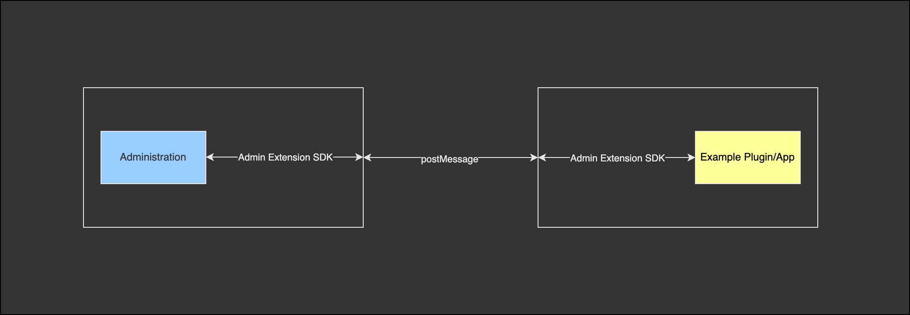
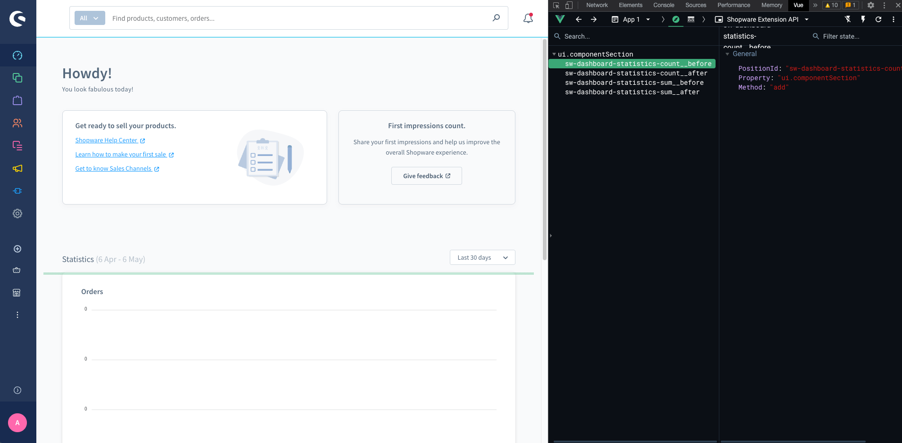

# Meteor Admin SDK — Konzepte, Guides & Setup

Quelle: Offizielle Dokumentation `docs/admin-sdk/` im Meteor-Monorepo.

> API-Referenz (Methoden, Parameter, Typen): siehe `admin-sdk.md`.
> Dieses Dokument behandelt Konzepte, Installation, Architektur, Migration und Entwicklungstools.

---

## Überblick — Was ist der Meteor Admin SDK?

Das `@shopware-ag/meteor-admin-sdk` ist eine npm-Bibliothek für den Bau von Shopware-Administration-UI-Erweiterungen.

**Anwendungsgebiete:**
- Custom Administration-Module mit eigenen Seiten
- UI-Erweiterungen (Notifications, Modals, Tabs, Sidebars)
- Zugriff auf und Änderung von Entity-Daten über die Admin-Datenschicht
- Entity-gesteuerte Workflows und Admin-Integrationen

**Vorteile:**
- Stabile, rückwärtskompatible API — reduziert Aufwand bei Shopware-Updates
- Kein Deep-Know-how der Admin-Interna notwendig
- Vollständiges TypeScript mit Auto-Completion
- Lightweight, tree-shakable (nur importiertes landet im Bundle)

---

## Extension-Typen: Apps vs. Plugins

### Apps

Apps laufen auf einem eigenen externen Server und kommunizieren über eine definierte API.

**Empfohlen, weil:**
- Funktionieren in Shopware Cloud **und** Self-Hosted, auch SaaS
- Frontend und Backend sind vollständig vom Shopware-Code entkoppelt
- Eigenständige Domain pro App erforderlich (CORS-Sicherheit)

```
app-one.meine-firma.com   ✓
app-two.meine-firma.com   ✓
meine-firma.com/app-one   ✗  (gleiche Domain → nicht erlaubt)
```

> Für lokale Entwicklung: `localhost` oder Tunneling-Dienst (ngrok). Wenn Shopware in Docker läuft, `registrationUrl` auf `host.docker.internal:PORT` setzen; `base-app-url` hingegen mit `localhost`.

### Plugins

Plugins laufen direkt in der Shopware-Instanz. Vollzugriff auf PHP-Codebase, aber auf **Self-Hosted** beschränkt.

---

## Installation — Apps (vollständige Walkthrough)

### 1. App Server + Frontend aufsetzen

```bash
# Beispiel-App mit App Server SDK scaffolden
npx tiged shopware/app-sdk-js/examples/node-hono demo-app
cd demo-app
npm install

# Meteor Admin SDK + Vite für das Admin-Frontend
npm install @shopware-ag/meteor-admin-sdk
npm install vue
npm install -D vite
```

### 2. Admin-Frontend erstellen (`meteor-app/`)

**`demo-app/meteor-app/index.html`:**

```html
<!doctype html>
<html lang="en">
  <head>
    <meta charset="UTF-8" />
    <meta name="viewport" content="width=device-width, initial-scale=1.0" />
    <title>My Example App</title>
  </head>
  <body>
    <div id="app"></div>
    <script type="module" src="/src/main.js"></script>
  </body>
</html>
```

**`demo-app/meteor-app/src/main.js`:**

```js
import { notification } from "@shopware-ag/meteor-admin-sdk";

notification.dispatch({
  title: "Meteor Admin SDK installed",
  message: "Your app is connected successfully",
});
```

### 3. Vite auf dem App Server mounten

In `demo-app/index.ts` den HTTP-Server so konfigurieren, dass `/admin`-Requests an Vite weitergeleitet werden:

```ts
import { readFileSync } from "node:fs";
import { createServer } from "node:http";
import { getRequestListener } from "@hono/node-server";

const PORT = 3000;

async function startServer() {
  const honoListener = getRequestListener(app.fetch);
  const { createServer: createViteServer } = await import("vite");

  const httpServer = createServer();

  const vite = await createViteServer({
    root: "./meteor-app",
    base: "/admin/",
    appType: "custom",
    server: { middlewareMode: true, hmr: { server: httpServer } },
  });

  httpServer.on("request", (req, res) => {
    if (req.url?.startsWith("/admin")) {
      vite.middlewares(req, res, async () => {
        let html = readFileSync("./meteor-app/index.html", "utf-8");
        html = await vite.transformIndexHtml(req.url, html);
        res.writeHead(200, { "Content-Type": "text/html" });
        res.end(html);
      });
      return;
    }
    honoListener(req, res);
  });

  httpServer.listen(PORT, () => {
    console.log(`App server: http://localhost:${PORT}`);
    console.log(`Admin frontend: http://localhost:${PORT}/admin/`);
  });
}

void startServer();
```

### 4. `manifest.xml` registrieren

```xml
<?xml version="1.0" encoding="UTF-8"?>
<manifest xmlns:xsi="http://www.w3.org/2001/XMLSchema-instance"
  xsi:noNamespaceSchemaLocation="https://raw.githubusercontent.com/shopware/platform/trunk/src/Core/Framework/App/Manifest/Schema/manifest-1.0.xsd">
  <meta>
    <name>MyExampleApp</name>
    <label>MyExampleApp</label>
    <description>My first example app</description>
    <author>Developer</author>
    <copyright>(c) Developer</copyright>
    <version>1.0.0</version>
    <license>MIT</license>
  </meta>
  <setup>
    <!-- host.docker.internal wenn Shopware in Docker läuft -->
    <registrationUrl>http://host.docker.internal:3000/app/register</registrationUrl>
    <secret>S3cr3tf0re$t</secret>
  </setup>
  <admin>
    <!-- base-app-url wird vom Browser geladen → localhost funktioniert -->
    <base-app-url>http://localhost:3000/admin/</base-app-url>
  </admin>
</manifest>
```

Name und Secret müssen mit dem App Server übereinstimmen:

```ts
configureAppServer(app, {
  appName: "MyExampleApp",
  appSecret: "S3cr3tf0re$t",
  shopRepository: new BetterSqlite3Repository("shop.db"),
});
```

### 5. App starten und installieren

```bash
npm start
# Admin-Frontend erreichbar unter http://localhost:3000/admin/

# In Shopware installieren (ggf. innerhalb Docker-Container):
bin/console app:install --activate MyExampleApp
bin/console cache:clear
```

---

## Installation — Plugins (vollständige Walkthrough, Shopware 6.7+)

### 1. Entry-Point-Ordner anlegen

```
custom/plugins/yourPluginName/src/Resources/app/meteor-app
```

> Shopware < 6.7: Pfad `administration` statt `meteor-app`

### 2. SDK installieren

```bash
cd custom/plugins/yourPluginName/src/Resources/app/meteor-app
npm install @shopware-ag/meteor-admin-sdk
```

### 3. Entry-Dateien erstellen

**`index.html`** (Shopware lädt diese Datei als versteckten iFrame):

```html
<!doctype html>
<html lang="en">
  <head>
    <meta charset="UTF-8" />
    <meta name="viewport" content="width=device-width, initial-scale=1.0" />
    <title>Your extension</title>
  </head>
  <body>
    <div id="app"></div>
    <script type="module" src="/src/main.js"></script>
  </body>
</html>
```

> Shopware < 6.7: `<script type="module">` weglassen — wird automatisch injiziert.

**`src/main.js`:**

```js
import { notification } from "@shopware-ag/meteor-admin-sdk";

notification.dispatch({
  title: "Hello from your plugin",
  message: "Meteor Admin SDK is working",
});
```

### 4. Plugin installieren

```bash
bin/console plugin:install --activate yourPluginName
bin/console cache:clear
```

### 5. Admin-Watcher starten

Shopware übernimmt das Bundling — kein eigenes Vite-Setup nötig:

```bash
composer watch:admin
```

---

## Ohne npm (CDN)

Für Prototypen oder sehr kleine Setups kann das SDK direkt per `<script>`-Tag geladen werden:

```html
<script src="https://unpkg.com/@shopware-ag/meteor-admin-sdk/cdn"></script>
```

Das SDK ist global als `sw` verfügbar:

```html
<script src="https://unpkg.com/@shopware-ag/meteor-admin-sdk/cdn"></script>
<script>
  sw.notification.dispatch({
    title: 'Hello',
    message: 'Meteor Admin SDK is working',
  });
</script>
```

Apps mit CDN benötigen weiterhin: App-Server, HTML-Datei zum Servieren, `manifest.xml`.

---

## Architektur — postMessage-Kommunikation



### Hybrides Modell

Apps (in iFrames) und Plugins (im gleichen Fenster) verwenden **denselben SDK**. Jede Methode funktioniert sowohl in iFrames als auch im selben Fenster.

### Ablauf eines SDK-Calls

1. Extension ruft `context.getLanguage()` auf
2. SDK sendet über `channel.send()` eine JSON-Message per `postMessage`:

```js
{
  _type: 'contextLanguage',
  _data: {},
  _callbackId: 'aRand0mGeneratedUniqueId'
}
```

3. Administration reagiert via `handle('contextLanguage', () => { ... })` und sendet zurück:

```js
{
  _type: 'contextLanguage',
  _response: { languageId: '...', systemLanguageId: '...' },
  _callbackId: 'aRand0mGeneratedUniqueId'
}
```

4. SDK löst das ursprüngliche Promise auf → Extension erhält die Daten

### Methoden in Nachrichten

Da JSON keine Funktionen unterstützt, werden Methoden in Informationsobjekte umgewandelt:

```js
{ __type__: '__function__', id: 'theUniqueFunctionId' }
```

Die Methode wird in einer `methodRegistry` gespeichert. Der Empfänger ruft dann per `send('__function__', { args, id })` zurück.

---

## Locations und iFrames

**Locations** definieren, wo Extension-Code ausgeführt wird. Jede Location läuft in einem eigenen iFrame — alle führen denselben JavaScript-Code aus, daher muss via `location.is()` verzweigt werden.

```js
import { location, ui } from '@shopware-ag/meteor-admin-sdk';

// Registrierung: im versteckten Haupt-iFrame
if (location.is(location.MAIN_HIDDEN)) {
  ui.componentSection.add({
    component: 'card',
    positionId: 'sw-product-properties__before',
    props: {
      title: 'Hello from plugin',
      locationId: 'my-app-card-before-properties'
    }
  });
}

// Inhalt rendern: im sichtbaren iFrame
if (location.is('my-app-card-before-properties')) {
  document.body.innerHTML = '<h1>Custom content here</h1>';
}
```

### iFrame-Höhe verwalten

```js
location.updateHeight(750);           // feste Höhe
location.startAutoResizer();          // automatisch bei Content-Änderungen
```

Scrollbars vermeiden: `overflow: hidden` auf `body` im iFrame setzen.

---

## Positions vs. Locations

- **Position**: Wo UI injiziert werden kann (identifiziert durch `positionId`)
- **Location**: Wo Extension-Code läuft und Inhalt rendert (identifiziert durch `locationId`)

### Positions mit Vue DevTools entdecken



**Voraussetzungen:**
- Vue DevTools (Version 6+, Beta-Channel)
- Laufende Shopware-Instanz im Watch-Mode (`composer watch:admin`)

**Workflow:**
1. Shopware Administration öffnen
2. Browser DevTools öffnen → Vue-Tab → "Shopware Extension API" Plugin
3. Liste aller Extension-Punkte für die aktuelle Seite erscheint
4. Extension-Punkt anklicken → Area in der Administration wird hervorgehoben
5. `positionId` aus den Details ablesen

---

## Component Sections

Component Sections erlauben das Injizieren von UI-Komponenten in vordefinierte Extension-Points.


```js
import { ui, location } from '@shopware-ag/meteor-admin-sdk';

if (location.is(location.MAIN_HIDDEN)) {
  ui.componentSection.add({
    positionId: 'sw-manufacturer-card-custom-fields__before',
    component: 'card',
    props: {
      title: 'Hello from plugin',
      subtitle: 'I am before the properties card',
      locationId: 'my-app-card-before-properties'
    }
  });
}

if (location.is('my-app-card-before-properties')) {
  document.body.innerHTML = '<h1>Hello World</h1>';
}
```

---

## Data Selectors

Selectors erlauben das Anfordern nur bestimmter Properties aus Admin-Datasets.

### Syntax

| Segment | Syntax | Beschreibung |
|:---|:---|:---|
| Property | `name` | Named property auf dem Root-Objekt |
| Nested | `a.b` | Tiefer in ein verschachteltes Objekt gehen |
| Array index | `[N]` | Element per nullbasiertem Index |
| Wildcard | `*` | Alle Elemente eines Arrays |

### Beispiele

```js
data.get({
  id: 'sw-product-detail__product',
  selectors: ['name', 'manufacturer.name'],
}).then((product) => console.log(product));
// { name: "My Product", manufacturer: { name: "My Manufacturer" } }

// Wildcard
data.get({
  id: 'sw-product-detail__product',
  selectors: ['variants.*.name'],
}).then((product) => console.log(product));
// { variants: [{ name: "First Variant" }, { name: "Second Variant" }] }
```

Mehrere Selectors auf denselben Parent werden zusammengeführt:

```js
selectors: ['manufacturer.id', 'manufacturer.name']
// → { manufacturer: { id: "...", name: "..." } }
```

### Datasets entdecken

Verfügbare Datasets lassen sich im Vue DevTools → "Shopware Extension API" inspizieren.

---

## TypeScript Entity-Typen

### Option 1: Generierte Typen von Shopware (empfohlen)

```bash
npm install @shopware-ag/entity-schema-types@5.0.0
```

Versionskorrespondenz (Shopware ohne führende `6.`):
- Shopware 6.5.0.0 → `@shopware-ag/entity-schema-types@5.0.0`
- Shopware 6.6.3.1 → `@shopware-ag/entity-schema-types@6.3.1`
- Shopware 6.7.x.x → entsprechend `7.x.x`

**`global.d.ts`:**

```ts
import '@shopware-ag/entity-schema-types';
```

### Option 2: Fallback `any` (einfachste Option)

```ts
// global.d.ts
declare namespace EntitySchema {
  interface Entities {
    [entityName: string]: any;
  }
}
```

### Option 3: Eigene Entity-Typen definieren

```ts
// global.d.ts
declare namespace EntitySchema {
  interface Entities {
    product_manufacturer: product_manufacturer;
    media: media;
  }

  interface product_manufacturer {
    id: string;
    versionId: string;
    mediaId?: string;
    link?: string;
    name: string;
    description?: string;
    customFields?: unknown;
    media?: Entity<'media'>;
    translations: EntityCollection<'product_manufacturer_translation'>;
    createdAt: string;
    updatedAt?: string;
    translated?: { name?: string; description?: string; customFields?: unknown };
  }
}
```

---

## Übersetzungen in der Extension

### Snippet-Dateien für nativen Admin-UI

Für Text in **nativen UI-Komponenten** (z.B. Card-Titel in `componentSection.add`) werden Snippet-Dateien verwendet:

```
<app-root>/Resources/app/administration/snippet/en-GB.json
<app-root>/Resources/app/administration/snippet/de-DE.json
```

**`en-GB.json`:**

```json
{
  "my-app-name": {
    "example-card": {
      "title": "My app",
      "subtitle": "This is my app"
    }
  }
}
```

**Verwendung via Snippet-Key:**

```js
ui.componentSection.add({
  component: 'card',
  positionId: 'sw-manufacturer-card-custom-fields__before',
  props: {
    title: 'my-app-name.example-card.title',
    subtitle: 'my-app-name.example-card.subtitle',
    locationId: 'my-app-card'
  }
});
```

Bei Sprachänderungen wird automatisch die passende Snippet-Datei genutzt.

### Übersetzungen im eigenen iFrame-UI

Im eigenen iFrame können beliebige Frontend-Frameworks verwendet werden (z.B. `vue-i18n`). Um die aktuelle Admin-Sprache zu synchronisieren:

```js
import { context } from '@shopware-ag/meteor-admin-sdk';

context.subscribeLanguage(({ languageId }) => {
  // i18n-Locale umschalten
});
```

---

## Migration bestehender Admin-Plugins

### Schrittweise Migration möglich

Das SDK kann neben dem bestehenden Twig-Plugin-System verwendet werden. Beide Ansätze funktionieren parallel:

```js
// Bestehende Extension-Funktionalität
Shopware.Component.override('sw-dashboard-index', {
  methods: {
    async createdComponent() {
      // Meteor Admin SDK gleichzeitig nutzen
      await sw.notification.dispatch({
        title: 'Hello from the plugin',
        message: 'Combining old and new approach',
      });
      this.$super('createdComponent');
    }
  }
});
```

### Locations mit Vue-Komponenten (ohne iFrame)

Statt einen iFrame zu rendern, kann eine normale Vue-Komponente in eine Location eingebunden werden:

```js
import { ui, location } from '@shopware-ag/meteor-admin-sdk';

if (!location.isIframe()) {
  const myLocationId = 'my-example-location-id';

  // Tab erstellen
  ui.tabs('sw-product-detail').addTabItem({
    label: 'Example tab',
    componentSectionId: 'example-product-detail-tab-content'
  });

  // Card mit Location in den Tab-Inhalt einfügen
  ui.componentSection.add({
    component: 'card',
    positionId: 'example-product-detail-tab-content',
    props: {
      title: 'Component section example',
      locationId: myLocationId
    }
  });

  // Vue-Komponente im Plugin-System registrieren
  Shopware.Component.register('your-component-name', {
    // your component
  });

  // Komponente zur Location zuordnen
  Shopware.State.commit('sdkLocation/addLocation', {
    locationId: myLocationId,
    componentName: 'your-component-name'
  });
}
```

`location.isIframe()` gibt `false` zurück wenn der Code im Plugin-Kontext (nicht iFrame) läuft.

---

## Berechtigungen in Apps (manifest.xml)

Für Repository-Operationen müssen Berechtigungen im Manifest deklariert werden:

```xml
<permissions>
  <create>product</create>
  <read>product</read>
  <update>product</update>
  <delete>product</delete>
</permissions>
```

> Nach Änderung der Berechtigungen: App-Version erhöhen und App aktualisieren.

### Client-seitige Privilege-Prüfung (Base Options)

```ts
notification.dispatch({
  title: 'Report ready',
  message: 'Your report is ready',
  privileges: ['product:read'],  // Aktion wird übersprungen wenn Privilege fehlt
});
```

**Wichtig**: Das ist nur eine UI-seitige Prüfung. Server-seitige Autorisierung ist weiterhin erforderlich.

---

## URL-Persistenz bei Page-Reload

Für Module mit eigenem Router kann die aktuelle URL an den Admin gesendet werden, sodass nach einem Reload der korrekte Zustand wiederhergestellt wird:

```ts
// Einmalig
location.updateUrl(new URL(window.location.href));

// Automatisch bei URL-Änderungen
location.startAutoUrlUpdater();
```

Ab Shopware 6.6.8.0.
