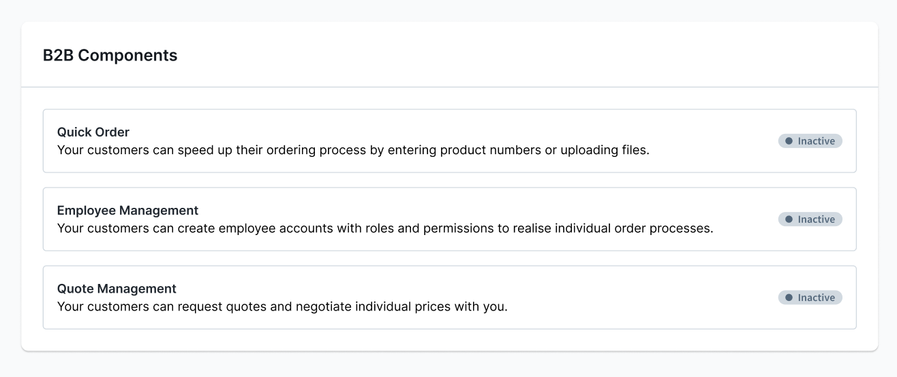

# Shopware B2B Components — Uberblick und Feature-Toggles



## Uberblick

B2B Components ist das moderne, modulare B2B-Framework im Commercial Plugin. Es erganzt Shopware
um folgende Kernkomponenten:

| Komponente              | Beschreibung                                              |
|-------------------------|-----------------------------------------------------------|
| Employee Management     | Mitarbeiter, Rollen, Berechtigungen, Firmen-Login         |
| Quote Management        | Angebotsanfragen, -verhandlung, -bestellungen             |
| Order Approval          | Genehmigungsworkflow fuer Bestellungen                    |
| Individual Pricing      | Firmenspezifische Rabatte, Volumenpreise (ab SW 6.7.8.0)  |
| Shopping Lists          | Einkaufslisten fuer B2B-Kunden                            |
| Organization Unit       | Organisationseinheiten innerhalb einer Firma              |

## Verzeichnisstruktur im Commercial Plugin

Alle B2B Components liegen unter `src/B2B/`:

```
src/
  B2B/
    QuickOrder/
    AnotherB2BComponent/
    CommercialB2BBundle.php
```

Eigene B2B-Bundles sollten `CommercialB2BBundle` statt `CommercialBundle` erweitern und
`type => self::TYPE_B2B` in `describeFeatures()` setzen:

```php
namespace Shopware\Commercial\B2B\YourB2BComponent;

class YourB2BComponent extends CommercialB2BBundle
{
    public function describeFeatures(): array
    {
        return [['type' => self::TYPE_B2B, ...]];
    }
}
```

## Customer-Specific Features (Feature-Toggles)

Der Merchant kann B2B-Features pro Kunde aktivieren/deaktivieren. Die Administration zeigt
dafuer den Abschnitt "Customer-specific features" auf der Kunden-Detailseite.

### Pruefung im PHP-Controller/Route

```php
use Shopware\Commercial\B2B\QuickOrder\Domain\CustomerSpecificFeature\CustomerSpecificFeatureService;

class ApiController
{
    public function view(Request $request, SalesChannelContext $context): Response
    {
        if (!$this->customerSpecificFeatureService->isAllowed($context->getCustomerId(), 'QUICK_ORDER')) {
            throw CustomerSpecificFeatureException::notAllowed('QUICK_ORDER');
        }
        // ...
    }
}
```

### Pruefung im Twig-Template

```twig

    {# Feature-spezifischer Inhalt #}

```

Die Twig-Extension `customerHasFeature()` liest den aktuellen Customer aus dem `context`.

### Eigene Feature-Toggles registrieren

Eigene B2B-Komponenten muessen:
1. `CommercialB2BBundle` erweitern
2. In `describeFeatures()` `type => self::TYPE_B2B` setzen
3. Den technischen Code als Konstante definieren (z.B. `'QUICK_ORDER'`)

## Abhangigkeiten zwischen Komponenten

- Organization Unit benoetigt Employee Management
- Order Approval benoetigt Employee Management
- Individual Pricing benoetigt Employee Management + Organization Unit
- Quote Management: eigenstaendig
- Shopping Lists: eigenstaendig

## Sub-Skills

- Detailliertes Entwicklerwissen: siehe jeweilige Sub-Skills
  - `sw-b2b-components-employee-management`
  - `sw-b2b-components-quotes`
  - `sw-b2b-order-approval`
