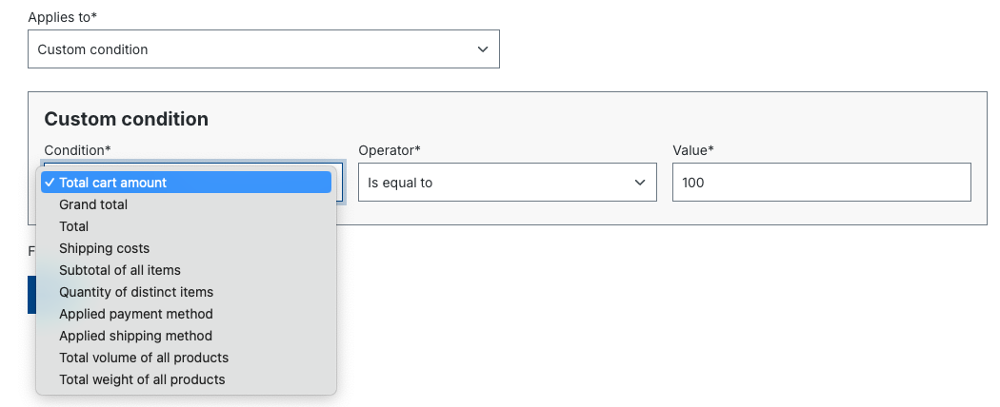
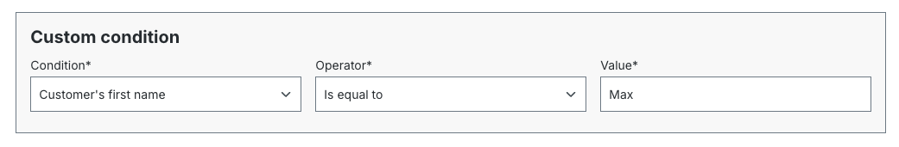
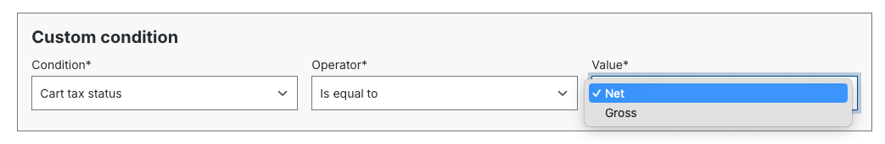
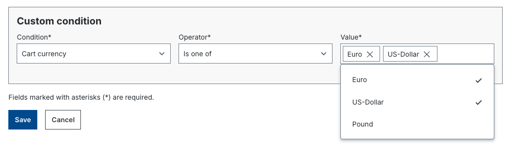

# B2B Order Approval — Entwickler-Referenz

## Voraussetzung

Employee Management muss installiert und aktiviert sein.

## Konzept

Der Order-Approval-Workflow ermoeglicht es, Regeln zu definieren, welche Bestellungen
eine Genehmigung benoetigen und wer genehmigen kann.

### Beispiel: App-basierte Approval-Bedingung im Admin



### Feldtypen fuer App-Bedingungen





### Workflow

```
Mitarbeiter platziert Bestellung
    ↓
Approval-Regel trifft zu?
    Nein → Ereignis: Order Placed (normal)
    Ja   → Ereignis: Order needs approval
              ↓
         Genehmigung erteilt?
             Ja  → Ereignis: Order Approved + Order Placed
             Nein → Ereignis: Order declined
```

## Entitaeten

### Approval Rule
Bedingungs-Set fuer Genehmigungspflicht:
- `state_id`, `priority` (INT, steuert Reihenfolge der Regelauswertung)
- Zugeordnete Reviewer-Rolle (nur Mitarbeiter mit dieser Rolle koennen genehmigen)
- Zugeordnete Mitarbeiter-Rolle (diese Mitarbeiter benoetigen Genehmigung)

### Pending Order
Ausstehende Bestellung: enthaelt Bestelldaten, den anfragenden Mitarbeiter und die passende
Approval-Regel.

## Berechtigungen

### Approval Rule Berechtigungen

| Permission                  | Beschreibung                      |
|-----------------------------|-----------------------------------|
| `Can create approval rules` | Regeln erstellen                  |
| `Can update approval rules` | Regeln bearbeiten                 |
| `Can delete approval rules` | Regeln loeschen                   |
| `Can read approval rules`   | Regeln lesen                      |

### Pending Order Berechtigungen

| Permission                               | Beschreibung                                   |
|------------------------------------------|------------------------------------------------|
| `Can approve/decline all pending orders` | Alle ausstehenden Bestellungen genehmigen      |
| `Can approve/decline pending orders`     | Zugewiesene Bestellungen genehmigen            |
| `Can view all pending orders`            | Alle ausstehenden Bestellungen sehen           |

### Sichtbarkeitsregeln

**Wer kann ausstehende Bestellungen sehen?**
- Mitarbeiter mit `Can view all pending orders`
- Mitarbeiter, die selbst Genehmigung angefragt haben (eigene Bestellungen)
- Business Partner (alle Bestellungen ihrer Mitarbeiter)

**Wer kann genehmigen/ablehnen?**
- Mitarbeiter mit `Can approve/decline all pending orders`
- Mitarbeiter mit `Can approve/decline pending orders` (fuer zugewiesene Bestellungen)
- Business Partner (alle Mitarbeiter-Bestellungen)

## Payment-Prozess

Gleich wie Standard-Bestellprozess, aber bei Online-Zahlung (Visa, PayPal etc.):
Zahlung wird erst nach Genehmigung ausgefuehrt.

### Zahlung-Prozess deaktivieren (nach Genehmigung)

```php
use Shopware\Commercial\B2B\OrderApproval\Event\PendingOrderApprovedEvent;

class MySubscriber implements EventSubscriberInterface
{
    public static function getSubscribedEvents(): array
    {
        return [PendingOrderApprovedEvent::class => 'onPendingOrderApproved'];
    }

    public function onPendingOrderApproved(PendingOrderApprovedEvent $event): void
    {
        // Zahlung-Prozess nach Genehmigung verhindern
        $event->setShouldProceedPlaceOrder(false);
    }
}
```

Storefront-Template ueberschreiben:
`@OrderApproval/storefront/pending-order/page/pending-approval/detail.html.twig`

## Eigene Approval-Bedingungen

### Via Plugin

Shopware Rule-System verwenden und mit Tag `shopware.approval_rule.definition` registrieren:

```php
class CartAmountRule extends Rule
{
    final public const RULE_NAME = 'totalCartAmount';
    protected float $amount;

    public function match(RuleScope $scope): bool
    {
        if (!$scope instanceof CartRuleScope) {
            return false;
        }
        return RuleComparison::numeric($scope->getCart()->getPrice()->getTotalPrice(), $this->amount, $this->operator);
    }

    public function getConstraints(): array
    {
        return ['amount' => RuleConstraints::float(), 'operator' => RuleConstraints::numericOperators(false)];
    }

    public function getConfig(): RuleConfig
    {
        return (new RuleConfig())
            ->operatorSet(RuleConfig::OPERATOR_SET_NUMBER)
            ->numberField('amount');
    }
}
```

Registrierung:

```php
$services->set(CartAmountRule::class)
    ->public()
    ->tag('shopware.approval_rule.definition');
```

### Via App (ab Commercial 6.4.0)

Verzeichnisstruktur:

```
DemoApp/
    Resources/
        scripts/
            approval-rule-conditions/    # Scripts fuer Approval-Bedingungen
                custom-condition.twig
    manifest.xml
```

`manifest.xml` Bedingung definieren:

```xml
<rule-condition>
    <identifier>custom_cart_amount</identifier>
    <name>Total cart amount</name>
    <group>cart</group>
    <script>/approval-rule-conditions/custom-condition.twig</script>
    <constraints>
        <single-select name="operator">
            <options>
                <option value=">="><name>Is greater than or equal to</name></option>
            </options>
        </single-select>
        <float name="amount" />
    </constraints>
</rule-condition>
```

Twig-Script:

```twig
{# Resources/scripts/approval-rule-conditions/custom-condition.twig #}

    


```

Unterstuetzte Feldtypen: `float`, `int`, `text`, `single-select`, `multi-select`

Scope-Variablen: `scope.cart`, `scope.salesChannelContext.customer`, `scope.salesChannelContext.currency`
