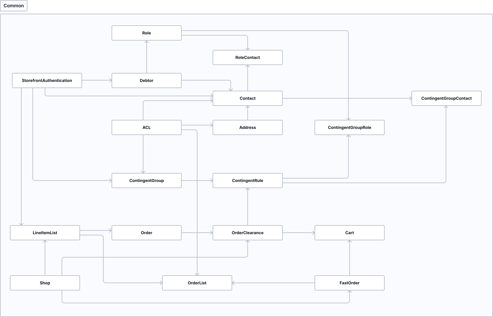

# B2B Suite — Entwickler-Referenz (Legacy)

> **Wichtig:** B2B Suite wird ab Shopware 6.8 nicht mehr unterstuetzt.
> Migration zu B2B Components erforderlich. Siehe `sw-b2b-suite-migration`.

## Architektur



Die B2B Suite ist eine Sammlung locker gekoppelter, gleichartig strukturierter Komponenten.

### Component Layers (von unten nach oben)

| Layer      | Verantwortung                                                          |
|------------|------------------------------------------------------------------------|
| Shop-Bridge| Bridgt Shopware-Interfaces, subscribt Events, ruft Framework-Services  |
| Framework  | Domaenespezifische CRUD- und Workflow-Services                         |
| REST-API   | REST-Zugriff auf Services                                              |
| Frontend   | Controller-as-Service fuer Storefront-Zugriff                          |
| B2B Plugin | Storefront-Zugriff auf Services                                        |

### Komponenten-Komplexe (39 Komponenten)

1. **Common** — Shared Library (Exception-Klassen, Repository-Helpers, DI-Manager, REST-Router)
2. **User Management** — StoreFrontAuthentication, Contact, Debtor, Address, Role
3. **ACL** — Zugriffskontrolle, verbunden mit fast allen Entitaeten
4. **Order & Contingent Management** — ContingentGroups, Orders, ACL-Settings

## Konventionen (Codebase)

| Bereich          | Konvention                                            |
|------------------|-------------------------------------------------------|
| DI Container     | IDs: `b2b_*.*` (Komponente.Klassen-Abkuerzung)        |
| Datenbank        | Tabellen: `b2b_*`, snake_case, Singular               |
| Attribute        | Prefix `swag_b2b_`                                    |
| Subscriber       | Methoden nach Funktion benannt, nicht nach Event      |
| Tests            | snake_case, Prefix `test_`                            |
| Templates        | Wrapper: `b2b--*`; Blöcke: ``        |
| JavaScript       | TypeScript; Plugin-Dateinamen enden auf `*.plugin.ts` |
| Snippets         | Root-Key: `b2b`                                       |

## Entity-Benennung (UI vs. Codebase)

| English Display Name       | B2B Suite Entitaet  |
|----------------------------|---------------------|
| Company administrator      | Debtor              |
| Employee                   | Contact             |
| Cart details               | Positions           |
| Quick order                | Fastorder           |
| Quote                      | Offers              |
| Purchase restriction       | Contingent          |
| Order restriction          | Contingent rule     |
| Product restriction        | Contingent restrictions |

## StoreFront Authentication

Einheitliche B2B-Schnittstelle fuer Login, Ownership und Authentifizierung.
Mehrere Tabellen koennen als Authentifizierungsquelle dienen (Debtor, Contact).

### Context Owner (Kontext-Zugriff)

```php
/** @var AuthenticationService $authenticationService */
$authenticationService = $this->container->get('b2b_front_auth.authentication_service');

if (!$authenticationService->isB2b()) {
    throw new \Exception('User must be logged in');
}

$ownershipContext = $authenticationService->getIdentity()->getOwnershipContext();
echo 'Context owner id: ' . $ownershipContext->contextOwnerId;
```

### Tabellen-Design fuer neue Entitaeten

```sql
-- Kontext-Owner (gleicher Debtor)
CREATE TABLE b2b_my (
  id INT(11) NOT NULL AUTO_INCREMENT,
  context_owner_id INT(11) NOT NULL,
  -- ...
  CONSTRAINT b2b_my_auth_owner_id_FK FOREIGN KEY (context_owner_id)
    REFERENCES b2b_store_front_auth (id) ON UPDATE NO ACTION ON DELETE CASCADE
);

-- Eigentuemer (spezifischer Contact/Debtor)
CREATE TABLE b2b_my (
  id INT(11) NOT NULL AUTO_INCREMENT,
  auth_id INT(11) NULL DEFAULT NULL,
  -- ...
  CONSTRAINT b2b_my_auth_user_id_FK FOREIGN KEY (auth_id)
    REFERENCES b2b_store_front_auth (id)
);
```

### Typische Abfragen

```php
$identity = $authenticationService->getIdentity();
$ownershipContext = $identity->getOwnershipContext();

// Alle Records des aktuellen Benutzers
'SELECT * FROM b2b_my WHERE auth_id = :authId'
// Alle Records des Debtor-Kontexts
'SELECT * FROM b2b_my WHERE auth_id IN (SELECT auth_id FROM b2b_store_front_auth WHERE context_owner_id = :contextOwnerId)'
```

### Eigene Identity implementieren

1. `Identity`-Interface implementieren (analog `DebtorIdentity`/`ContactIdentity`)
2. `CredentialsBuilder` implementieren (erstellt `CredentialsEntity` fuer Login)
3. `AuthenticationIdentityLoaderInterface` implementieren
4. Als Tagged Service registrieren: `b2b_front_auth.authentication_repository`

## REST API

B2B Suite hat eigenes REST-API-System (kein Shopware-ORM).

### Einfacher Controller

```php
class MyApiController
{
    public function helloAction(Request $request): array
    {
        return ['message' => 'hello']; // automatisch zu JSON
    }
}
```

### Route registrieren

```php
// RouteProvider erstellen
class MyApiRouteProvider implements RouteProvider
{
    public function getRoutes(): array
    {
        return [
            ['GET', '/my/hello', 'my.api_controller', 'hello'],
            ['GET', '/my/hello/{name}', 'my.api_controller', 'hello', ['name']],
        ];
    }
}

// Im DIC registrieren
$services->set('my.controller', MyApiController::class);
$services->set('my.api_route_provider', MyApiRouteProvider::class)
    ->tag('b2b_common.rest_route_provider');
```

Alle Routen erreichbar unter: `http://my-shop.de/api/b2b`

Route-Parser: FastRoute (Parameter via `{name}` Placeholder).

## Voraussetzungen und Installation

- B2B Suite 4.6.0–4.6.9: Shopware 6.4, PHP 7.4.3, MySQL 5.7.21
- B2B Suite 4.7.0+: Shopware 6.5
- Ab B2B Suite 4.9.3: Migration zu B2B Components moeglich

Docker-Setup (Entwicklung):

```bash
./psh.phar docker:start
./psh.phar docker:ssh
./psh.phar init
```
