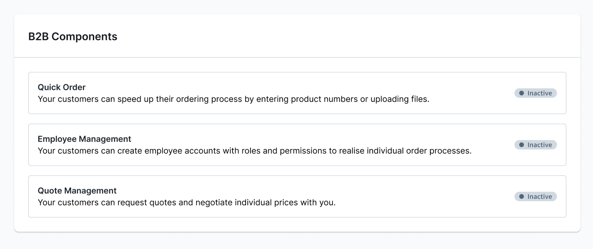

# Shopware B2B Components — Overview and feature toggles



## Overview

B2B Components is the modern, modular B2B framework in the Commercial plugin. It extends Shopware
with the following core components:

| Component               | Description                                               |
|-------------------------|-----------------------------------------------------------|
| Employee Management     | Employees, roles, permissions, company login              |
| Quote Management        | Quote requests, negotiation, quote orders                 |
| Order Approval          | Approval workflow for orders                              |
| Individual Pricing      | Company-specific discounts, volume prices (as of SW 6.7.8.0) |
| Shopping Lists          | Shopping lists for B2B customers                          |
| Organization Unit       | Organizational units within a company                     |

## Directory structure in the Commercial plugin

All B2B Components live under `src/B2B/`:

```
src/
  B2B/
    QuickOrder/
    AnotherB2BComponent/
    CommercialB2BBundle.php
```

Your own B2B bundles should extend `CommercialB2BBundle` instead of `CommercialBundle` and set
`type => self::TYPE_B2B` in `describeFeatures()`:

```php
namespace Shopware\Commercial\B2B\YourB2BComponent;

class YourB2BComponent extends CommercialB2BBundle
{
    public function describeFeatures(): array
    {
        return [['type' => self::TYPE_B2B, ...]];
    }
}
```

## Customer-specific features (feature toggles)

The merchant can enable/disable B2B features per customer. The Administration shows
the "Customer-specific features" section on the customer detail page for this.

### Check in a PHP controller/route

```php
use Shopware\Commercial\B2B\QuickOrder\Domain\CustomerSpecificFeature\CustomerSpecificFeatureService;

class ApiController
{
    public function view(Request $request, SalesChannelContext $context): Response
    {
        if (!$this->customerSpecificFeatureService->isAllowed($context->getCustomerId(), 'QUICK_ORDER')) {
            throw CustomerSpecificFeatureException::notAllowed('QUICK_ORDER');
        }
        // ...
    }
}
```

### Check in a Twig template

```twig

    {# Feature-specific content #}

```

The Twig extension `customerHasFeature()` reads the current customer from the `context`.

### Registering your own feature toggles

Your own B2B components must:
1. Extend `CommercialB2BBundle`
2. Set `type => self::TYPE_B2B` in `describeFeatures()`
3. Define the technical code as a constant (e.g. `'QUICK_ORDER'`)

## Dependencies between components

- Organization Unit requires Employee Management
- Order Approval requires Employee Management
- Individual Pricing requires Employee Management + Organization Unit
- Quote Management: standalone
- Shopping Lists: standalone

## Sub-skills

- Detailed developer knowledge: see the respective sub-skills
  - `sw-b2b-components-employee-management`
  - `sw-b2b-components-quotes`
  - `sw-b2b-order-approval`
