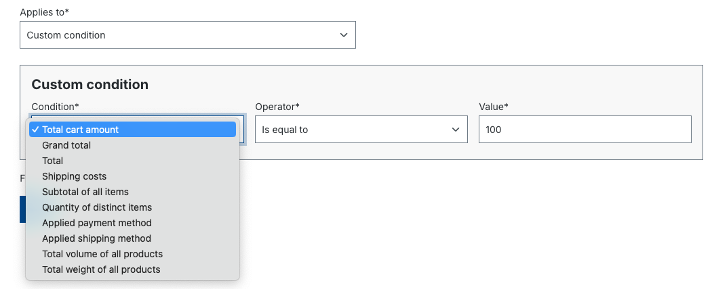
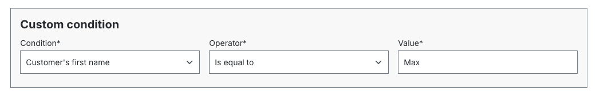
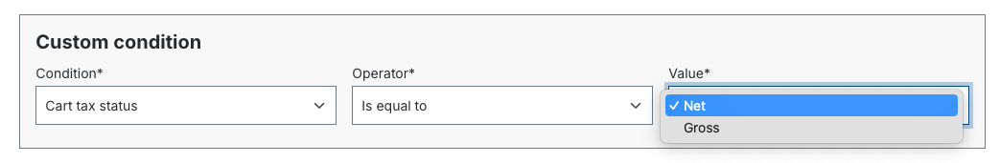
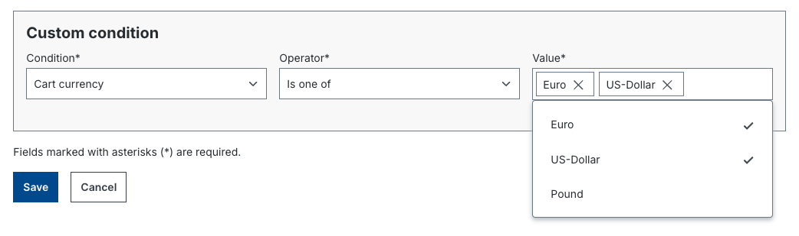

# B2B Order Approval — Developer reference

## Contents

- [Prerequisite](#prerequisite)
- [Concept](#concept)
- [Entities](#entities)
- [Permissions](#permissions)
- [Payment process](#payment-process)
- [Custom approval conditions](#custom-approval-conditions)

## Prerequisite

Employee Management must be installed and activated.

## Concept

The order approval workflow makes it possible to define rules for which orders
require an approval and who can approve them.

### Example: app-based approval condition in the admin



### Field types for app conditions





### Workflow

```
Employee places order
    ↓
Approval rule matches?
    No  → Event: Order Placed (normal)
    Yes → Event: Order needs approval
              ↓
         Approval granted?
             Yes → Event: Order Approved + Order Placed
             No  → Event: Order declined
```

## Entities

### Approval Rule
Condition set for approval requirement:
- `state_id`, `priority` (INT, controls the order of rule evaluation)
- Assigned reviewer role (only employees with this role can approve)
- Assigned employee role (these employees require approval)

### Pending Order
Pending order: contains the order data, the requesting employee and the matching
approval rule.

## Permissions

### Approval rule permissions

| Permission                  | Description                       |
|-----------------------------|-----------------------------------|
| `Can create approval rules` | Create rules                      |
| `Can update approval rules` | Edit rules                        |
| `Can delete approval rules` | Delete rules                      |
| `Can read approval rules`   | Read rules                        |

### Pending order permissions

| Permission                               | Description                                    |
|------------------------------------------|------------------------------------------------|
| `Can approve/decline all pending orders` | Approve all pending orders                     |
| `Can approve/decline pending orders`     | Approve assigned orders                        |
| `Can view all pending orders`            | See all pending orders                         |

### Visibility rules

**Who can see pending orders?**
- Employees with `Can view all pending orders`
- Employees who requested the approval themselves (their own orders)
- Business partners (all orders of their employees)

**Who can approve/decline?**
- Employees with `Can approve/decline all pending orders`
- Employees with `Can approve/decline pending orders` (for assigned orders)
- Business partners (all employee orders)

## Payment process

Same as the standard order process, but with online payment (Visa, PayPal etc.):
the payment is only executed after approval.

### Disabling the payment process (after approval)

```php
use Shopware\Commercial\B2B\OrderApproval\Event\PendingOrderApprovedEvent;

class MySubscriber implements EventSubscriberInterface
{
    public static function getSubscribedEvents(): array
    {
        return [PendingOrderApprovedEvent::class => 'onPendingOrderApproved'];
    }

    public function onPendingOrderApproved(PendingOrderApprovedEvent $event): void
    {
        // Prevent the payment process after approval
        $event->setShouldProceedPlaceOrder(false);
    }
}
```

Override the storefront template:
`@OrderApproval/storefront/pending-order/page/pending-approval/detail.html.twig`

## Custom approval conditions

### Via plugin

Use the Shopware rule system and register it with the tag `shopware.approval_rule.definition`:

```php
class CartAmountRule extends Rule
{
    final public const RULE_NAME = 'totalCartAmount';
    protected float $amount;

    public function match(RuleScope $scope): bool
    {
        if (!$scope instanceof CartRuleScope) {
            return false;
        }
        return RuleComparison::numeric($scope->getCart()->getPrice()->getTotalPrice(), $this->amount, $this->operator);
    }

    public function getConstraints(): array
    {
        return ['amount' => RuleConstraints::float(), 'operator' => RuleConstraints::numericOperators(false)];
    }

    public function getConfig(): RuleConfig
    {
        return (new RuleConfig())
            ->operatorSet(RuleConfig::OPERATOR_SET_NUMBER)
            ->numberField('amount');
    }
}
```

Registration:

```php
$services->set(CartAmountRule::class)
    ->public()
    ->tag('shopware.approval_rule.definition');
```

### Via app (as of Commercial 6.4.0)

Directory structure:

```
DemoApp/
    Resources/
        scripts/
            approval-rule-conditions/    # Scripts for approval conditions
                custom-condition.twig
    manifest.xml
```

Define the condition in `manifest.xml`:

```xml
<rule-condition>
    <identifier>custom_cart_amount</identifier>
    <name>Total cart amount</name>
    <group>cart</group>
    <script>/approval-rule-conditions/custom-condition.twig</script>
    <constraints>
        <single-select name="operator">
            <options>
                <option value=">="><name>Is greater than or equal to</name></option>
            </options>
        </single-select>
        <float name="amount" />
    </constraints>
</rule-condition>
```

Twig script:

```twig
{# Resources/scripts/approval-rule-conditions/custom-condition.twig #}

    


```

Supported field types: `float`, `int`, `text`, `single-select`, `multi-select`

Scope variables: `scope.cart`, `scope.salesChannelContext.customer`, `scope.salesChannelContext.currency`
