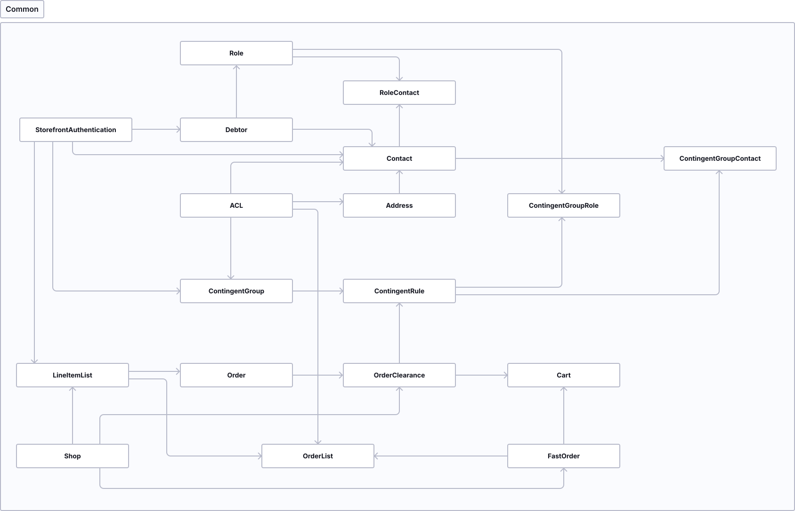

# B2B Suite — Developer reference (legacy)

> **Important:** the B2B Suite is no longer supported as of Shopware 6.8.
> Migration to B2B Components is required. See `sw-b2b-suite-migration`.

## Contents

- [Architecture](#architecture)
- [Conventions (codebase)](#conventions-codebase)
- [Entity naming (UI vs. codebase)](#entity-naming-ui-vs-codebase)
- [StoreFront Authentication](#storefront-authentication)
- [REST API](#rest-api)
- [Prerequisites and installation](#prerequisites-and-installation)

## Architecture



The B2B Suite is a collection of loosely coupled, uniformly structured components.

### Component layers (bottom to top)

| Layer      | Responsibility                                                         |
|------------|------------------------------------------------------------------------|
| Shop-Bridge| Bridges Shopware interfaces, subscribes events, calls framework services |
| Framework  | Domain-specific CRUD and workflow services                             |
| REST-API   | REST access to services                                               |
| Frontend   | Controller-as-service for storefront access                           |
| B2B Plugin | Storefront access to services                                         |

### Component complexes (39 components)

1. **Common** — shared library (exception classes, repository helpers, DI manager, REST router)
2. **User Management** — StoreFrontAuthentication, Contact, Debtor, Address, Role
3. **ACL** — access control, connected to almost all entities
4. **Order & Contingent Management** — ContingentGroups, Orders, ACL settings

## Conventions (codebase)

| Area             | Convention                                            |
|------------------|-------------------------------------------------------|
| DI Container     | IDs: `b2b_*.*` (component.class abbreviation)         |
| Database         | Tables: `b2b_*`, snake_case, singular                 |
| Attributes       | Prefix `swag_b2b_`                                    |
| Subscriber       | Methods named after function, not after the event     |
| Tests            | snake_case, prefix `test_`                            |
| Templates        | Wrapper: `b2b--*`; blocks: ``        |
| JavaScript       | TypeScript; plugin file names end in `*.plugin.ts`    |
| Snippets         | Root key: `b2b`                                       |

## Entity naming (UI vs. codebase)

| English Display Name       | B2B Suite entity    |
|----------------------------|---------------------|
| Company administrator      | Debtor              |
| Employee                   | Contact             |
| Cart details               | Positions           |
| Quick order                | Fastorder           |
| Quote                      | Offers              |
| Purchase restriction       | Contingent          |
| Order restriction          | Contingent rule     |
| Product restriction        | Contingent restrictions |

## StoreFront Authentication

Unified B2B interface for login, ownership and authentication.
Several tables can serve as the authentication source (Debtor, Contact).

### Context owner (context access)

```php
/** @var AuthenticationService $authenticationService */
$authenticationService = $this->container->get('b2b_front_auth.authentication_service');

if (!$authenticationService->isB2b()) {
    throw new \Exception('User must be logged in');
}

$ownershipContext = $authenticationService->getIdentity()->getOwnershipContext();
echo 'Context owner id: ' . $ownershipContext->contextOwnerId;
```

### Table design for new entities

```sql
-- Context owner (same debtor)
CREATE TABLE b2b_my (
  id INT(11) NOT NULL AUTO_INCREMENT,
  context_owner_id INT(11) NOT NULL,
  -- ...
  CONSTRAINT b2b_my_auth_owner_id_FK FOREIGN KEY (context_owner_id)
    REFERENCES b2b_store_front_auth (id) ON UPDATE NO ACTION ON DELETE CASCADE
);

-- Owner (specific contact/debtor)
CREATE TABLE b2b_my (
  id INT(11) NOT NULL AUTO_INCREMENT,
  auth_id INT(11) NULL DEFAULT NULL,
  -- ...
  CONSTRAINT b2b_my_auth_user_id_FK FOREIGN KEY (auth_id)
    REFERENCES b2b_store_front_auth (id)
);
```

### Typical queries

```php
$identity = $authenticationService->getIdentity();
$ownershipContext = $identity->getOwnershipContext();

// All records of the current user
'SELECT * FROM b2b_my WHERE auth_id = :authId'
// All records of the debtor context
'SELECT * FROM b2b_my WHERE auth_id IN (SELECT auth_id FROM b2b_store_front_auth WHERE context_owner_id = :contextOwnerId)'
```

### Implementing your own identity

1. Implement the `Identity` interface (analogous to `DebtorIdentity`/`ContactIdentity`)
2. Implement a `CredentialsBuilder` (creates the `CredentialsEntity` for login)
3. Implement `AuthenticationIdentityLoaderInterface`
4. Register as a tagged service: `b2b_front_auth.authentication_repository`

## REST API

The B2B Suite has its own REST API system (no Shopware ORM).

### Simple controller

```php
class MyApiController
{
    public function helloAction(Request $request): array
    {
        return ['message' => 'hello']; // automatically converted to JSON
    }
}
```

### Registering a route

```php
// Create a RouteProvider
class MyApiRouteProvider implements RouteProvider
{
    public function getRoutes(): array
    {
        return [
            ['GET', '/my/hello', 'my.api_controller', 'hello'],
            ['GET', '/my/hello/{name}', 'my.api_controller', 'hello', ['name']],
        ];
    }
}

// Register in the DIC
$services->set('my.controller', MyApiController::class);
$services->set('my.api_route_provider', MyApiRouteProvider::class)
    ->tag('b2b_common.rest_route_provider');
```

All routes are reachable under: `http://my-shop.de/api/b2b`

Route parser: FastRoute (parameters via `{name}` placeholder).

## Prerequisites and installation

- B2B Suite 4.6.0–4.6.9: Shopware 6.4, PHP 7.4.3, MySQL 5.7.21
- B2B Suite 4.7.0+: Shopware 6.5
- As of B2B Suite 4.9.3: migration to B2B Components possible

Docker setup (development):

```bash
./psh.phar docker:start
./psh.phar docker:ssh
./psh.phar init
```
