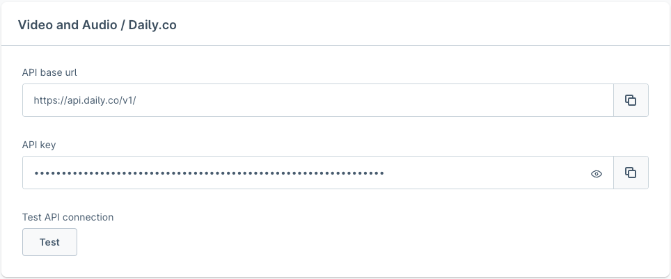
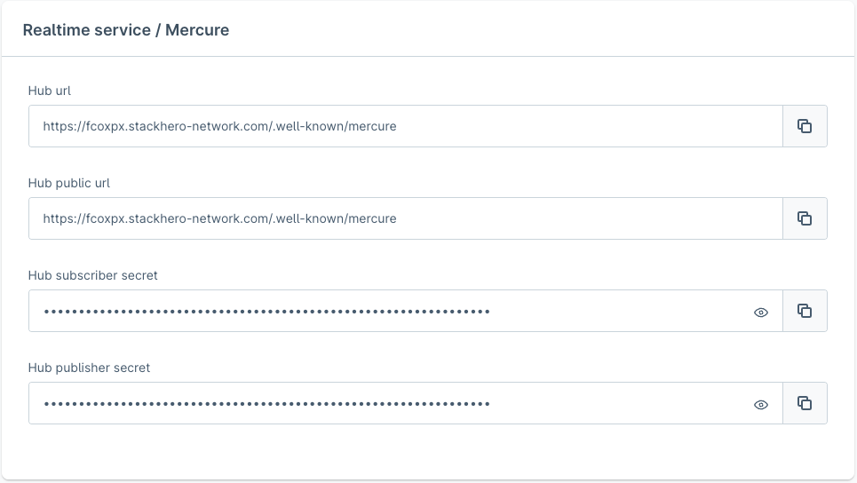
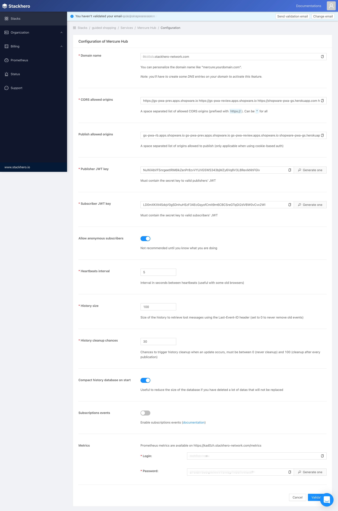

# Digital Sales Rooms — 3rd-Party Setup (vollständig)

DSR benötigt zwei externe Dienste:

| Dienst | Zweck |
|--------|-------|
| **Daily.co** | Echtzeit-Video/Audio-Streaming zwischen Teilnehmern |
| **Mercure** | Server-to-Client-Push (Realtime-Updates, Server-Sent Events) |

---

## Daily.co Setup

### Schritt 1: Dashboard öffnen

[https://dashboard.daily.co/](https://dashboard.daily.co/) — Login oder Account erstellen.

### Schritt 2: API Key ermitteln

- Linke Navigation: **"Developers"**-Bereich öffnen
- **API KEY** kopieren



### Schritt 3: In Plugin-Config eintragen

Navigation: Marketing › Digital Sales Rooms › Configuration → **Video and Audio**

| Feld | Wert |
|------|------|
| API base url | `https://api.daily.co/v1/` |
| API key | Kopierter API KEY |

---

## Mercure Hub Setup

Mercure ist ein offenes Protokoll für Server-to-Client-Updates. Es ist eine
moderne Alternative zu Polling und WebSockets.

### Option A: Stackhero (empfohlen)

[StackHero](https://www.stackhero.io/en/services/Mercure-Hub/pricing) bietet
gehosteten Mercure als Service. Für kleine Demos reicht der "Hobby"-Plan.

**Setup:**

1. Stackhero-Account erstellen
2. Dashboard → **Stacks** → **Create a new stack** → Service: **Mercure Hub**
3. Stack konfigurieren → **Configure**-Button
4. Folgende Werte notieren:
   - **Hub url** — Hub-URL
   - **Hub public url** — Öffentliche Hub-URL (meist identisch)
   - **Hub subscriber secret** — JWT-Key für Subscriber
   - **Hub publisher secret** — JWT-Key für Publisher



5. Werte in DSR Plugin-Config eintragen:



### Option B: Docker (lokal/selbst gehostet)

> Für Produktion: unterschiedliche Publisher- und Subscriber-Keys verwenden!

```bash
git clone https://github.com/shopware/local-mercure-sample
cd local-mercure-sample
docker-compose up
```

---

## Mercure Hub absichern (CORS & Keys)

Nach der Hub-Initialisierung folgende Einstellungen vornehmen:

### CORS allowed origins

Domain(s), von denen der Browser auf den Hub zugreift:

```
https://dsr.shopware.io    ← DSR-Frontend-Domain
```

### Publish allowed origins

Domains, die Events an den Hub publizieren dürfen (ohne HTTP-Protokoll):

```
https://dsr.shopware.io      ← Frontend-Domain
https://shopware.store       ← Backend/Admin-API-Domain
```

### Publisher (JWT) Key

Frei wählbarer JWT-Key für Publisher-Authentifizierung.

### Subscriber (JWT) Key

Frei wählbarer JWT-Key für Subscriber-Authentifizierung.

---

## Entwicklungsmodus (unsecured Mercure)

Für lokale Entwicklung ohne JWT-Authentifizierung:

```shell
# In .env der DSR-Frontend-App:
ALLOW_ANONYMOUS_MERCURE=1
```

> Nur für Entwicklungszwecke — niemals in Produktion verwenden!
