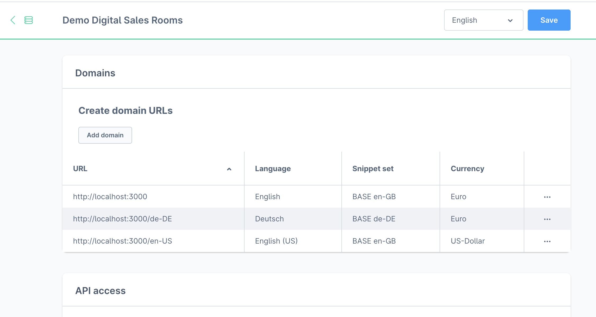
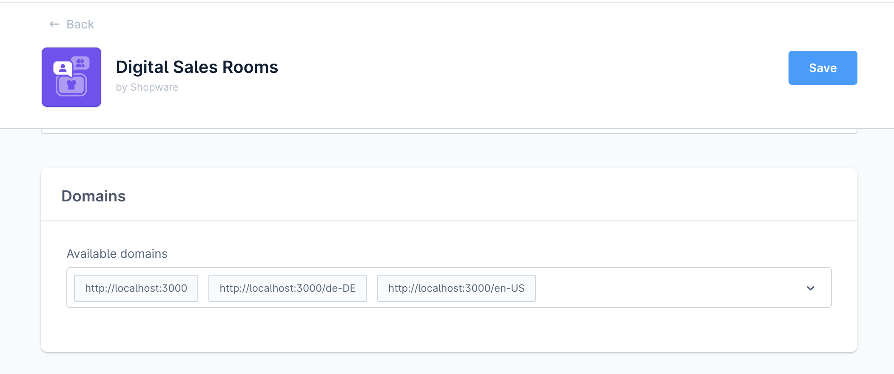
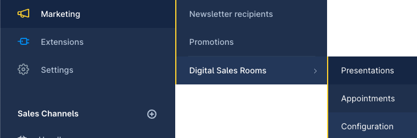

# Digital Sales Rooms — Konfiguration (vollständig)

## 1. Domain-Konfiguration

Die DSR-Frontend-App läuft auf einer eigenen Domain (z.B. `https://dsr.shopware.io`).
Diese Domain muss im Shopware Sales Channel eingetragen werden.

### Domains zum Sales Channel hinzufügen

Im Shopware Admin unter dem gewünschten Sales Channel → **Domains-Sektion**:

DSR unterstützt Sprach-Switching über den URL-Pfad. Empfohlene Struktur:

```
https://dsr.shopware.io       → English
https://dsr.shopware.io/de-DE → Deutsch
https://dsr.shopware.io/en-US → English (US)
```



> **Wichtig:** Nach Domain-Änderungen muss die Frontend-App neu deployed/gestartet
> werden, damit die Änderungen greifen.

Die eingetragenen Domains werden anschließend in der Plugin-Konfiguration
unter "Appointments → Available domains" ausgewählt.



---

## 2. Konfiguration via CLI (empfohlen)

Aus dem Plugin-Root-Verzeichnis:

```bash
composer dsr:config
```

Dieser Befehl führt automatisch folgende Setup-Commands aus:

| Sub-Command | Beschreibung |
|-------------|-------------|
| `composer dsr:domain-setup` | Domain-Konfigurationen einrichten |
| `composer dsr:daily-setup` | Daily.co für Video/Audio konfigurieren |
| `composer dsr:mercure-setup` | Mercure Hub für Realtime-Updates konfigurieren |

Die Sub-Commands können auch einzeln ausgeführt werden, um nur bestimmte
Teile neu zu konfigurieren.

---

## 3. Plugin-Konfigurationsseite

Navigation: **Marketing › Digital Sales Rooms › Configuration**



### Abschnitt: Appointments

| Feld | Beschreibung |
|------|-------------|
| Available domains | Dropdown mit allen Sales-Channel-Domains. DSR-Domains aus Schritt 1 auswählen. |

### Abschnitt: Video and Audio

| Feld | Wert |
|------|------|
| API base url | `https://api.daily.co/v1/` |
| API key | API-Key aus dem Daily.co Dashboard (→ `sw-digital-sales-rooms-3rdparty`) |

### Abschnitt: Realtime service

| Feld | Quelle |
|------|--------|
| Hub url | Mercure Hub URL (aus Stackhero oder eigenem Docker-Setup) |
| Hub public url | Mercure Public Hub URL (meistens identisch mit Hub url) |
| Hub subscriber secret | JWT-Key für Subscriber-Authentifizierung |
| Hub publisher secret | JWT-Key für Publisher-Authentifizierung |

Alle Mercure-Werte kommen aus dem Stackhero-Dashboard oder dem eigenen
Mercure-Setup → Details in `sw-digital-sales-rooms-3rdparty`.

---

## Abhängigkeiten

Die Plugin-Konfiguration setzt voraus, dass:

1. Daily.co API-Key vorhanden ist → `sw-digital-sales-rooms-3rdparty`
2. Mercure Hub läuft und konfiguriert ist → `sw-digital-sales-rooms-3rdparty`
3. DSR-Domain im Sales Channel eingetragen ist (Schritt 1 oben)
