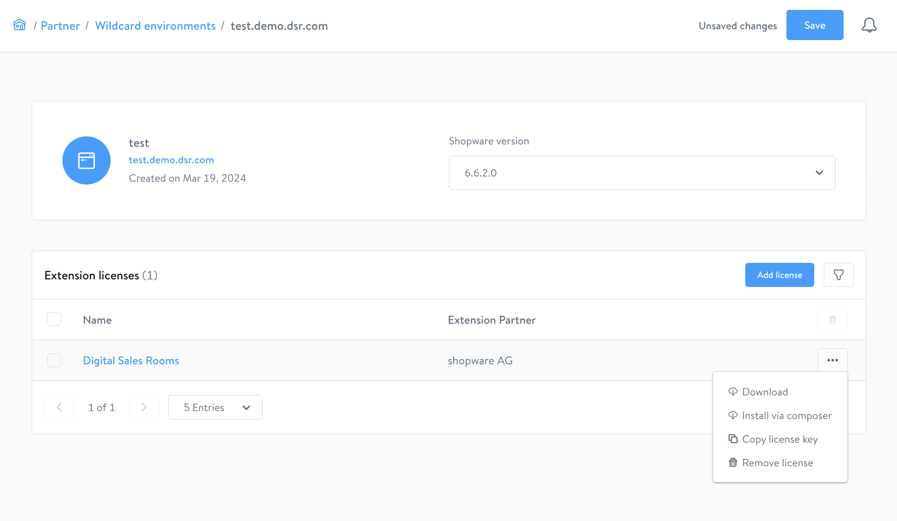

# Digital Sales Rooms — Installation (vollständig)

> Voraussetzung: Shopware läuft unter `https://shopware.store`, die DSR-Frontend-App
> wird unter `https://dsr.shopware.io` erreichbar sein.

## Teil 1: Admin-seitige Plugin-Installation

### Plugin beziehen

Digital Sales Rooms ist Teil des **Shopware Beyond**-Plans. Plugin-Bezug über
[account.shopware.com](https://auth.shopware.com/login?return_to=https:%2F%2Faccount.shopware.com%2Fportal)
via Wildcard Environment.



#### Via Composer

1. Wildcard-Environment-Detailseite öffnen
2. Plugin auswählen → "Install via composer" klicken
3. Modal enthält alle nötigen Composer-Befehle

#### Via Download (ZIP)

1. Wildcard-Environment-Detailseite → "Download"
2. ZIP speichern und nach `custom/plugins/` entpacken
3. Ordnername muss `SwagDigitalSalesRooms` sein

### Plugin aktivieren

```bash
# Verfügbare Plugins aktualisieren
bin/console plugin:refresh

# Plugin installieren und aktivieren (Name: SwagDigitalSalesRooms)
bin/console plugin:install SwagDigitalSalesRooms --activate

# Cache leeren
bin/console cache:clear
```

---

## Teil 2: Frontend-App-Installation

Die DSR-Frontend-App basiert auf dem **Shopware Frontends Framework** (Nuxt 3).
Sie befindet sich im Plugin-Paket unter `./templates/dsr-frontends/`.

### Quellcode erhalten

```shell
# Im Plugin-Verzeichnis:
cd ./templates/dsr-frontends
```

Den Quellcode empfiehlt Shopware in ein eigenes privates Repository zu kopieren,
um Anpassungen versioniert zu verwalten.

### Umgebungsvariablen konfigurieren

```shell
cp .env.template .env
```

| Variable | Pflicht | Beschreibung |
|----------|---------|--------------|
| `ORIGIN` | Ja | Domain der DSR-Frontend-App. Z.B. `https://dsr.shopware.io` |
| `SHOPWARE_STOREFRONT_URL` | Ja | Shopware Storefront-Domain. Z.B. `https://shopware.store` |
| `SHOPWARE_ADMIN_API` | Ja | Admin-API-Endpunkt. Z.B. `https://shopware.store/admin-api` |
| `SHOPWARE_STORE_API` | Ja | Store-API-Endpunkt. Z.B. `https://shopware.store/store-api` |
| `SHOPWARE_STORE_API_ACCESS_TOKEN` | Ja | API-Access-Key des Sales Channels (Einstellung: API access) |
| `ALLOW_ANONYMOUS_MERCURE` | Nein | Nur Entwicklung: `1` erlaubt unsecured Mercure |

**Beispiel `.env`:**

```shell
ORIGIN=https://dsr.shopware.io
SHOPWARE_STOREFRONT_URL=https://shopware.store
SHOPWARE_ADMIN_API=https://shopware.store/admin-api
SHOPWARE_STORE_API=https://shopware.store/store-api
SHOPWARE_STORE_API_ACCESS_TOKEN=XXXXXXXXXXX
```

### Entwicklungsmodus starten

```shell
npm install -g pnpm  # pnpm global installieren
pnpm install         # Abhängigkeiten installieren
pnpm dev             # Dev-Server starten (Standard: http://localhost:3000/)
```

### Produktions-Build erstellen

```shell
npm install -g pnpm
pnpm install
pnpm build
```

Nach dem Build das Deployment durchführen — siehe Skill
`sw-digital-sales-rooms-deployment`.

## Nächste Schritte

Nach erfolgreicher Installation:

1. **3rd-Party-Setup** (Daily.co + Mercure) → `sw-digital-sales-rooms-3rdparty`
2. **Plugin-Konfiguration** (Domain, API-Keys) → `sw-digital-sales-rooms-config`
3. Optional: **Anpassungen** → `sw-digital-sales-rooms-customization`
