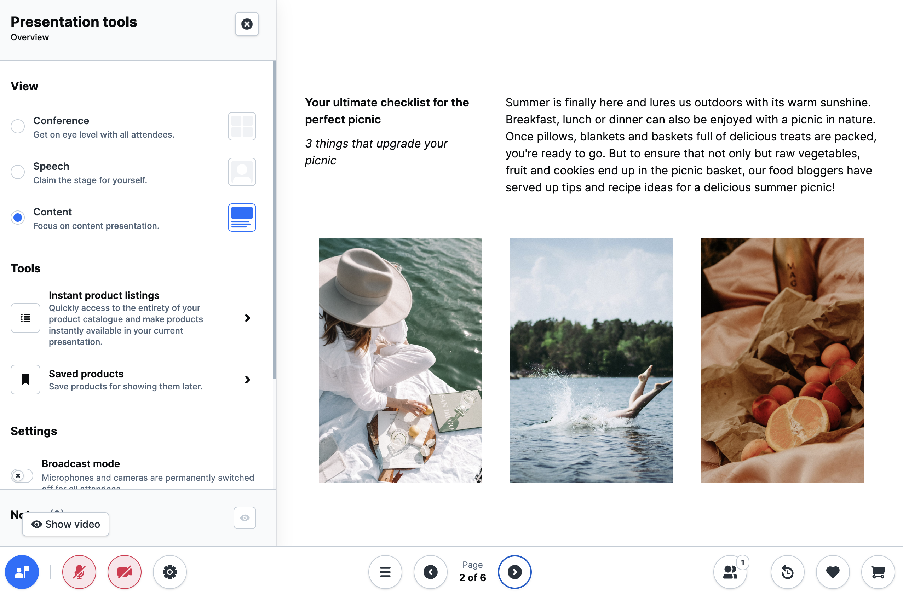

# Digital Sales Rooms — Vollständige Referenz

## Was ist Digital Sales Rooms?

Digital Sales Rooms (DSR) ist eine lizenzpflichtige Shopware-Erweiterung, die
nahtlos in die Shopware-Systemlandschaft integriert wird. Sie ermöglicht
interaktive Live-Video-Events für Kunden direkt aus der Shopware-Website,
ohne zwischen Präsentationstool, Videokonferenzsystem und Shopsystem wechseln
zu müssen.



> **Lizenzhinweis:** Digital Sales Rooms ist eine lizenzpflichtige Erweiterung
> und nicht als Open Source verfügbar. Verfügbar im Shopware Beyond-Plan.

> **Architektur-Hinweis:** Die DSR-Anwendung gehört **nicht** zum Standard-
> Storefront. Es ist eine eigenständige Frontend-App, die auf einer Nuxt-Instanz
> läuft und auf einer separaten Domain mit eigenem Hostname gehostet wird.

## Mindestanforderungen

| Komponente | Version |
|-----------|---------|
| Node.js | >= 18 |
| pnpm | >= 8 |
| Shopware Frontends | Nuxt 3-basiert |
| Shopware 6 | beliebige aktuelle Version |
| Daily.co | API-Key erforderlich |
| Mercure | Hub-Instanz erforderlich |

## Architektur-Überblick

```
Browser ─── DSR Frontend (Nuxt 3)          separater Hostname z.B. dsr.shopware.io
                │
                ├── Shopware Store API      z.B. shopware.store/store-api
                ├── Shopware Admin API      z.B. shopware.store/admin-api
                ├── Mercure Hub             Realtime-Updates (SSE)
                └── Daily.co               Video/Audio-Streaming
```

Der Shopware-Admin enthält das SwagDigitalSalesRooms-Plugin, das die
DSR-Funktionalität serverseitig bereitstellt.

## Pflicht-Setup-Schritte

Um Digital Sales Rooms produktiv einzusetzen, müssen alle drei Schritte
abgeschlossen werden:

1. **Installation** — Plugin-Installation (Admin) + Frontend-App-Setup
2. **3rd-Party-Setup** — Daily.co API-Key + Mercure Hub konfigurieren
3. **Plugin-Konfiguration** — Domain, Video-API und Realtime-Service in der
   Shopware-Konfigurationsseite eintragen

## Referenz-Übersicht

Detailthemen sind in spezialisierten Skills abgelegt:

- Installation → `sw-digital-sales-rooms-installation`
- Konfiguration → `sw-digital-sales-rooms-config`
- Customization → `sw-digital-sales-rooms-customization`
- 3rd Party → `sw-digital-sales-rooms-3rdparty`
- Deployment → `sw-digital-sales-rooms-deployment`
