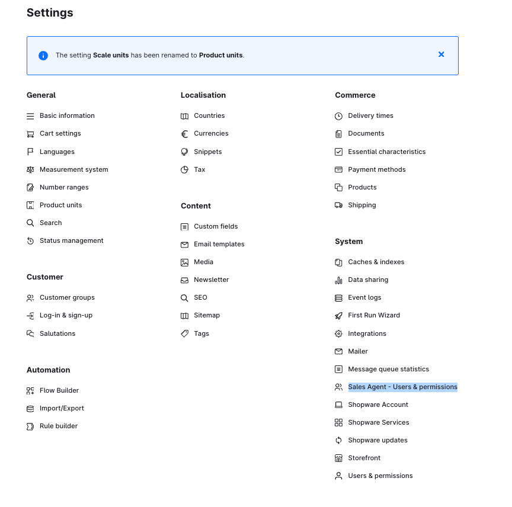

# Sales Agent — Installation & Setup (vollständig)

## Voraussetzungen

Credentials für folgende Services bereitstellen:

- **MySQL-Datenbank** — Verbindungsdaten
- **Redis Cache** — Verbindungsdaten

## App-Server einrichten

### 1. Repository klonen

```shell
git clone https://github.com/shopware/swagsalesagent.git
cd swagsalesagent
```

> Zugang zum privaten GitLab-Repository via Support-Ticket in
> [Shopware Account](https://account.shopware.com).

### 2. `.env`-Datei erstellen

```shell
cp .env.template .env
```

Alle Properties mit Erklärungen sind in `.env.template` dokumentiert.
Mindestens folgende Werte eintragen:

| Variable | Beispiel |
|----------|---------|
| `DATABASE_URL` | MySQL Connection String |
| `REDIS_CACHE` | `true` |
| `REDIS_HOST` | Redis-Hostname |
| `REDIS_PORT` | `6379` |
| `REDIS_PASSWORD` | Redis-Passwort |
| `REDIS_TLS` | `true` (Produktion) / `false` (lokal) |
| `APP_NAME` | Name der Shopware-App |
| `APP_SECRET` | Geheimer App-Token |
| `ORIGIN` | App-Domain, z.B. `https://agent.shopware.io` |
| `COMPANY_NAME` | Firmenname |

### 3. Abhängigkeiten installieren

```shell
pnpm install --frozen-lockfile --prefer-offline
```

### 4. Datenbank migrieren

**Nur vorhandene Migrationen ausführen (Produktion/erste Installation):**

```bash
pnpm db:migration:deploy
```

**Neue Migrationsdateien erstellen bei Schema-Änderungen (Entwicklung):**

```bash
pnpm db:migration:dev
```

### 5. Dev-Server starten

```shell
pnpm dev
```

### 6. Produktions-Build erstellen

```shell
pnpm build
```

---

## Mit Shopware-Instanz verbinden

### App-ZIP bauen

```bash
pnpm app:build
```

Erzeugt `bundle/swagsalesagent.zip`.

### In Shopware installieren

1. Shopware Admin → **Extensions**
2. ZIP-Datei (`bundle/swagsalesagent.zip`) hochladen
3. Nach erfolgreicher Installation: **Sales Agent** Menüeintrag erscheint unter Settings



---

## Tests

Sales Agent nutzt [Vitest](https://vitest.dev/) für Unit-Tests.
Tests befinden sich im `tests/`-Verzeichnis.

```bash
# Unit Tests ausführen
pnpm run test

# Code-Coverage ermitteln
pnpm run test:coverage
```
