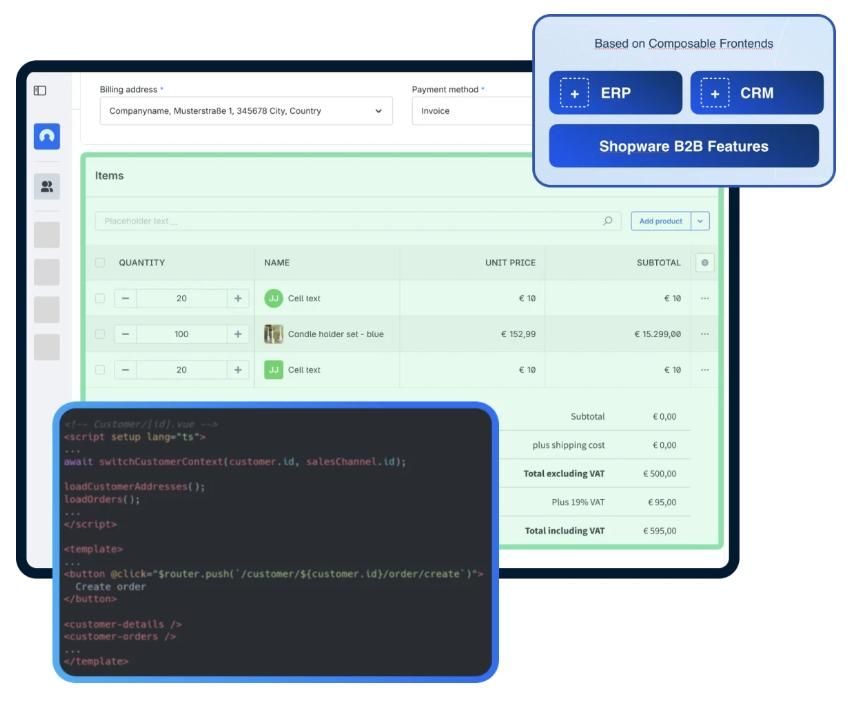
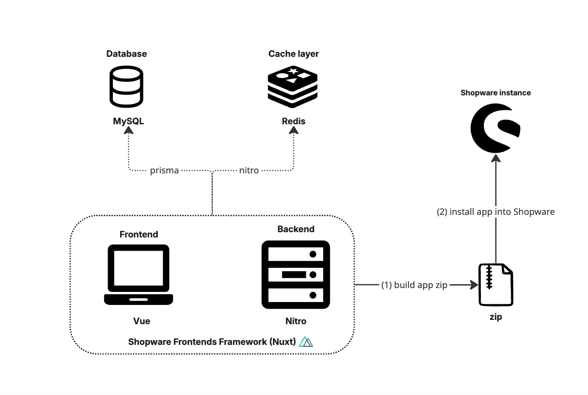

# Sales Agent — Überblick

Sales Agent ist eine lizenzpflichtige Shopware-App (Beyond oder Evolve),
die Vertriebsmitarbeitern eine optimierte Arbeitsumgebung bietet — ohne
den Overhead der Shopware-Administration.

## Architektur

| Schicht | Technologie |
|---------|------------|
| Frontend | Vue |
| Backend/Server | Nuxt 3 + Nitro |
| Datenbank | MySQL (via Prisma) |
| Cache | Redis (via Nitro Storage) |

Vollständige Referenz: [references/deep/overview.md](references/deep/overview.md)

## Verwandte Skills

| Thema | Skill |
|-------|-------|
| Installation & App-Server-Setup | `sw-sales-agent-setup` |
| Anpassung (Branding, Komponenten, i18n) | `sw-sales-agent-customization` |
| Deployment (AWS, Cloudflare, Ubuntu) | `sw-sales-agent-deployment` |
