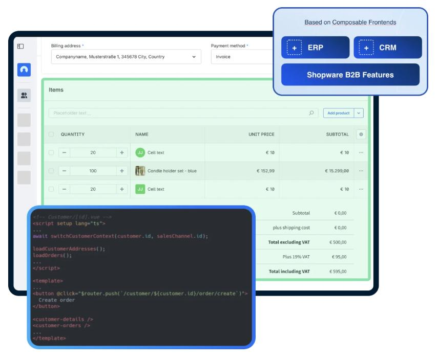
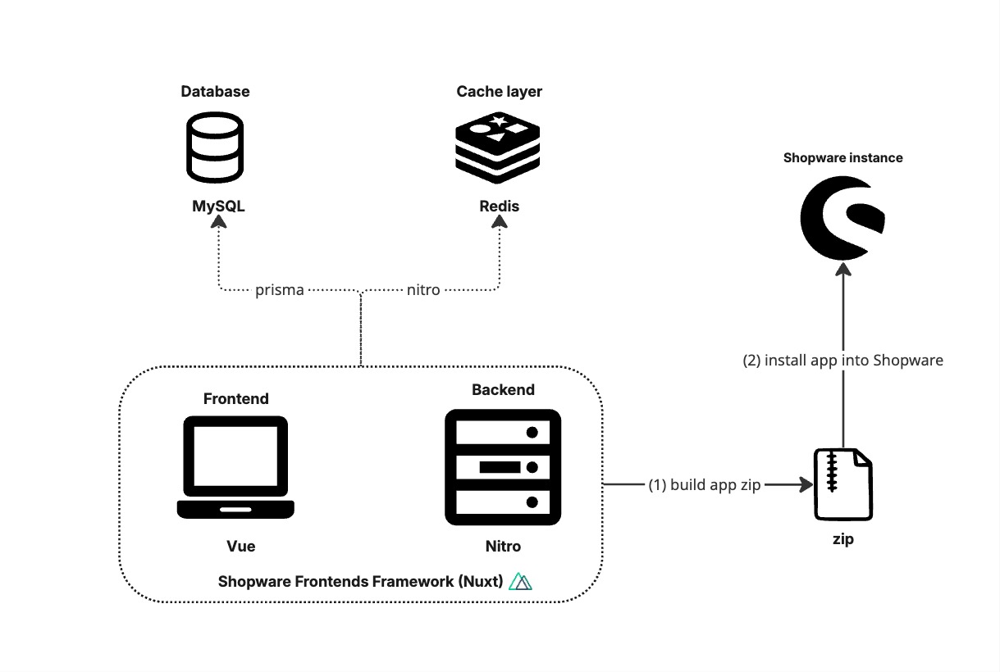

# Sales Agent — full reference

## What is Sales Agent?

Sales Agent is a licensed Shopware application (not open source) that
optimizes communication and sales processes between sales representatives and
customers. It integrates Shopware into a lean environment without the
overhead of the full administration.



> **Access:** open a support ticket in your [Shopware account](https://account.shopware.com).
> Access is granted after a short validation, or when purchasing a
> Beyond/Evolve license.

> **Architecture note:** Sales Agent is **not** part of the standard Shopware
> Storefront. It is a stand-alone Nuxt 3 app on a separate domain.

## Minimum requirements

| Component | Version/requirement |
|-----------|---------------------|
| Node.js | >= 18 |
| pnpm | >= 8 |
| Shopware Frontends | Nuxt 3 based |
| Shopware 6 | >= 6.7.3 |
| Database | MySQL |
| License | Beyond or Evolve |

## Architecture detail

```
Browser ──── Sales Agent frontend (Vue/Nuxt 3)    separate hostname
                     │
                     ├── Nitro Server Engine
                     │     ├── Prisma → MySQL
                     │     └── Redis cache (Nitro storage layer)
                     │
                     └── Shopware backend
```



## API documentation

Detailed API information:
[shopware.stoplight.io/docs/swag-sales-agent/](https://shopware.stoplight.io/docs/swag-sales-agent/)

## Skill overview

- Setup/Installation → `sw-sales-agent-setup`
- Customization → `sw-sales-agent-customization`
- Deployment → `sw-sales-agent-deployment`
