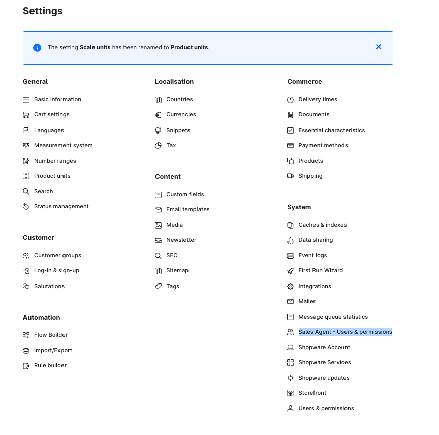

# Sales Agent — installation & setup (complete)

## Contents

- [Prerequisites](#prerequisites)
- [Set up the app server](#set-up-the-app-server)
- [Connect to a Shopware instance](#connect-to-a-shopware-instance)
- [Tests](#tests)

## Prerequisites

Provide credentials for the following services:

- **MySQL database** — connection details
- **Redis cache** — connection details

## Set up the app server

### 1. Clone the repository

```shell
git clone https://github.com/shopware/swagsalesagent.git
cd swagsalesagent
```

> Access to the private GitLab repository via a support ticket in your
> [Shopware account](https://account.shopware.com).

### 2. Create the `.env` file

```shell
cp .env.template .env
```

All properties are documented with explanations in `.env.template`.
Enter at least the following values:

| Variable | Example |
|----------|---------|
| `DATABASE_URL` | MySQL connection string |
| `REDIS_CACHE` | `true` |
| `REDIS_HOST` | Redis hostname |
| `REDIS_PORT` | `6379` |
| `REDIS_PASSWORD` | Redis password |
| `REDIS_TLS` | `true` (production) / `false` (local) |
| `APP_NAME` | name of the Shopware app |
| `APP_SECRET` | secret app token |
| `ORIGIN` | app domain, e.g. `https://agent.shopware.io` |
| `COMPANY_NAME` | company name |

### 3. Install dependencies

```shell
pnpm install --frozen-lockfile --prefer-offline
```

### 4. Migrate the database

**Run existing migrations only (production/first installation):**

```bash
pnpm db:migration:deploy
```

**Create new migration files on schema changes (development):**

```bash
pnpm db:migration:dev
```

### 5. Start the dev server

```shell
pnpm dev
```

### 6. Create a production build

```shell
pnpm build
```

---

## Connect to a Shopware instance

### Build the app ZIP

```bash
pnpm app:build
```

Creates `bundle/swagsalesagent.zip`.

### Install in Shopware

1. Shopware Admin → **Extensions**
2. Upload the ZIP file (`bundle/swagsalesagent.zip`)
3. After a successful installation the **Sales Agent** menu entry appears under Settings



---

## Tests

Sales Agent uses [Vitest](https://vitest.dev/) for unit tests.
The tests live in the `tests/` directory.

```bash
# run unit tests
pnpm run test

# determine code coverage
pnpm run test:coverage
```
