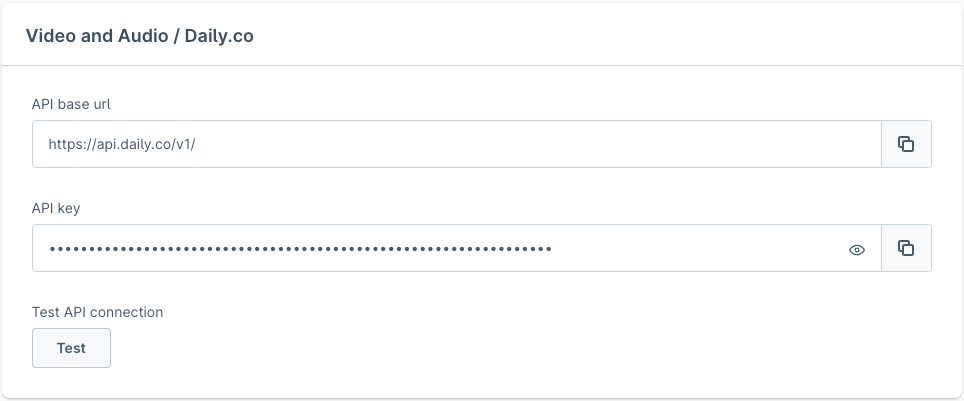
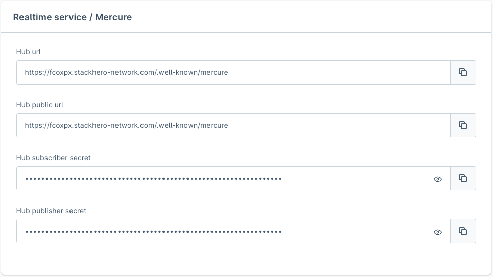
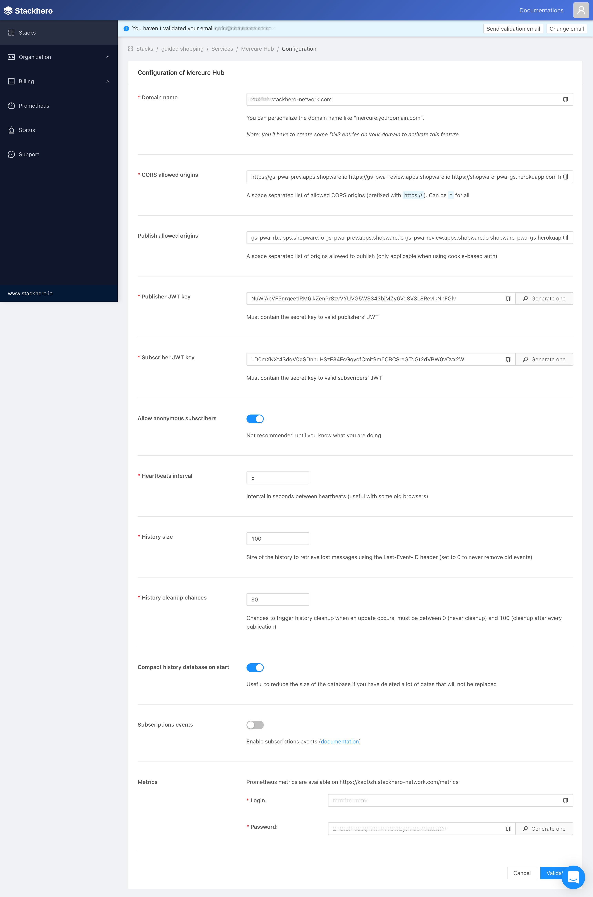

# Digital Sales Rooms — third-party setup (complete)

DSR requires two external services:

| Service | Purpose |
|--------|-------|
| **Daily.co** | Realtime video/audio streaming between participants |
| **Mercure** | Server-to-client push (realtime updates, server-sent events) |

---

## Contents

- [Daily.co Setup](#dailyco-setup)
- [Mercure Hub Setup](#mercure-hub-setup)
- [Securing the Mercure hub (CORS & keys)](#securing-the-mercure-hub-cors--keys)
- [Development mode (unsecured Mercure)](#development-mode-unsecured-mercure)

## Daily.co Setup

### Step 1: open the dashboard

[https://dashboard.daily.co/](https://dashboard.daily.co/) — log in or create an account.

### Step 2: obtain the API key

- Left-hand navigation: open the **"Developers"** area
- Copy the **API KEY**



### Step 3: enter it in the plugin config

Navigation: Marketing › Digital Sales Rooms › Configuration → **Video and Audio**

| Field | Value |
|------|------|
| API base url | `https://api.daily.co/v1/` |
| API key | The copied API KEY |

---

## Mercure Hub Setup

Mercure is an open protocol for server-to-client updates. It is a
modern alternative to polling and WebSockets.

### Option A: Stackhero (recommended)

[StackHero](https://www.stackhero.io/en/services/Mercure-Hub/pricing) offers
hosted Mercure as a service. For small demos the "Hobby" plan is sufficient.

**Setup:**

1. Create a Stackhero account
2. Dashboard → **Stacks** → **Create a new stack** → Service: **Mercure Hub**
3. Configure the stack → **Configure** button
4. Note down the following values:
   - **Hub url** — hub URL
   - **Hub public url** — public hub URL (usually identical)
   - **Hub subscriber secret** — JWT key for subscribers
   - **Hub publisher secret** — JWT key for publishers



5. Enter the values in the DSR plugin config:



### Option B: Docker (local/self-hosted)

> For production: use different publisher and subscriber keys!

```bash
git clone https://github.com/shopware/local-mercure-sample
cd local-mercure-sample
docker-compose up
```

---

## Securing the Mercure hub (CORS & keys)

After initializing the hub, apply the following settings:

### CORS allowed origins

Domain(s) from which the browser accesses the hub:

```
https://dsr.shopware.io    ← DSR frontend domain
```

### Publish allowed origins

Domains allowed to publish events to the hub (without the HTTP protocol):

```
https://dsr.shopware.io      ← frontend domain
https://shopware.store       ← backend/admin API domain
```

### Publisher (JWT) key

A freely chosen JWT key for publisher authentication.

### Subscriber (JWT) key

A freely chosen JWT key for subscriber authentication.

---

## Development mode (unsecured Mercure)

For local development without JWT authentication:

```shell
# in the .env of the DSR frontend app:
ALLOW_ANONYMOUS_MERCURE=1
```

> For development purposes only — never use in production!
