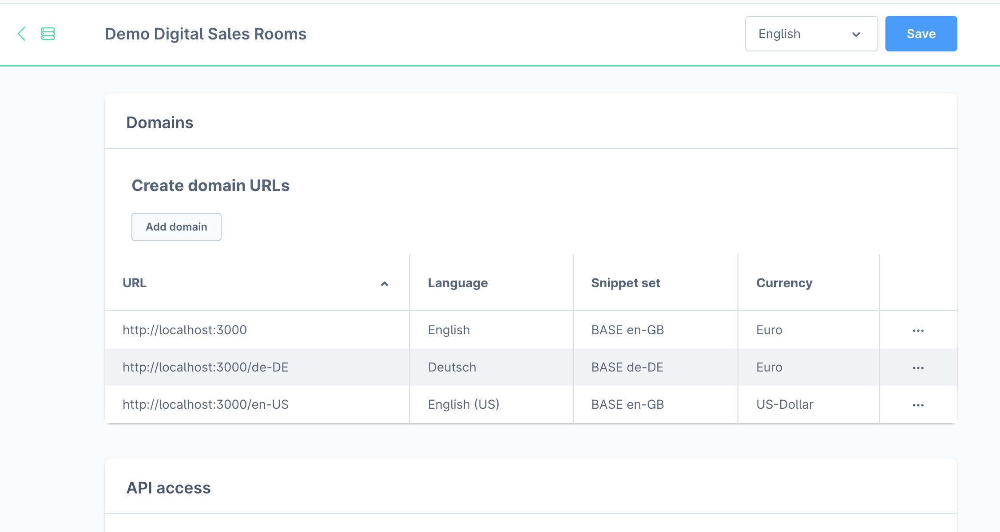
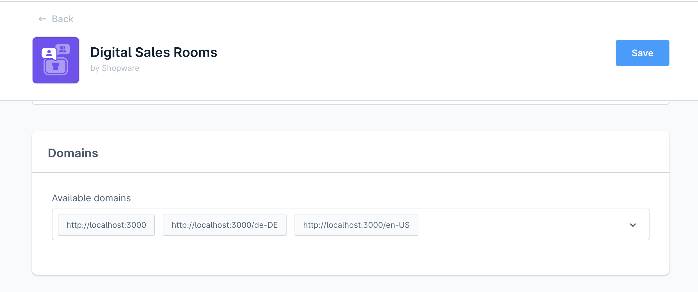
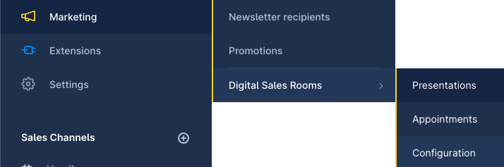

# Digital Sales Rooms — configuration (complete)

## 1. Domain configuration

The DSR frontend app runs on its own domain (e.g. `https://dsr.shopware.io`).
This domain has to be entered in the Shopware sales channel.

### Adding domains to the sales channel

In the Shopware admin, under the desired sales channel → **Domains section**:

DSR supports language switching via the URL path. Recommended structure:

```
https://dsr.shopware.io       → English
https://dsr.shopware.io/de-DE → German
https://dsr.shopware.io/en-US → English (US)
```



> **Important:** after domain changes the frontend app has to be redeployed/restarted
> for the changes to take effect.

The domains entered are then selected in the plugin configuration
under "Appointments → Available domains".



---

## 2. Configuration via CLI (recommended)

From the plugin root directory:

```bash
composer dsr:config
```

This command automatically runs the following setup commands:

| Sub-command | Description |
|-------------|-------------|
| `composer dsr:domain-setup` | set up the domain configurations |
| `composer dsr:daily-setup` | configure Daily.co for video/audio |
| `composer dsr:mercure-setup` | configure the Mercure hub for realtime updates |

The sub-commands can also be run individually to reconfigure only certain
parts.

---

## 3. Plugin configuration page

Navigation: **Marketing › Digital Sales Rooms › Configuration**



### Section: Appointments

| Field | Description |
|------|-------------|
| Available domains | Dropdown with all sales channel domains. Select the DSR domains from step 1. |

### Section: Video and Audio

| Field | Value |
|------|------|
| API base url | `https://api.daily.co/v1/` |
| API key | API key from the Daily.co dashboard (→ `sw-digital-sales-rooms-3rdparty`) |

### Section: Realtime service

| Field | Source |
|------|--------|
| Hub url | Mercure hub URL (from Stackhero or your own Docker setup) |
| Hub public url | Mercure public hub URL (usually identical to the hub url) |
| Hub subscriber secret | JWT key for subscriber authentication |
| Hub publisher secret | JWT key for publisher authentication |

All Mercure values come from the Stackhero dashboard or your own
Mercure setup → details in `sw-digital-sales-rooms-3rdparty`.

---

## Dependencies

The plugin configuration requires that:

1. a Daily.co API key is available → `sw-digital-sales-rooms-3rdparty`
2. the Mercure hub is running and configured → `sw-digital-sales-rooms-3rdparty`
3. the DSR domain is entered in the sales channel (step 1 above)
