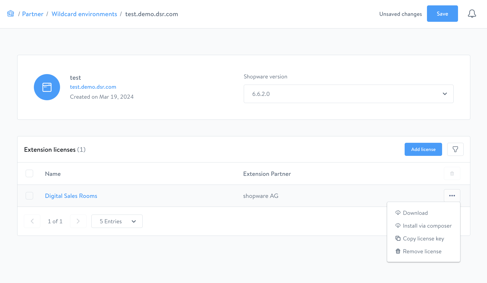

# Digital Sales Rooms — installation (complete)

> Prerequisite: Shopware runs at `https://shopware.store`, and the DSR frontend app
> will be reachable at `https://dsr.shopware.io`.

## Contents

- [Part 1: admin-side plugin installation](#part-1-admin-side-plugin-installation)
- [Part 2: frontend app installation](#part-2-frontend-app-installation)
- [Next steps](#next-steps)

## Part 1: admin-side plugin installation

### Obtaining the plugin

Digital Sales Rooms is part of the **Shopware Beyond** plan. Obtain the plugin via
[account.shopware.com](https://auth.shopware.com/login?return_to=https:%2F%2Faccount.shopware.com%2Fportal)
using a wildcard environment.



#### Via Composer

1. Open the wildcard environment detail page
2. Select the plugin → click "Install via composer"
3. The modal contains all the required composer commands

#### Via Download (ZIP)

1. Wildcard environment detail page → "Download"
2. Save the ZIP and extract it into `custom/plugins/`
3. The folder name must be `SwagDigitalSalesRooms`

### Activating the plugin

```bash
# refresh the available plugins
bin/console plugin:refresh

# install and activate the plugin (name: SwagDigitalSalesRooms)
bin/console plugin:install SwagDigitalSalesRooms --activate

# clear the cache
bin/console cache:clear
```

---

## Part 2: frontend app installation

The DSR frontend app is based on the **Shopware Frontends framework** (Nuxt 3).
It is located in the plugin package at `./templates/dsr-frontends/`.

### Getting the source code

```shell
# in the plugin directory:
cd ./templates/dsr-frontends
```

Shopware recommends copying the source code into your own private repository
in order to manage customizations under version control.

### Configuring environment variables

```shell
cp .env.template .env
```

| Variable | Required | Description |
|----------|---------|--------------|
| `ORIGIN` | Yes | Domain of the DSR frontend app. E.g. `https://dsr.shopware.io` |
| `SHOPWARE_STOREFRONT_URL` | Yes | Shopware Storefront domain. E.g. `https://shopware.store` |
| `SHOPWARE_ADMIN_API` | Yes | Admin API endpoint. E.g. `https://shopware.store/admin-api` |
| `SHOPWARE_STORE_API` | Yes | Store API endpoint. E.g. `https://shopware.store/store-api` |
| `SHOPWARE_STORE_API_ACCESS_TOKEN` | Yes | API access key of the sales channel (setting: API access) |
| `ALLOW_ANONYMOUS_MERCURE` | No | Development only: `1` allows unsecured Mercure |

**Example `.env`:**

```shell
ORIGIN=https://dsr.shopware.io
SHOPWARE_STOREFRONT_URL=https://shopware.store
SHOPWARE_ADMIN_API=https://shopware.store/admin-api
SHOPWARE_STORE_API=https://shopware.store/store-api
SHOPWARE_STORE_API_ACCESS_TOKEN=XXXXXXXXXXX
```

### Starting development mode

```shell
npm install -g pnpm  # install pnpm globally
pnpm install         # install dependencies
pnpm dev             # start the dev server (default: http://localhost:3000/)
```

### Creating a production build

```shell
npm install -g pnpm
pnpm install
pnpm build
```

Perform the deployment after the build — see the skill
`sw-digital-sales-rooms-deployment`.

## Next steps

After a successful installation:

1. **Third-party setup** (Daily.co + Mercure) → `sw-digital-sales-rooms-3rdparty`
2. **Plugin configuration** (domain, API keys) → `sw-digital-sales-rooms-config`
3. Optional: **customizations** → `sw-digital-sales-rooms-customization`
