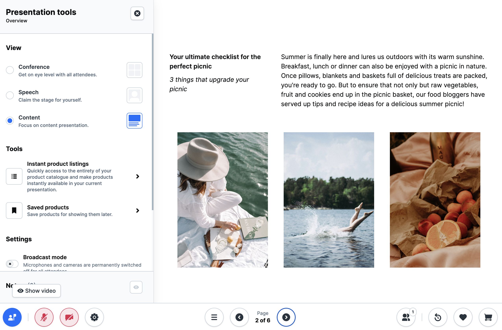

# Digital Sales Rooms — full reference

## What is Digital Sales Rooms?

Digital Sales Rooms (DSR) is a licensed Shopware extension that integrates
seamlessly into the Shopware system landscape. It enables interactive
live video events for customers directly from the Shopware website,
without having to switch between presentation tool, video conferencing system
and shop system.



> **License note:** Digital Sales Rooms is a licensed extension
> and is not available as open source. Available in the Shopware Beyond plan.

> **Architecture note:** The DSR application is **not** part of the standard
> Storefront. It is a stand-alone frontend app that runs on a Nuxt instance
> and is hosted on a separate domain with its own hostname.

## Minimum requirements

| Component | Version |
|-----------|---------|
| Node.js | >= 18 |
| pnpm | >= 8 |
| Shopware Frontends | Nuxt 3 based |
| Shopware 6 | any current version |
| Daily.co | API key required |
| Mercure | hub instance required |

## Architecture overview

```
Browser ─── DSR frontend (Nuxt 3)          separate hostname e.g. dsr.shopware.io
                │
                ├── Shopware Store API      e.g. shopware.store/store-api
                ├── Shopware Admin API      e.g. shopware.store/admin-api
                ├── Mercure hub             realtime updates (SSE)
                └── Daily.co               video/audio streaming
```

The Shopware admin contains the SwagDigitalSalesRooms plugin, which provides
the DSR functionality server-side.

## Mandatory setup steps

To run Digital Sales Rooms in production, all three steps must be
completed:

1. **Installation** — plugin installation (admin) + frontend app setup
2. **Third-party setup** — configure the Daily.co API key + Mercure hub
3. **Plugin configuration** — enter domain, video API and realtime service on
   the Shopware configuration page

## Reference overview

Detailed topics are kept in specialized skills:

- Installation → `sw-digital-sales-rooms-installation`
- Configuration → `sw-digital-sales-rooms-config`
- Customization → `sw-digital-sales-rooms-customization`
- 3rd Party → `sw-digital-sales-rooms-3rdparty`
- Deployment → `sw-digital-sales-rooms-deployment`
