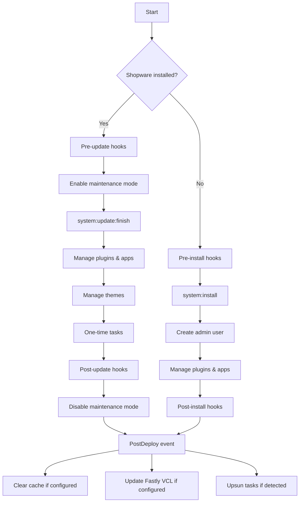

# Shopware 6 — Deployment (Deep Reference)

Sources: `guides/hosting/installation-updates/deployments/deployment-helper.md`, `guides/hosting/installation-updates/deployments/deployment-with-deployer.md`, `guides/hosting/installation-updates/deployments/build-w-o-db.md`, `guides/hosting/installation-updates/deployments/index.md`

## Deployment principles

- Build artifacts once in CI — deploy those artifacts
- Keep config and secrets outside the codebase
- Separate build-time from runtime concerns
- Roll forward by default
- Enable maintenance mode for schema-changing releases
- Health check + smoke test after deploy before exiting maintenance
- Retain build logs and deployment reports

## Deployment Helper

```bash
composer require shopware/deployment-helper
vendor/bin/shopware-deployment-helper run
```

### What it does



### .shopware-project.yml

```yaml
deployment:
    hooks:
        pre: |
            echo "Before deployment"
        post: |
            echo "After deployment"
        pre-install: |
            echo "Before system:install"
        post-install: |
            echo "After system:install"
        pre-update: |
            echo "Before system:update"
        post-update: |
            echo "After system:update"

    extension-management:
        enabled: true

        exclude:
            - PluginManagedManually

        force-update:
            - ProjectSpecificPlugin

        overrides:
            SomePlugin:
                state: ignore        # same as exclude
            InactivePlugin:
                state: inactive      # installed but inactive
            RemoveThisPlugin:
                state: remove        # uninstalled
                keepUserData: true   # keep DB data after uninstall

    one-time-tasks:
        - id: my-data-migration
          when: after      # "before" = before system:update, "after" = after (default)
          script: |
              %php.bin% bin/console app:migrate-data

    store:
        license-domain: 'example.com'

    staging:
        enabled: false   # or SHOPWARE_DEPLOYMENT_STAGING=1
```

### Local config overrides (.shopware-project.local.yml)

```yaml
# .shopware-project.local.yml (add to .gitignore)
deployment:
    hooks:
        pre: |
            echo "Local pre hook"
    store:
        license-domain: local.example.com
    one-time-tasks:
        - id: local-only-task
          script: echo "local task"
```

Merge behavior:
- Scalars: replaced
- Maps: deep-merged
- Lists: appended

YAML tags for advanced control:
- `!reset` — discard base value, use only override
- `!override` — completely replace a mapping section

```yaml
deployment:
    extension-management:
        exclude: !reset
            - OnlyThisPlugin      # base list discarded

    hooks: !override
        pre: |
            echo "Only this hook"  # all other hooks from base removed
```

### Environment variables for initial setup

| Variable | Default | Description |
|---|---|---|
| `INSTALL_LOCALE` | `en-GB` | Installation locale |
| `INSTALL_CURRENCY` | `EUR` | Installation currency |
| `INSTALL_ADMIN_USERNAME` | `admin` | Admin username |
| `INSTALL_ADMIN_PASSWORD` | `shopware` | Admin password |
| `SALES_CHANNEL_URL` | `http://localhost` | Storefront URL |
| `SHOPWARE_DEPLOYMENT_TIMEOUT` | `300` | Setup command timeout |
| `SHOPWARE_STORE_ACCOUNT_EMAIL` | (empty) | Shopware account email |
| `SHOPWARE_STORE_ACCOUNT_PASSWORD` | (empty) | Shopware account password |
| `SHOPWARE_STORE_LICENSE_DOMAIN` | (empty) | License domain (overrides YAML) |
| `SHOPWARE_USAGE_DATA_CONSENT` | (empty) | `accepted` or `revoked` |
| `SHOPWARE_DEPLOYMENT_STAGING` | (empty) | Set `1` to enable staging mode |

### One-time task management

```bash
./vendor/bin/shopware-deployment-helper one-time-task:list
./vendor/bin/shopware-deployment-helper one-time-task:unmark <id>   # re-run next deploy
./vendor/bin/shopware-deployment-helper one-time-task:mark <id>     # mark as done
```

### Extension removal process

1. Add to `.shopware-project.yml`:
```yaml
overrides:
    TheExtensionToRemove:
        state: remove
        keepUserData: true
```

2. Deploy → extension is uninstalled

3. Remove from source code + remove from YAML

4. Deploy again

### Fastly integration

```bash
composer require shopware/fastly-meta
# Set FASTLY_API_KEY and FASTLY_SERVICE_ID
```

```bash
./vendor/bin/shopware-deployment-helper fastly:snippet:list
./vendor/bin/shopware-deployment-helper fastly:snippet:remove <name>
```

## Deployer (classic deployment)

```bash
composer require deployer/deployer shopware/deployment-helper
dep deploy env=prod
```

### Webserver prerequisite

Docroot must point to `/var/www/shopware/current/public` (where `current` is a Deployer symlink).
Configure webserver to follow symlinks.

### deploy.php

```php
<?php

namespace Deployer;

require_once 'recipe/common.php';
require_once 'contrib/cachetool.php';

set('bin/console', '{{bin/php}} {{release_or_current_path}}/bin/console');
set('cachetool', '/run/php/php-fpm.sock');
set('application', 'Shopware 6');
set('allow_anonymous_stats', false);
set('default_timeout', 3600);

host('SSH-HOSTNAME')
    ->setLabels(['type' => 'web', 'env' => 'production'])
    ->setRemoteUser('www-data')
    ->set('deploy_path', '/var/www/shopware')
    ->set('http_user', 'www-data')
    ->set('writable_mode', 'chmod')
    ->set('keep_releases', 3);

set('shared_files', ['.env.local', 'install.lock', 'public/.htaccess', 'public/.user.ini']);
set('shared_dirs', ['config/jwt', 'files', 'var/log', 'public/media', 'public/plugins', 'public/thumbnail', 'public/sitemap']);
set('writable_dirs', ['config/jwt', 'custom/plugins', 'files', 'public/bundles', 'public/css', 'public/fonts', 'public/js', 'public/media', 'public/sitemap', 'public/theme', 'public/thumbnail', 'var']);

task('sw:deployment:helper', static function() {
    run('cd {{release_path}} && vendor/bin/shopware-deployment-helper run');
});

task('sw:touch_install_lock', static function () {
    run('cd {{release_path}} && touch install.lock');
});

task('sw:health_checks', static function () {
    run('cd {{release_path}} && bin/console system:check --context=pre_rollout');
});

desc('Deploys your project');
task('deploy', [
    'deploy:prepare',
    'deploy:clear_paths',
    'sw:deployment:helper',
    'sw:touch_install_lock',
    'sw:health_checks',
    'deploy:publish',
]);

task('deploy:update_code')->setCallback(static function () {
    upload('.', '{{release_path}}', ['options' => ['--exclude=.git', '--exclude=deploy.php', '--exclude=node_modules']]);
});

after('deploy:failed', 'deploy:unlock');
after('deploy:symlink', 'cachetool:clear:opcache');
```

### .gitlab-ci.yml (using component)

```yaml
stages:
    - deploy

include:
    - component: gitlab.com/shopware/ci-components/project-deployer@main
      inputs:
          php_version: "8.4"
```

### .github/workflows/deploy.yml

```yaml
name: Deployment

on:
    workflow_dispatch:

jobs:
    deploy:
        runs-on: ubuntu-latest
        steps:
            - name: Deploy
              uses: shopware/github-actions/project-deployer@main
              with:
                  sshPrivateKey: ${{ secrets.SSH_PRIVATE_KEY }}
```

## Build without database (CI)

### Administration (without DB)

Use `bin/ci` (uses `ComposerPluginLoader`) instead of `bin/console`:

```bash
CI=1 bin/ci bundle:dump
# or set CI=1 in scripts to auto-use bin/ci
```

### Storefront theme without DB

1. Dump theme config from a running instance:
```bash
bin/console theme:dump
```

2. Configure `StaticFileConfigLoader`:
```yaml
# config/packages/storefront.yaml
storefront:
    theme:
        config_loader_id: Shopware\Storefront\Theme\ConfigLoader\StaticFileConfigLoader
        available_theme_provider: Shopware\Storefront\Theme\ConfigLoader\StaticFileAvailableThemeProvider
        theme_path_builder_id: Shopware\Storefront\Theme\MD5ThemePathBuilder
```

3. Theme config location: `files/theme-config/` (share across deployments or use S3).

### Partial Storefront build (JS only, no theme)

```bash
CI=1 SHOPWARE_SKIP_THEME_COMPILE=true PUPPETEER_SKIP_CHROMIUM_DOWNLOAD=true shopware-cli project storefront-build
```

Then run `bin/console theme:dump` on the server when DB is available.

### Cache hash implications

`bin/ci` uses `ComposerPluginLoader` (all Composer plugins = active).
`bin/console` uses `DbalKernelPluginLoader` (respects DB `active` column).

If plugins differ between CI cache and production DB state, cache hashes diverge.

**Solution:** Use `bin/console cache:clear:all` instead of `bin/console cache:clear` in deploy scripts.

## Blue-Green Deployment

```dotenv
BLUE_GREEN_DEPLOYMENT=1
```

Requires MySQL SUPER privilege (creates DB triggers for schema synchronization).
Enables safe rollback without DB restore after update-only deployments.

**Note:** Only rollback-safe when Shopware itself was updated, not when extensions were also updated.

## Health Check

```
GET /api/_info/health-check
```

Returns `200 OK` when healthy, `50x` when not.
Use for load balancer health checks and CI smoke tests.

```bash
bin/console system:check --context=pre_rollout
```
