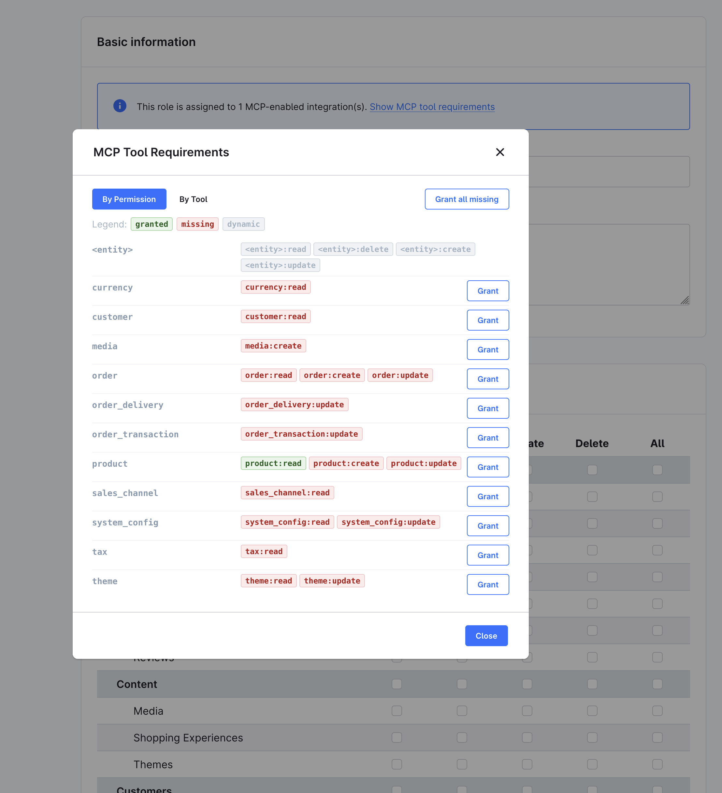
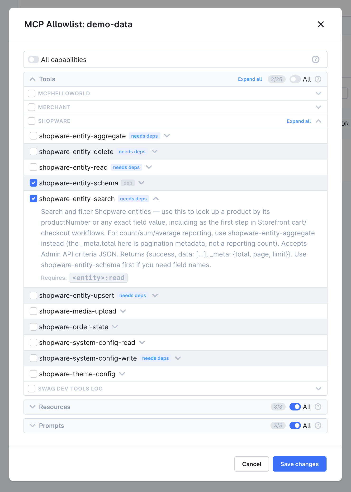

# Shopware MCP-Server — Vollständige Referenz

Der Model Context Protocol (MCP) Server ist seit Shopware 6.7 Teil der Core-Platform.
Er ermöglicht KI-Clients (Claude Desktop, Claude Code, Cursor, Codex) die direkte,
strukturierte Kommunikation mit dem Shop über ein Tool-basiertes Interface.

> **Experimentell:** Hinter Feature-Flag `MCP_SERVER`. APIs und Tool-Namen können
> sich bis Shopware 6.8 noch ändern.

---

## Überblick

| Eigenschaft | Details |
|-------------|---------|
| Endpoint | `POST /api/_mcp` (Streamable HTTP Transport) |
| Authentifizierung | Integration-Credentials oder OAuth Bearer-Token |
| Autorisierung | Vollständige Admin API ACL-Prüfung pro Tool-Call |
| Tool-Allowlist | Pro Integration und pro User; Schnittmenge bei `sw-app-user-id` |
| Rate Limiting | Pro Integration |
| Discovery | `bin/console debug:mcp` listet alle registrierten Capabilities |
| Erweiterbarkeit | Plugins, Bundles und Apps können eigene Tools/Prompts/Resources beitragen |

---

## Schnellstart

### 1. Feature Flag aktivieren

```bash
# .env
MCP_SERVER=1
```

### 2. Integration erstellen

```bash
bin/console integration:create "My MCP Client" --admin
# Ausgabe:
# SHOPWARE_ACCESS_KEY_ID=SWIA...
# SHOPWARE_SECRET_ACCESS_KEY=...
```

> Für Production: `--admin` weglassen, dedizierte ACL-Rolle mit minimalen Rechten erstellen.

### 3. KI-Client konfigurieren

**Claude Desktop / Cursor** (`~/Library/Application Support/Claude/claude_desktop_config.json` oder `.cursor/mcp.json`):
```json
{
  "mcpServers": {
    "shopware": {
      "type": "streamable-http",
      "url": "https://your-shop.example.com/api/_mcp",
      "headers": {
        "sw-access-key": "SWIA...",
        "sw-secret-access-key": "..."
      }
    }
  }
}
```

**Claude Code** (`.mcp.json` im Projekt-Root — `type` muss `http` sein, nicht `streamable-http`):
```json
{
  "mcpServers": {
    "shopware": {
      "type": "http",
      "url": "http://localhost:8000/api/_mcp",
      "headers": {
        "sw-access-key": "SWIA...",
        "sw-secret-access-key": "..."
      }
    }
  }
}
```

Oder per CLI:
```bash
claude mcp add --transport http shopware http://localhost:8000/api/_mcp \
  --header "sw-access-key: SWIA..." \
  --header "sw-secret-access-key: ..."
```

**Codex** (`~/.codex/config.toml`):
```toml
[mcp_servers.shopware]
url = "https://your-shop.example.com/api/_mcp"
env_http_headers = { "sw-access-key" = "SHOPWARE_MCP_ACCESS_KEY", "sw-secret-access-key" = "SHOPWARE_MCP_SECRET_KEY" }
enabled = true
```
```bash
export SHOPWARE_MCP_ACCESS_KEY='SWIA...'
export SHOPWARE_MCP_SECRET_KEY='...'
```

### 4. Verbindung testen

```bash
bin/console debug:mcp
```

---

## Authentifizierung

### Integration-Credentials (empfohlen)

HTTP-Header `sw-access-key` und `sw-secret-access-key`. Kein Token-Ablauf, keine manuelle Erneuerung.

### Bearer Token

Standard Admin API OAuth Bearer-Token. Läuft ab (default: 10 Minuten) — für persistente Clients ungeeignet. Verwendet die Per-User-Allowlist.

---

## Sicherheits-Schichten

Jede Anfrage durchläuft drei unabhängige Schichten:

```
Anfrage → [1. Authentifizierung] → [2. MCP Allowlist] → [3. ACL] → Capability ausführen
```

**Schicht 1 — Authentifizierung:** `sw-access-key` + `sw-secret-access-key`.

**Schicht 2 — MCP Allowlist:** Pro Principal. `null` = alle Capabilities; `[]` = keine.

| Auth-Methode | Allowlist-Quelle |
|--------------|------------------|
| Integration-Key (`SWIA...`) | Pro-Integration unter Settings → Integrations → Edit MCP Allowlist |
| User-Key (`SWUA...`) | Pro-User unter Settings → Users & Permissions → MCP Tool Allowlist |
| Bearer JWT (Password/Refresh) | Pro-User-Allowlist |
| Bearer JWT (Client-Credentials) | Pro-Integration-Allowlist |
| Integration + `sw-app-user-id` (Copilot) | Schnittmenge von Integration und User |

Admin-User (`admin = true`) umgehen die Allowlist vollständig.
`--admin` bei Integration umgeht nur ACL (Schicht 3), nicht die Allowlist (Schicht 2).

**Schicht 3 — ACL:** Integration-Rolle muss die erforderlichen Entity-Permissions haben.

---

## Eingebaute Tools

### Response-Format

Alle Core-Tools antworten mit konsistenter Envelope:

```json
// Erfolg:
{"success": true, "data": [], "_meta": {"total": 42, "page": 1, "limit": 25}}

// Fehler:
{"success": false, "error": "Actionable error message"}
```

### Dry-Run-Verhalten

Alle Write-Tools defaulten zu `dryRun=true`:
- Validierung und Vorschau, keine Persistierung
- Transaktion öffnen → ausführen → rollback
- Flow Builder Aktionen unterdrückt
- `dryRun=false` explizit übergeben um zu committen

### Tool-Dependency-Graph

| Tool | Depends On |
|------|-----------|
| `shopware-entity-read` | `shopware-entity-schema` |
| `shopware-entity-search` | `shopware-entity-schema` |
| `shopware-entity-aggregate` | `shopware-entity-schema` |
| `shopware-entity-upsert` | `shopware-entity-schema` |
| `shopware-entity-delete` | `shopware-entity-search` |
| `shopware-system-config-write` | `shopware-system-config-read` |

---

### Read Tools

#### `shopware-entity-schema`

Schema (Felder + Assoziationen) einer Entity abrufen. Vor Search/Upsert immer zuerst aufrufen.

| Parameter | Typ | Required | Beschreibung |
|-----------|-----|----------|--------------|
| `entity` | string | ja | Entity-Name (z.B. `product`, `order`, `customer`) |

```json
{"entity": "product"}
```

ACL: keine (nur Schema-Introspection).

---

#### `shopware-entity-search`

Entity-Datensätze suchen. Unterstützt `filter`, `sort`, `limit`, `page`, `associations`, `includes`, `fields`, `ids`, `term`, `query`, `post-filter`, `grouping`, `total-count-mode`.

| Parameter | Typ | Required | Default | Beschreibung |
|-----------|-----|----------|---------|--------------|
| `entity` | string | ja | — | Entity-Name |
| `criteria` | string | nein | `{}` | JSON Criteria-Objekt |
| `limit` | int | nein | `25` | Ergebnisse pro Seite |
| `page` | int | nein | `1` | Seite |
| `term` | string | nein | — | Volltextsuche |

```json
{"entity": "product", "term": "shirt", "limit": 5}
```

```json
{
  "entity": "product",
  "criteria": "{\"filter\": [{\"type\": \"range\", \"field\": \"stock\", \"parameters\": {\"lte\": 5}}], \"sort\": [{\"field\": \"stock\", \"order\": \"ASC\"}]}"
}
```

Paginierung: `page * limit >= _meta.total` → letzte Seite erreicht.

Ohne `includes`: Antwort wird automatisch auf Skalar-Felder trimmt (keine Thumbnails, Übersetzungs-Duplikate).

ACL: `{entity}:read`

---

#### `shopware-entity-aggregate`

Aggregationen ausführen ohne Datensätze zu laden. Für Zählungen, Durchschnitte, Summen.

| Parameter | Typ | Required | Beschreibung |
|-----------|-----|----------|--------------|
| `entity` | string | ja | Entity-Name |
| `aggregations` | string | ja | JSON-Array von Aggregations-Definitionen |
| `filters` | string | nein | JSON-Array von Filtern |

Aggregations-Typen: `avg`, `sum`, `min`, `max`, `count`, `terms`, `date-histogram`, `range`, `filter`, `entity`

```json
{
  "entity": "order",
  "aggregations": "[{\"type\": \"avg\", \"name\": \"avgOrderValue\", \"field\": \"amountTotal\"}]"
}
```

ACL: `{entity}:read`

---

#### `shopware-entity-read`

Einzelne Entity per UUID lesen.

| Parameter | Typ | Required | Beschreibung |
|-----------|-----|----------|--------------|
| `entity` | string | ja | Entity-Name |
| `id` | string | ja | UUID |
| `criteria` | string | nein | JSON Criteria für Assoziationen |

ACL: `{entity}:read`

---

#### `shopware-system-config-read`

System-Konfigurationswerte lesen. Domain-Prefix für alle Schlüssel unter einer Domain.

| Parameter | Typ | Required | Beschreibung |
|-----------|-----|----------|--------------|
| `key` | string | ja | Config-Key oder Domain-Prefix (z.B. `core.listing`) |
| `salesChannelId` | string | nein | Sales Channel scopen |

ACL: `system_config:read`

---

### Write Tools

#### `shopware-entity-upsert`

Entity erstellen oder aktualisieren. Ohne `id` → create; mit `id` → update.

| Parameter | Typ | Required | Default | Beschreibung |
|-----------|-----|----------|---------|--------------|
| `entity` | string | ja | — | Entity-Name |
| `payload` | string | ja | — | JSON Objekt oder Array |
| `dryRun` | bool | nein | `true` | Vorschau ohne Persistierung |

ACL: `{entity}:create` und/oder `{entity}:update`

---

#### `shopware-entity-delete`

Entities per UUID löschen. Cascade-Impact-Vorschau in Dry-Run.

| Parameter | Typ | Required | Default | Beschreibung |
|-----------|-----|----------|---------|--------------|
| `entity` | string | ja | — | Entity-Name |
| `ids` | string | ja | — | JSON-Array von UUIDs |
| `dryRun` | bool | nein | `true` | Cascade-Vorschau |

ACL: `{entity}:delete`

---

#### `shopware-system-config-write`

System-Konfiguration aktualisieren. Zeigt Before/After-Diff in Dry-Run.

| Parameter | Typ | Required | Default | Beschreibung |
|-----------|-----|----------|---------|--------------|
| `key` | string | ja | — | Vollständiger Config-Key |
| `value` | string | ja | — | Neuer Wert (JSON-encoded für komplexe Typen) |
| `salesChannelId` | string | nein | — | Sales Channel scopen |
| `dryRun` | bool | nein | `true` | Diff-Vorschau |

ACL: `system_config:update`

---

#### `shopware-order-state`

Order-, Transaction- und/oder Delivery-State in einem Aufruf ändern.

| Parameter | Typ | Required | Default | Beschreibung |
|-----------|-----|----------|---------|--------------|
| `orderNumber` | string | eines von | — | Bestellnummer (z.B. `10001`) |
| `orderId` | string | eines von | — | Bestellungs-UUID |
| `orderAction` | string | nein | — | `cancel`, `process`, `complete`, `reopen` |
| `transactionAction` | string | nein | — | `cancel`, `paid`, `refund` |
| `deliveryAction` | string | nein | — | `cancel`, `ship`, `retour`, `reopen` |
| `dryRun` | bool | nein | `true` | Vorschau ohne Ausführung |

```json
{"orderNumber": "10001", "deliveryAction": "ship", "dryRun": true}
```

```json
{"orderNumber": "10001", "orderAction": "cancel", "transactionAction": "refund", "deliveryAction": "cancel", "dryRun": false}
```

ACL: `order:read` immer; `order:update`, `order_transaction:update`, `order_delivery:update` je nach Action bei Commit.

---

#### `shopware-media-upload`

Media-Datei von öffentlicher URL hochladen. Kein Dry-Run.

| Parameter | Typ | Required | Beschreibung |
|-----------|-----|----------|--------------|
| `url` | string | ja | Öffentliche URL |
| `fileName` | string | nein | Dateiname (default: URL-Basename) |
| `mediaFolderId` | string | nein | UUID des Media-Ordners |
| `productId` | string | nein | Produkt-UUID — setzt das Bild als Cover |

ACL: `media:create`; zusätzlich `product:update` bei `productId`.

---

### Storefront-Bundle Tools

#### `shopware-theme-config`

Theme-Konfiguration für Sales Channel lesen oder aktualisieren.

| Parameter | Typ | Required | Default | Beschreibung |
|-----------|-----|----------|---------|--------------|
| `salesChannelId` | string | ja* | `""` | Sales Channel UUID |
| `action` | string | nein | `"get"` | `"get"` oder `"update"` |
| `config` | string | nein | `"{}"` | JSON Key-Value (für update) |
| `dryRun` | bool | nein | `true` | Vorschau (für update) |

```json
{
  "salesChannelId": "<uuid>",
  "action": "update",
  "config": "{\"sw-color-brand-primary\": {\"value\": \"#0000ff\"}}",
  "dryRun": false
}
```

ACL: `theme:read` (get), `theme:update` (update).

---

## Eingebaute Resources

Resources sind schreibgeschützte Referenzdaten ohne Tool-Call-Budget.

| URI | Beschreibung |
|-----|--------------|
| `shopware://entities` | Alle registrierten Entity-Namen |
| `shopware://sales-channels` | Alle Sales Channels mit IDs, Namen, Typen, Domains |
| `shopware://currencies` | Alle Währungen mit ISO-Codes, Symbolen, Faktoren |
| `shopware://languages` | Alle Sprachen mit Locale-Codes |
| `shopware://state-machines` | Alle State Machines mit States und gültigen Transitionen |
| `shopware://business-events` | Alle Events, die Flows triggern können |
| `shopware://flow-actions` | Alle Flow-Builder-Aktionen |
| `shopware://extensions` | Aktive Plugins/Bundles mit zusätzlichen MCP-Tools |

---

## Eingebaute Prompts

### `shopware-context`

System-Prompt mit Shopware-Domain-Wissen:
- Core Entity-Beziehungen (product, order, customer, category)
- DAL Criteria-Format
- Tools nach Zweck gruppiert
- Häufige Multi-Step-Workflows als Recipes
- Error-Recovery-Guidance
- Best Practices (schema first, dryRun, includes)

---

## Konfiguration

### Feature Flag

```bash
# .env
MCP_SERVER=1
```

### Shopware MCP-Einstellungen

```yaml
# config/packages/shopware.yaml
shopware:
  mcp:
    allowed_tools: []    # Leer = alle Tools. Liste = globale Einschränkung.
    app_tool_timeout: 10 # Timeout in Sekunden für App-Webhook-Calls
```

### Global Tool Allowlist

```yaml
shopware:
  mcp:
    allowed_tools:
      - shopware-entity-schema
      - shopware-entity-search
      - shopware-system-config-read
```

### Session Store

Default: File-basiert in `%kernel.cache_dir%/mcp-sessions/` (nur Single-Server).

**Redis für Multi-Server/Kubernetes:**

```yaml
# config/services.yaml
services:
  mcp.session.cache_psr16:
    class: Symfony\Component\Cache\Psr16Cache
    arguments: ['@cache.mcp_sessions']
  mcp.session.store:
    class: Mcp\Server\Session\Psr16SessionStore
    arguments:
      - '@mcp.session.cache_psr16'
      - 3600
```

```yaml
# config/packages/framework.yaml
framework:
  cache:
    pools:
      cache.mcp_sessions:
        adapter: cache.adapter.redis_tag_aware
        provider: 'redis://your-redis-host:6379'
        default_lifetime: 3600
```

### Delegated User Calls (`sw-app-user-id`)

Apps können im Namen eines eingeloggten Users handeln:

```
sw-access-key: SWIA...
sw-secret-access-key: ...
sw-app-user-id: <user-uuid>
```

User-UUID aus JavaScript: `Shopware.Store.get('session').currentUser.id`
Oder via API: `GET /api/_info/me` → `data.id`

Shopware wendet **Schnittmenge** von Integration-Allowlist und User-Allowlist an.

### CLI: `debug:mcp`

```bash
bin/console debug:mcp                         # Alle Capabilities
bin/console debug:mcp --tools                 # Nur Tools
bin/console debug:mcp --prompts               # Nur Prompts
bin/console debug:mcp --resources             # Nur Resources
bin/console debug:mcp shopware-entity-search  # Einzelne Capability
bin/console debug:mcp --integration=SWIA...   # Aus Perspektive einer Integration
```

### ACL konfigurieren

1. ACL-Rolle in Settings → Users & Permissions → Roles erstellen
2. Integration ohne `--admin` erstellen und Rolle zuweisen
3. Settings → Integrations → Edit MCP Allowlist → nur benötigte Tools aktivieren

**Privilege-Übersicht im Admin:** Die Role-Detail-Seite zeigt ein Banner bei MCP-aktivierten Integrations.
Klick auf **Show MCP tool requirements** öffnet das Modal mit fehlenden Privileges per Tool/Entity:



**Allowlist mit Privilege-Lücken:** Das Edit-MCP-Allowlist-Modal zeigt Coverage-Warnungen bei fehlenden Permissions:


**Allowlist konfigurieren** (Integration + Capability-Auswahl):



**Integration-Liste mit Edit-Allowlist-Aktion:**


---

## MCP Concepts: Tools vs. Resources vs. Prompts

| | Tool | Resource | Prompt |
|---|------|----------|--------|
| Aufruf | Agent entscheidet | Client/Agent holt | User wählt aus |
| Parameter | Ja, typisiert | Nur URI | Optional |
| Schreiben | Ja | Nein | Nein |
| Hat Description | Ja (Agent-Routing) | Nein | Ja |
| Zählt als Tool-Call | Ja | Nein | Nein |
| Best for | Actions, Abfragen | Referenzdaten | System-Instructions |

---

## Shopware MCP-Erweiterungen

### Shopware Copilot

KI-Assistent direkt in der Shopware Administration. Primärer Consumer des MCP-Servers. Aktiviert automatisch wenn MCP-Server läuft.

### SwagMcpMerchantAssistant

**Prefix:** `merchant-*` | **Distribution:** Shopware Marketplace

Höherwertige Merchant-Workflow-Tools:

| Tool | Zweck |
|------|-------|
| `merchant-order-summary` | Bestellübersicht mit Kunde, Positionen, Totals, Status |
| `merchant-customer-lookup` | Kunde per E-Mail, Kundennummer oder UUID finden |
| `merchant-product-create` | Produkt mit natürlichen Parametern (Bruttopreis, Steuersatz) anlegen |
| `merchant-revenue-report` | Umsatz-Breakdown nach Tag/Woche/Monat |
| `merchant-bestseller-report` | Top-Produkte nach verkaufter Menge |
| `merchant-storefront-search` | Kundenorientierte Produktsuche mit Preisen |
| `merchant-cart-manage` | Warenkorb erstellen, inspizieren, ändern |
| `merchant-cart-checkout` | Checkout abschließen |
| `merchant-checkout-methods` | Zahlungs- und Versandmethoden auflisten |

### SwagMcpDevTools

**Prefix:** `swag-dev-tools-*` | **Distribution:** Symfony Bundle (nicht Plugin)

Developer-Diagnostik-Tools:

| Tool | Zweck |
|------|-------|
| `swag-dev-tools-log-stream` | Aktuelle Monolog-Einträge aus Disk lesen |
| `swag-dev-tools-log-search` | Log-Dateien nach Substring durchsuchen |

Sensible Felder (Passwörter, Tokens) werden automatisch redaktiert.

### ai-coding-tools

Developer-facing lokale MCP-Tools (experimentell): Code-Generierung, Testing, Linting, Cache-Clearing. Separat von `/api/_mcp`.

---

## MCP Server Erweitern

### Via Plugin

```php
#[McpTool(name: 'swag-my-plugin-orders', title: 'Order List', description: 'List recent orders.')]
#[McpToolRequires('order:read')]
class OrdersTool extends McpToolResponse
{
    public function __invoke(int $limit = 10): string
    {
        $context = $this->contextProvider->getContext();
        if ($error = $this->requirePrivilege($context, 'order:read')) {
            return $error;
        }
        return $this->success([/* ... */]);
    }
}
```

Service-Tag in `services.xml`: `<tag name="shopware.mcp.tool"/>`.

### Via App (Remote Webhook)

```xml
<!-- Resources/mcp.xml -->
<mcp-tools>
  <mcp-tool name="sync-orders" url="https://app.example.com/mcp/sync-orders">
    <description>Synchronize orders with the ERP</description>
    <input-schema>
      <property name="since" type="string" description="ISO 8601 date" required="true"/>
    </input-schema>
    <required-privileges>
      <privilege>order:read</privilege>
    </required-privileges>
  </mcp-tool>
</mcp-tools>
```

### Via Bundle

Identisch zu Plugin. Services in `build()` laden. MCP-Feature-Flag sperrt nur HTTP-Endpoint, nicht DI-Registrierung.

---

## Typische Beispiel-Workflows

### Bestellung versenden

```json
// 1. Gültige Delivery-Actions prüfen
// Resource: shopware://state-machines

// 2. Vorschau
{"tool": "shopware-order-state", "orderNumber": "10001", "deliveryAction": "ship", "dryRun": true}

// 3. Ausführen
{"tool": "shopware-order-state", "orderNumber": "10001", "deliveryAction": "ship", "dryRun": false}
```

### Produkt erstellen

```json
// 1. Schema prüfen
{"tool": "shopware-entity-schema", "entity": "product"}

// 2. Währung + Tax ID holen
// Resource: shopware://currencies
{"tool": "shopware-entity-search", "entity": "tax", "limit": 10}

// 3. Erstellen (Vorschau)
{
  "tool": "shopware-entity-upsert",
  "entity": "product",
  "payload": "{\"name\": \"New Product\", \"productNumber\": \"SW-NEW-001\", \"stock\": 100, \"taxId\": \"<tax-uuid>\", \"price\": [{\"currencyId\": \"<currency-uuid>\", \"gross\": 29.99, \"net\": 25.20, \"linked\": true}]}",
  "dryRun": true
}
```

### Analytics

```json
// Durchschnittlicher Bestellwert
{
  "tool": "shopware-entity-aggregate",
  "entity": "order",
  "aggregations": "[{\"type\": \"avg\", \"name\": \"avgOrderValue\", \"field\": \"amountTotal\"}]"
}

// Bestellungen pro Monat
{
  "tool": "shopware-entity-aggregate",
  "entity": "order",
  "aggregations": "[{\"type\": \"date-histogram\", \"name\": \"ordersByMonth\", \"field\": \"orderDateTime\", \"interval\": \"month\"}]"
}
```

---

## Troubleshooting

| Symptom | Ursache | Fix |
|---------|---------|-----|
| `Authentication failed` | Falsche Credentials | `sw-access-key`/`sw-secret-access-key` prüfen |
| `Tool "X" is not in the allowlist` | Tool nicht aktiviert | Settings → Integrations → Edit MCP Allowlist |
| `Missing privilege: {entity}:read` | Fehlende ACL-Permission | ACL-Rolle mit Berechtigung zuweisen |
| Tool fehlt in `tools/list` | Allowlist-Block | Tool unter Edit MCP Allowlist aktivieren |
| Keine Tools in `tools/list` | Allowlist leer | "All tools" Toggle auf ON |
| `ECONNREFUSED` | Server läuft nicht | Shopware starten, URL prüfen |
| Claude Code: "Does not adhere to schema" | `type: streamable-http` statt `type: http` | In `.mcp.json` auf `"type": "http"` ändern |
| Tool fehlt in `debug:mcp` | Plugin inaktiv, Tag fehlt, Attribute falsch | Plugin aktivieren, `bin/console cache:clear` |

**Verbindung debuggen:**
```bash
bin/console debug:mcp
bin/console debug:mcp --integration=SWIA...
```

---

## Bekannte Limitierungen (Spec-Coverage)

| Bereich | Status |
|---------|--------|
| `listChanged` Notifications | Nicht implementiert |
| Resource Templates + Subscriptions | Nicht implementiert |
| Protocol-level Pagination | Nicht implementiert (Shopware nutzt `limit`/`page`) |
| Completion für Prompt/URI-Template-Argumente | Nicht implementiert |
| `structuredContent` und `isError` | Nicht genutzt (eigene `{"success": bool}` Envelope) |
| ACL-Checks auf Resources | Nicht implementiert |
