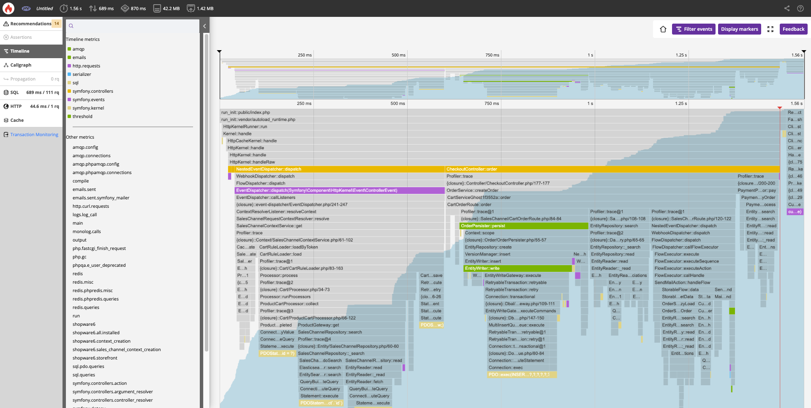

# Shopware PaaS — Composable Frontends (Deep Reference)

Quellen: `products/paas/shopware-paas/composable-frontends/performance.md`,
`products/paas/shopware-paas/composable-frontends/blackfire.md`,
`products/paas/shopware-paas/blackfire.md`

Bild: `assets/blackfire-profile.png`

---

## Problem: Store-API POST-Requests

Shopware nutzt `POST`-Requests für `/store-api/`. POST ist per Design nicht
cachebar — Fastly leitet sie direkt an das Backend-Cluster weiter.

---

## Lösung 1: SwagStoreApiCache Plugin

```bash
composer require shopware-labs/swag-store-api-cache
```

- Plugin: https://github.com/shopwareLabs/SwagStoreApiCache
- Ermöglicht Fastly-Caching für ausgewählte POST `/store-api/`-Routen
- Beinhaltet eigene Fastly-Snippets (statt Standard-Snippets verwenden!)

### Standard-cacheable Routen

Automatisch gecached (definiert in
[StoreAPIResponseListener.php](https://github.com/shopwareLabs/SwagStoreApiCache/blob/trunk/src/Listener/StoreAPIResponseListener.php#L57)).

### Weitere Routen cachen

In Shopware Admin-Config:
`SwagStoreAPICache.config.additionalCacheableRoutes`

### Wichtig: Soft-Purge aktivieren!

```
https://developer.shopware.com/docs/guides/hosting/infrastructure/reverse-http-cache.html#fastly-soft-purge
```

---

## Lösung 2: Frontend-Caching mit Fastly

### Architektur

- Eigener Fastly-Service pro Frontend (oder ein Service mit mehreren Domains/Hosts)
- Frontend-Cache-Invalidierung: Nur Backend-Fastly-Service
- Shopware "kennt" das Frontend nicht → keine automatische Invalidierung

### nuxt.config.ts — ISR-Konfiguration

```ts
routeRules: {
  '/': {
    isr: 60 * 60 * 24,
    headers: {
      'cache-control': 'public, s-maxage=3600, stale-while-revalidate=1800'
    }
  },
  '/**': {
    isr: 60 * 60 * 24,
    headers: {
      'cache-control': 'public, s-maxage=3600, stale-while-revalidate=1800'
    }
  }
}
```

| Parameter | Beschreibung |
|-----------|-------------|
| `isr` | Sekunden bis zur Revalidierung |
| `s-maxage` | Cache-Dauer auf Fastly (Sekunden) |
| `stale-while-revalidate` | Dauer für Stale-Content-Serving (Sekunden) |

---

## CORS-Probleme vermeiden (OPTIONS-Requests)

### Problem

Bei unterschiedlichen Domains für Frontend und Backend: Browser sendet `OPTIONS`
(Preflight) vor jedem API-Request. Standard-Caching: Max. 5 Sekunden.

### Lösung: Proxy über Frontend-Fastly-Service

Frontend und Backend über **eine Domain** — `OPTIONS`-Checks entfallen.

```vcl
# Fastly VCL für Frontend-Service
if (req.url.path ~ "^/store-api/") {
  set req.http.host = "backend.mydomain.com";
  set req.backend = F_Backend__Shopware_instance_;
  return (pass);  # WICHTIG: Kein Cache im Frontend-Service!
}
```

**Wichtig:** `return (pass)` ist zwingend — das Frontend-Fastly-Service darf
Backend-Responses nicht cachen (Invalidierungs-Probleme).
Der Backend-Fastly-Service bleibt für das Caching zuständig.

---

## Cache-Hit-Ratio optimieren

### Problem: sw-cache-hash Cookie

Nach Warenkorbzusatz: `sw-cache-hash`-Cookie wird gesetzt.
Standard-VCL nutzt diesen Cookie im Cache-Key → vorher gecachte Seiten werden
nicht mehr gecacht.

### Lösung (nur ohne Regelbasiertes-Pricing)

Im VCL-Hash-Snippet auskommentieren:

```vcl
# Standard VCL Hash Snippet
# Consider Shopware http cache cookies
#if (req.http.cookie:sw-cache-hash) {
#  set req.hash += req.http.cookie:sw-cache-hash;
#} elseif (req.http.cookie:sw-currency) {
#  set req.hash += req.http.cookie:sw-currency;
#}
```

### Validierung

Developer Tools → `Age`-Header prüfen:
- `Age > 0`: Response aus Cache
- `Age: 0` / kein Age-Header: Cache-Miss

---

## Blackfire (PaaS/Upsun Enterprise)

Blackfire ist in jedem Enterprise-Shopware-PaaS-Projekt **ohne Aufpreis** enthalten.
Alle eingeladenen Benutzer haben Zugriff auf alle Environments.

### Features

| Feature | Beschreibung |
|---------|-------------|
| Monitoring | Live-Metriken (langsame Transaktionen, Background Jobs, Services) |
| Deterministic Profiling | Tiefer Laufzeit-Code-Analyse, Funktionsaufruf-Metriken |
| Continuous Profiling | Kombiniert Profiling + Monitoring mit minimalem Overhead |
| Testing | Performance-Budget-Kontrolle |
| Alerting | Warnungen bei abnormalem Verhalten |
| Recommendations | KI-basierte Empfehlungen |
| CI/CD Integration | Automatisiertes Testen in Pipelines |

### Zugang (Enterprise PaaS)

1. Shopware PaaS Console → Environment-Level → Blackfire-Link
2. Upsun-Authentifizierung (gleiche E-Mail wie PaaS)
3. Falls Erstnutzung: "Reset Password" für Upsun-Passwort nutzen

### Browser-Extensions

- [Firefox Blackfire Extension](https://addons.mozilla.org/en-US/firefox/addon/blackfire/)
- [Chrome Blackfire Extension](https://chromewebstore.google.com/detail/blackfire-profiler/miefikpgahefdbcgoiicnmpbeeomffld?hl=en)

### Onboarding Guide

https://docs.blackfire.io/onboarding/index

---

## Blackfire Continuous Profiling für Nuxt.js

### Setup

```bash
npm install @blackfireio/node-tracing
```

Umgebungsvariable: `BLACKFIRE_ENABLE=1`

### server/plugins/blackfire.ts

```typescript
export default defineNitroPlugin(async () => {
  if (process.env.BLACKFIRE_ENABLE !== '1') return;

  try {
    // ESM-kompatibel: dynamischer Import
    const mod = await import('@blackfireio/node-tracing');
    const Blackfire: any = (mod as any).default || mod;

    Blackfire.start({
      appName:
        process.env.BLACKFIRE_APP_NAME || 'shopware-frontend',
      // Optionale Konfiguration:
      // durationMillis: 45000,
      // cpuProfileRate: 100,
      // labels: { service: 'frontend', framework: 'nuxt3' },
    });

    console.info('[blackfire] node-tracing started');
  } catch (e) {
    console.error('[blackfire] failed to start node-tracing', e);
  }
});
```



---

## Architektur-Zusammenfassung

```
Kunde → Frontend-Fastly (Nuxt ISR Cache)
           ↓ (Cache-Miss oder store-api/*)
       → Backend-Fastly (Shopware HTTP Cache)
           ↓ (Cache-Miss)
       → Shopware App Cluster
           ↓
       → Redis / MySQL / OpenSearch
```
