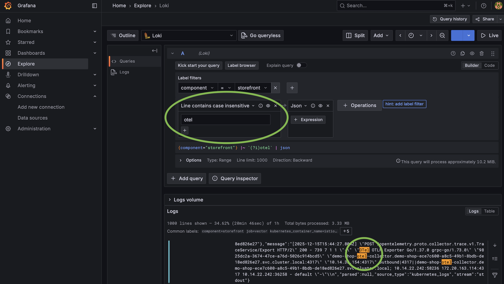

# Shopware PaaS Native — Monitoring

## Logs via CLI

```bash
# Letzte 15 Minuten (Default)
sw-paas application logs

# Live-Stream
sw-paas application logs --follow

# Nach Komponente filtern
sw-paas application logs --component storefront
# Komponenten: admin | command | cronjob | migration | scheduled-task | setup | storefront | worker

# Zeitfenster
sw-paas application logs --time-range 09:00-10:00

# Anzahl Zeilen
sw-paas application logs --limit 500

# Rohe Ausgabe / JSON
sw-paas application logs --raw
sw-paas application logs --output json

# LogQL-Query
sw-paas application logs --query '{job="vector",component="storefront"} |= "error"'

# Deployment-Logs
sw-paas application deploy logs
sw-paas application deploy logs --follow

# Cron-Logs
sw-paas application cronjob logs
sw-paas application cron logs --run-id <run-id>
```

Jeder Befehl gibt am Ende eine **Grafana Explore URL** aus.

## Grafana (Browser)

```bash
sw-paas open grafana
# → URL, Username, Passwort
```

- **Logs**: Explore → Loki → Label `component` setzen
- **Traces**: Explore → Tempo → Service Name: `shopware`
- Dashboard: `Logs Dashboard` (vordefiniert)

Log-Retention: **45 Tage** | Trace-Retention: **14 Tage**

## Events live verfolgen

```bash
sw-paas watch
sw-paas watch --application-ids app1,app2
sw-paas watch --event-types "EVENT_TYPE_DEPLOYMENT_STARTED,EVENT_TYPE_DEPLOYMENT_FINISHED"
sw-paas application deploy get    # Event-History eines Deployments
```

 

## Vertiefung

[references/deep/monitoring.md](references/deep/monitoring.md)
