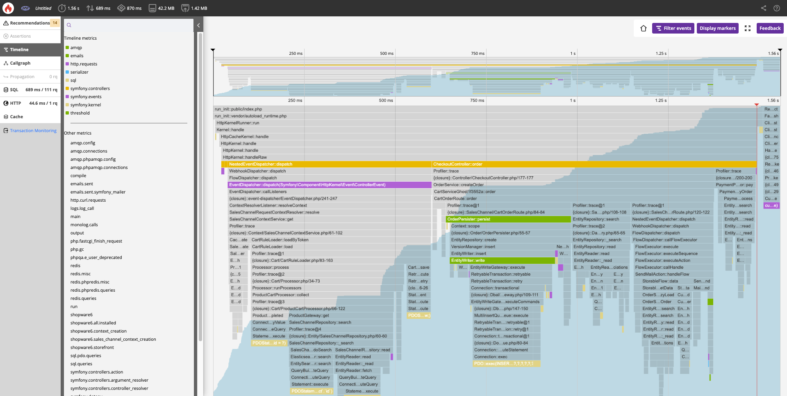

# Shopware PaaS — Composable Frontends (Deep Reference)

Sources: `products/paas/shopware-paas/composable-frontends/performance.md`,
`products/paas/shopware-paas/composable-frontends/blackfire.md`,
`products/paas/shopware-paas/blackfire.md`

Image: `assets/blackfire-profile.png`

---

## Contents

- [Problem: Store API POST requests](#problem-store-api-post-requests)
- [Solution 1: SwagStoreApiCache plugin](#solution-1-swagstoreapicache-plugin)
- [Solution 2: frontend caching with Fastly](#solution-2-frontend-caching-with-fastly)
- [Avoiding CORS problems (OPTIONS requests)](#avoiding-cors-problems-options-requests)
- [Optimizing the cache hit ratio](#optimizing-the-cache-hit-ratio)
- [Blackfire (PaaS/Upsun Enterprise)](#blackfire-paasupsun-enterprise)
- [Blackfire Continuous Profiling for Nuxt.js](#blackfire-continuous-profiling-for-nuxtjs)
- [Architecture summary](#architecture-summary)

## Problem: Store API POST requests

Shopware uses `POST` requests for `/store-api/`. POST is by design not
cacheable — Fastly forwards them straight to the backend cluster.

---

## Solution 1: SwagStoreApiCache plugin

```bash
composer require shopware-labs/swag-store-api-cache
```

- Plugin: https://github.com/shopwareLabs/SwagStoreApiCache
- Enables Fastly caching for selected POST `/store-api/` routes
- Ships its own Fastly snippets (use these instead of the standard snippets!)

### Routes cacheable by default

Cached automatically (defined in
[StoreAPIResponseListener.php](https://github.com/shopwareLabs/SwagStoreApiCache/blob/trunk/src/Listener/StoreAPIResponseListener.php#L57)).

### Caching additional routes

In the Shopware admin config:
`SwagStoreAPICache.config.additionalCacheableRoutes`

### Important: enable soft purge!

```
https://developer.shopware.com/docs/guides/hosting/infrastructure/reverse-http-cache.html#fastly-soft-purge
```

---

## Solution 2: frontend caching with Fastly

### Architecture

- A dedicated Fastly service per frontend (or one service with several domains/hosts)
- Frontend cache invalidation: only the backend Fastly service
- Shopware does not "know" the frontend → no automatic invalidation

### nuxt.config.ts — ISR configuration

```ts
routeRules: {
  '/': {
    isr: 60 * 60 * 24,
    headers: {
      'cache-control': 'public, s-maxage=3600, stale-while-revalidate=1800'
    }
  },
  '/**': {
    isr: 60 * 60 * 24,
    headers: {
      'cache-control': 'public, s-maxage=3600, stale-while-revalidate=1800'
    }
  }
}
```

| Parameter | Description |
|-----------|-------------|
| `isr` | Seconds until revalidation |
| `s-maxage` | Cache duration on Fastly (seconds) |
| `stale-while-revalidate` | Duration for serving stale content (seconds) |

---

## Avoiding CORS problems (OPTIONS requests)

### Problem

With different domains for frontend and backend, the browser sends `OPTIONS`
(preflight) before every API request. Default caching: max. 5 seconds.

### Solution: proxy through the frontend Fastly service

Frontend and backend on **one domain** — the `OPTIONS` checks disappear.

```vcl
# Fastly VCL for the frontend service
if (req.url.path ~ "^/store-api/") {
  set req.http.host = "backend.mydomain.com";
  set req.backend = F_Backend__Shopware_instance_;
  return (pass);  # IMPORTANT: no caching in the frontend service!
}
```

**Important:** `return (pass)` is mandatory — the frontend Fastly service must not
cache backend responses (invalidation problems).
The backend Fastly service remains responsible for caching.

---

## Optimizing the cache hit ratio

### Problem: sw-cache-hash cookie

After adding to the cart, the `sw-cache-hash` cookie is set.
The standard VCL uses this cookie in the cache key → pages cached earlier are
no longer cached.

### Solution (only without rule-based pricing)

Comment it out in the VCL hash snippet:

```vcl
# Standard VCL Hash Snippet
# Consider Shopware http cache cookies
#if (req.http.cookie:sw-cache-hash) {
#  set req.hash += req.http.cookie:sw-cache-hash;
#} elseif (req.http.cookie:sw-currency) {
#  set req.hash += req.http.cookie:sw-currency;
#}
```

### Validation

Developer tools → check the `Age` header:
- `Age > 0`: response from cache
- `Age: 0` / no Age header: cache miss

---

## Blackfire (PaaS/Upsun Enterprise)

Blackfire is included in every Enterprise Shopware PaaS project **at no extra cost**.
All invited users have access to all environments.

### Features

| Feature | Description |
|---------|-------------|
| Monitoring | Live metrics (slow transactions, background jobs, services) |
| Deterministic Profiling | Deep runtime code analysis, function call metrics |
| Continuous Profiling | Combines profiling + monitoring with minimal overhead |
| Testing | Performance budget control |
| Alerting | Warnings on abnormal behavior |
| Recommendations | AI-based recommendations |
| CI/CD Integration | Automated testing in pipelines |

### Access (Enterprise PaaS)

1. Shopware PaaS Console → environment level → Blackfire link
2. Upsun authentication (same email as PaaS)
3. On first use: use "Reset Password" for the Upsun password

### Browser extensions

- [Firefox Blackfire Extension](https://addons.mozilla.org/en-US/firefox/addon/blackfire/)
- [Chrome Blackfire Extension](https://chromewebstore.google.com/detail/blackfire-profiler/miefikpgahefdbcgoiicnmpbeeomffld?hl=en)

### Onboarding guide

https://docs.blackfire.io/onboarding/index

---

## Blackfire Continuous Profiling for Nuxt.js

### Setup

```bash
npm install @blackfireio/node-tracing
```

Environment variable: `BLACKFIRE_ENABLE=1`

### server/plugins/blackfire.ts

```typescript
export default defineNitroPlugin(async () => {
  if (process.env.BLACKFIRE_ENABLE !== '1') return;

  try {
    // ESM-compatible: dynamic import
    const mod = await import('@blackfireio/node-tracing');
    const Blackfire: any = (mod as any).default || mod;

    Blackfire.start({
      appName:
        process.env.BLACKFIRE_APP_NAME || 'shopware-frontend',
      // Optional configuration:
      // durationMillis: 45000,
      // cpuProfileRate: 100,
      // labels: { service: 'frontend', framework: 'nuxt3' },
    });

    console.info('[blackfire] node-tracing started');
  } catch (e) {
    console.error('[blackfire] failed to start node-tracing', e);
  }
});
```



---

## Architecture summary

```
Customer → Frontend Fastly (Nuxt ISR cache)
           ↓ (cache miss or store-api/*)
       → Backend Fastly (Shopware HTTP cache)
           ↓ (cache miss)
       → Shopware app cluster
           ↓
       → Redis / MySQL / OpenSearch
```
