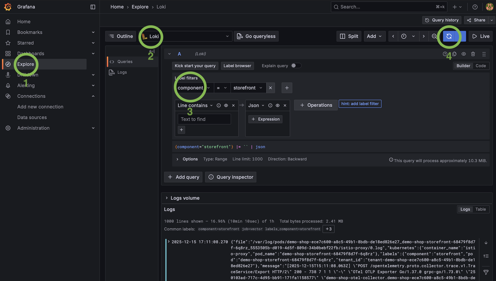
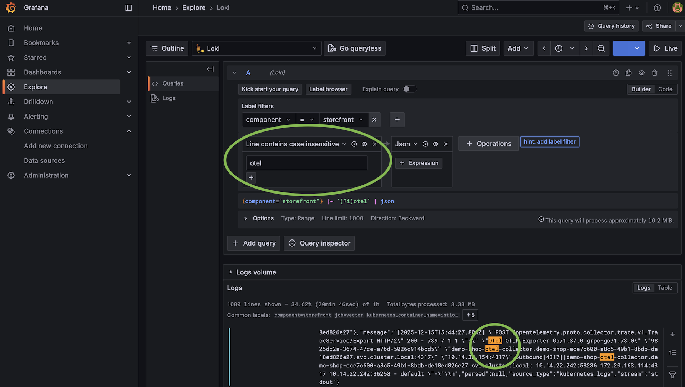

# Shopware PaaS Native — Monitoring

## Logs via CLI

```bash
# Last 15 minutes (default)
sw-paas application logs

# Live stream
sw-paas application logs --follow

# Filter by component
sw-paas application logs --component storefront
# Components: admin | command | cronjob | migration | scheduled-task | setup | storefront | worker

# Time window
sw-paas application logs --time-range 09:00-10:00

# Number of lines
sw-paas application logs --limit 500

# Raw output / JSON
sw-paas application logs --raw
sw-paas application logs --output json

# LogQL query
sw-paas application logs --query '{job="vector",component="storefront"} |= "error"'

# Deployment logs
sw-paas application deploy logs
sw-paas application deploy logs --follow

# Cron logs
sw-paas application cronjob logs
sw-paas application cron logs --run-id <run-id>
```

Every command prints a **Grafana Explore URL** at the end.

## Grafana (browser)

```bash
sw-paas open grafana
# → URL, username, password
```

- **Logs**: Explore → Loki → set the `component` label
- **Traces**: Explore → Tempo → service name: `shopware`
- Dashboard: `Logs Dashboard` (predefined)

Log retention: **45 days** | Trace retention: **14 days**

## Following events live

```bash
sw-paas watch
sw-paas watch --application-ids app1,app2
sw-paas watch --event-types "EVENT_TYPE_DEPLOYMENT_STARTED,EVENT_TYPE_DEPLOYMENT_FINISHED"
sw-paas application deploy get    # event history of a deployment
```

 

## Deep dive

[MONITORING-DETAIL.md](MONITORING-DETAIL.md)
