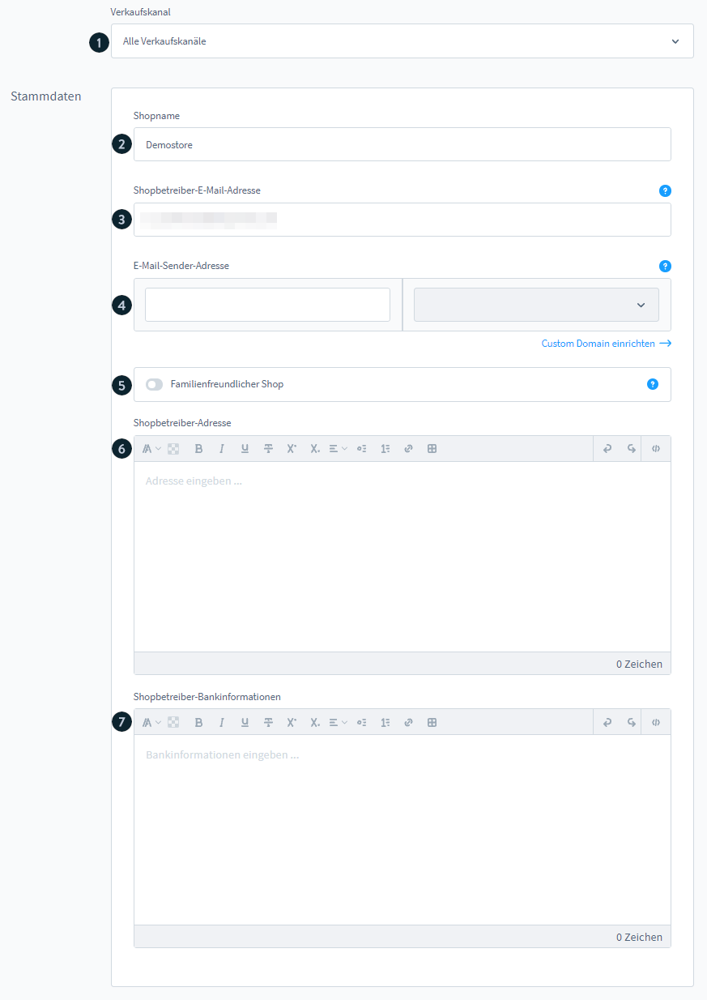
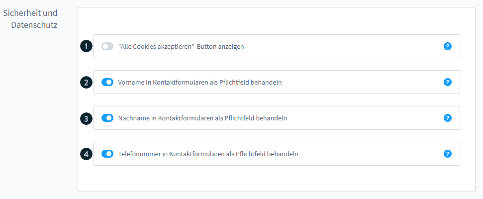
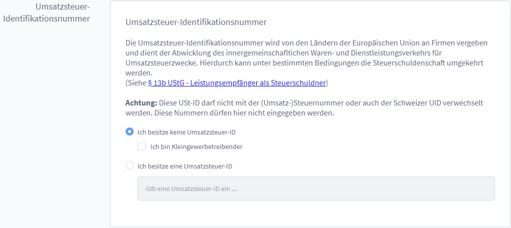
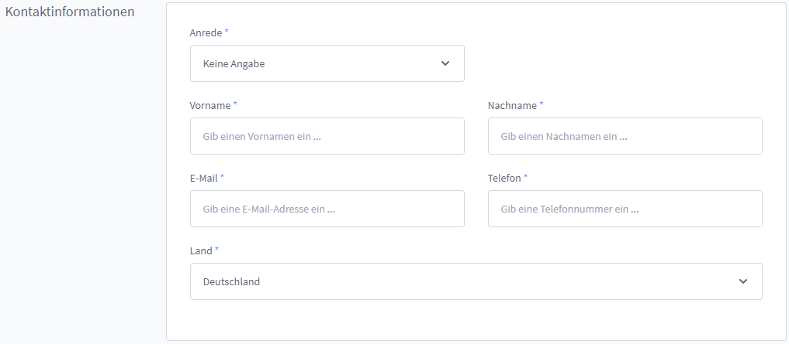
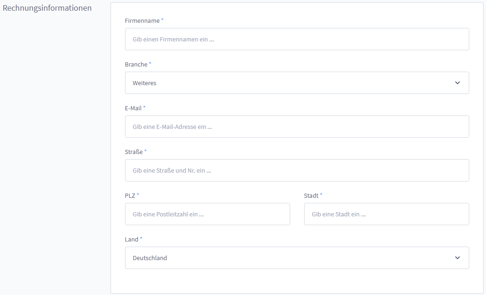

# Shopware SaaS — Stammdaten & Firmendaten

**Quellen**: 
- https://docs.shopware.com/de/shopware-6-de/saas/stammdaten
- https://docs.shopware.com/de/shopware-6-de/saas/firma

---

## Stammdaten

**Pfad:** Einstellungen > Shop > Stammdaten

Konfigurierbar global oder individuell je Verkaufskanal:

| Feld | Beschreibung |
|---|---|
| **Verkaufskanal-Auswahl** | Global oder je Kanal |
| **Shopname** | Name des Shops |
| **Shopbetreiber-E-Mail** | Betreiber-Kontakt |
| **E-Mail-Sender-Adresse** | Erfordert Custom Domain |
| **Familienfreundlicher Shop** | Setzt Meta-Tag `isFamilyFriendly` |
| **Shopbetreiber-Adresse** | Adressdaten |
| **Shopbetreiber-Bankinformationen** | Bankdaten |

---

## Shopseiten konfigurieren

Layouts für gesetzliche und informative Seiten:

| Seitentyp | Zweck |
|---|---|
| AGB-Seiten | Allgemeine Geschäftsbedingungen |
| Widerrufsbelehrungen | Rechtliches Widerrufsrecht |
| Versand- und Zahlungsarten | Informationsseiten |
| Datenschutz-Seiten | DSGVO-konforme Texte |
| Impressum | Pflichtangaben |
| 404-Fehlerseiten | Fehlerseitengestaltung |
| Wartungsseiten | Wartungsmodus-Seite |
| Kontaktseiten | Kontaktformular-Seite |
| Newsletterseiten | Newsletter-Anmeldeseite |

> Layouts werden über **Erlebniswelten** (Inhalte > Erlebniswelten) erstellt.

---

## Sicherheit und Datenschutz

Aktivierbare Optionen:

| Option | Funktion |
|---|---|
| „Alle Cookies akzeptieren"-Button | Cookie-Banner anpassen |
| Vorname als Pflichtfeld | Kontaktformular |
| Nachname als Pflichtfeld | Kontaktformular |
| Telefonnummer als Pflichtfeld | Kontaktformular |

---

## Firmendaten (für Shopware AG)

**Pfad:** Einstellungen > Account > Firma

> **Wichtig:** Diese Daten dienen **nicht** der Kundenkommunikation, sondern der Abrechnung mit Shopware AG.
> Für Kundendokumente: Einstellungen > Shop > Dokumente

### 1. Umsatzsteuer-Identifikationsnummer

- Feld zur Eingabe der USt-ID
- Option: Kleingewerbetreibender kennzeichnen

### 2. Kontaktinformationen

- Für Kontaktaufnahme durch Shopware AG

### 3. Rechnungsinformationen

- Werden bei der Rechnungsstellung für SaaS-Kosten genutzt
- Bei Shopware-Account-Verknüpfung: Manche Felder nicht direkt änderbar

---

*Quelle: https://docs.shopware.com/de/shopware-6-de/saas/stammdaten | https://docs.shopware.com/de/shopware-6-de/saas/firma*
