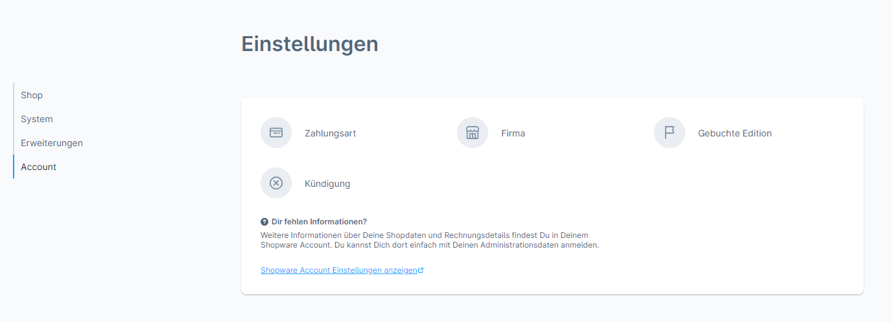
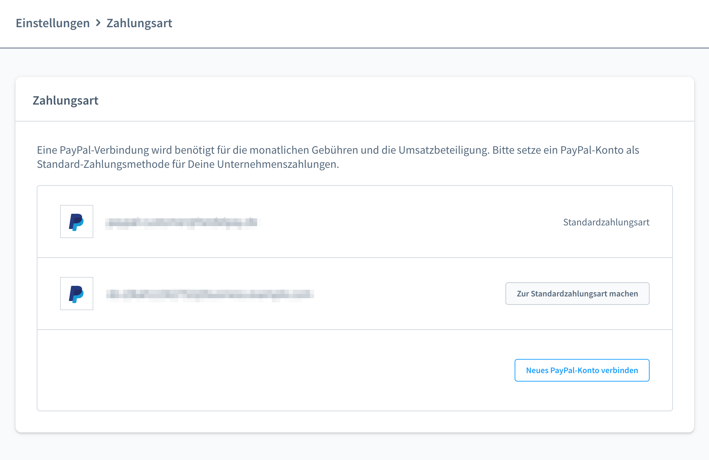
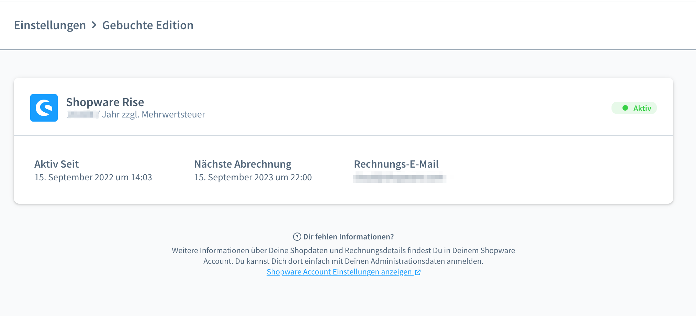
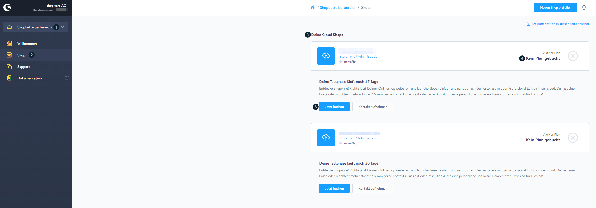
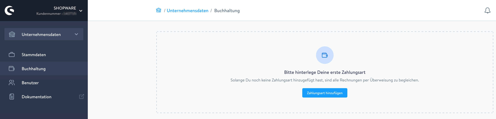
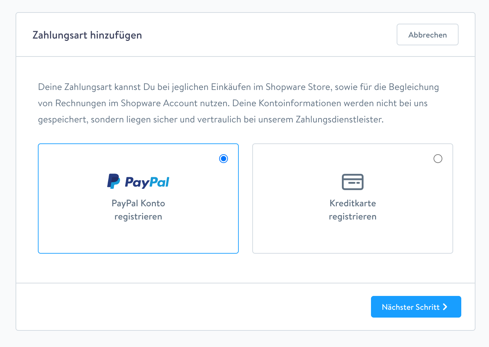

# Shopware SaaS — Pläne buchen

**Quelle**: https://docs.shopware.com/de/shopware-6-de/saas/plaene

---

## Verfügbare Pläne

- **Rise**
- **Evolve**
- **Beyond**

Funktionsvergleich: `https://www.shopware.com/de/preise/`

---

## Voraussetzungen vor der Buchung

### 1. Firmendaten im Account-Bereich
- **Pfad:** Einstellungen > Account > Firma
- Allgemeine Kontaktinformationen und Rechnungsdaten eintragen
- Detaildoku: `/de/shopware-6-de/cloud/firma`

### 2. PayPal in der Administration
- **Pfad:** Einstellungen > Account > Zahlungsart
- Button **„Neues PayPal Konto verbinden"** anklicken
- Verifizierung: Einmalige Abbuchung von **0,01 €** (wird auf Shopware-Konto gutgeschrieben)
- Zukünftige Abrechnungen berücksichtigen zunächst den Kontostand

---

## Plan buchen — In der Administration

**Pfad:** Einstellungen > Account > Gebuchte Editionen

Angezeigte Informationen:
- Gebuchte Edition (Rise, Evolve oder Beyond)
- Aktivierungsdatum
- Nächstes Abrechnungsdatum
- E-Mail-Adresse für Rechnungen

Rechnungsinformationen werden automatisch aus dem Shopware-Account abgerufen (wenn Shop dort erstellt wurde).
Verifizierung/Anpassung: Einstellungen > Account > Firma

---

## Plan buchen — Im Shopware-Account (extern)

**Navigation:**
```
Shopbetreiberbereich (1)
└─ Shops (2)
   └─ Auflistung SaaS-Umgebungen (3)
```

| Element | Funktion |
|---|---|
| (4) Status-Anzeige | Zeigt aktuelle Buchung |
| (5) „Jetzt buchen"-Button | Öffnet Plan-Auswahl |
| (6) „Neuen Shop erstellen"-Button | Startet Shop-Erstellung |

**Plan-Buchung:**
- Pop-Up mit Kontaktoptionen erscheint
- Telefonisch: `02555 / 928850`
- E-Mail: `customer@shopware.com`

**PayPal im Account:**
- Buchhaltung > „Zahlungsart hinzufügen" > „PayPal Konto registrieren"

---

## Screenshots













---

*Quelle: https://docs.shopware.com/de/shopware-6-de/saas/plaene*
