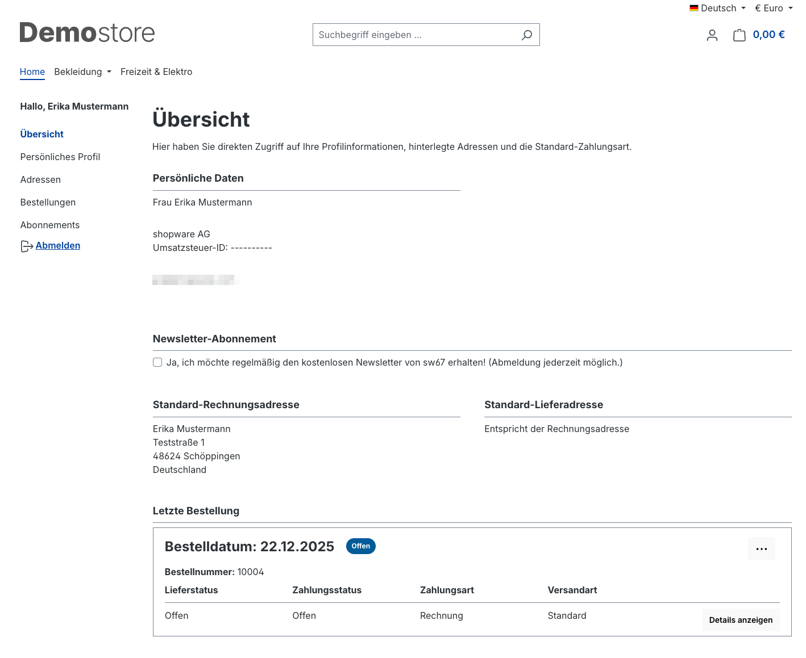
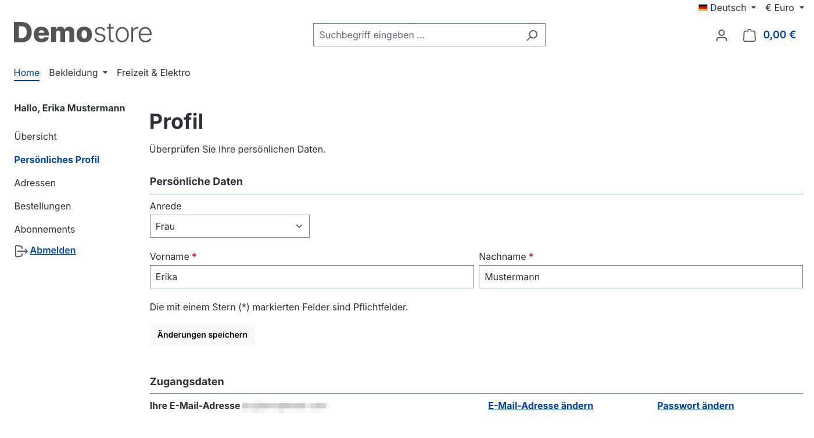
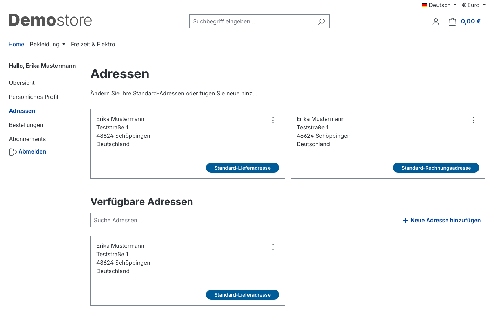
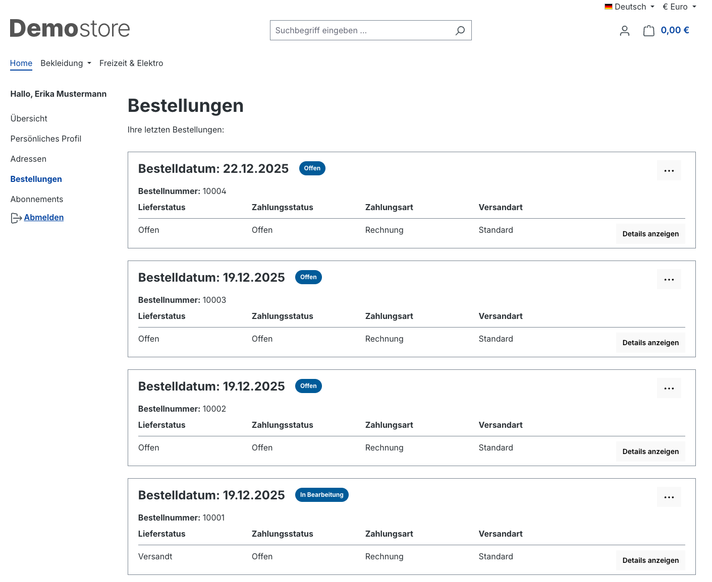
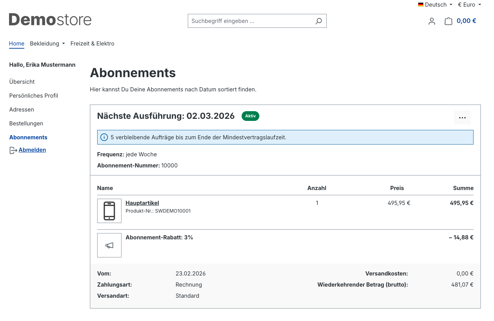

# Shopware 6 – Kundenaccount: Vollständige Referenz

> Quelle: https://docs.shopware.com/de/shopware-6-de/kunden/kundenaccount  
> Dokumentierte Version: 6.7.0.0+

---

## 1. Übersicht (Account-Dashboard)

Dashboard-ähnliche Ansicht mit schnellem Überblick über:
- Aktuelle Bestellungen und deren Status
- Gespeicherte Adressen
- Newsletter-Anmeldestatus

Kunden können sich hier direkt für den **Newsletter anmelden**.

---

## 2. Persönliches Profil

Im Profil-Bereich können Kunden ihre **Zugangsdaten** anpassen:
- **E-Mail-Adresse** ändern
- **Passwort** ändern

Beide Änderungen erfordern das aktuelle Passwort zur Bestätigung.

---

## 3. Adressen

Kunden verwalten gespeicherte Adressen vollständig selbst:

| Aktion | Beschreibung |
|--------|-------------|
| Neue Adresse hinzufügen | Formular mit allen Adressfeldern |
| Adresse bearbeiten | Bestehende Einträge ändern |
| Adresse löschen | Nicht mehr benötigte Adressen entfernen |
| Als Standard-Lieferadresse | Primäre Lieferadresse festlegen |
| Als Standard-Rechnungsadresse | Primäre Rechnungsadresse festlegen |

---

## 4. Bestellungen

Kunden sehen alle getätigten Bestellungen mit:
- Bestellnummer
- Bestellbetrag
- Aktueller Bearbeitungsstand / Status
- Bestelldatum

**Drei-Punkte-Menü** pro Bestellung bietet:
- **Bestellung wiederholen**: Alle Artikel erneut in den Warenkorb legen
- **Zahlungsstatus ändern**: Kunden können (je nach Konfiguration) den Zahlungsweg wechseln

---

## 5. Abonnements (ab v6.5.4.0, Plan Beyond)

Ermöglicht **wiederkehrende Bestellungen** mit konfigurierbaren Intervallen.

- Übersicht aller aktiven Abonnements
- Konfiguration von Bestellintervall und Laufzeit
- Pausieren / Kündigen von Abonnements

> Voraussetzung: Shopware Beyond Plan + Feature aktiv in den Einstellungen  
> Weitere Details: `/de/shopware-6-de/einstellungen/abonnements`

---

## 6. Passwort zurücksetzen

### Ablauf für Kunden

1. Auf der Login-Seite: **„Ich habe mein Passwort vergessen"** klicken
2. E-Mail-Adresse des Kontos eingeben
3. System sendet E-Mail mit Wiederherstellungslink
4. Link anklicken → neues Passwort vergeben

### Sicherheitsregeln

| Regel | Detail |
|-------|--------|
| **Gültigkeitsdauer des Links** | **2 Stunden** |
| **Verwendbarkeit des Links** | **Einmalig** (wird nach Nutzung ungültig) |
| **Rate Limiting** | Schutz gegen Missbrauch (konfigurierbar via `user_recovery`) |

### Wichtige Hinweise

- Falls die E-Mail nicht ankommt: **Spam-Ordner** prüfen
- Abgelaufener Link: Prozess muss **neu gestartet** werden
- Nicht verwendete Links werden nach 2 Stunden automatisch ungültig

### Technische Konfiguration (Admin / Entwickler)

Das Rate Limiting für Passwort-Reset-Anfragen ist über den Parameter `user_recovery` konfigurierbar.  
Standardmäßig schützt das System vor zu vielen Anfragen von derselben IP/E-Mail.

---

## Versionsmatrix

| Feature | Mindestversion | Plan |
|---------|---------------|------|
| Account-Grundfunktionen | 6.0.0 | alle |
| Bestellung wiederholen | 6.0.0 | alle |
| Zahlungsstatus ändern | 6.0.0 | alle |
| Abonnements | 6.5.4.0 | Beyond |
| Aktuelle Doku-Version | 6.7.0.0 | – |
