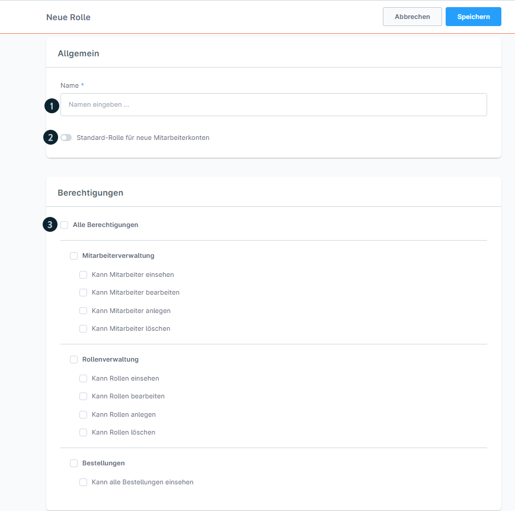

# Shopware 6 – B2B / Firmenkonten: Vollständige Referenz

> Quelle: https://docs.shopware.com/de/shopware-6-de/kunden/uebersicht (Tab Unternehmen)  
> Dokumentierte Version: 6.5.6.0+  
> Voraussetzung: **Shopware Evolve Plan**

---

## 1. Überblick

Der **„Unternehmen"-Tab** in der Kundendetailansicht ermöglicht die vollständige B2B-Verwaltung eines Firmenkontos direkt im Admin. Features:

- **Mitarbeiterverwaltung**: Mehrere Benutzer pro Unternehmen
- **Rollenverwaltung**: Berechtigungen für Mitarbeiter definieren

---

## 2. Mitarbeiterverwaltung

### Mitarbeiter einladen

1. `Kunden` → Firmenkunden-Detailansicht → Tab **„Unternehmen"**
2. Button **„Konto hinzufügen (1)"** klicken
3. Formular ausfüllen:

| Feld | Pflicht | Beschreibung |
|------|---------|-------------|
| Vorname | Ja | Vorname des Mitarbeiters |
| Nachname | Ja | Nachname des Mitarbeiters |
| E-Mail | Ja | Login-E-Mail für den Mitarbeiter |
| Rolle | Nein | Optionale Rollenzuweisung |

4. Einladung absenden → Mitarbeiter erhält E-Mail mit Aktivierungslink

### Einladungs-Details

| Parameter | Wert |
|-----------|------|
| **Gültigkeitsdauer** | **2 Stunden** |
| **Status nach Versand** | Anzeige in der Mitarbeiterliste |
| **Neu einladen** | Möglich falls Link abgelaufen |

### Mitarbeiter deaktivieren

1. Kontextmenü (⋮) des Mitarbeiters öffnen
2. **„Deaktivieren"** wählen
3. Mitarbeiter kann sich nicht mehr einloggen (Konto bleibt erhalten)

### Mitarbeiter-Statusübersicht

| Status | Bedeutung |
|--------|-----------|
| Ausstehend | Einladung verschickt, noch nicht akzeptiert |
| Aktiv | Mitarbeiter hat Account aktiviert |
| Inaktiv | Vom Admin deaktiviert |

---

## 3. Rollenverwaltung

### Rolle anlegen

1. Tab **„Unternehmen"** → Bereich **„Rollen"**
2. Button **„Rolle hinzufügen (2)"** klicken
3. Formular ausfüllen:

| Feld | Pflicht | Beschreibung |
|------|---------|-------------|
| Name (1) | Ja | Bezeichnung der Rolle (z.B. „Einkäufer", „Manager") |
| Standard-Rolle (2) | Nein | Diese Rolle automatisch neuen Mitarbeitern zuweisen |
| Berechtigungen (3) | Nein | Zugriffsrechte konfigurieren |

### Verfügbare Berechtigungen

| Berechtigung | Beschreibung |
|-------------|-------------|
| **Mitarbeiterverwaltung** | Mitarbeiter einladen, bearbeiten, deaktivieren |
| **Rollenverwaltung** | Rollen anlegen, bearbeiten, zuweisen |
| **Bestellungen** | Bestellungen einsehen und verwalten |

---

## 4. Frontend-Ansicht (Storefront)

Firmenkonten-Mitarbeiter können die B2B-Verwaltung auch **direkt im Storefront** nutzen:

**Zugriff:** `Konto-Icon (1)` im Storefront-Header

Verfügbare Bereiche (identisch mit Admin):
- **Mitarbeiterverwaltung (2)**: Mitarbeiter einladen und verwalten
- **Rollenverwaltung (3)**: Rollen anlegen und Berechtigungen vergeben

Die Konfiguration ist vollständig identisch zur Admin-Oberfläche.

---

## 5. B2B-Features im Überblick (Evolve Plan)

Weitere B2B-Funktionen, die über Kundengruppen aktiviert werden:

| Feature | Konfiguration | Beschreibung |
|---------|--------------|-------------|
| **Schnellbestellungen** | Kunden-Detailansicht → Option aktivieren | CSV-Upload + Produktnummernsuche |
| **Angebotsmanagement** | Kundengruppe → B2B-Options | Angebote erstellen/annehmen |
| **Bestellgenehmigung** | Kundengruppe → B2B-Options | Bestellungen vor Ausführung freigeben |

---

## 6. Versionsmatrix

| Feature | Mindestversion | Plan |
|---------|---------------|------|
| Unternehmen-Tab (Basis) | 6.5.6.0 | Evolve |
| Mitarbeiterverwaltung | 6.5.6.0 | Evolve |
| Rollenverwaltung | 6.5.6.0 | Evolve |
| Schnellbestellungen | 6.5.4.0 | Evolve |
| Angebotsmanagement | 6.5.6.0 | Evolve |
