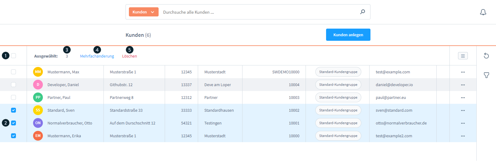
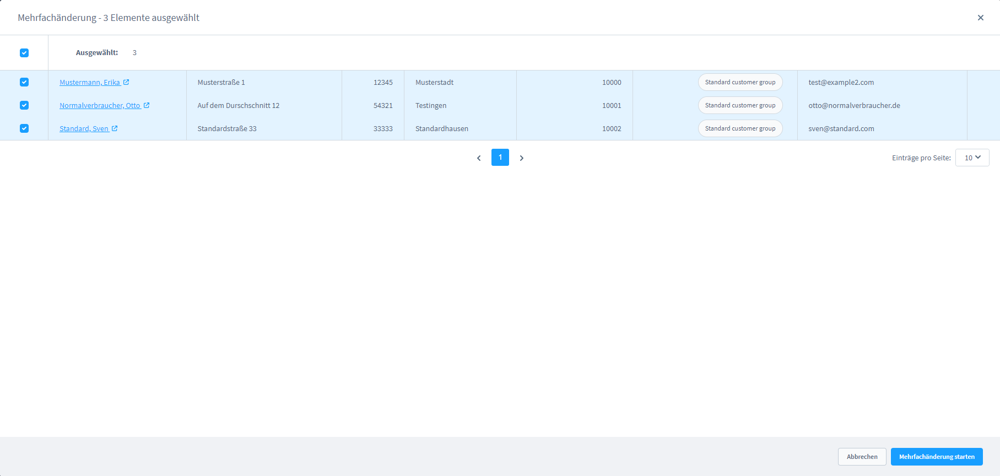
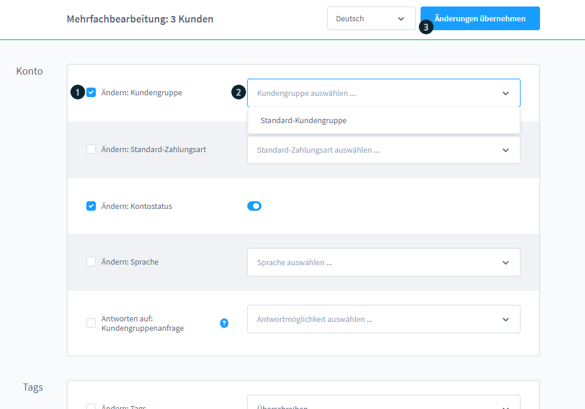
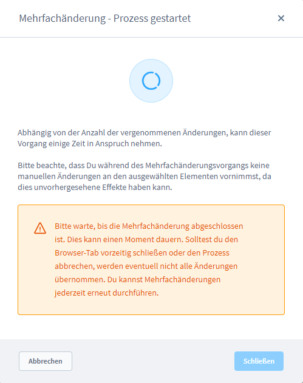
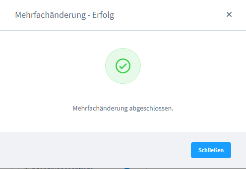
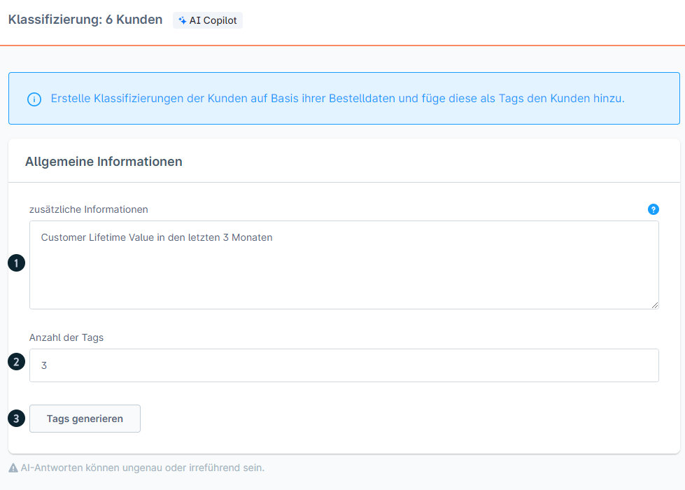
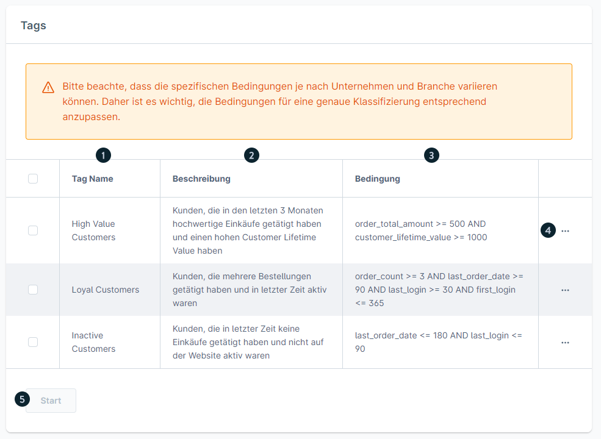

# Shopware 6 – Mehrfachänderung & AI-Klassifizierung: Vollständige Referenz

> Quelle: https://docs.shopware.com/de/shopware-6-de/kunden/uebersicht  
> Dokumentierte Version: 6.7.0.0+

---

## 1. Mehrfachänderung

Ermöglicht das gleichzeitige Bearbeiten oder Löschen von bis zu **1.000 Kunden**.

### 1.1 Kunden auswählen

| Element | Funktion |
|---------|----------|
| (1) | **Alle Kunden auf Seite** auswählen (Checkbox im Header) |
| (2) | **Einzelne Kunden** auswählen |
| — | Auswahl funktioniert **seitenübergreifend** |
| — | **Maximum: 1.000 Datensätze** |
| (3) | Anzeige der **Anzahl ausgewählter Kunden** |
| (4) | Button **„Mehrfachänderung"** → Bearbeitungsmodus |
| (5) | Button **„Löschen"** → Alle ausgewählten Kunden löschen |

### 1.2 Mehrfachänderung starten

1. Button **„Mehrfachänderung (4)"** klicken
2. Pop-Up öffnet sich mit Liste der ausgewählten Kunden
3. Einzelne Kunden können aus der Liste entfernt werden (ohne sie zu löschen)
4. **„Mehrfachänderung starten"** klicken

### 1.3 Felder auswählen und Werte eingeben

| Element | Funktion |
|---------|----------|
| Checkbox (1) | Feld für Änderung **aktivieren** |
| Werte (2) | Neue Werte eingeben |
| „Änderungen übernehmen" (3) | Änderungen für alle ausgewählten Kunden übernehmen |

### 1.4 Dropdown-Operatoren

Bei bestimmten Feldern (z.B. Tags, Kundengruppen) steht ein **Operator-Dropdown** zur Verfügung:

| Operator | Wirkung |
|----------|---------|
| **Überschreiben** | Ersetzt alle vorherigen Informationen des Feldes vollständig |
| **Leeren** | Entfernt alle Einstellungen des Blocks (Feld wird geleert) |
| **Hinzufügen** | Ergänzt neue Einstellungen, bestehende Werte bleiben erhalten |
| **Entfernen** | Löscht spezifische Einstellungen (nur die eingegebenen Werte) |

### 1.5 Änderungen anwenden und Abschluss

1. **Bestätigungs-Pop-Up** zeigt Anzahl der betroffenen Kunden
2. **„Änderungen anwenden"** klicken
3. System verarbeitet die Änderungen (Ladebalken)
4. **Benachrichtigung** bei Fertigstellung erscheint
5. **„Schließen"** → zurück zur Kundenübersicht

---

## 2. AI-generierte Kunden-Klassifizierung

> Voraussetzung: **Shopware Rise Plan**

Automatische KI-gestützte Klassifizierung der Kunden. Ergebnisse werden als **Tags** gespeichert und können für weitere Shopware-Funktionen (z.B. Rule Builder, Marketing) genutzt werden.

### 2.1 Schritt 1 – Kunden auswählen und Klassifizierung starten

1. Kunden in der Übersicht auswählen
2. Button **„Klassifizieren (1)"** klicken
3. Konfigurations-Fenster öffnet sich

### 2.2 Schritt 2 – Klassifizierung konfigurieren

| Element | Pflicht | Beschreibung |
|---------|---------|-------------|
| **Zusätzliche Informationen (1)** | Nein | Kontext für die KI: Klassifizierungszweck, Marketing-Kampagne, Auswertungsgrund. Leer lassen = KI verwendet nur Kundendaten |
| **Anzahl Tags (2)** | Ja | Gewünschte Anzahl der zu generierenden Klassifizierungen |
| **„Tags generieren" (3)** | — | Startet den KI-Prozess |

### 2.3 Schritt 3 – Review und Anpassung

Die KI generiert Tags, die folgende Informationen enthalten:

| Element | Beschreibung |
|---------|-------------|
| **Name (1)** | Kurzbezeichnung des Tags (z.B. „Stammkunde", „Großbesteller") |
| **Beschreibung (2)** | Erklärung welche Kundengruppe dieser Tag beschreibt |
| **Bedingung (3)** | Detaillierte Kriterien, nach denen der Tag vergeben wird |
| **Kontextmenü (4)** | Manuelle Anpassung des Tags möglich |

### 2.4 Schritt 4 – Tags zuweisen

1. Gewünschte Tags auswählen
2. Button **„Start (5)"** klicken
3. KI vergibt Tags an Kunden, die den jeweiligen Bedingungen entsprechen

> **Hinweis:** Nicht jeder initially ausgewählte Kunde erhält zwingend alle Tags.  
> Die KI vergibt Tags nur, wenn die Bedingungen für den jeweiligen Kunden zutreffen.

### 2.5 Wichtige Warnung

> **Achtung:** Eine erneute Klassifizierung entfernt **ALLE** vorherigen KI-generierten Tags  
> und **löscht** diese dauerhaft. Nicht mehr umkehrbar.

---

## 3. Versionsmatrix

| Feature | Mindestversion | Plan |
|---------|---------------|------|
| Mehrfachänderung | 6.0.0 | alle |
| Mehrfachänderung Max. 1.000 Datensätze | 6.0.0 | alle |
| AI-Klassifizierung | beliebig | Rise |
