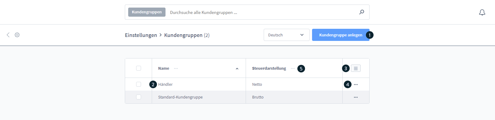
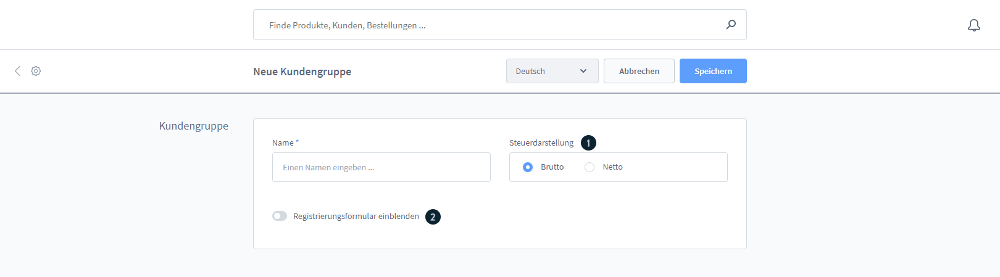
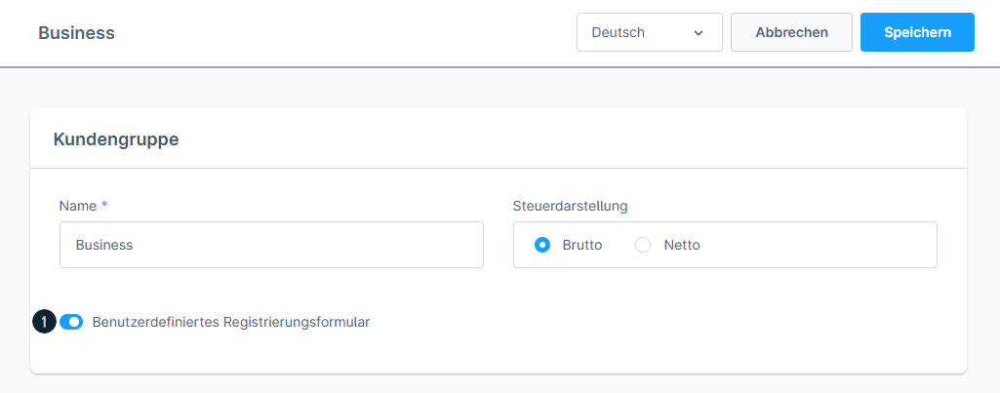
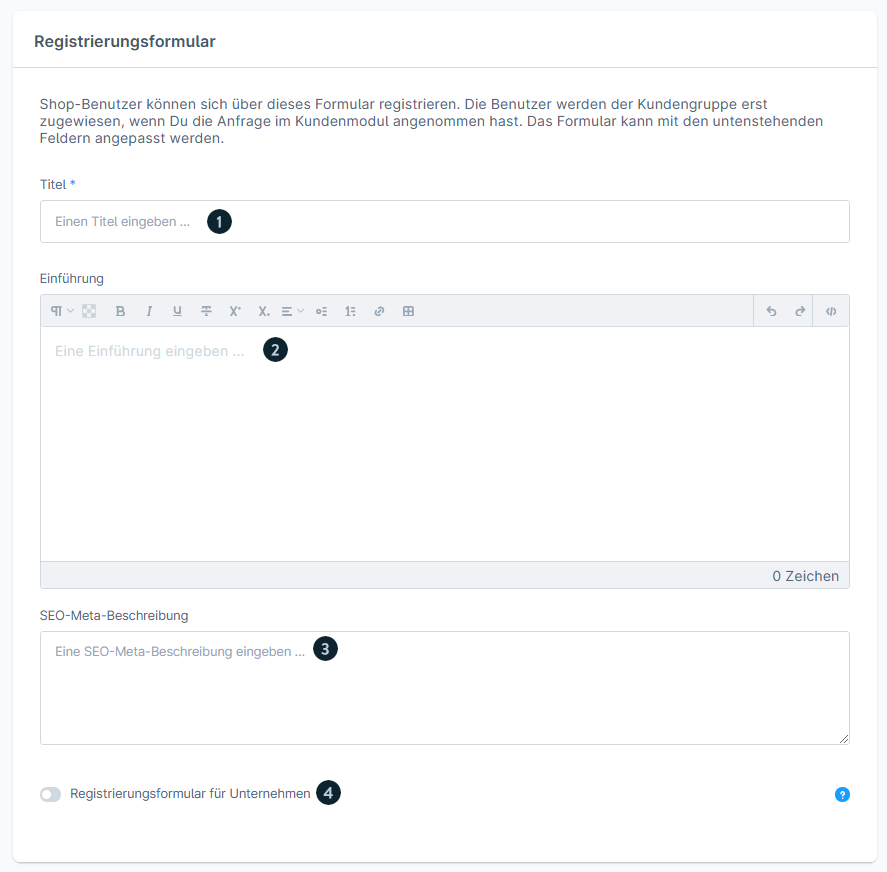
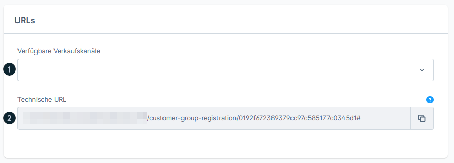
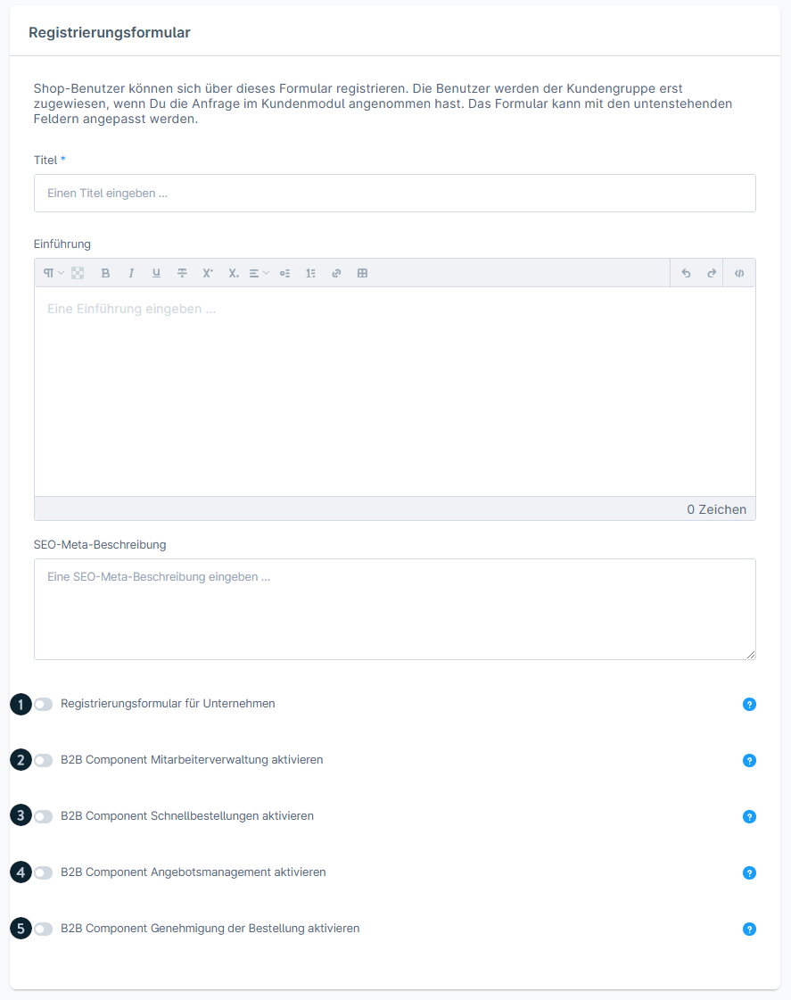
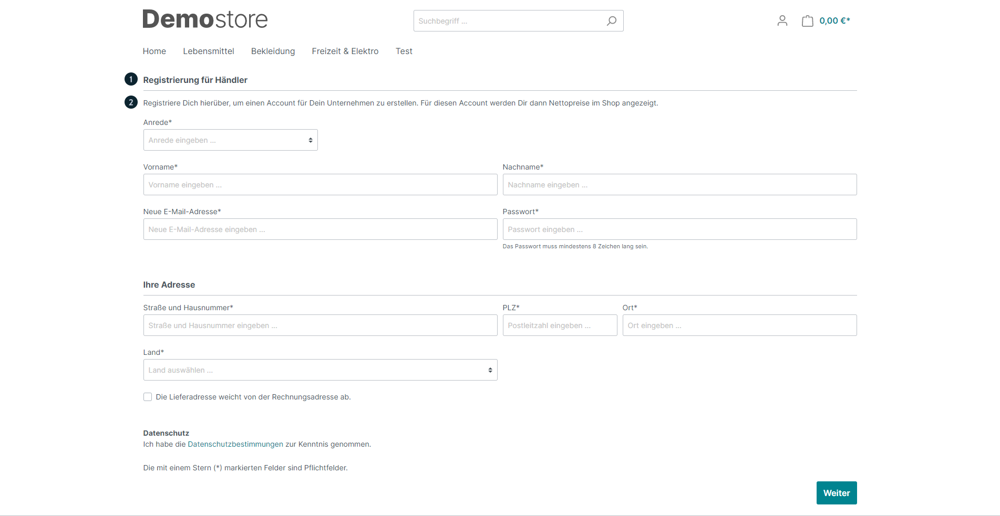
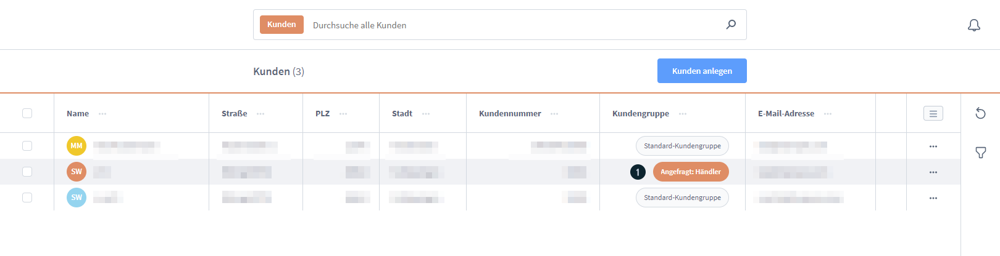
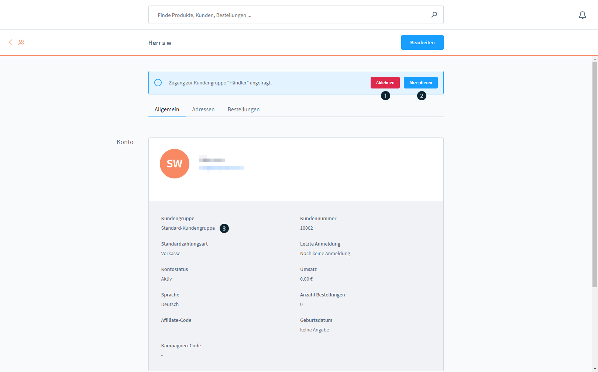

# Shopware 6 – Kundengruppen: Vollständige Referenz

> Quelle: https://docs.shopware.com/de/shopware-6-de/einstellungen/kundengruppen  
> Dokumentierte Version: 6.5.6.0+

---

## 1. Was sind Kundengruppen?

Kundengruppen ermöglichen es, **Preisdarstellung (Brutto/Netto)** und **Zugang** zu Verkaufskanälen zu steuern. Kunden werden einer Kundengruppe zugeordnet und sehen entsprechend ihrer Gruppe die konfigurierten Preise.

> **Kritischer Hinweis:** Die **Standard-Kundengruppe** dient als Fallback für alle Verkaufskanäle.  
> **Deren Löschung macht das Frontend unzugänglich!** Niemals löschen.

---

## 2. Kundengruppen-Übersicht

Zugriff: `Einstellungen` → `Kundengruppen`

Verfügbare Aktionen:
- **„Kundengruppe anlegen"**: Neue Gruppe erstellen
- Bestehende Gruppen über Namensklick oder Kontextmenü bearbeiten
- Listeneinstellungen zur Spaltenanpassung
- Kompaktmodus verfügbar

---

## 3. Neue Kundengruppe erstellen

### Grundeinstellungen

| Feld | Beschreibung |
|------|-------------|
| **Name** | Bezeichnung der Kundengruppe (z.B. „Händler", „Endkunde") |
| **Steuerdarstellung** | `Brutto`: Preise inkl. MwSt. · `Netto`: Preise exkl. MwSt. |

### Erweitertes Registrierungsformular (optional)

Aktiviert ein **benutzerdefiniertes Registrierungsformular** für diese Kundengruppe.

**Konfigurierbare Felder:**

| Element | Beschreibung |
|---------|-------------|
| **Titel** | Überschrift des Formulars |
| **Einführungstext** | Optionaler Begrüßungstext |
| **SEO-Meta-Beschreibung** | Für Suchmaschinenoptimierung |
| **Unternehmensregistrierung** | Checkbox: Formular für Firmen-Registrierung |
| **Verkaufskanal-Zuordnung** | Welche Verkaufskanäle dieses Formular anzeigen |

**Technische URLs:**

URLs werden automatisch generiert für die direkte Verlinkung auf das Registrierungsformular.

---

## 4. B2B-Components (Evolve Plan)

Bei aktiviertem **Shopware Evolve Plan** können pro Kundengruppe B2B-Features aktiviert werden:

| Feature | Beschreibung |
|---------|-------------|
| **Mitarbeiterverwaltung** | Mehrere Benutzer pro Firmenkonto |
| **Schnellbestellungen** | CSV-Upload und Produktnummer-Schnellsuche |
| **Angebotsmanagement** | Angebote erstellen und verwalten |
| **Genehmigung von Bestellungen** | Bestellungen vor Ausführung freigeben lassen |

---

## 5. Storefront-Registrierungsformular

Kunden, die sich über ein erweitertes Registrierungsformular anmelden, müssen zunächst **freigeschaltet** werden.

---

## 6. Kunden nach Registrierung verwalten

### Kundenliste mit Status

Nach der Registrierung erscheinen neue Kunden in der Kundenliste mit Status **„Ausstehend"**.

### Kunden annehmen oder ablehnen

In der **Kundendetailansicht** stehen die Optionen zur Verfügung:

| Aktion | Ergebnis |
|--------|---------|
| **Akzeptieren** | Kunde wird in die Kundengruppe aufgenommen + automatische E-Mail-Benachrichtigung |
| **Ablehnen** | Registrierung wird verweigert + E-Mail über entsprechende Vorlage |

---

## 7. Kundengruppe einem Kunden zuweisen

Im **Bearbeitungsmodus** eines Kunden:  
Tab „Allgemein" → Feld **„Kundengruppe"** → Gewünschte Gruppe auswählen.

Alternativ bei der **Neuanlage** eines Kunden:  
Formular „Kunden anlegen" → Feld **„Kundengruppe (1)"**.

---

## 8. Versionsmatrix

| Feature | Mindestversion | Plan |
|---------|---------------|------|
| Kundengruppen Grundfunktion | 6.0.0 | alle |
| Erweitertes Registrierungsformular | 6.3.1.0 | alle |
| B2B-Components in Kundengruppen | 6.5.6.0 | Evolve |
| Aktuelle Doku-Version | 6.5.6.0+ | – |
