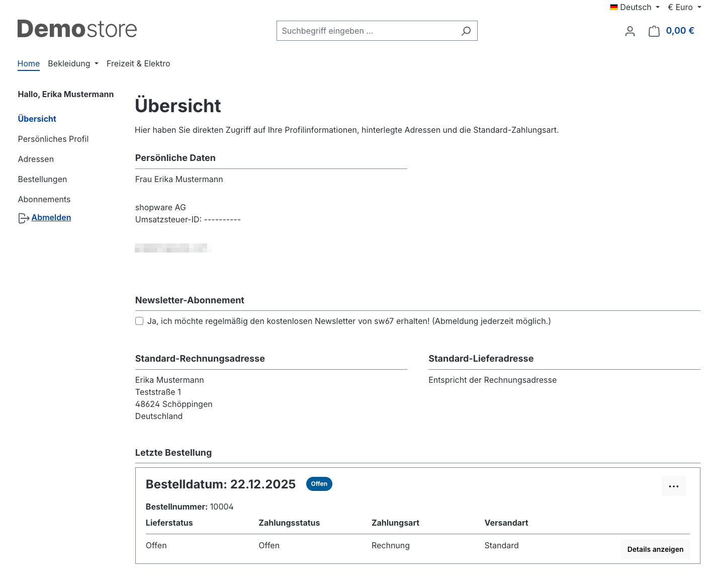
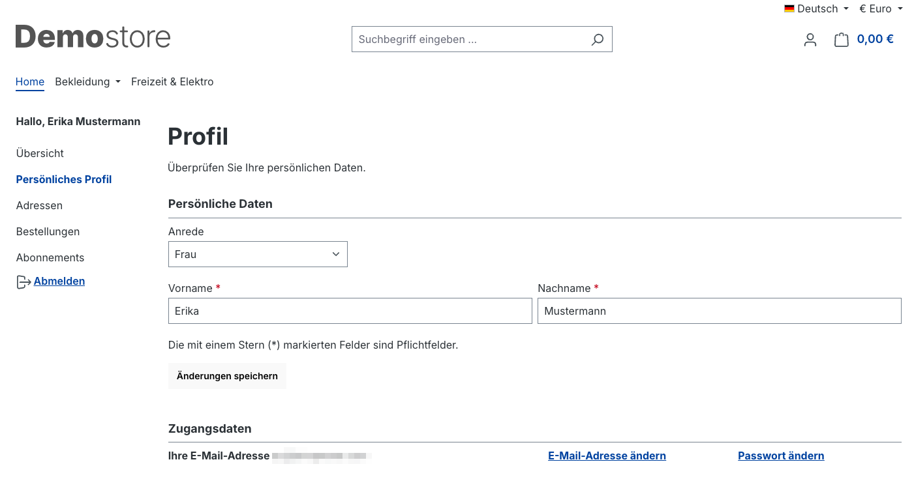
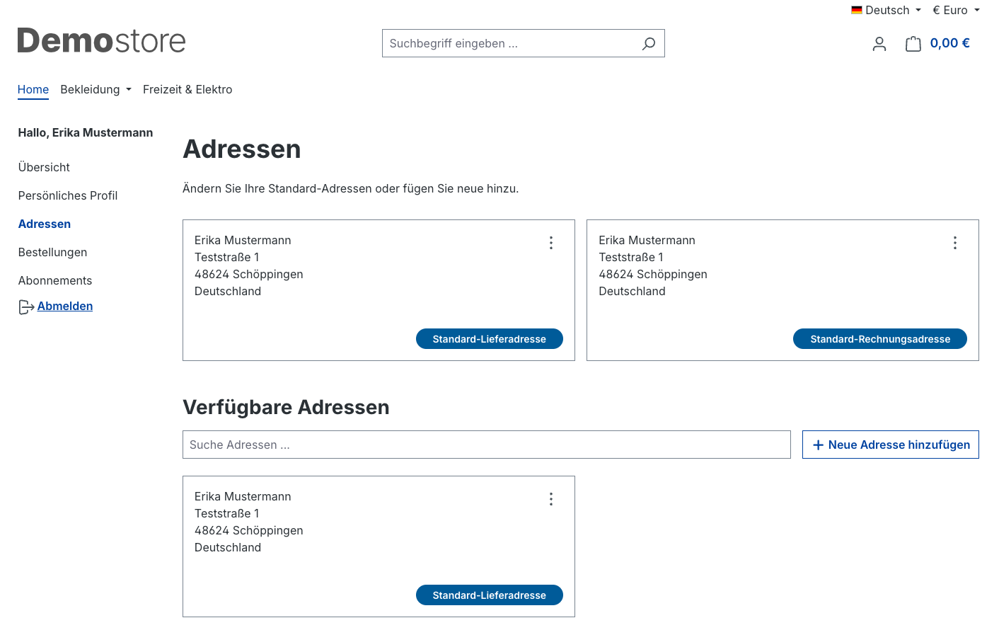
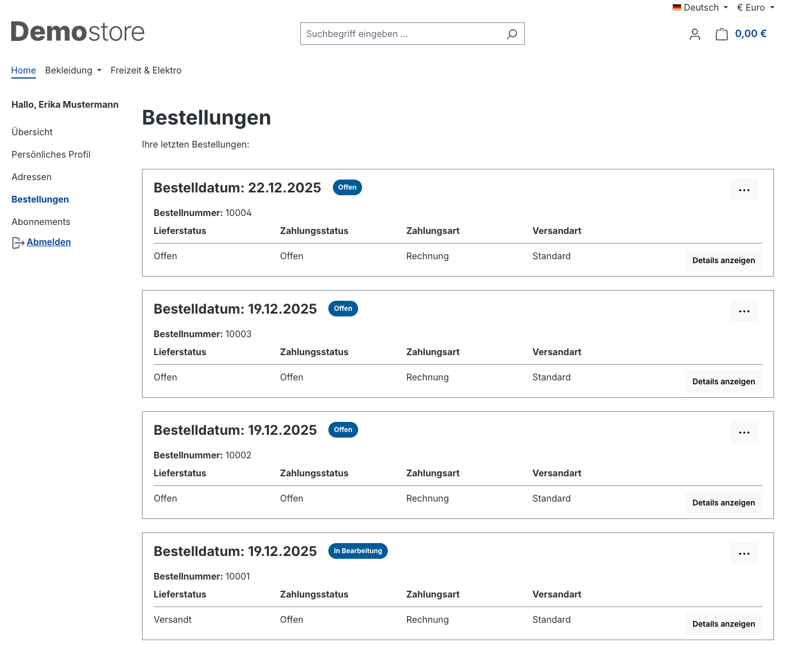
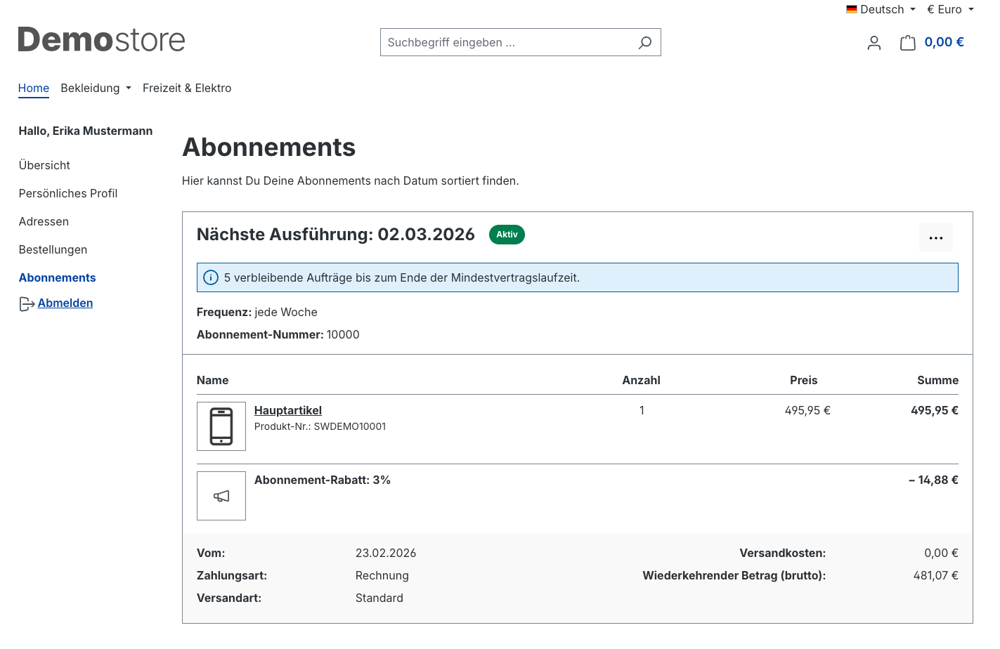

# Shopware 6 – Customer account: full reference

> Source: https://docs.shopware.com/de/shopware-6-de/kunden/kundenaccount  
> Documented version: 6.7.0.0+

---

## Contents

- [1. Übersicht (Overview) (account dashboard)](#1-übersicht-overview-account-dashboard)
- [2. Personal profile](#2-personal-profile)
- [3. Adressen (Addresses)](#3-adressen-addresses)
- [4. Bestellungen (Orders)](#4-bestellungen-orders)
- [5. Abonnements (Subscriptions) (from v6.5.4.0, Beyond plan)](#5-abonnements-subscriptions-from-v6540-beyond-plan)
- [6. Resetting the password](#6-resetting-the-password)
- [Version matrix](#version-matrix)

## 1. Übersicht (Overview) (account dashboard)

Dashboard-style view giving a quick overview of:
- Current orders and their status
- Saved addresses
- Newsletter subscription status

Customers can **subscribe to the newsletter** directly here.

---

## 2. Personal profile

In the profile area, customers can adjust their **login credentials**:
- Change the **email address**
- Change the **password**

Both changes require the current password as confirmation.

---

## 3. Adressen (Addresses)

Customers manage saved addresses entirely on their own:

| Action | Description |
|--------|-------------|
| Add new address | Form with all address fields |
| Edit address | Change existing entries |
| Delete address | Remove addresses that are no longer needed |
| As default shipping address | Define the primary shipping address |
| As default billing address | Define the primary billing address |

---

## 4. Bestellungen (Orders)

Customers see all orders they have placed, with:
- Order number
- Order total
- Current processing state / status
- Order date

The **three-dot menu** per order offers:
- **Repeat order**: add all items to the cart again
- **Change payment status**: customers can (depending on configuration) switch the payment method

---

## 5. Abonnements (Subscriptions) (from v6.5.4.0, Beyond plan)

Enables **recurring orders** with configurable intervals.

- Overview of all active subscriptions
- Configuration of order interval and term
- Pausing / cancelling subscriptions

> Prerequisite: Shopware Beyond Plan + feature active in the Einstellungen (Settings)  
> Further details: `/de/shopware-6-de/einstellungen/abonnements`

---

## 6. Resetting the password

### Procedure for customers

1. On the login page: click **"Ich habe mein Passwort vergessen"** (I forgot my password)
2. Enter the email address of the account
3. The system sends an email containing a recovery link
4. Click the link → set a new password

### Security rules

| Rule | Detail |
|-------|--------|
| **Link validity period** | **2 hours** |
| **Link usability** | **Single use** (becomes invalid after use) |
| **Rate limiting** | Protection against abuse (configurable via `user_recovery`) |

### Important notes

- If the email does not arrive: check the **spam folder**
- Expired link: the process must be **started again**
- Unused links automatically become invalid after 2 hours

### Technical configuration (admin / developer)

Rate limiting for password reset requests is configurable via the `user_recovery` parameter.  
By default, the system protects against too many requests from the same IP/email address.

---

## Version matrix

| Feature | Minimum version | Plan |
|---------|---------------|------|
| Basic account functions | 6.0.0 | all |
| Repeat order | 6.0.0 | all |
| Change payment status | 6.0.0 | all |
| Abonnements | 6.5.4.0 | Beyond |
| Current documentation version | 6.7.0.0 | – |
