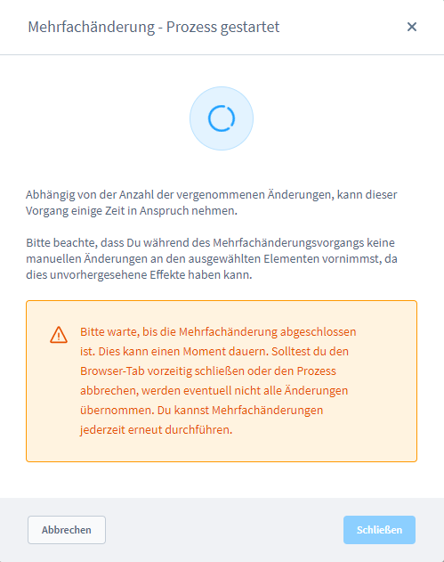
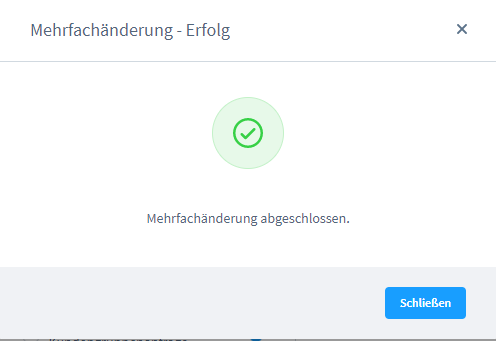

# Shopware 6 – Bulk edit & AI classification: Complete reference

> Source: https://docs.shopware.com/de/shopware-6-de/kunden/uebersicht  
> Documented version: 6.7.0.0+

---

## Contents

- [1. Bulk edit](#1-bulk-edit)
- [2. AI-generated customer classification](#2-ai-generated-customer-classification)
- [3. Version matrix](#3-version-matrix)

## 1. Bulk edit

Allows you to edit or delete up to **1,000 customers** at the same time.

### 1.1 Selecting customers

| Element | Function |
|---------|----------|
| (1) | Select **all customers on the page** (checkbox in the header) |
| (2) | Select **individual customers** |
| — | The selection works **across pages** |
| — | **Maximum: 1,000 records** |
| (3) | Display of the **number of selected customers** |
| (4) | **"Mehrfachänderung"** (Bulk edit) button → editing mode |
| (5) | **"Löschen"** (Delete) button → delete all selected customers |

### 1.2 Starting the bulk edit

1. Click the **"Mehrfachänderung (4)"** button
2. A pop-up opens with a list of the selected customers
3. Individual customers can be removed from the list (without deleting them)
4. Click **"Mehrfachänderung starten"** (Start bulk edit)

### 1.3 Selecting fields and entering values

| Element | Function |
|---------|----------|
| Checkbox (1) | **Activate** the field for the change |
| Werte (2) (Values) | Enter the new values |
| "Änderungen übernehmen" (3) (Apply changes) | Apply the changes to all selected customers |

### 1.4 Dropdown operators

For certain fields (e.g. tags, customer groups) an **operator dropdown** is available:

| Operator | Effect |
|----------|---------|
| **Überschreiben** (Overwrite) | Completely replaces all previous information in the field |
| **Leeren** (Clear) | Removes all settings of the block (the field is emptied) |
| **Hinzufügen** (Add) | Adds new settings, existing values are retained |
| **Entfernen** (Remove) | Deletes specific settings (only the values entered) |

### 1.5 Applying the changes and completion

1. A **confirmation pop-up** shows the number of affected customers
2. Click **"Änderungen anwenden"** (Apply changes)
3. The system processes the changes (progress bar)
4. A **notification** appears once processing is finished
5. **"Schließen"** (Close) → back to the customer overview

---

## 2. AI-generated customer classification

> Prerequisite: **Shopware Rise Plan**

Automatic AI-supported classification of customers. Results are stored as **tags** and can be used for further Shopware functions (e.g. Rule Builder, marketing).

### 2.1 Step 1 – select customers and start the classification

1. Select customers in the overview
2. Click the **"Klassifizieren (1)"** (Classify) button
3. The configuration window opens

### 2.2 Step 2 – configuring the classification

| Element | Required | Description |
|---------|---------|-------------|
| **Zusätzliche Informationen (1)** (Additional information) | No | Context for the AI: classification purpose, marketing campaign, reason for the analysis. Leave empty = the AI uses only the customer data |
| **Anzahl Tags (2)** (Number of tags) | Yes | Desired number of classifications to be generated |
| **"Tags generieren" (3)** (Generate tags) | — | Starts the AI process |

### 2.3 Step 3 – review and adjustment

The AI generates tags that contain the following information:

| Element | Description |
|---------|-------------|
| **Name (1)** | Short label of the tag (e.g. "Stammkunde" (Regular customer), "Großbesteller" (Bulk buyer)) |
| **Beschreibung (2)** (Description) | Explanation of which customer group this tag describes |
| **Bedingung (3)** (Condition) | Detailed criteria by which the tag is assigned |
| **Kontextmenü (4)** (Context menu) | Manual adjustment of the tag is possible |

### 2.4 Step 4 – assigning tags

1. Select the desired tags
2. Click the **"Start (5)"** button
3. The AI assigns tags to the customers that match the respective conditions

> **Note:** Not every initially selected customer necessarily receives all tags.  
> The AI only assigns a tag if its conditions apply to the respective customer.

### 2.5 Important warning

> **Caution:** Running the classification again removes **ALL** previously AI-generated tags  
> and **deletes** them permanently. This cannot be undone.

---

## 3. Version matrix

| Feature | Minimum version | Plan |
|---------|---------------|------|
| Mehrfachänderung | 6.0.0 | all |
| Mehrfachänderung max. 1,000 records | 6.0.0 | all |
| AI classification | any | Rise |
