# Shopware 6 – Customers: Complete reference (Admin)

> Source: https://docs.shopware.com/de/shopware-6-de/kunden/uebersicht  
> Documented version: 6.7.0.0+

---

## Contents

- [1. Customer overview](#1-customer-overview)
- [2. Customer detail view – tabs](#2-customer-detail-view-tabs)
- [3. Editing mode](#3-editing-mode)
- [4. Creating a new customer](#4-creating-a-new-customer)
- [5. Storefront customer area](#5-storefront-customer-area)
- [6. Quick order function (from v6.5.4.0, Evolve Plan)](#6-quick-order-function-from-v6540-evolve-plan)
- [7. Bulk edit](#7-bulk-edit)
- [8. AI-generated customer classification (from Shopware Rise Plan)](#8-ai-generated-customer-classification-from-shopware-rise-plan)
- [Version matrix](#version-matrix)

## 1. Customer overview

The customer overview (`Kunden` (Customers) in the main menu) enables **convenient management of the customer base**.

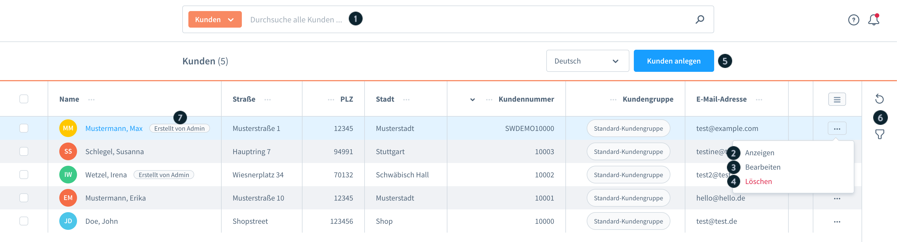

### Available actions

| No. | Action | Description |
|-----|--------|-------------|
| (1) | **Suchen** (Search) | Full-text search across all customer fields |
| (2) | **Anzeigen** (View) | Open the detail view of a customer |
| (3) | **Bearbeiten** (Edit) | Edit the customer data directly |
| (4) | **Löschen** (Delete) | Remove customers |
| (5) | **Kunden anlegen** (Create customer) | Create a new customer manually |
| (6) | **Tools** | Set filters, refresh the overview |
| (7) | **Badge "Erstellt von Admin"** (Created by admin) | Marks manually created customers |

### Displayed fields

- Customer number (Kd.-Nr.)
- First and last name
- Address data (from the default billing address)
- Email address

---

## 2. Customer detail view – tabs

### Tab: Allgemein (General)

Shows all customer information in one overview.

**"Als Kunde anmelden" (2)** (Log in as customer)  
With this button the admin can log in to the storefront directly as the respective customer.  
A pop-up appears for selecting the sales channel.

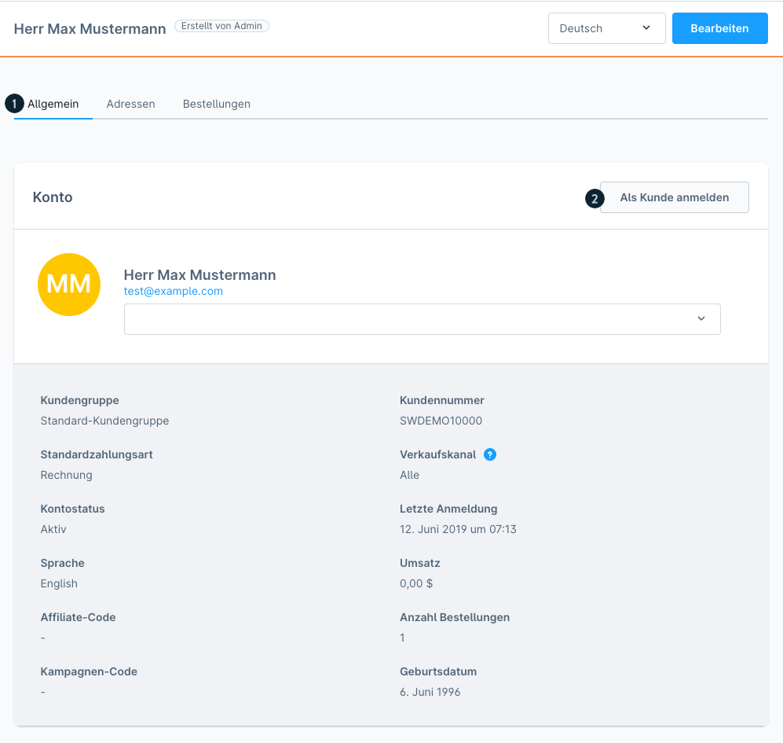

### Tab: Adressen (Addresses)

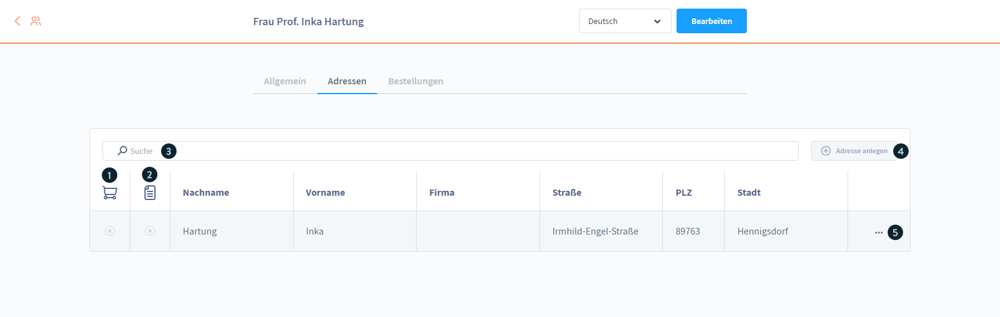

All addresses stored for the customer.

| No. | Element | Function |
|-----|---------|----------|
| (1) | **Standard-Lieferadresse** (Default shipping address) | Mark/change |
| (2) | **Standard-Rechnungsadresse** (Default billing address) | Mark/change |
| (3) | **Suche** | Filter addresses |
| (4) | **Neue Adresse hinzufügen** (Add new address) | Open the form |
| (5) | **Kontextmenü** (Context menu) | Edit · Duplicate · Delete |

### Tab: Bestellungen (Orders)

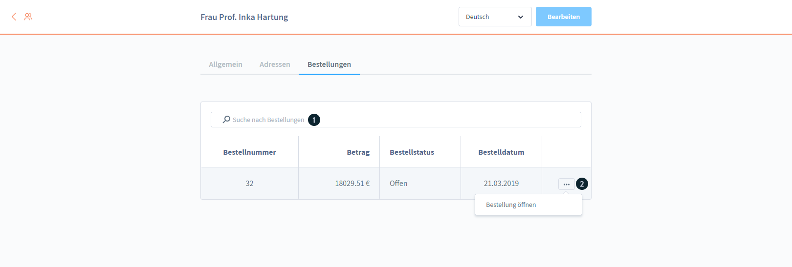

| Element | Displayed |
|---------|-----------|
| (1) | Search function |
| (2) | Order number, amount, status, date (clickable → order details) |

### Tab: Unternehmen (Companies) (from v6.5.6.0, Evolve Plan)

Only visible when the feature is active. Contains two sub-areas:

**Mitarbeiterverwaltung** (Employee management)

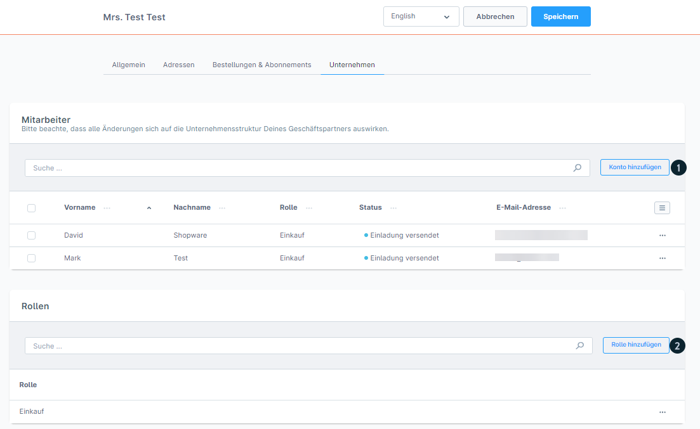

- `Konto hinzufügen (1)` (Add account): invite a new employee
- Required fields: first/last name, email
- Rolle (Role): optionally selectable
- Acceptance period for the invitation link: **2 hours**
- Status after the invitation: can be tracked
- Deactivation: via the context menu

**Rollenverwaltung** (Role management)

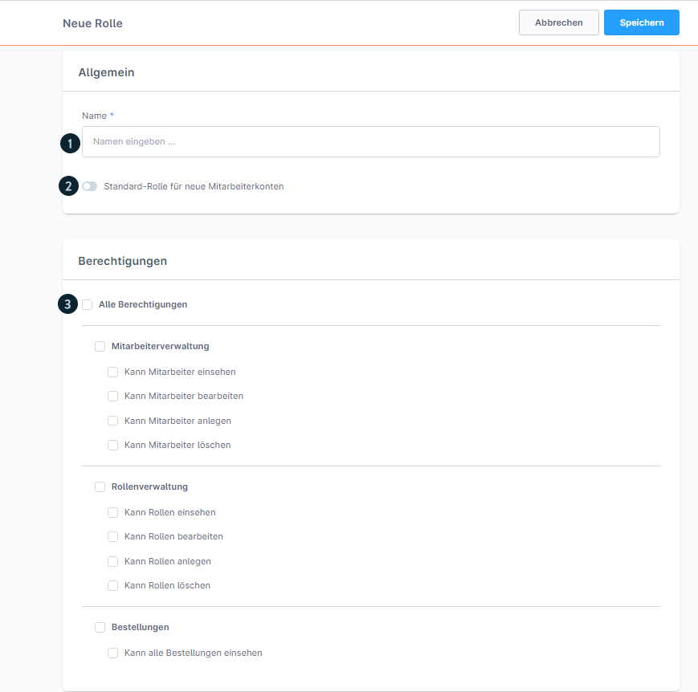

- `Rolle hinzufügen (2)` (Add role): create a new role
- Name (1): required field
- Default role for new employees (2): optional
- Berechtigungen (3) (Permissions): employee management · role management · orders

**Frontend view (Storefront)**

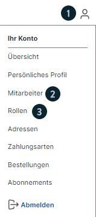

Access via the `Konto-Icon (1)` (Account icon) → configuration identical to the admin.

---

## 3. Editing mode

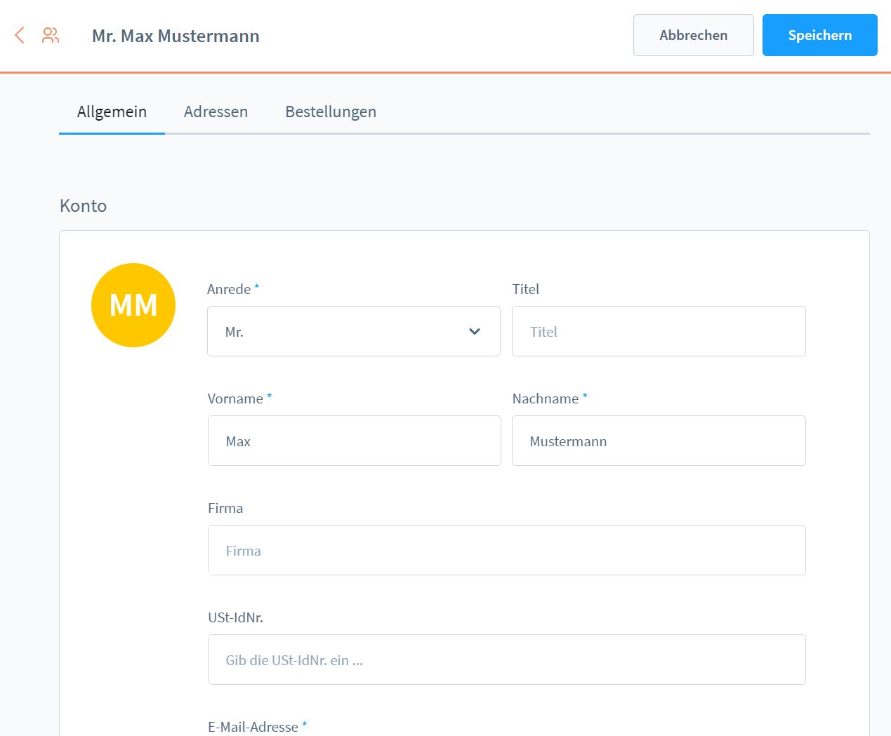

Accessible via the edit button. Configurable:
- Name, address data, all customer information
- Default shipping and billing address

---

## 4. Creating a new customer

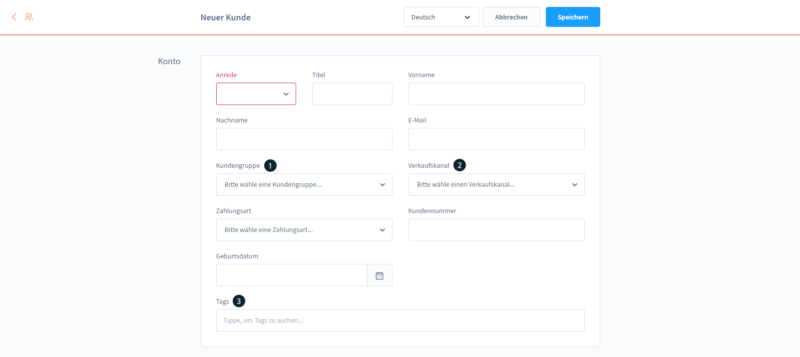
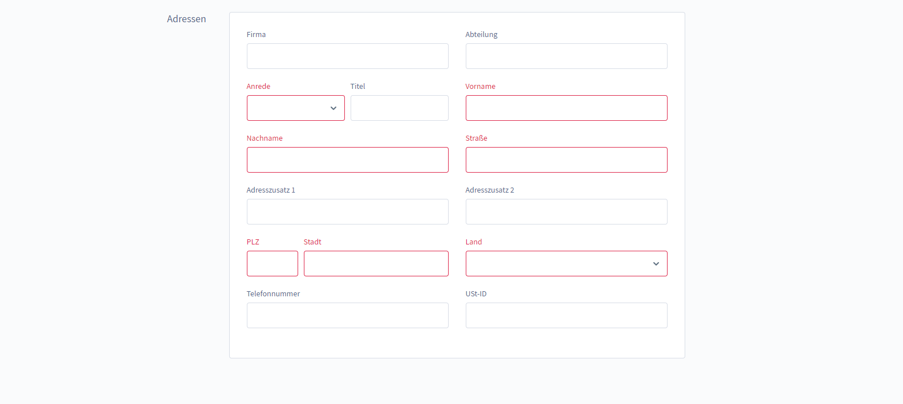

### Input fields

| Field | Required | Description |
|------|---------|-------------|
| Name | Yes | First and last name |
| Adresse (Address) | Yes | Default address |
| Kundengruppe (1) (Customer group) | No | Assigns predefined settings |
| Verkaufskanal (2) (Sales channel) | Yes | Determines shop visibility and assortment |
| Tags (3) | No | Several keywords possible |
| Adressen | No | Assign an address in advance |

> Fields marked in red = required fields

---

## 5. Storefront customer area

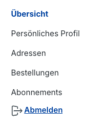

In their account, customers see the following areas:
- **Übersicht** (Overview): dashboard with orders, addresses
- **Persönliches Profil** (Personal profile): change email and password
- **Adressen**: manage saved shipping addresses
- **Bestellungen**: order history with status
- **Abonnements** (Subscriptions): active subscriptions (from v6.5.4.0, Beyond Plan)

---

## 6. Quick order function (from v6.5.4.0, Evolve Plan)

Speeds up the ordering process for B2B customers.

### Activation (admin)

Editing mode of the customer → activate the "Schnellbestellung" (Quick order) option.

### Frontend access

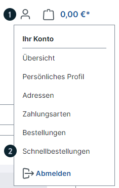

`Konto-Icon (1)` → `Schnellbestellungen (2)` (Quick orders)

### Functionality

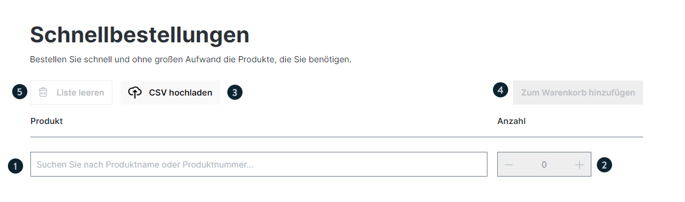

| Element | Function |
|---------|----------|
| Suche (1) | Search by product name or number |
| Anzahl (2) (Quantity) | Enter the quantity directly |
| CSV-Upload (3) | Columns: `product_number`, `quantity` |
| "In Warenkorb" (4) (Add to cart) | Add all products to the shopping cart |
| "Liste leeren" (5) (Clear list) | Reset the entire list |

> A CSV template is available for download.

---

## 7. Bulk edit

Allows several customers to be edited at the same time.

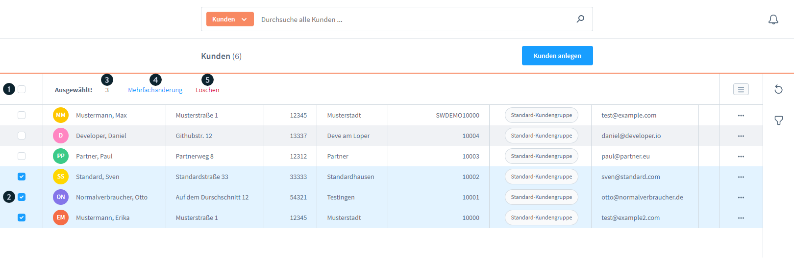

### Selection

| Element | Function |
|---------|----------|
| (1) | Select all customers on the page |
| (2) | Select individual customers |
| – | Selection across several pages is possible |
| – | **Maximum: 1,000 records** |
| (3) | Number of selected customers |
| (4) | **"Mehrfachänderung"** (Bulk edit) button |
| (5) | "Löschen" button |

### Procedure

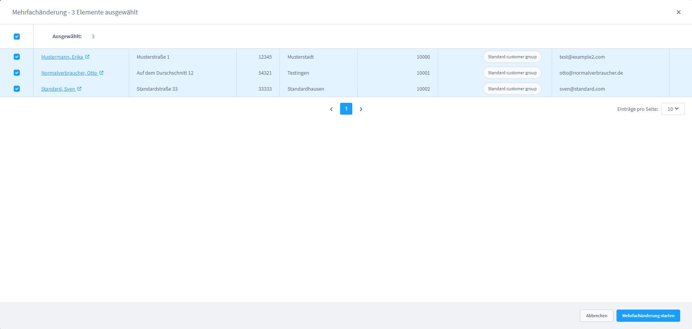
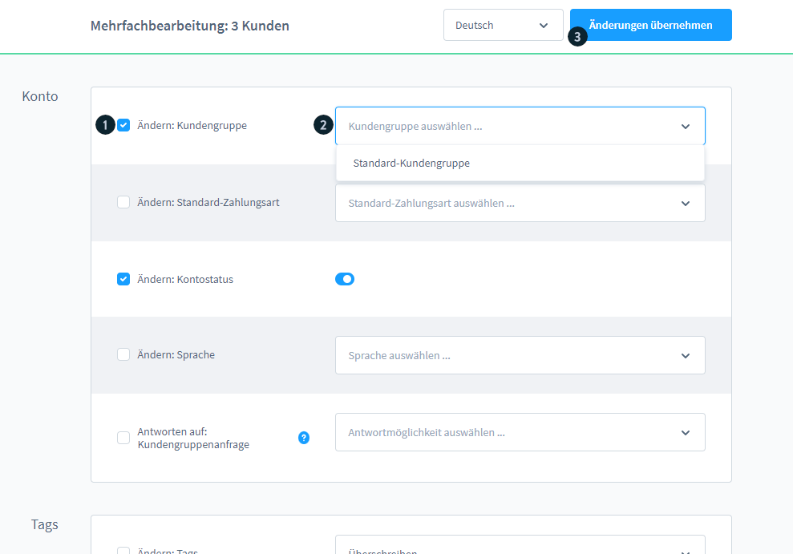
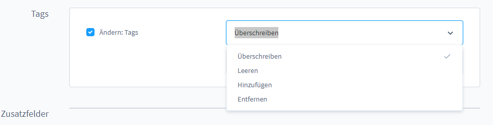

1. Pop-up: check the list of selected customers / remove individual ones
2. Click "Mehrfachänderung starten" (Start bulk edit)
3. Set the checkboxes (1) for the fields to be changed
4. Enter the new values (2)
5. Click "Änderungen übernehmen (3)" (Apply changes)

### Dropdown operators

| Operator | Effect |
|----------|---------|
| **Überschreiben** (Overwrite) | Replaces all previous information in the field |
| **Leeren** (Clear) | Removes all settings of the block |
| **Hinzufügen** (Add) | Adds new settings (existing ones remain) |
| **Entfernen** (Remove) | Deletes specific settings |

### Completion

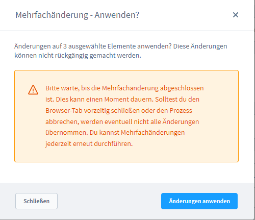

- The confirmation pop-up shows the number of customers
- Click "Änderungen anwenden" (Apply changes)
- Wait for the system to finish processing
- Notification once processing is complete
- "Schließen" (Close) → back to the overview

---

## 8. AI-generated customer classification (from Shopware Rise Plan)

Automatic AI-supported classification for marketing purposes. Classifications are stored as **tags**.

### Step 1: selection & start

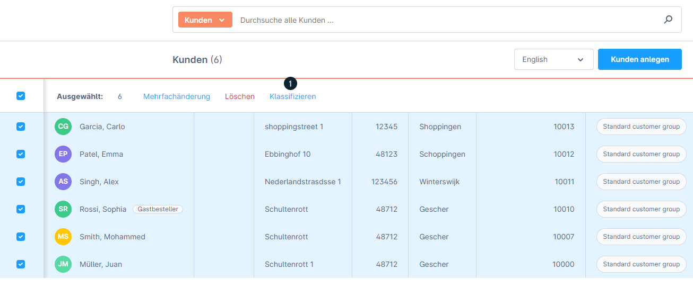

Select customers in the overview → click **"Klassifizieren (1)"** (Classify).

### Step 2: configuration

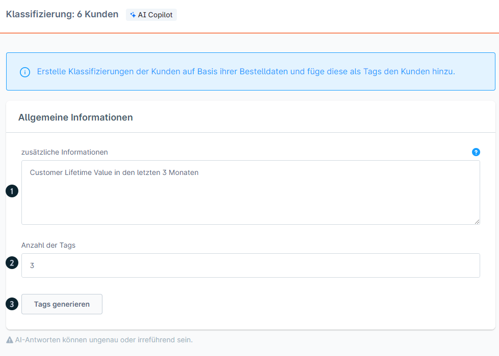

| Element | Description |
|---------|-------------|
| Zusätzliche Informationen (1) (Additional information) | Optional: purpose, campaign, reason for the analysis. Empty = the AI uses only the customer data |
| Anzahl Tags (2) (Number of tags) | Desired number of classifications |
| "Tags generieren" (3) (Generate tags) | Starts the AI process |

### Step 3: review & adjustment

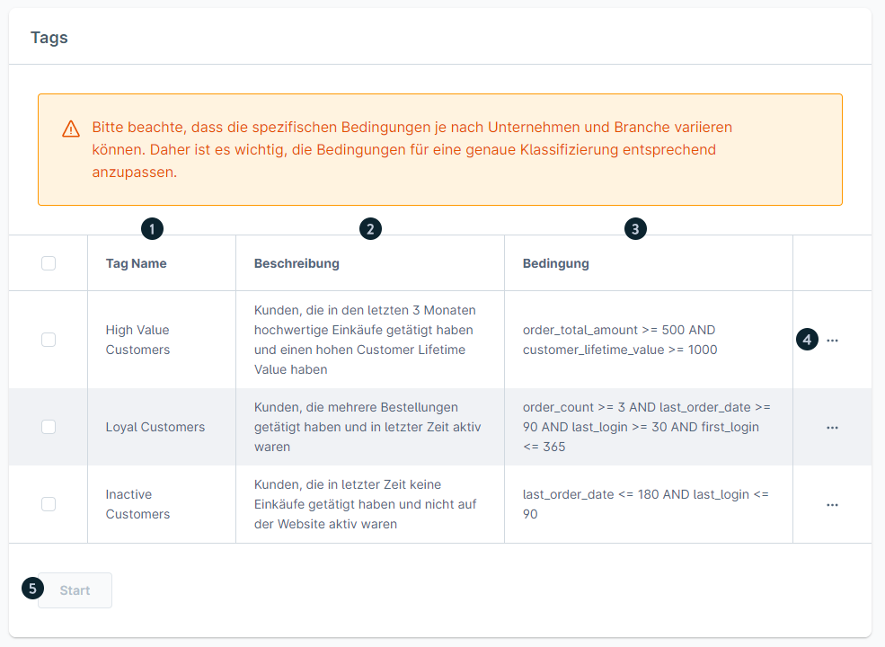

The generated tags show:
- **Name (1)**
- **Beschreibung (2)** (Description): explanation of the customer group concerned
- **Bedingung (3)** (Condition): detailed assignment criteria
- **Kontextmenü (4)**: manual tag adjustment possible

### Step 4: assignment

- Select the desired tags → click **"Start (5)"**
- Tags are assigned to customers whose conditions match
- Not every selected customer necessarily receives all tags

> **Important:** Running the classification again removes ALL previously AI-generated tags and deletes them.

---

## Version matrix

| Feature | Minimum version | Plan |
|---------|---------------|------|
| Customer overview (basic) | 6.0.0 | all |
| Quick order | 6.5.4.0 | Evolve |
| Unternehmen/B2B tab | 6.5.6.0 | Evolve |
| AI classification | any | Rise |
| Abonnements (storefront) | 6.5.4.0 | Beyond |
