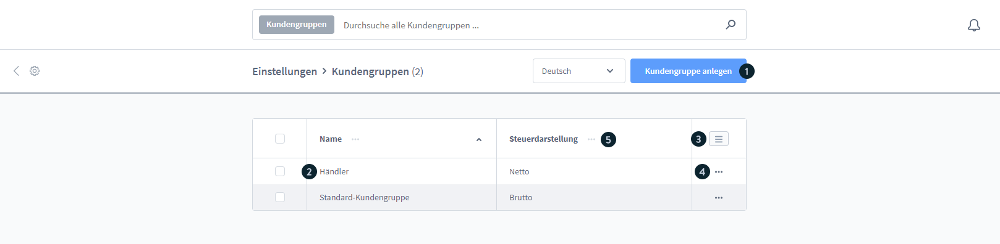
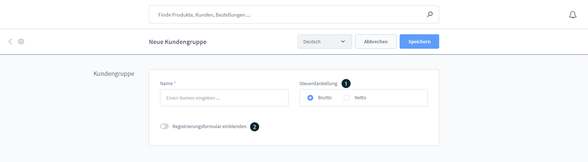
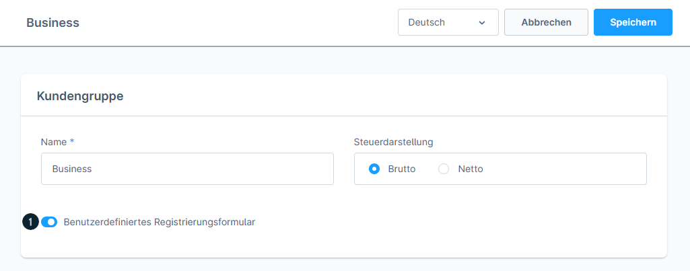
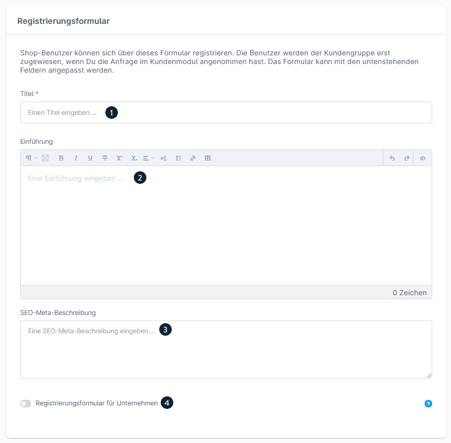
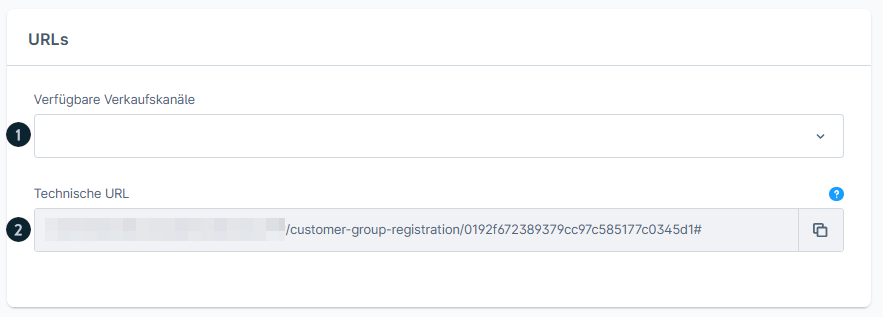
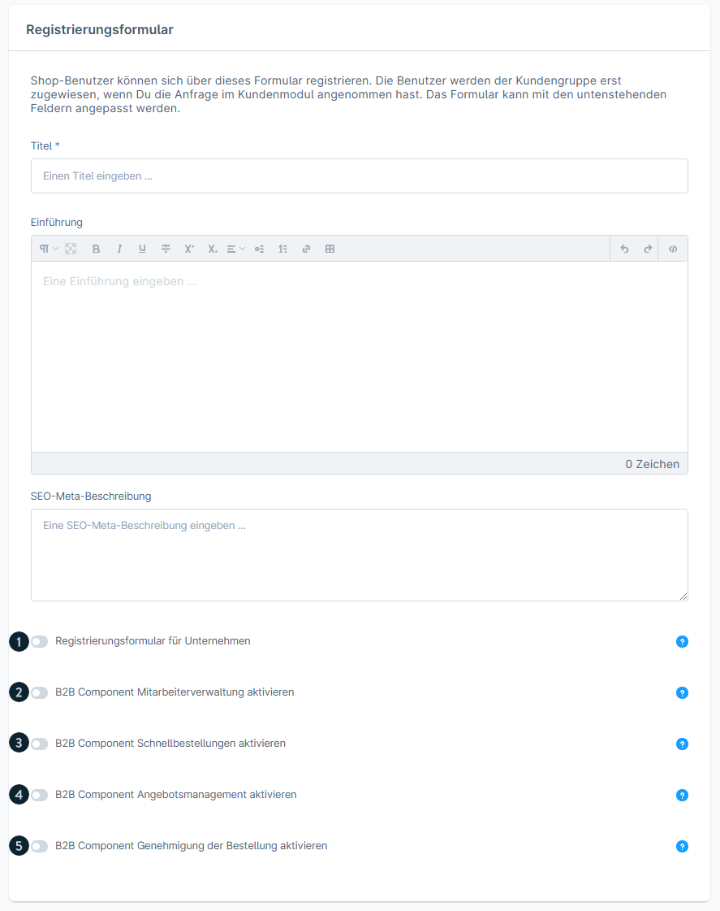
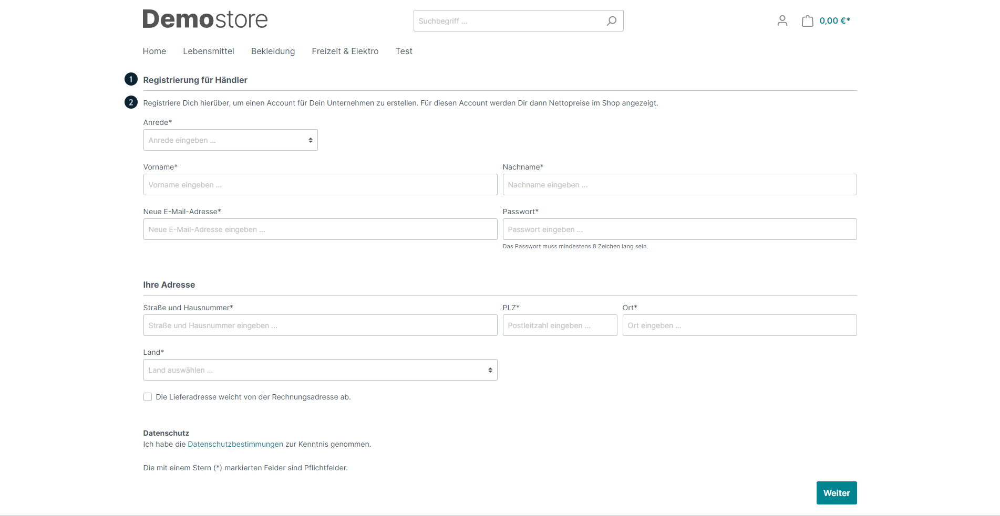
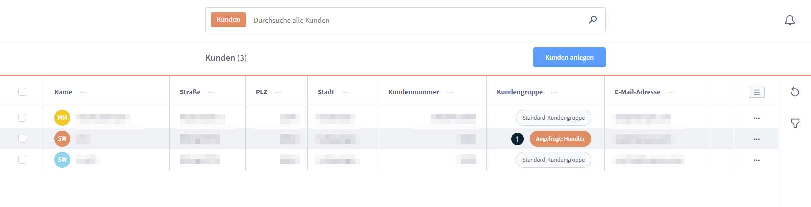
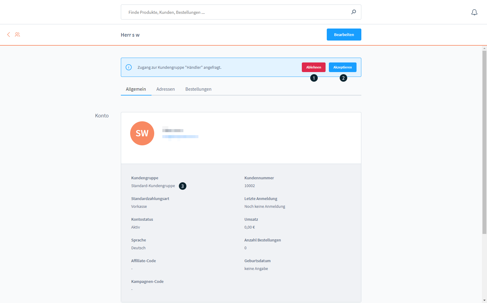

# Shopware 6 – Customer groups: Complete reference

> Source: https://docs.shopware.com/de/shopware-6-de/einstellungen/kundengruppen  
> Documented version: 6.5.6.0+

---

## Contents

- [1. What are customer groups?](#1-what-are-customer-groups)
- [2. Customer groups overview](#2-customer-groups-overview)
- [3. Creating a new customer group](#3-creating-a-new-customer-group)
- [4. B2B Components (Evolve Plan)](#4-b2b-components-evolve-plan)
- [5. Storefront registration form](#5-storefront-registration-form)
- [6. Managing customers after registration](#6-managing-customers-after-registration)
- [7. Assigning a customer group to a customer](#7-assigning-a-customer-group-to-a-customer)
- [8. Version matrix](#8-version-matrix)

## 1. What are customer groups?

Customer groups let you control the **price display (gross/net)** and **access** to sales channels. Customers are assigned to a customer group and see the configured prices according to their group.

> **Critical note:** The **default customer group** serves as the fallback for all sales channels.  
> **Deleting it makes the frontend inaccessible!** Never delete it.

---

## 2. Customer groups overview

Access: `Einstellungen` (Settings) → `Kundengruppen` (Customer groups)

Available actions:
- **"Kundengruppe anlegen"** (Create customer group): create a new group
- Edit existing groups by clicking the name or via the context menu
- List settings for adjusting the columns
- Compact mode available

---

## 3. Creating a new customer group

### Basic settings

| Field | Description |
|------|-------------|
| **Name** | Label of the customer group (e.g. "Händler" (Dealer), "Endkunde" (End customer)) |
| **Steuerdarstellung** (Tax display) | `Brutto` (Gross): prices incl. VAT · `Netto` (Net): prices excl. VAT |

### Extended registration form (optional)

Activates a **custom registration form** for this customer group.

**Configurable fields:**

| Element | Description |
|---------|-------------|
| **Titel** (Title) | Heading of the form |
| **Einführungstext** (Introductory text) | Optional welcome text |
| **SEO-Meta-Beschreibung** (SEO meta description) | For search engine optimisation |
| **Unternehmensregistrierung** (Company registration) | Checkbox: form for company registration |
| **Verkaufskanal-Zuordnung** (Sales channel assignment) | Which sales channels display this form |

**Technical URLs:**

URLs are generated automatically for linking directly to the registration form.

---

## 4. B2B Components (Evolve Plan)

With an active **Shopware Evolve Plan**, B2B features can be activated per customer group:

| Feature | Description |
|---------|-------------|
| **Mitarbeiterverwaltung** (Employee management) | Multiple users per company account |
| **Schnellbestellungen** (Quick orders) | CSV upload and product number quick search |
| **Angebotsmanagement** (Quote management) | Create and manage quotes |
| **Genehmigung von Bestellungen** (Order approval) | Have orders approved before execution |

---

## 5. Storefront registration form

Customers who register via an extended registration form must first be **approved**.

---

## 6. Managing customers after registration

### Customer list with status

After registration, new customers appear in the customer list with the status **"Ausstehend"** (Pending).

### Accepting or rejecting customers

The following options are available in the **customer detail view**:

| Action | Result |
|--------|---------|
| **Akzeptieren** (Accept) | The customer is added to the customer group + automatic email notification |
| **Ablehnen** (Reject) | Registration is refused + email via the corresponding template |

---

## 7. Assigning a customer group to a customer

In the **editing mode** of a customer:  
Tab "Allgemein" (General) → field **"Kundengruppe"** → select the desired group.

Alternatively when **creating** a customer:  
Form "Kunden anlegen" (Create customer) → field **"Kundengruppe (1)"**.

---

## 8. Version matrix

| Feature | Minimum version | Plan |
|---------|---------------|------|
| Customer groups basic function | 6.0.0 | all |
| Extended registration form | 6.3.1.0 | all |
| B2B Components in customer groups | 6.5.6.0 | Evolve |
| Current doc version | 6.5.6.0+ | – |
