# Shopware 6 – Kunden: Vollständige Referenz (Admin)

> Quelle: https://docs.shopware.com/de/shopware-6-de/kunden/uebersicht  
> Dokumentierte Version: 6.7.0.0+

---

## 1. Kundenübersicht

Die Kundenübersicht (`Kunden` im Hauptmenü) ermöglicht die **komfortable Verwaltung des Kundenstamms**.

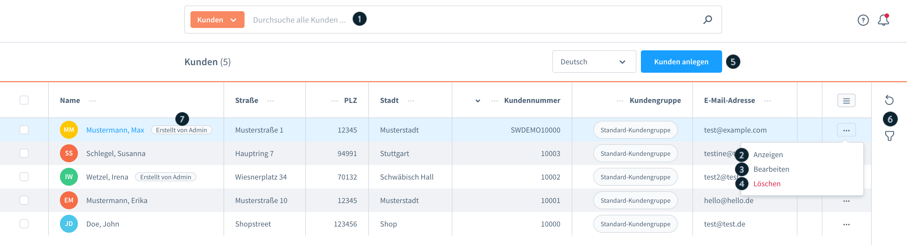

### Verfügbare Aktionen

| Nr. | Aktion | Beschreibung |
|-----|--------|-------------|
| (1) | **Suchen** | Freitext-Suche über alle Kundenfelder |
| (2) | **Anzeigen** | Detail-Ansicht eines Kunden öffnen |
| (3) | **Bearbeiten** | Kundendaten direkt bearbeiten |
| (4) | **Löschen** | Kunden entfernen |
| (5) | **Kunden anlegen** | Neuen Kunden manuell erstellen |
| (6) | **Tools** | Filter setzen, Übersicht aktualisieren |
| (7) | **Badge „Erstellt von Admin"** | Markiert manuell angelegte Kunden |

### Angezeigte Felder

- Kundennummer (Kd.-Nr.)
- Vor- und Nachname
- Adressdaten (aus Standardrechnungsadresse)
- E-Mail-Adresse

---

## 2. Kundendetailansicht – Tabs

### Tab: Allgemein

Zeigt alle Kundeninformationen in einer Übersicht.

**„Als Kunde anmelden" (2)**  
Admin kann sich mit diesem Button direkt in der Storefront als der jeweilige Kunde einloggen.  
Ein Pop-Up erscheint zur Auswahl des Verkaufskanals.

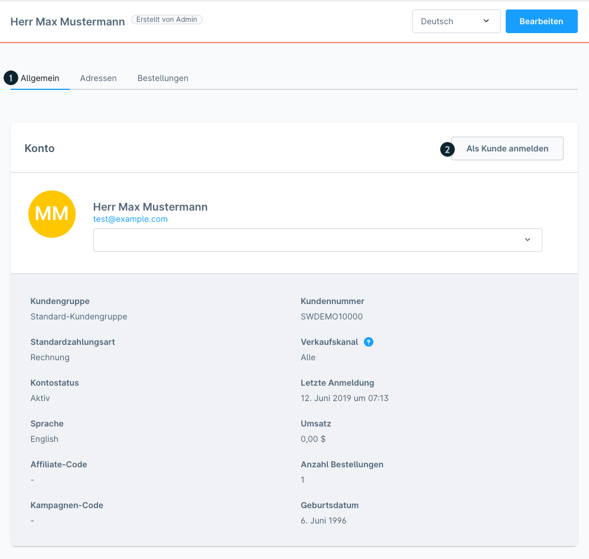

### Tab: Adressen

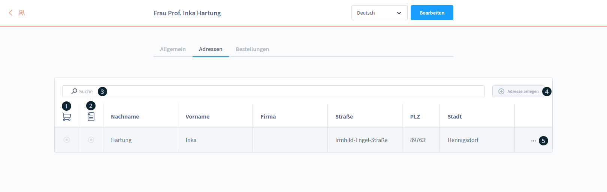

Alle hinterlegten Adressen des Kunden.

| Nr. | Element | Funktion |
|-----|---------|----------|
| (1) | **Standard-Lieferadresse** | Markierung/Änderung |
| (2) | **Standard-Rechnungsadresse** | Markierung/Änderung |
| (3) | **Suche** | Adressen filtern |
| (4) | **Neue Adresse hinzufügen** | Formular öffnen |
| (5) | **Kontextmenü** | Bearbeiten · Duplizieren · Löschen |

### Tab: Bestellungen

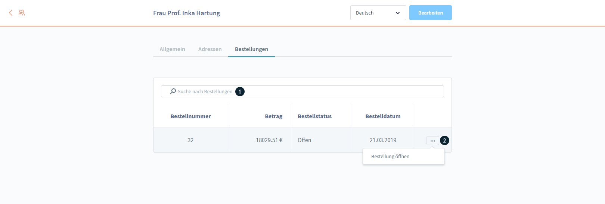

| Element | Angezeigt |
|---------|-----------|
| (1) | Suchfunktion |
| (2) | Bestellnummer, Betrag, Status, Datum (klickbar → Bestelldetails) |

### Tab: Unternehmen (ab v6.5.6.0, Evolve Plan)

Nur sichtbar wenn Feature aktiv. Enthält zwei Unterbereiche:

**Mitarbeiterverwaltung**

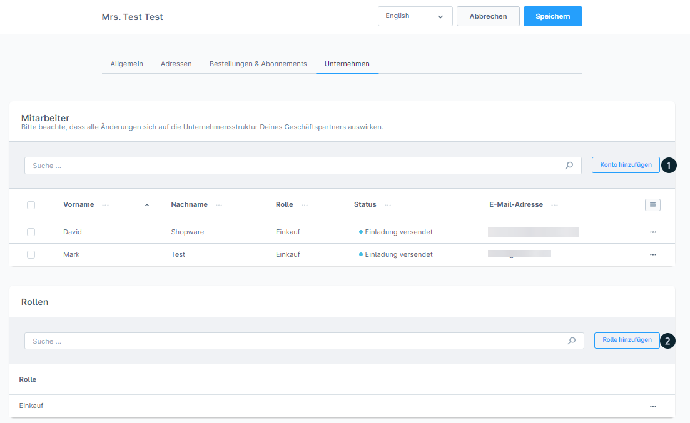

- `Konto hinzufügen (1)`: Neuen Mitarbeiter einladen
- Pflichtfelder: Vor-/Nachname, E-Mail
- Rolle: optional wählbar
- Akzeptanzfrist für Einladungs-Link: **2 Stunden**
- Status nach Einladung: verfolgbar
- Deaktivierung: über Kontextmenü

**Rollenverwaltung**

- `Rolle hinzufügen (2)`: Neue Rolle anlegen
- Name (1): Pflichtfeld
- Standard-Rolle für neue Mitarbeiter (2): optional
- Berechtigungen (3): Mitarbeiterverwaltung · Rollenverwaltung · Bestellungen

**Frontend-Ansicht (Storefront)**

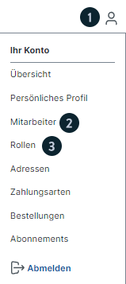

Zugriff über `Konto-Icon (1)` → identische Konfiguration wie im Admin.

---

## 3. Bearbeitungsmodus

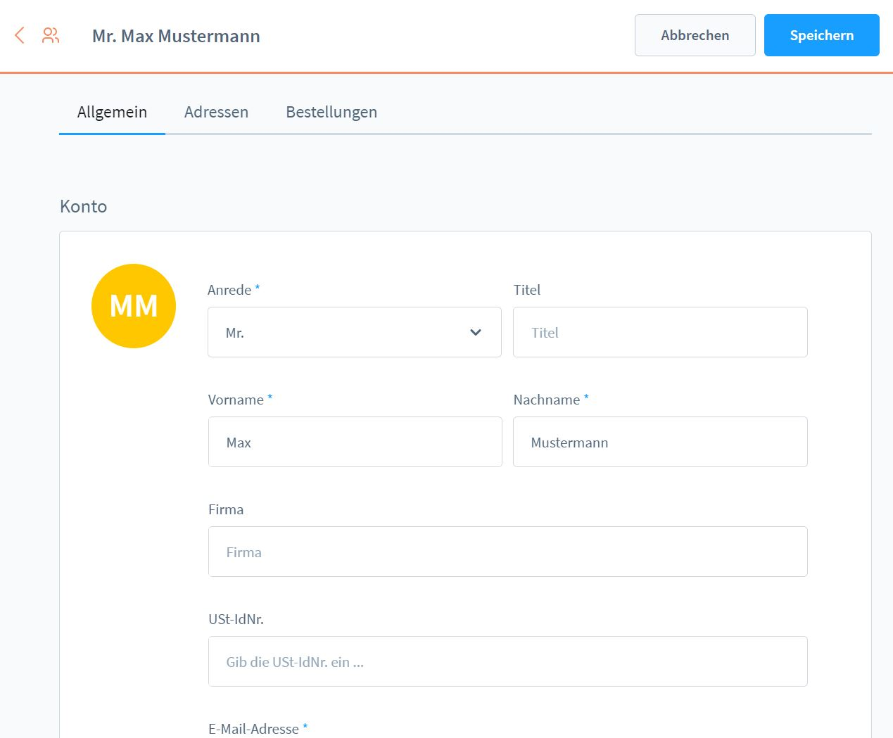

Über den Bearbeitungs-Button zugänglich. Konfigurierbar:
- Name, Adressdaten, alle Kundeninformationen
- Standard-Liefer- und Rechnungsadresse

---

## 4. Neuen Kunden anlegen

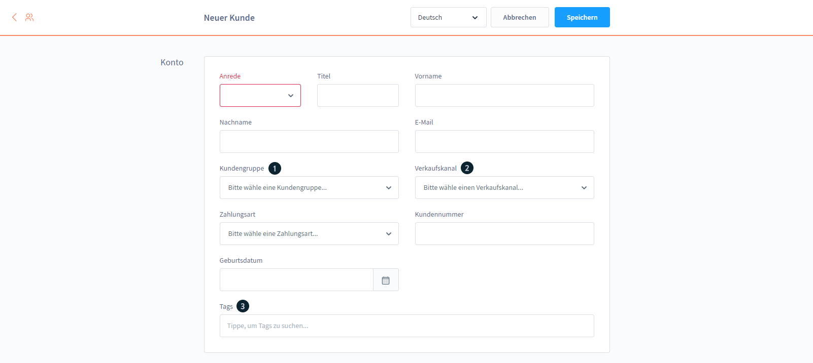
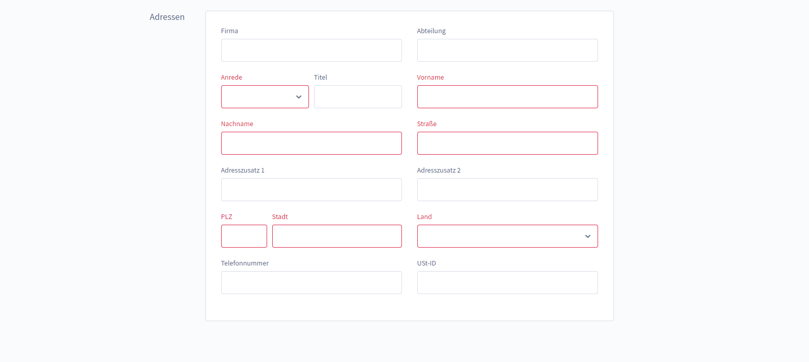

### Eingabefelder

| Feld | Pflicht | Beschreibung |
|------|---------|-------------|
| Name | Ja | Vor- und Nachname |
| Adresse | Ja | Standardadresse |
| Kundengruppe (1) | Nein | Weist vordefinierte Einstellungen zu |
| Verkaufskanal (2) | Ja | Bestimmt Shop-Sichtbarkeit und Sortiment |
| Tags (3) | Nein | Mehrere Schlagworte möglich |
| Adressen | Nein | Adresse vorab zuweisen |

> Rot markierte Felder = Pflichtfelder

---

## 5. Storefront-Kundenbereich

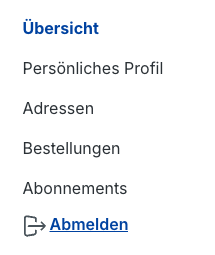

Kunden sehen im Account folgende Bereiche:
- **Übersicht**: Dashboard mit Bestellungen, Adressen
- **Persönliches Profil**: E-Mail und Passwort ändern
- **Adressen**: Verwalten gespeicherter Lieferadressen
- **Bestellungen**: Bestellhistorie mit Status
- **Abonnements**: Aktive Abos (ab v6.5.4.0, Beyond Plan)

---

## 6. Schnellbesteller-Funktion (ab v6.5.4.0, Evolve Plan)

Beschleunigt den Bestellprozess für B2B-Kunden.

### Aktivierung (Admin)

Bearbeitungsmodus des Kunden → Option „Schnellbestellung" aktivieren.

### Frontend-Zugriff

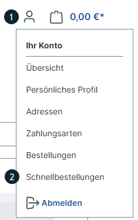

`Konto-Icon (1)` → `Schnellbestellungen (2)`

### Funktionalität

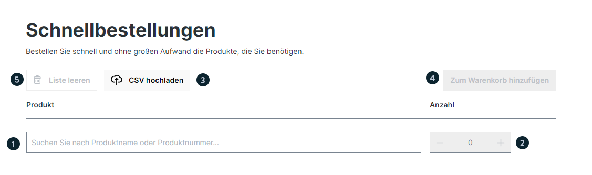

| Element | Funktion |
|---------|----------|
| Suche (1) | Nach Produktname oder -nummer suchen |
| Anzahl (2) | Menge direkt eingeben |
| CSV-Upload (3) | Spalten: `product_number`, `quantity` |
| „In Warenkorb" (4) | Alle Produkte in den Warenkorb legen |
| „Liste leeren" (5) | Gesamte Liste zurücksetzen |

> CSV-Template steht zum Download bereit.

---

## 7. Mehrfachänderung

Ermöglicht gleichzeitige Bearbeitung mehrerer Kunden.

### Auswahl

| Element | Funktion |
|---------|----------|
| (1) | Alle Kunden auf Seite auswählen |
| (2) | Einzelne Kunden auswählen |
| – | Auswahl über mehrere Seiten möglich |
| – | **Maximum: 1.000 Datensätze** |
| (3) | Anzahl ausgewählter Kunden |
| (4) | Button „Mehrfachänderung" |
| (5) | Button „Löschen" |

### Ablauf

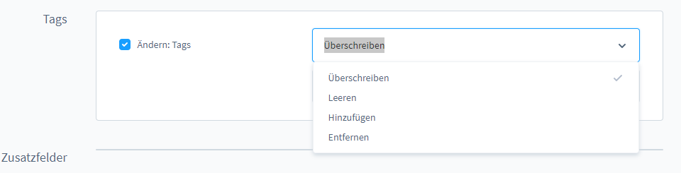

1. Pop-Up: Liste ausgewählter Kunden prüfen / einzelne entfernen
2. „Mehrfachänderung starten" klicken
3. Checkboxen (1) für zu ändernde Felder setzen
4. Neue Werte (2) eingeben
5. „Änderungen übernehmen (3)" klicken

### Dropdown-Operatoren

| Operator | Wirkung |
|----------|---------|
| **Überschreiben** | Ersetzt alle vorherigen Informationen des Feldes |
| **Leeren** | Entfernt alle Einstellungen des Blocks |
| **Hinzufügen** | Ergänzt neue Einstellungen (bestehende bleiben) |
| **Entfernen** | Löscht spezifische Einstellungen |

### Abschluss

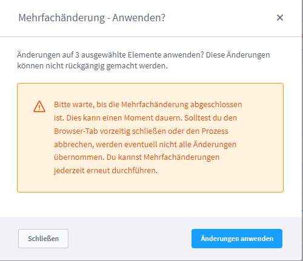

- Bestätigungs-Pop-Up zeigt Kundenzahl
- „Änderungen anwenden" klicken
- Systemverarbeitung abwarten
- Benachrichtigung bei Fertigstellung
- „Schließen" → zurück zur Übersicht

---

## 8. AI-generierte Kunden-Klassifizierung (ab Shopware Rise Plan)

Automatische KI-gestützte Klassifizierung für Marketing-Zwecke. Klassifizierungen werden als **Tags** gespeichert.

### Schritt 1: Auswahl & Start

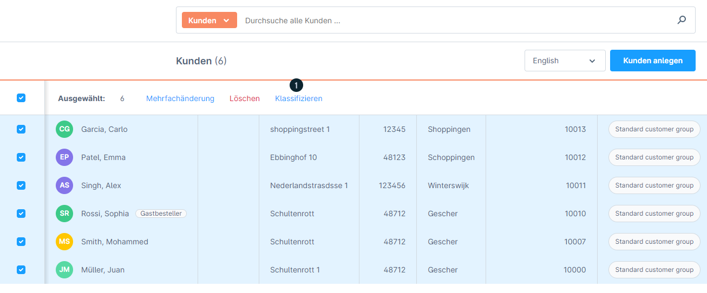

Kunden in der Übersicht auswählen → **„Klassifizieren (1)"** klicken.

### Schritt 2: Konfiguration

| Element | Beschreibung |
|---------|-------------|
| Zusätzliche Informationen (1) | Optional: Zweck, Kampagne, Auswertungsgrund. Leer = KI nutzt nur Kundendaten |
| Anzahl Tags (2) | Gewünschte Anzahl Klassifizierungen |
| „Tags generieren" (3) | Startet KI-Prozess |

### Schritt 3: Review & Anpassung

Generierte Tags zeigen:
- **Name (1)**
- **Beschreibung (2)**: Erklärung der betroffenen Kundengruppe
- **Bedingung (3)**: Detaillierte Zuweisungskriterien
- **Kontextmenü (4)**: Manuelle Tag-Anpassung möglich

### Schritt 4: Zuweisung

- Gewünschte Tags auswählen → **„Start (5)"** klicken
- Tags werden an Kunden mit passenden Bedingungen vergeben
- Nicht jeder ausgewählte Kunde erhält zwingend alle Tags

> **Wichtig:** Erneute Klassifizierung entfernt ALLE vorherigen KI-generierten Tags und löscht diese.

---

## Versionsmatrix

| Feature | Mindestversion | Plan |
|---------|---------------|------|
| Kundenübersicht (Basis) | 6.0.0 | alle |
| Schnellbesteller | 6.5.4.0 | Evolve |
| Unternehmen/B2B Tab | 6.5.6.0 | Evolve |
| AI-Klassifizierung | beliebig | Rise |
| Abonnements (Storefront) | 6.5.4.0 | Beyond |
