# Shopware 6 – Product Bundles: Vollständige Referenz

> Quelle: https://docs.shopware.com/de/shopware-6-de/shopware-services/bundles
> Plan: Evolve oder höher | Mindestversion: 6.7.9.0 | Status: Blueprint

---

## 1. Überblick

### Was sind Bundles?

Ein **Bundle** ist ein Produkt, das aus mehreren einzelnen Artikeln besteht. Kunden kaufen
das Bundle als Gesamtpaket, profitieren dabei von einem **Preisvorteil** und sehen alle
enthaltenen Produkte übersichtlich auf der Produktdetailseite.

### Blueprint-Status – Hinweise

> ⚠ **Dieses Feature befindet sich derzeit im Blueprint-Status.** Der Funktionsumfang
> ist in dieser Phase bewusst minimal gehalten und dient dazu, Funktionen frühzeitig
> bereitzustellen und Feedback einzuholen.
> Basierend auf Feedback kann sich das Feature weiterentwickeln und in seiner Struktur
> stark verändern.

---

## 2. Anforderungen

| Eigenschaft | Detail |
|---|---|
| Status | Blueprint |
| Mindestplan | Evolve oder höher |
| Mindestversion | 6.7.9.0 |
| Pfad im Admin | Kataloge > Bundles |

---

## 3. Typische Anwendungsfälle

| Anwendungsfall | Beschreibung |
|---|---|
| **Cross-Selling / Warenkorb erhöhen** | Ergänzende Produkte bündeln, die oft zusammen gekauft werden |
| **Einstiegspakete / Komplettlösungen** | Produkte, die nur gemeinsam sinnvoll nutzbar sind (z. B. Starter-Kit) |
| **Abverkauf / Lageroptimierung** | Langsam drehende Produkte mit Bestsellern kombinieren |

---

## 4. Bundle erstellen – Schritt für Schritt

### 4.1 Pfad

**Kataloge > Bundles** → **„Bundle hinzufügen"**

---

### 4.2 Allgemeine Informationen festlegen

| Feld | Nr. | Beschreibung |
|---|---|---|
| **Name** | (1) | Bundle-Name; wird im Produktlisting und als Überschrift auf der Detailseite angezeigt |
| **Produktnummer** | (2) | Individuelle Produktnummer zuweisen; erfolgt i. d. R. automatisch via Nummernkreise |
| **Beschreibung** | (3) | Überblick über das Bundle für den Kunden; wird auf der Bundle-Detailseite angezeigt |
| **Bundle hervorheben** | (4) | Aktiviert ein Badge im Listing (z. B. „Empfohlen") für höhere Sichtbarkeit |

---

### 4.3 Medien hinzufügen

- Bilder oder andere Medien hinzufügen für die visuelle Darstellung
- Das **Coverbild** wird in der Storefront als Hauptbild des Bundles verwendet

---

### 4.4 Produkte zum Bundle hinzufügen

| Element | Nr. | Beschreibung |
|---|---|---|
| **Produkte hinzufügen** | (1) | Schaltfläche zum Hinzufügen weiterer Artikel |
| **Daten aktualisieren** | (2) | Lädt die Produktdaten neu |
| **Position** | (3) | Pfeil-Symbole: Reihenfolge der Produkte im Bundle anpassen |

**Wichtige Einschränkungen und Hinweise**:

| Regel | Detail |
|---|---|
| Mindestanzahl | Ein Bundle muss **mindestens zwei Produkte** enthalten |
| Menge | Aktuell beträgt die Menge pro Produkt stets **1** (nicht änderbar) |
| Produkttypen | Sowohl **Hauptprodukte** als auch **Varianten** auswählbar |

---

### 4.5 Preise und Rabatte konfigurieren

| Element | Nr. | Beschreibung |
|---|---|---|
| **Preise** | (1) | Zwischensumme aller enthaltenen Produkte, angewendeter Rabatt und Gesamtpreis |
| **Währungsabhängige Preise** | (2) | Individuelle Preise pro Währung definieren (für internationalen Verkauf) |
| **Rabatt hinzufügen** | (3) | Schalter aktivieren, um Rabatt zu definieren |
| **Art** | (4) | Rabattart: **Prozentual** (z. B. 20 %) oder **Fester Betrag** |
| **Wert** | (5) | Rabattwert eingeben (z. B. "20" für 20 %) |
| **Maximaler Rabattwert** | (6) | Optional: Obergrenze für den Rabattbetrag setzen |
| **Rabattregeln** | (7) | Bedingungen für die Rabattgültigkeit (z. B. nur bestimmte Kundengruppen/Zeiträume) |
| **Kombination mit anderen Aktionen** | (8) | Wenn aktiviert: verhindert Kombination des Bundle-Rabatts mit anderen Aktionen |

**Wichtige Rabatt-Hinweise**:

> ⚠ Der Rabatt wird **im Checkout auf die einzelnen Produkte verteilt** (nicht als
> separater Rabattposten ausgewiesen).

> ⚠ Entfernt ein Kunde ein Produkt aus dem Bundle, **entfällt auch der Bundle-Rabatt**.

> Weitere Rabatte können – je nach Konfiguration – zusätzlich angewendet werden.

---

### 4.6 Sichtbarkeit und Zuordnung

| Element | Nr. | Beschreibung |
|---|---|---|
| **Verkaufskanal** | (1) | Verkaufskanal auswählen (z. B. Storefront) |
| **Aktiv** | (2) | Bundle im Verkaufskanal sichtbar schalten |
| **Sichtbarkeit für Verkaufskanäle** | (3) | Detaillierte Sichtbarkeit pro Kanal konfigurieren |
| **Kategorien** | (4) | Kategorien zuweisen für Navigation und Auffindbarkeit |
| **Tags** | (5) | Interne Strukturierung; nutzbar für Automatisierungen (Rule Builder) |
| **Such-Schlagwörter** | (6) | Zusätzliche Begriffe für die Storefront-Suche |

---

### 4.7 Auszeichnung (Erscheinungsdatum)

**Erscheinungsdatum** festlegen:
- Gibt an, ab wann ein Bundle im Shop erhältlich ist
- Ist die Zeit noch nicht erreicht, erscheint eine **Information auf der Detailseite**
- Das Bundle **kann weiterhin gekauft werden** – das Datum dient nur als Hinweis

---

### 4.8 Layout

- Über den Tab **Layout** kann dem Bundle eine **Bundle-Seite aus den Erlebniswelten** zugewiesen werden
- Ermöglicht die vollständige Gestaltung der Produktseite mit eigenem Design

---

### 4.9 SEO-Einstellungen

| Feld | Nr. | Beschreibung |
|---|---|---|
| **Meta-Titel** | (1) | Titel für Suchergebnisse; sollte Bundle-Inhalt präzise beschreiben |
| **Meta-Beschreibung** | (2) | Kurze Zusammenfassung; erhöht Klickrate in Suchergebnissen |
| **Schlüsselwörter** | (3) | Relevante Suchbegriffe für Suchmaschinen-Optimierung |
| **Verkaufskanal** | (4) | Für welchen Kanal gilt die SEO-URL (Standard: Alle) |
| **SEO-Pfad** | (5) | SEO-URL definieren (kurz, verständlich, suchmaschinenfreundlich) |
| **Hauptkategorie** | (6) | Beeinflusst URL-Struktur und Einordnung in der Storefront |

---

## 5. Darstellung in der Storefront

### 5.1 Produktlisting (Übersicht)

In der Produktübersicht wird ein Bundle wie ein normales Produkt dargestellt.
Kunden sehen:

- Cover-Bild des Bundles
- Name und Kurzbeschreibung
- Anzahl der enthaltenen Produkte (z. B. "3 Produkte")
- Reduzierter Gesamtpreis sowie die **Ersparnis** (Betrag und/oder Prozent)

### 5.2 Produktdetailseite

Vollständige Übersicht auf der Bundle-Detailseite:

- **Gesamtpreis** inklusive Rabatt und prozentualer Ersparnis
- Übersicht aller enthaltenen Produkte mit Einzelpreisen
- Für jedes enthaltene Produkt:
  - Produktbild
  - Name des Produkts
  - Einzelpreis
  - Link zur jeweiligen Produktdetailseite

### 5.3 Warenkorb und Checkout

- Bundle wird als **zusammengehöriges Angebot** behandelt
- Bundle-Rabatt wird **automatisch angewendet**
- Rabatt wird auf die einzelnen Produkte verteilt
- Weitere Rabatte können – je nach Konfiguration – zusätzlich gelten
- Entfernt ein Kunde ein Produkt aus dem Bundle: **Bundle-Rabatt entfällt**

---

## 6. Weitere Funktionen

### 6.1 Rücksendungen / Retouren

- **Teilrücksendungen** sind möglich: Kunden können einzelne Produkte aus einem Bundle
  zurückgeben ohne das gesamte Bundle zu retournieren
- Rabatt wird **anteilig auf alle Produkte verteilt**
- Rückerstattung erfolgt auf Basis des **rabattierten Einzelpreises** des zurückgesendeten Produkts
- Korrekte und nachvollziehbare Preisberechnung auch bei Teilrückgaben

---

### 6.2 Dynamische Produktgruppen

Bundles sind kompatibel mit **dynamischen Produktgruppen**:

- Filter: **„Produktart gleich Bundle"** verwenden
- Ermöglicht gezielte Darstellung nur von Bundles in Produktlisten oder Kategorien

---

### 6.3 Rule Builder – Bundle-Bedingungen

Für Bundles stehen zwei spezifische **Bedingungen** im Rule Builder zur Verfügung:

| Bedingung | Beschreibung |
|---|---|
| **Position ist Bundle-Bestandteil** | Prüft, ob ein Artikel Teil *irgendeines* Bundles ist |
| **Artikel gehört zum ausgewählten Bundle** | Prüft, ob ein Artikel zu einem *bestimmten* Bundle gehört |

**Einsatzmöglichkeiten**:
- Individuelle Preise für Bundle-Bestandteile
- Spezielle Versandregeln für Bundle-Artikel
- Rabatte & Aktionen auf Bundle-Ebene

---

### 6.4 CMS-Element für Bundle-Empfehlungen

Über die **Erlebniswelten** können Bundles auch auf Produktdetailseiten eingebettet werden:

- Eigenes **CMS-Element „Bundle-Empfehlungen"** verfügbar
- Zeigt Bundles an, **in denen das aktuelle Produkt enthalten ist**
- Besonders geeignet für **Cross-Selling-Szenarien**

---

### 6.5 SEO-URL-Templates

- Eigenes **SEO-URL-Template** für Bundles definierbar
- Pfad: **Einstellungen > SEO**
- Standard: Gleiche Vorlage wie für Produkte
- Kann individuell angepasst werden

---

### 6.6 Bundles im Admin finden

Bundles verhalten sich im Admin ähnlich wie Produkte:

- Über die **globale Suche** findbar
- Im **Bundle-Modul** (Kataloge > Bundles) gezielt filterbar

---

### 6.7 API-Unterstützung

- Eigene **Admin API** für Bundles verfügbar
- Bundles können **extern erstellt, verwaltet und automatisiert verarbeitet** werden
- Weitere Informationen: Bundle API Dokumentation (Technische Doku)

---

## 7. Screenshots

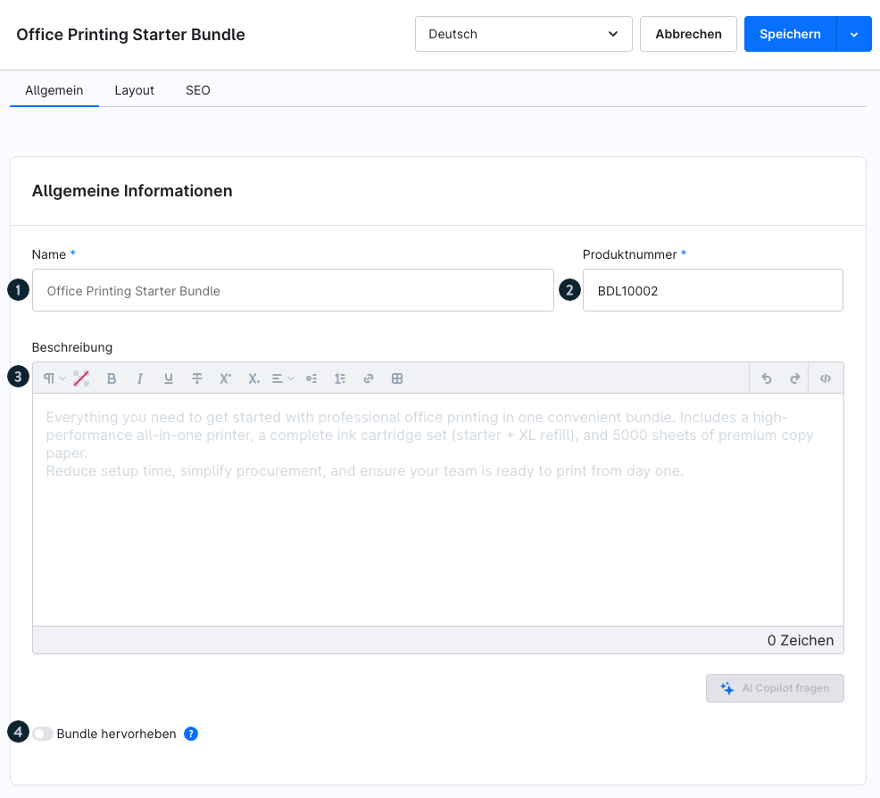
*Basisfelder: Name, Produktnummer, Beschreibung, Hervorhebung*

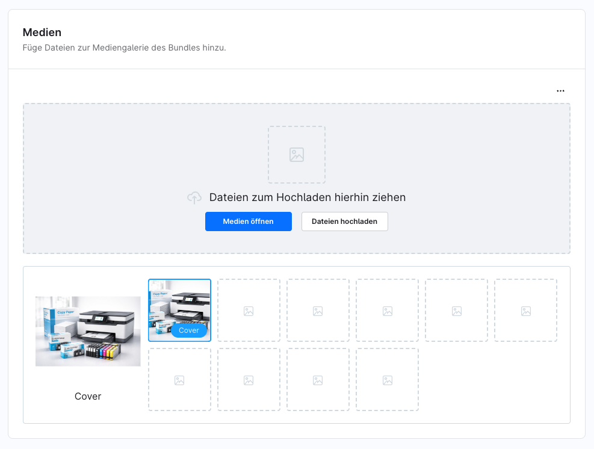
*Medien-Tab: Coverbild und weitere Medien hochladen*

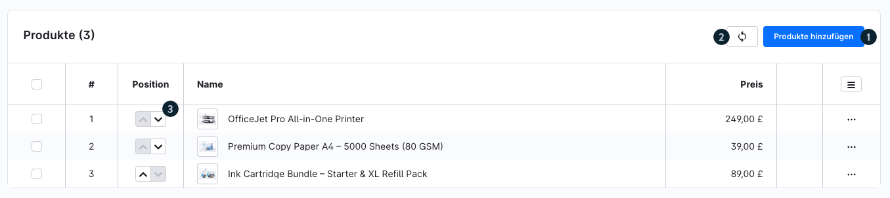
*Produkte hinzufügen und Reihenfolge per Pfeil-Symbole anpassen*

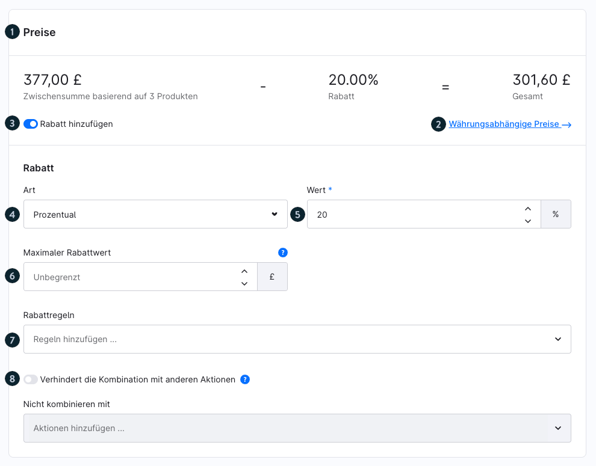
*Preiskonfiguration: Zwischensumme, Rabattart, maximaler Rabattwert, Rabattregeln*

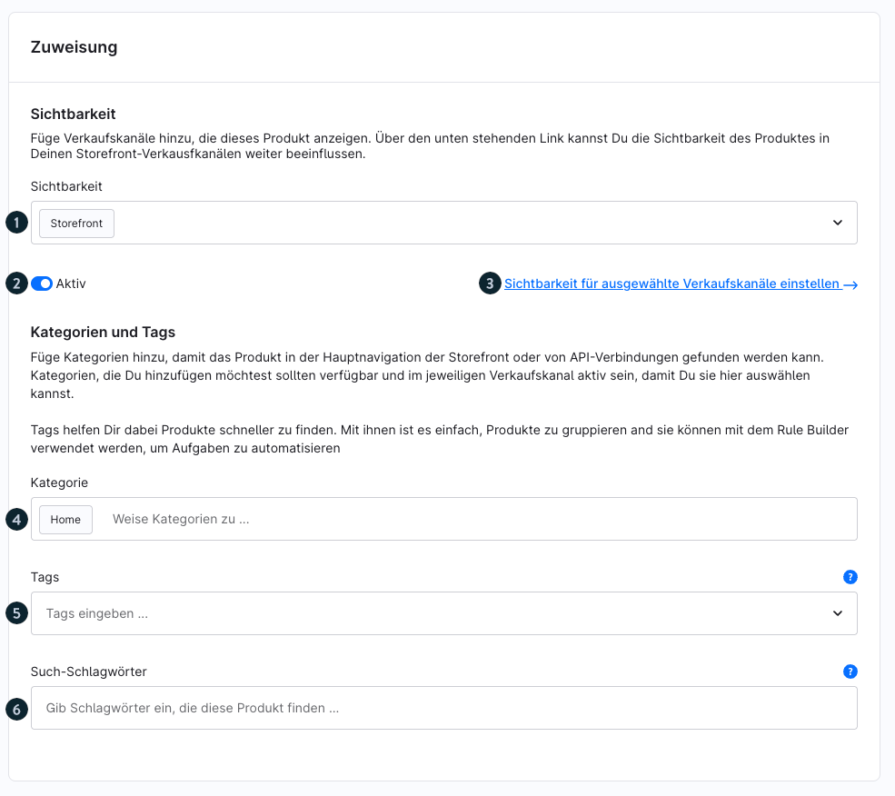
*Verkaufskanal, Aktivierung, Kategorien, Tags, Suchbegriffe*

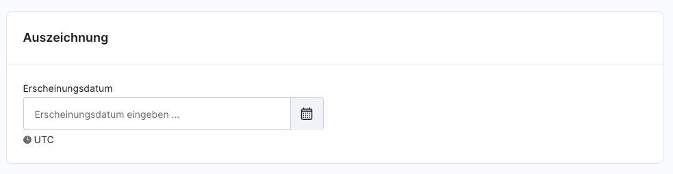
*Erscheinungsdatum als Hinweis für Kunden*

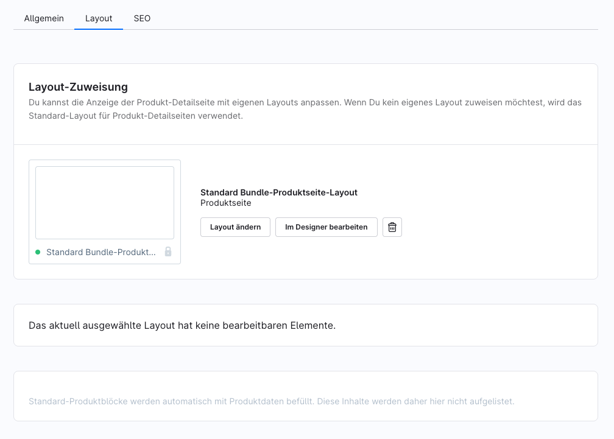
*Erlebniswelt-Seite für das Bundle zuweisen*

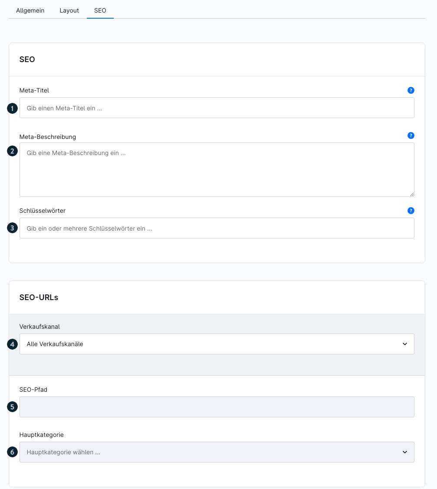
*Meta-Titel, Meta-Beschreibung, SEO-Pfad, Hauptkategorie*

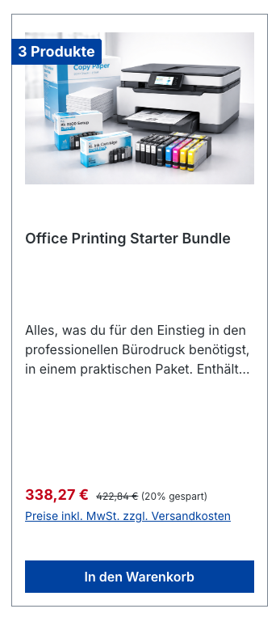
*Bundle in der Produktübersicht (Listing) mit Ersparnis-Badge*

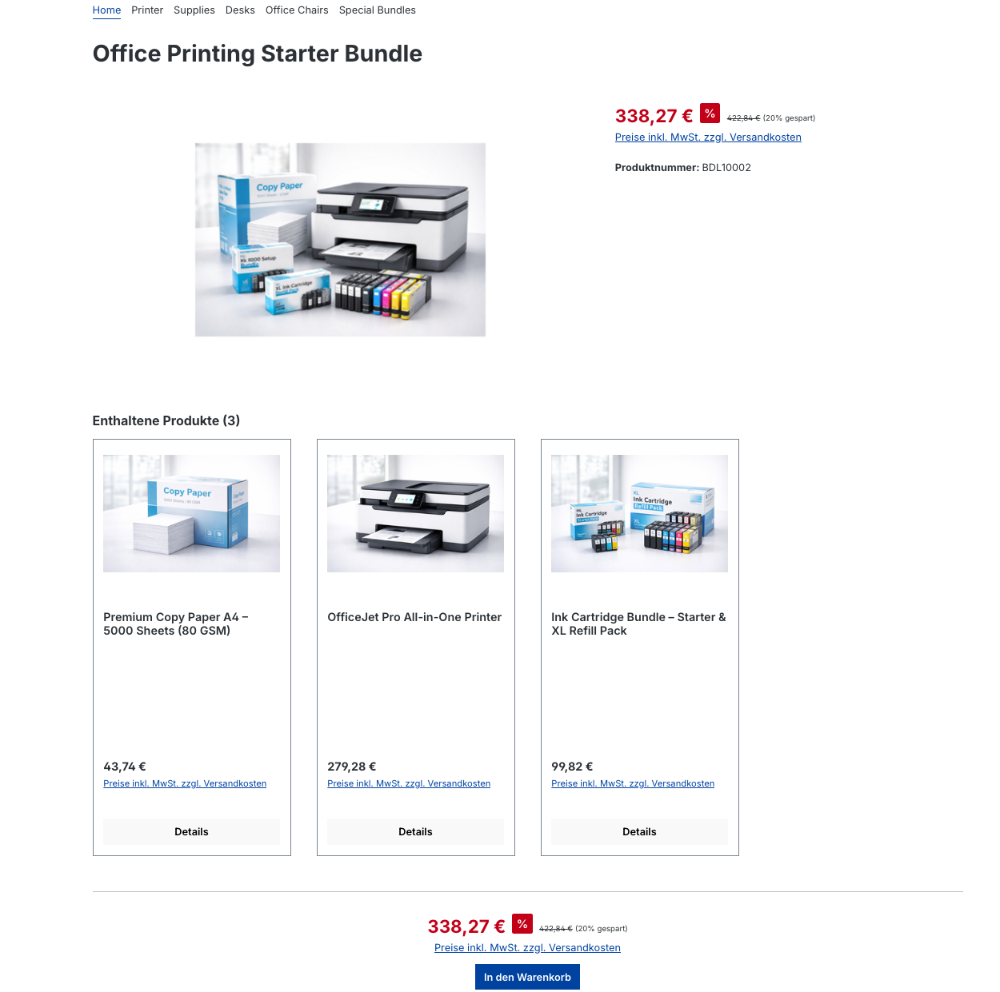
*Bundle-Detailseite mit Gesamtpreis und Einzelprodukten*

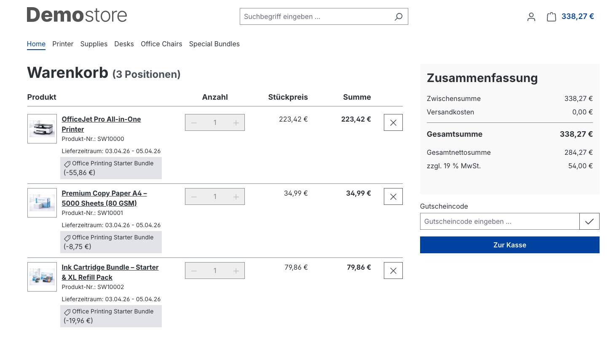
*Bundle im Warenkorb mit automatisch angewendetem Rabatt*

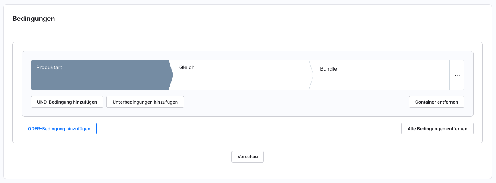
*Filter „Produktart gleich Bundle" in dynamischen Produktgruppen*

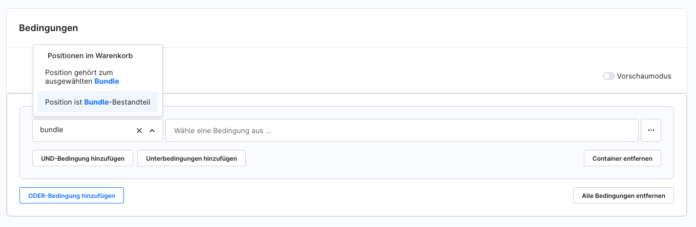
*Bundle-spezifische Bedingungen im Rule Builder*

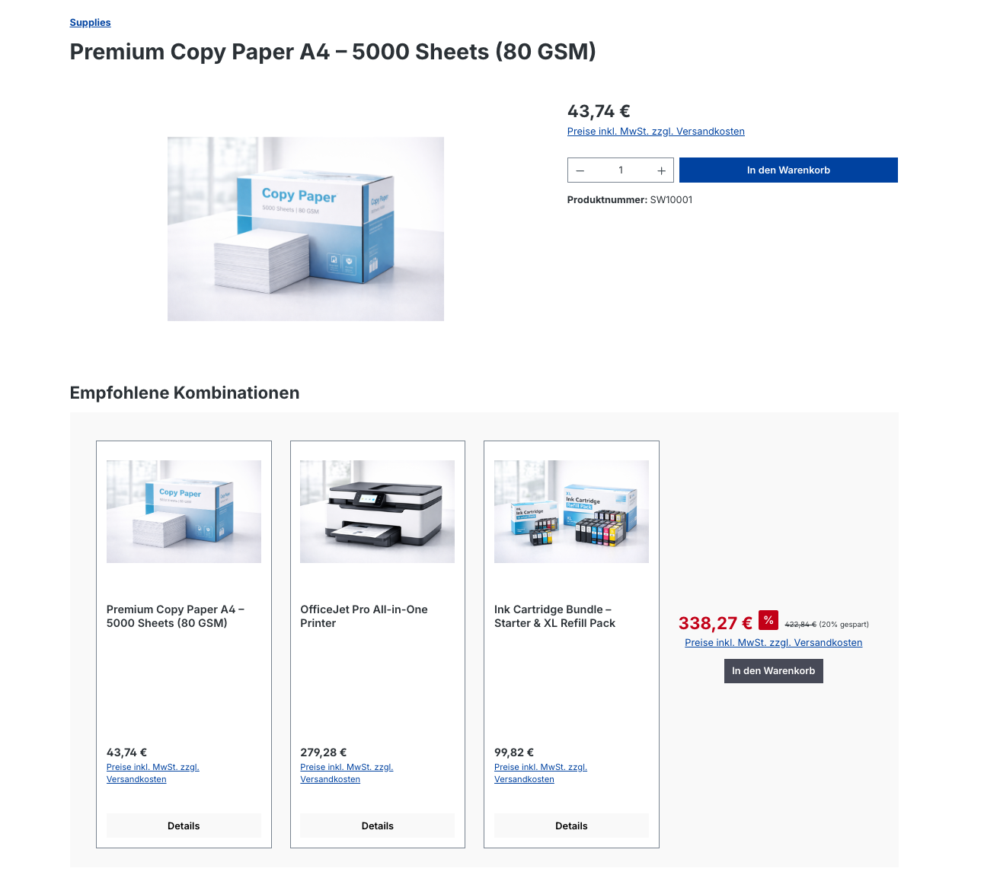
*CMS-Element für Bundle-Empfehlungen in Erlebniswelten*

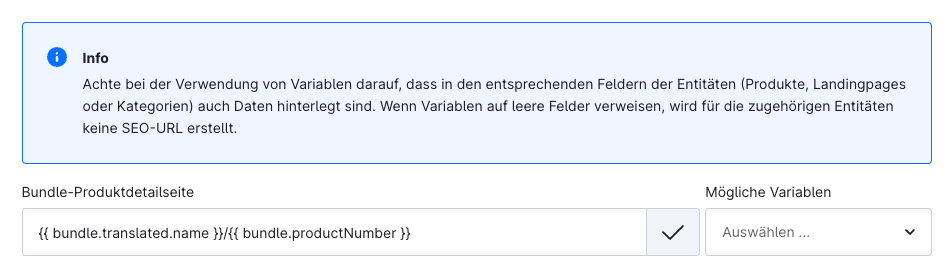
*SEO-URL-Template für Bundles unter Einstellungen > SEO*

---

## 8. Zusammenfassung der Einschränkungen (Blueprint-Phase)

| Einschränkung | Detail |
|---|---|
| Menge pro Produkt | Immer 1 (nicht konfigurierbar) |
| Mindestproduktanzahl | 2 Produkte |
| Funktionsumfang | Minimal – wird basierend auf Feedback ausgebaut |
| Strukturelle Änderungen | Möglich – Blueprint kann sich stark verändern |

---

## Quelle
https://docs.shopware.com/de/shopware-6-de/shopware-services/bundles
https://docs.shopware.com/de/shopware-6-de/insider-previews
