# Shopware 6 – Product Bundles: full reference

> Source: https://docs.shopware.com/de/shopware-6-de/shopware-services/bundles
> Plan: Evolve or higher | Minimum version: 6.7.9.0 | Status: Blueprint

---

## Contents

- [1. Overview](#1-overview)
- [2. Requirements](#2-requirements)
- [3. Typical use cases](#3-typical-use-cases)
- [4. Creating a bundle – step by step](#4-creating-a-bundle-step-by-step)
- [5. Presentation in the storefront](#5-presentation-in-the-storefront)
- [6. Further functions](#6-further-functions)
- [7. Screenshots](#7-screenshots)
- [8. Summary of the limitations (blueprint phase)](#8-summary-of-the-limitations-blueprint-phase)
- [Source](#source)

## 1. Overview

### What are bundles?

A **bundle** is a product that consists of several individual items. Customers buy
the bundle as one overall package, benefit from a **price advantage** and see all
included products clearly laid out on the product detail page.

### Blueprint status – notes

> ⚠ **This feature is currently in blueprint status.** The feature scope
> is deliberately kept minimal in this phase and serves to make features available
> early and to gather feedback.
> Based on feedback the feature may evolve and change considerably in its
> structure.

---

## 2. Requirements

| Property | Detail |
|---|---|
| Status | Blueprint |
| Minimum plan | Evolve or higher |
| Minimum version | 6.7.9.0 |
| Path in the admin | **Kataloge** (Catalogues) > Bundles |

---

## 3. Typical use cases

| Use case | Description |
|---|---|
| **Cross-selling / increasing the basket** | Bundle complementary products that are often bought together |
| **Starter packages / complete solutions** | Products that are only usefully usable together (e.g. a starter kit) |
| **Clearance / stock optimisation** | Combine slow-moving products with bestsellers |

---

## 4. Creating a bundle – step by step

### 4.1 Path

**Kataloge > Bundles** → **"Bundle hinzufügen"** (Add bundle)

---

### 4.2 Defining the general information

| Field | No. | Description |
|---|---|---|
| **Name** | (1) | Bundle name; shown in the product listing and as the heading on the detail page |
| **Produktnummer** (Product number) | (2) | Assign an individual product number; usually done automatically via number ranges |
| **Beschreibung** (Description) | (3) | Overview of the bundle for the customer; shown on the bundle detail page |
| **Bundle hervorheben** (Highlight bundle) | (4) | Activates a badge in the listing (e.g. "Empfohlen" – recommended) for higher visibility |

---

### 4.3 Adding media

- Add images or other media for the visual presentation
- The **cover image** is used in the storefront as the main image of the bundle

---

### 4.4 Adding products to the bundle

| Element | No. | Description |
|---|---|---|
| **Produkte hinzufügen** (Add products) | (1) | Button for adding further items |
| **Daten aktualisieren** (Refresh data) | (2) | Reloads the product data |
| **Position** | (3) | Arrow icons: adjust the order of the products in the bundle |

**Important limitations and notes**:

| Rule | Detail |
|---|---|
| Minimum count | A bundle must contain **at least two products** |
| Quantity | Currently the quantity per product is always **1** (not changeable) |
| Product types | Both **main products** and **variants** can be selected |

---

### 4.5 Configuring prices and discounts

| Element | No. | Description |
|---|---|---|
| **Preise** (Prices) | (1) | Subtotal of all included products, applied discount and total price |
| **Währungsabhängige Preise** (Currency-dependent prices) | (2) | Define individual prices per currency (for international selling) |
| **Rabatt hinzufügen** (Add discount) | (3) | Activate the toggle in order to define a discount |
| **Art** (Type) | (4) | Discount type: **Prozentual** (percentage, e.g. 20 %) or **Fester Betrag** (fixed amount) |
| **Wert** (Value) | (5) | Enter the discount value (e.g. "20" for 20 %) |
| **Maximaler Rabattwert** (Maximum discount value) | (6) | Optional: set an upper limit for the discount amount |
| **Rabattregeln** (Discount rules) | (7) | Conditions for the discount validity (e.g. only certain customer groups/periods) |
| **Kombination mit anderen Aktionen** (Combination with other promotions) | (8) | When activated: prevents the bundle discount from being combined with other promotions |

**Important discount notes**:

> ⚠ The discount is **distributed across the individual products in the checkout** (not shown as a
> separate discount line item).

> ⚠ If a customer removes a product from the bundle, **the bundle discount is lost as well**.

> Further discounts can – depending on the configuration – be applied in addition.

---

### 4.6 Visibility and assignment

| Element | No. | Description |
|---|---|---|
| **Verkaufskanal** (Sales channel) | (1) | Select the sales channel (e.g. Storefront) |
| **Aktiv** (Active) | (2) | Make the bundle visible in the sales channel |
| **Sichtbarkeit für Verkaufskanäle** (Visibility for sales channels) | (3) | Configure detailed visibility per channel |
| **Kategorien** (Categories) | (4) | Assign categories for navigation and findability |
| **Tags** | (5) | Internal structuring; usable for automations (Rule Builder) |
| **Such-Schlagwörter** (Search keywords) | (6) | Additional terms for the storefront search |

---

### 4.7 Auszeichnung (Labelling) – release date

Setting the **Erscheinungsdatum** (Release date):
- Indicates from when a bundle is available in the shop
- If that time has not been reached yet, an **information notice appears on the detail page**
- The bundle **can still be purchased** – the date only serves as a note

---

### 4.8 Layout

- Via the **Layout** tab a **bundle page from the Erlebniswelten** (Shopping Experiences) can be assigned to the bundle
- Allows the product page to be designed completely with its own design

---

### 4.9 SEO settings

| Field | No. | Description |
|---|---|---|
| **Meta-Titel** (Meta title) | (1) | Title for search results; should describe the bundle content precisely |
| **Meta-Beschreibung** (Meta description) | (2) | Short summary; increases the click rate in search results |
| **Schlüsselwörter** (Keywords) | (3) | Relevant search terms for search engine optimisation |
| **Verkaufskanal** | (4) | Which channel the SEO URL applies to (default: all) |
| **SEO-Pfad** (SEO path) | (5) | Define the SEO URL (short, understandable, search engine friendly) |
| **Hauptkategorie** (Main category) | (6) | Influences the URL structure and the classification in the storefront |

---

## 5. Presentation in the storefront

### 5.1 Product listing (overview)

In the product overview a bundle is presented like a normal product.
Customers see:

- Cover image of the bundle
- Name and short description
- Number of included products (e.g. "3 Produkte")
- Reduced total price as well as the **saving** (amount and/or percentage)

### 5.2 Product detail page

Complete overview on the bundle detail page:

- **Total price** including discount and percentage saving
- Overview of all included products with individual prices
- For every included product:
  - Product image
  - Name of the product
  - Individual price
  - Link to the respective product detail page

### 5.3 Cart and checkout

- The bundle is treated as **one coherent offer**
- The bundle discount is **applied automatically**
- The discount is distributed across the individual products
- Further discounts can – depending on the configuration – apply in addition
- If a customer removes a product from the bundle: **the bundle discount is lost**

---

## 6. Further functions

### 6.1 Returns

- **Partial returns** are possible: customers can return individual products from a bundle
  without returning the entire bundle
- The discount is **distributed proportionally across all products**
- The refund is based on the **discounted individual price** of the returned product
- Correct and traceable price calculation even for partial returns

---

### 6.2 Dynamic product groups

Bundles are compatible with **dynamische Produktgruppen** (dynamic product groups):

- Filter: use **"Produktart gleich Bundle"** (Product type equals bundle)
- Allows a targeted presentation of bundles only, in product lists or categories

---

### 6.3 Rule Builder – bundle conditions

Two specific **Bedingungen** (conditions) are available for bundles in the Rule Builder:

| Condition | Description |
|---|---|
| **Position ist Bundle-Bestandteil** (Line item is part of a bundle) | Checks whether an item is part of *any* bundle |
| **Artikel gehört zum ausgewählten Bundle** (Item belongs to the selected bundle) | Checks whether an item belongs to a *specific* bundle |

**Possible applications**:
- Individual prices for bundle components
- Special shipping rules for bundle items
- Discounts & promotions at bundle level

---

### 6.4 CMS element for bundle recommendations

Via the **Erlebniswelten** bundles can also be embedded on product detail pages:

- A dedicated **CMS element "Bundle-Empfehlungen"** (Bundle recommendations) is available
- Shows bundles **that contain the current product**
- Particularly suitable for **cross-selling scenarios**

---

### 6.5 SEO URL templates

- A dedicated **SEO URL template** can be defined for bundles
- Path: **Einstellungen** (Settings) **> SEO**
- Default: the same template as for products
- Can be adjusted individually

---

### 6.6 Finding bundles in the admin

Bundles behave in the admin similarly to products:

- Findable via the **global search**
- Filterable in a targeted way in the **bundle module** (Kataloge > Bundles)

---

### 6.7 API support

- A dedicated **Admin API** for bundles is available
- Bundles can be **created, managed and processed automatically from outside**
- Further information: bundle API documentation (technical docs)

---

## 7. Screenshots

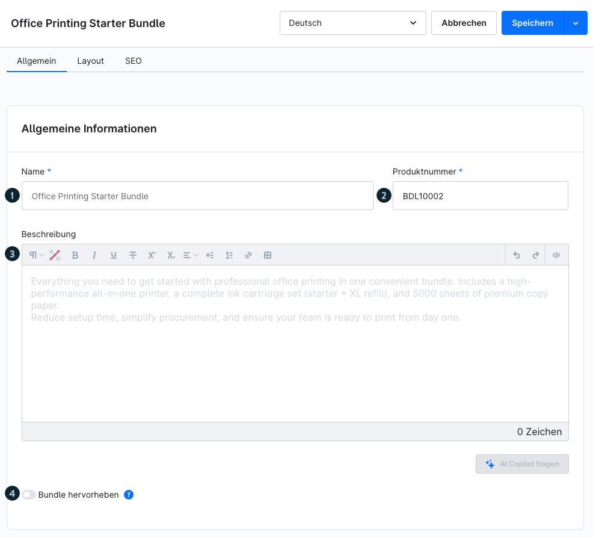
*Basic fields: name, product number, description, highlighting*

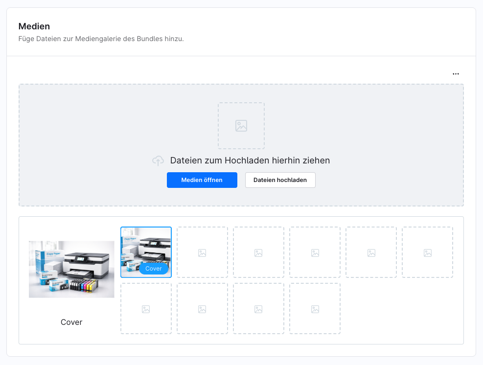
*Media tab: upload the cover image and further media*

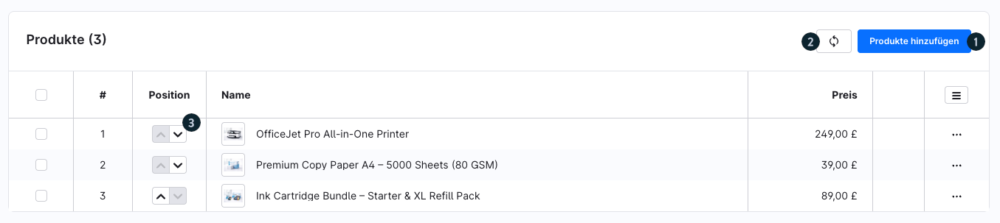
*Add products and adjust the order using the arrow icons*

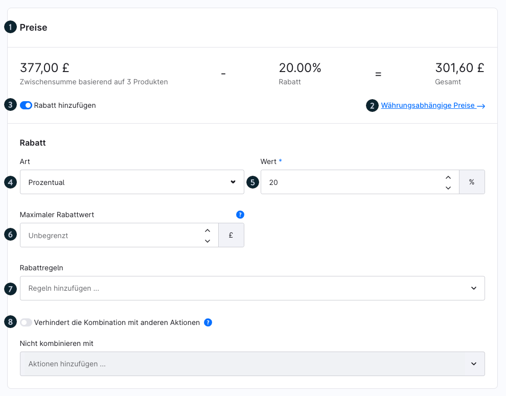
*Price configuration: subtotal, discount type, maximum discount value, discount rules*

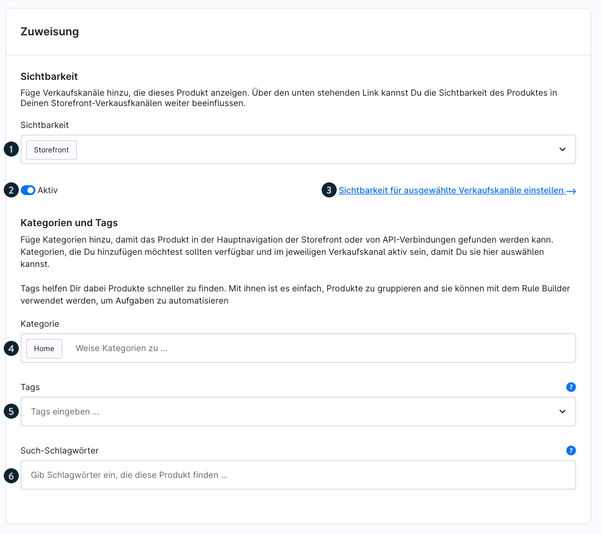
*Sales channel, activation, categories, tags, search terms*

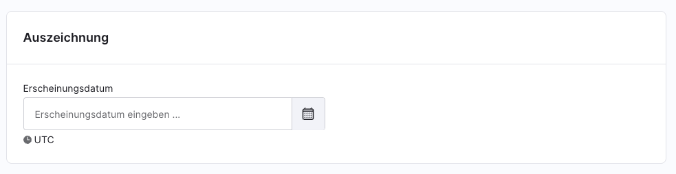
*Release date as a note for customers*

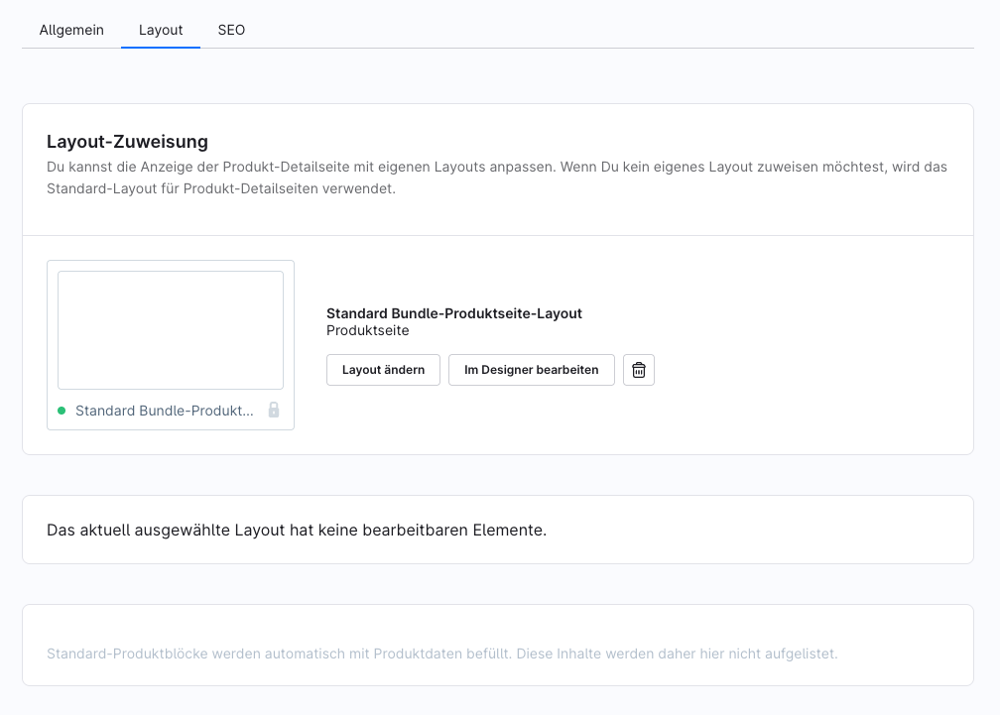
*Assign a Erlebniswelten page to the bundle*

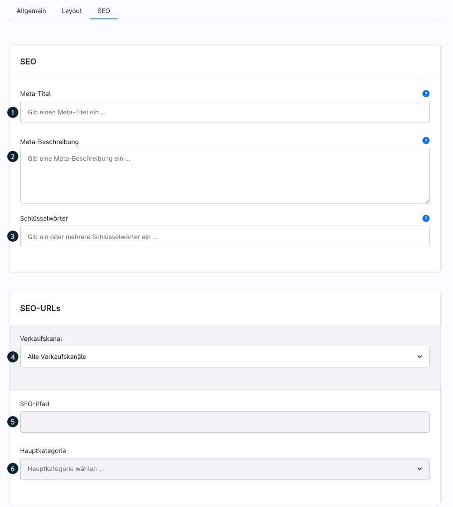
*Meta title, meta description, SEO path, main category*

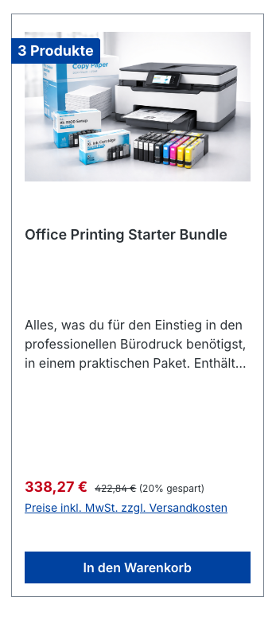
*Bundle in the product overview (listing) with a saving badge*

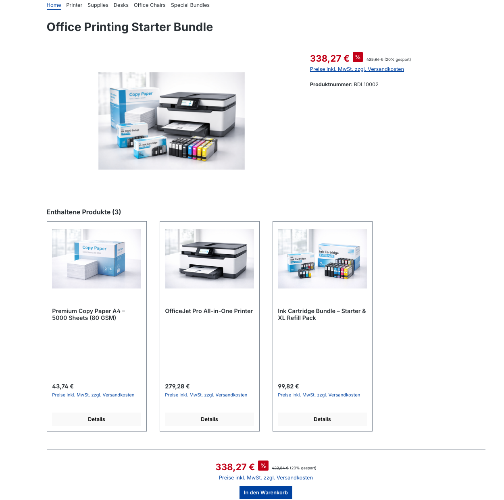
*Bundle detail page with total price and individual products*

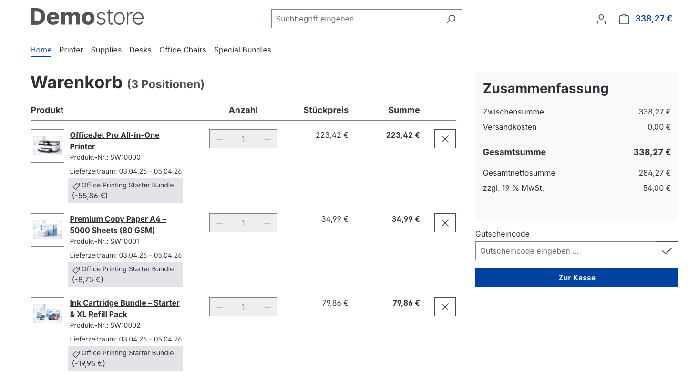
*Bundle in the cart with the automatically applied discount*

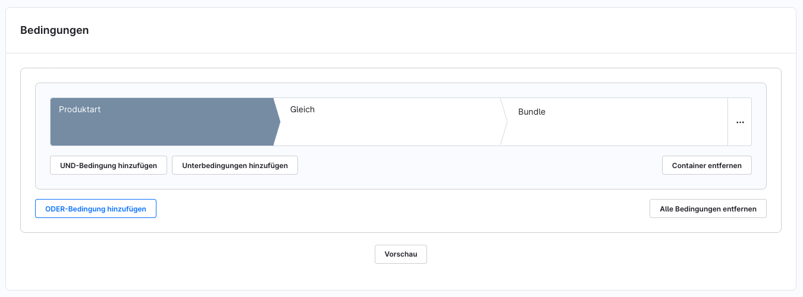
*Filter "Produktart gleich Bundle" in dynamic product groups*

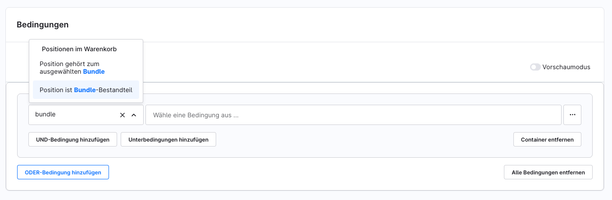
*Bundle-specific conditions in the Rule Builder*

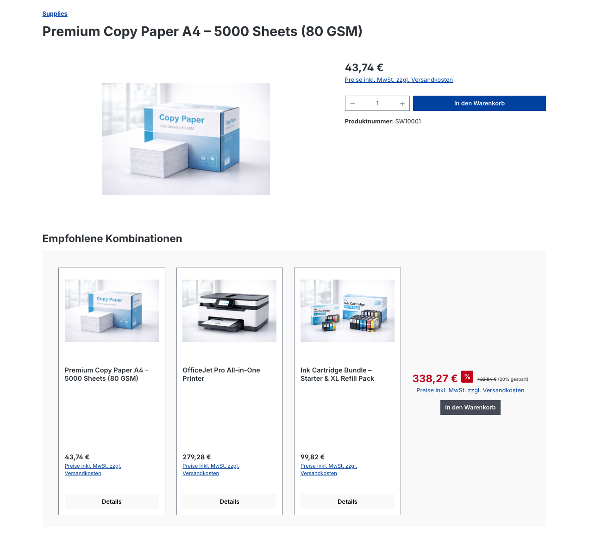
*CMS element for bundle recommendations in the Erlebniswelten*

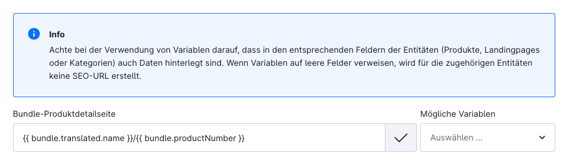
*SEO URL template for bundles under Einstellungen > SEO*

---

## 8. Summary of the limitations (blueprint phase)

| Limitation | Detail |
|---|---|
| Quantity per product | Always 1 (not configurable) |
| Minimum product count | 2 products |
| Feature scope | Minimal – will be expanded based on feedback |
| Structural changes | Possible – a blueprint can change considerably |

---

## Source
https://docs.shopware.com/de/shopware-6-de/shopware-services/bundles
https://docs.shopware.com/de/shopware-6-de/insider-previews
