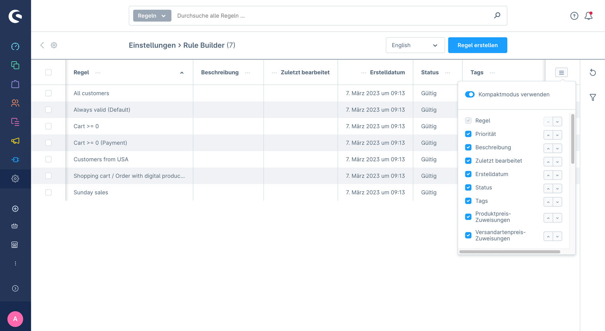
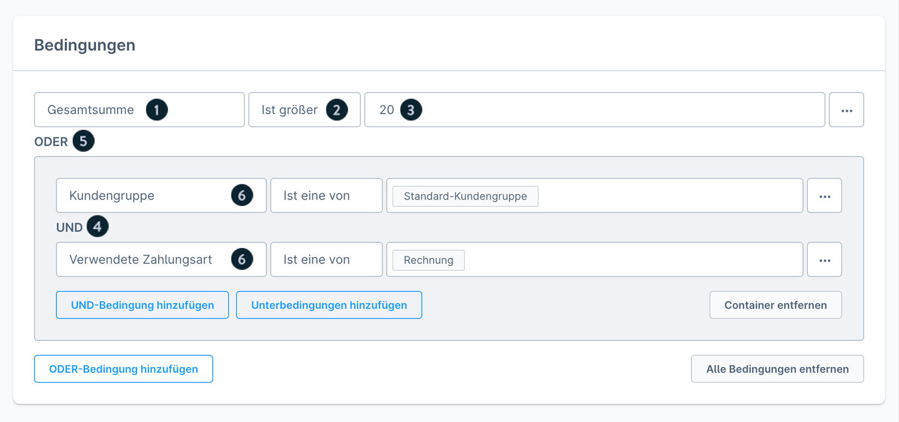
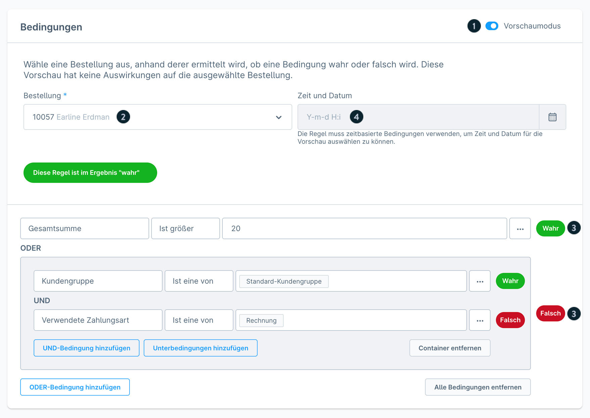
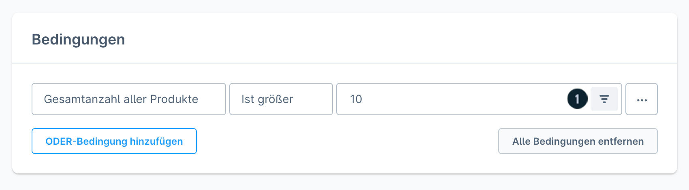
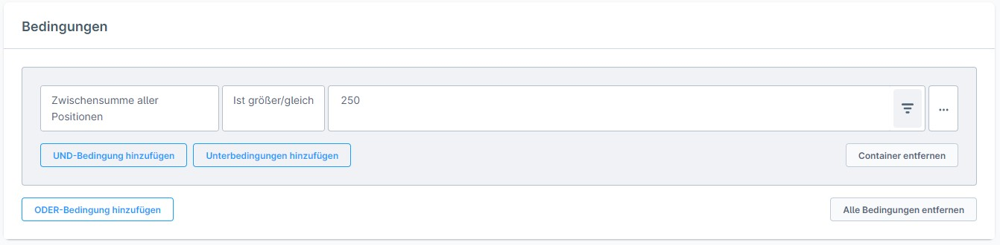
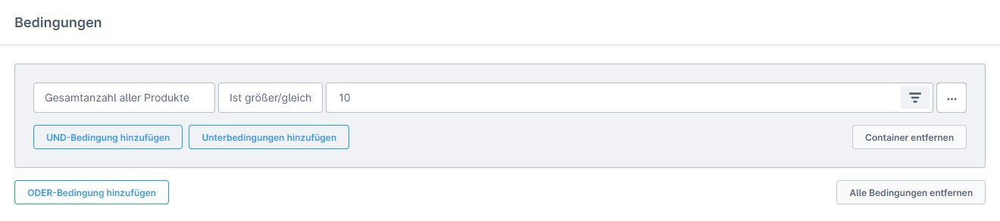
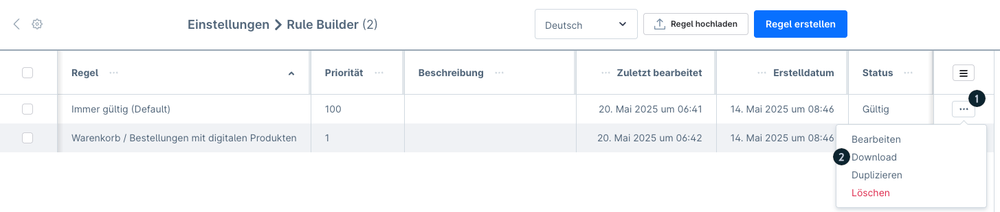
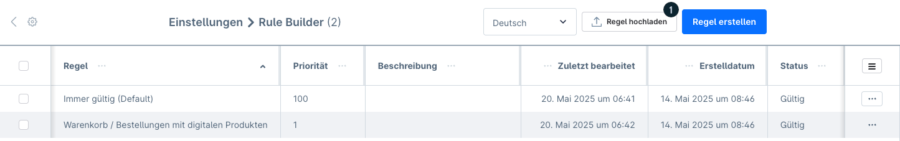
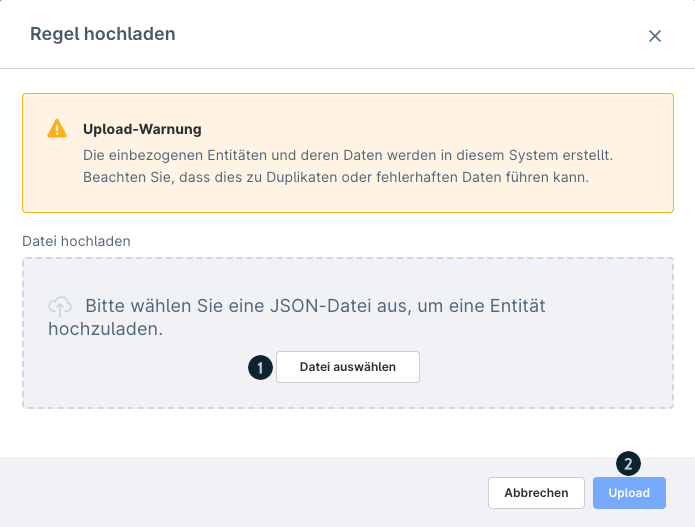

# Rule Builder

**Pfad:** Einstellungen > Automatisierung > Rule Builder
**Version:** ab Shopware 6.0.0 (Regeln teilen ab v6.7.1.0 mit Rise-Plan)

## Beschreibung

Der Rule Builder ermöglicht die Erstellung regelbasierter Bedingungen für verschiedene Shopware-Funktionen. Er wird besonders für die Konfiguration von Rabattaktionen unter Marketing > Rabatte & Aktionen verwendet.

---

## Übersicht

Die Übersichtsseite zeigt alle Regeln in einer Tabelle.

### Standard-Spalten

| Spalte | Beschreibung |
|--------|--------------|
| Regel | Name der Regel |
| Priorität | Reihenfolge der Regelausführung |
| Beschreibung | Erläuterung der Regel |
| Zuletzt bearbeitet | Datum der letzten Änderung |
| Erstelldatum | Datum der Erstellung |
| Status | Aktiv / Inaktiv |

### Erweiterte Spalten (einblendbar)

| Spalte | Beschreibung |
|--------|--------------|
| Produktpreis-Zuweisung | Anzahl der Produktpreise die diese Regel nutzen |
| Versandartenpreis-Zuweisung | Anzahl der Versandarten die diese Regel nutzen |
| Flow-Zuweisung | Anzahl der Flows die diese Regel nutzen |
| Rabatt-Zuweisung | Anzahl der Rabattaktionen die diese Regel nutzen |

---

## Komponenten einer Regel

### Allgemeine Informationen

| Feld | Beschreibung |
|------|--------------|
| **Name** | Identifikation der Regel |
| **Beschreibung** | Dokumentation des Anwendungsfalls |
| **Priorität** | Höherer Wert = höhere Priorität bei gleichzeitiger Ausführung |
| **Typ** | Einschränkung der Zuweisungsmöglichkeiten |
| **Tags** | Organisationshilfe für die Übersicht |

### Bedingungsstruktur

| Element | Beschreibung |
|---------|--------------|
| **Bedingung** | Parameter-Abfrage (z. B. "Gesamtsumme") |
| **Operator** | Vergleichsmethode (größer, kleiner, gleich) |
| **Eingabewert** | Vergleichswert (z. B. 50 für 50 €) |
| **UND-Verknüpfung** | Alle Bedingungen müssen erfüllt sein |
| **ODER-Verknüpfung** | Mindestens eine Bedingung muss erfüllt sein |
| **Unterbedingungen** | Automatisch erstellt bei Wechsel der Verknüpfungsart |

---

## Regel erstellen – Schritt-für-Schritt

1. Zu Einstellungen > Automatisierung > Rule Builder navigieren
2. Schaltfläche "Regel erstellen" klicken
3. **Name** und optional **Beschreibung** eingeben
4. **Priorität** festlegen (Standard: 1)
5. Schaltfläche "Bedingung hinzufügen" klicken
6. Bedingungstyp aus Dropdown wählen
7. **Operator** auswählen
8. **Eingabewert** eingeben
9. Weitere Bedingungen mit UND/ODER verknüpfen (optional)
10. **Speichern** klicken

---

## Regeln löschen

> **Wichtig:** Regeln können nicht gelöscht werden, solange sie einer Funktion zugewiesen sind. Zuerst alle Zuweisungen entfernen.

- Löschung über das Kontextmenü (drei Punkte) in der Übersicht
- Gelöschte Regeln sind nicht wiederherstellbar

---

## Zuweisungsmöglichkeiten

Regeln können folgenden Bereichen zugewiesen werden:

| Bereich | Zweck |
|---------|-------|
| Zahlungsmethoden | Verfügbarkeit einschränken |
| Versandmethoden | Verfügbarkeit einschränken |
| Versandkosten | Berechnung steuern |
| Promotions | Bedingungen für Rabattaktionen |
| Erweiterte Preise | Produktpreisberechnung |
| Flow Builder | Automatisierungsregeln |
| Produktsichtbarkeit | Dynamic Access (kostenpflichtig) |
| Kategoriesichtbarkeit | Dynamic Access (kostenpflichtig) |
| Shopping Experience | Block-Sichtbarkeit steuern |

---

## Vorschaumodus

> **Verfügbarkeit:** Rise-Plan und höher

Der Vorschaumodus ermöglicht die Echtzeit-Prüfung einer Regel:

1. Regel öffnen
2. Reiter "Vorschau" wählen
3. Bestellung auswählen
4. Optional: Zeitpunkt simulieren
5. Ergebnis: WAHR/FALSCH für jede Bedingung

---

## Bedingungen mit optionalem Filter

Drei Bedingungen bieten ein Filter-Symbol zur weiteren Eingrenzung:

| Bedingung | Filter-Option |
|-----------|---------------|
| Zwischensumme aller Positionen | Nach Kategorie filtern |
| Gesamtanzahl aller Produkte | Nach Tags filtern |
| Gesamtanzahl unterschiedlicher Produkte | Nach Streichpreis filtern |

---

## Alle Operatoren

| Operator | Beschreibung |
|----------|--------------|
| **Mind. eine** | Mindestens ein Wert in der Liste muss passen |
| **Alle** | Alle Werte in der Liste müssen passen |
| **Gleich** | Exakte Übereinstimmung mit dem Wert |
| **Ungleich** | Keine Übereinstimmung mit dem Wert |
| **Ist eine von** | Übereinstimmung mit einem der angegebenen Werte |
| **Ist keine von** | Keine Übereinstimmung mit den angegebenen Werten |
| **Größer** | Größer als der Eingabewert |
| **Größer gleich** | Größer oder gleich dem Eingabewert |
| **Kleiner** | Kleiner als der Eingabewert |
| **Kleiner gleich** | Kleiner oder gleich dem Eingabewert |

---

## Alle Bedingungskategorien

### 1. Allgemein (8 Bedingungen)

| Bedingung | Beschreibung |
|-----------|--------------|
| Ausgelöst durch Admin-API | Prüft ob die Anfrage über die Admin-API kam |
| Datumsbereich | Datum liegt zwischen zwei Werten |
| Immer zutreffend | Bedingung ist immer erfüllt |
| Sprache | Aktuelle Shop-Sprache |
| Steuerdarstellung | Brutto- oder Netto-Darstellung |
| Verkaufskanal | Welcher Verkaufskanal aktiv ist |
| Währung | Aktuelle Währung |
| Wochentag | Aktueller Wochentag |
| Zeitraum | Aktueller Zeitpunkt liegt in einem Zeitraum |

### 2. Bestellungen (11 Bedingungen)

| Bedingung | Beschreibung |
|-----------|--------------|
| Affiliate-Code | Bestellung enthält bestimmten Affiliate-Code |
| Bestellstatus | Status der Bestellung |
| Bestellung mit Dokument | Dokument einem Typ zugeordnet |
| Bestellung mit gesendeter Dokumenten-Art | Dokument wurde versendet |
| Bestellung mit Tag | Bestellung hat bestimmten Tag |
| Bestellung mit Zusatzfeld | Benutzerdefiniertes Feld hat Wert |
| Bestellung vom Administrator erstellt | Erstellt in der Administration |
| Kampagnen-Code | Bestimmter Kampagnen-Code vorhanden |
| Lieferstatus | Status der Lieferung |
| Zahlungsstatus | Status der Zahlung |
| In Administration verwendbar | Regel kann in der Administration genutzt werden |

### 3. Kunde (25 Bedingungen)

#### Demografisch

| Bedingung | Beschreibung |
|-----------|--------------|
| Kundenalter | Alter des Kunden |
| Kunden-Geburtstag | Geburtstag des Kunden (Datum) |
| Kundenanrede | Anrede des Kunden |
| Kundennachname | Nachname des Kunden |
| Kundennummer | Kundennummer |

#### Verhalten

| Bedingung | Beschreibung |
|-----------|--------------|
| Angemeldeter Kunde | Kunde ist eingeloggt |
| Anzahl abgeschlossener Bestellungen | Bestellhistorie des Kunden |
| Firmenkunde | Ist ein B2B-Kunde |
| Gastbesteller | Bestellung als Gast |
| Gesamtwert aller abgeschlossenen Bestellungen | Summe aller Bestellungen |
| Kunde ist aktiv | Kundenkonto ist aktiv |
| Kunde ist Newsletter-Empfänger | Hat Newsletter abonniert |
| Zeit seit der ersten Anmeldung | Wie lange ist der Kunde registriert |
| Zeit seit der letzten Anmeldung | Letzter Login-Zeitpunkt |
| Zeit seit letzter Bestellung | Letzte Bestellung |

#### Adressdaten

| Bedingung | Beschreibung |
|-----------|--------------|
| Lieferadresse: Bundesland | Bundesland der Lieferadresse |
| Lieferadresse: Land | Land der Lieferadresse |
| Lieferadresse: Postleitzahl | PLZ der Lieferadresse |
| Lieferadresse: Stadt | Stadt der Lieferadresse |
| Lieferadresse: Straße | Straße der Lieferadresse |
| Rechnungsadresse: Bundesland | Bundesland der Rechnungsadresse |
| Rechnungsadresse: Land | Land der Rechnungsadresse |
| Rechnungsadresse: Postleitzahl | PLZ der Rechnungsadresse |
| Rechnungsadresse: Stadt | Stadt der Rechnungsadresse |
| Rechnungsadresse: Straße | Straße der Rechnungsadresse |

#### Konfiguration

| Bedingung | Beschreibung |
|-----------|--------------|
| Kunden-E-Mail-Adresse | E-Mail-Adresse (Wildcard `*` unterstützt) |
| Kunde mit abweichender Lieferadresse | Lieferadresse weicht von Rechnungsadresse ab |
| Kunde mit Standardzahlungsart | Hinterlegte Standardzahlungsart |
| Kunde mit Tag | Kunde hat bestimmten Tag |
| Kunde mit Zusatzfeld | Benutzerdefiniertes Feld hat Wert |
| Neukunde *(veraltet)* | Verwende stattdessen "Zeit seit erste Anmeldung" |

### 4. Marketing & Rabattaktionen (4 Bedingungen)

| Bedingung | Beschreibung |
|-----------|--------------|
| Anzahl der Rabatte | Anzahl aktiver Rabattaktionen im Warenkorb |
| Rabattaktion | Bestimmte Rabattaktion ist aktiv |
| Rabattaktionen mit Aktionscodetyp | Typ des verwendeten Aktionscodes |
| Zwischensumme aller Rabatte | Gesamtrabattsumme im Warenkorb |

### 5. Positionen im Warenkorb (30+ Bedingungen)

#### Bestand

| Bedingung | Beschreibung |
|-----------|--------------|
| Position mit Lagerbestand | Lagerbestand des Artikels |
| Position mit verfügbarem Bestand | Verfügbarer Bestand |
| Artikel auf Lager | Artikel ist lagernd |

#### Produkteigenschaften

| Bedingung | Beschreibung |
|-----------|--------------|
| Position mit Breite/Höhe/Länge/Volumen | Maße des Produkts |
| Position mit Einkaufspreis | EK-Preis |
| Position mit Erscheinungsdatum | Erscheinungsdatum |
| Position mit Erstellungsdatum | Erstelldatum |
| Position mit Gewicht | Gewicht des Produkts |
| Position mit Hersteller | Hersteller des Produkts |
| Position mit prozentualen Preis/Streichpreis Verhältnis | Rabattverhältnis |
| Position mit Steuersatz | Mehrwertsteuersatz |
| Position mit Streichpreis | Streichpreis vorhanden |
| Position mit Tag | Produkt hat bestimmten Tag |
| Position mit Varianten- oder Eigenschaftsausprägung | Variante/Eigenschaft |
| Position mit Zusatzfeld | Custom-Field-Wert |

#### Status & Kategorisierung

| Bedingung | Beschreibung |
|-----------|--------------|
| Position als "neu" markiert | Produkt ist als neu markiert |
| Position im Abverkauf | Clearance-Produkt |
| Position in dynamischer Produktgruppe | Dynamische Gruppe |
| Position in Kategorie | Kategorie des Produkts |
| Position ist hervorgehoben | Featured-Produkt |
| Position ist versandkostenfrei | Versandkostenfrei-Flag |
| Position mit Durchschnittsbewertung | Kundenbewertung |
| Position vom Typ | Produkt- oder Gutscheintyp |

#### Mengen & Preise

| Bedingung | Beschreibung |
|-----------|--------------|
| Anzahl unterschiedlicher Positionen | Anzahl verschiedener Artikel |
| Positionsanzahl | Menge eines Artikels im Warenkorb |
| Positionsstückpreis | Preis pro Stück |
| Positionszwischensumme | Zwischensumme einer Position |
| Zwischensumme aller Positionen | Gesamtwert aller Positionen (mit Filter) |

### 6. Warenkorb (10 Bedingungen)

| Bedingung | Beschreibung |
|-----------|--------------|
| Gesamtanzahl aller Produkte | Gesamte Produktmenge (mit Filter) |
| Gesamtanzahl unterschiedlicher Produkte | Anzahl verschiedener Produkte (mit Filter) |
| Gesamtgewicht aller Produkte | Gesamtgewicht |
| Gesamtsumme | Gesamtbetrag des Warenkorbs |
| Gesamtvolumen aller Produkte | Gesamtvolumen |
| Summe | Summe (ohne bestimmte Positionen) |
| Versandkosten | Aktuelle Versandkosten |
| Verwendete Versandart | Gewählte Versandmethode |
| Verwendete Zahlungsart | Gewählte Zahlungsmethode |

---

## Regeln teilen (ab v6.7.1.0, Rise-Plan)

### Regel herunterladen (Export)

1. In der Übersicht Kontextmenü `[...]` der Regel öffnen
2. Option "Herunterladen" wählen
3. JSON-Datei wird heruntergeladen (enthält alle Bedingungen, Operatoren, Referenzen)

> **Hinweis:** Kunden, Kundengruppen und Verkaufskanäle aus der Regel können im Ziel-Shop fehlen.

### Regel hochladen (Import)

1. In der Übersicht Schaltfläche "Regel hochladen" klicken
2. JSON-Datei auswählen
3. Validierung läuft automatisch
4. Fehlende Referenzen können neu zugeordnet werden

