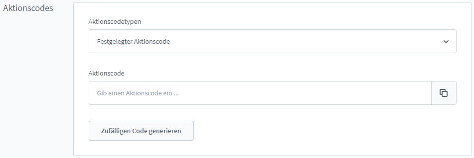
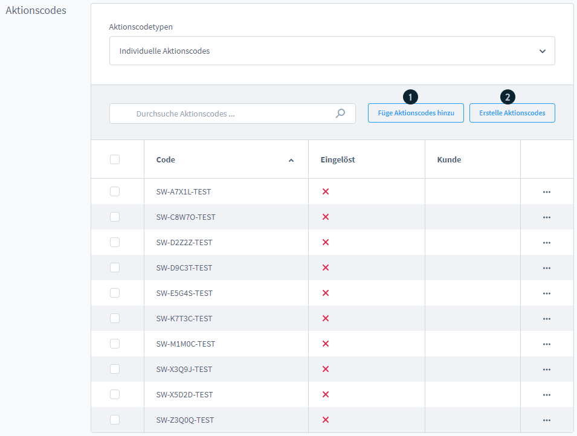
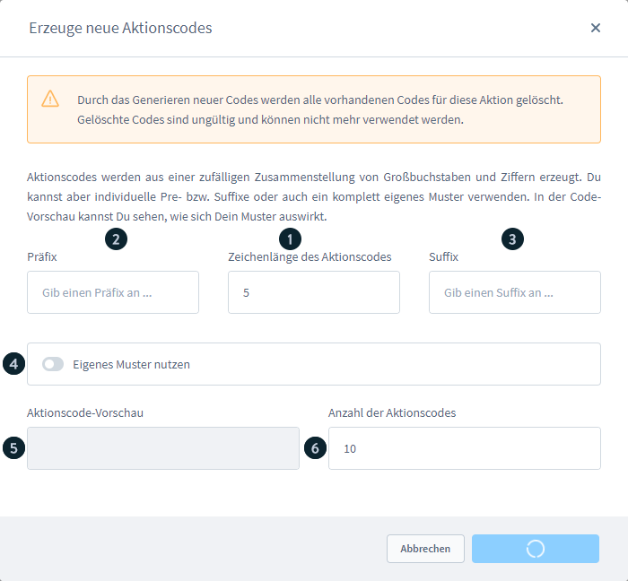
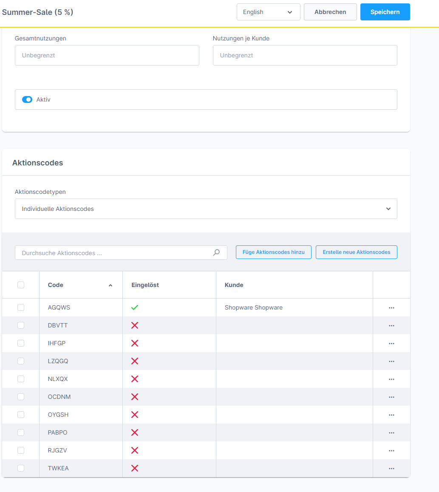
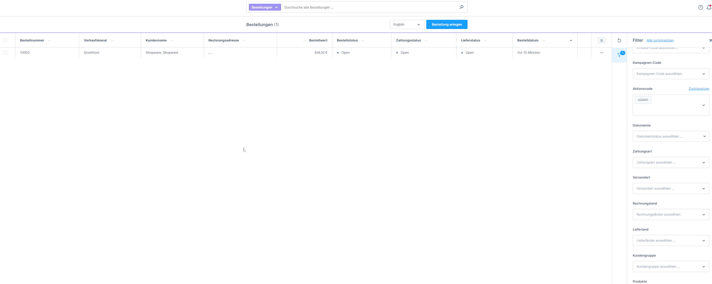

# Aktionscodes (Promotion codes) – Rabatte & Aktionen

**Path:** Admin > Marketing > **Rabatte & Aktionen** (Discounts & promotions) > [promotion] > tab "**Allgemein**" (General)
**Version:** from Shopware 6.0.0

## Contents

- [Overview of the code types](#overview-of-the-code-types)
- [No promotion code required](#no-promotion-code-required)
- [Fixed promotion code](#fixed-promotion-code)
- [Individual promotion codes](#individual-promotion-codes)
- [Redeeming codes in the storefront](#redeeming-codes-in-the-storefront)
- [Frequently asked questions](#frequently-asked-questions)

## Overview of the code types

In every discount promotion it can be defined under the tab **Allgemein > Aktionscodes** how customers activate the promotion:

| Type | Description | Use case |
|-----|--------------|----------------|
| **Kein Aktionscode erforderlich** (No promotion code required) | The promotion is applied automatically | Automatic discounts (e.g. VIP, free shipping) |
| **Festgelegter Aktionscode** (Fixed promotion code) | One uniform code for all customers | General discount promotions (e.g. a newsletter mailing) |
| **Individuelle Aktionscodes** (Individual promotion codes) | Single-use codes per customer | Personalised offers, prize draws |

---

## No promotion code required

The promotion is applied automatically to all carts that meet the defined conditions. The customer does not have to enter a code.

**Typical scenarios of use:**
- Free shipping above a minimum order value
- Customer group discounts
- VIP customer discounts

---

## Fixed promotion code

One code that several customers can use.

### Configuration

1. Choose the option "Festgelegter Aktionscode"
2. Enter the code in the text field (e.g. `SOMMER20`)
3. Save

### Usage rules

- The code can be redeemed multiple times
- The total usage and the usage per customer limit how often it can be used
- The code is case-sensitive (mind upper/lower case)

### Tracking

Redeemed fixed codes can be filtered in the order overview:

1. Open **Bestellungen > Übersicht** (Orders > Overview)
2. Set the filter: "Aktionscode" = [code]
3. All orders with this code are displayed

---

## Individual promotion codes

Single-use codes for individual customers. Every code can be redeemed only once.

### Generating codes

1. Choose the option "Individuelle Aktionscodes"
2. Click the "**Codes erzeugen**" (Generate codes) button
3. Enter the number of desired codes
4. Optional: define a prefix/suffix for the codes
5. Confirm the generation

### Rules for individual codes

> **Important:** it is not possible to apply several different individual codes from one single promotion at the same time.

- Every generated code is unique
- After redemption the code is deactivated
- New codes can be generated at any time

### Tracking individual codes

**In the promotion detail view:**
- Open Marketing > Rabatte & Aktionen
- Open the desired promotion
- The tab "Aktionscodes" shows all codes with their status (redeemed / not redeemed)

**In the order overview:**
- Open Bestellungen > Übersicht
- Filter: "Aktionscode" = [desired code]
- The associated order is displayed

---

## Redeeming codes in the storefront

Customers enter codes in the cart:

1. Open the cart or the off-canvas cart
2. Find the field "Gutschein-Code eingeben" (Enter voucher code)
3. Enter the code
4. Click the confirmation button
5. The discount is shown in the item list

---

## Frequently asked questions

### Can I use one code for several promotions?

No. Every code is assigned to one promotion. However, several promotions can be active at the same time and different codes can be applied.

### What happens when a code has expired?

If the promotion is no longer active (the **Gültigkeitszeitraum** – validity period – has expired or it has been deactivated), the code is rejected as invalid.

### Can I export individual codes?

Codes can be exported from the promotion detail view, in order to send them out by newsletter, for example.
