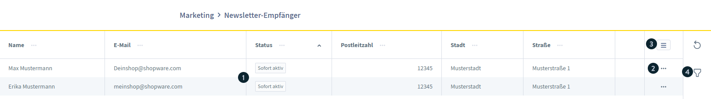
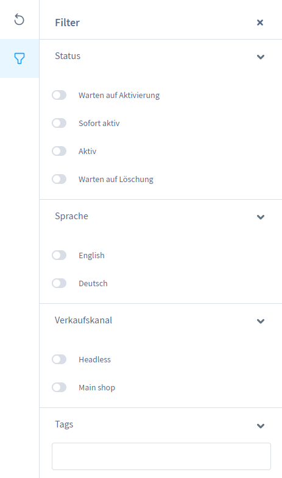
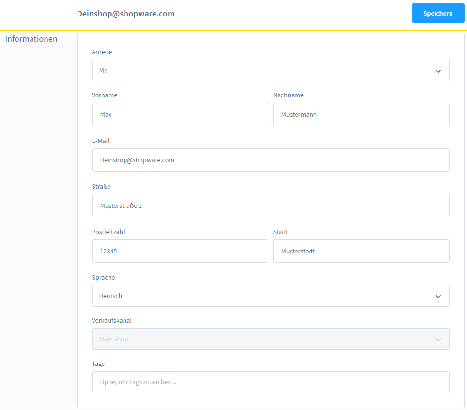

# Newsletter Empfänger (Newsletter recipients)

**Path:** Admin > Marketing > **Newsletter Empfänger**
**Version:** from Shopware 6.0.0

## Description

The "Newsletter Empfänger" page shows a list of all customers who have signed up for the newsletter in their account. Here merchants can manage, filter and edit recipients.

---

## Overview

The overview page contains the following elements:

| Element | Description |
|---------|--------------|
| **(1) List** | All newsletter recipients with their status and basic info |
| **(2) Context menu** | Per entry: edit or remove |
| **(3) List settings** | Adjust the columns, entries per page |
| **(4) Filter** | Filter by status, language, sales channel |

---

## Status options

Every recipient has one of the following statuses:

| Status | Description |
|--------|--------------|
| **Warten auf Aktivierung** (Waiting for activation) | The double opt-in email has been sent, but not confirmed yet |
| **Sofort Aktiv** (Directly active) | Signed up without the double opt-in process |
| **Aktiv** (Active) | The registration has been confirmed via double opt-in |
| **Warten auf Löschung** (Waiting for deletion) | The recipient has unsubscribed from the newsletter |

> **Note:** the status "Warten auf Aktivierung" means that the customer has not clicked the confirmation email yet. Only after confirmation does the status change to "Aktiv".

---

## Filter functionality

Via the filter button recipients can be filtered by:

- **Status:** Aktiv, Warten auf Aktivierung, Sofort Aktiv, Warten auf Löschung
- **Sprache** (Language)**:** the language version of the shop
- **Verkaufskanal** (Sales channel)**:** which shop channel the recipient is assigned to

---

## Editing a recipient

A recipient can be edited via the context menu or by clicking an entry.

### Editable fields

| Field | Description |
|------|--------------|
| **E-Mail-Adresse** (Email address) | Change the recipient's email |
| **Adresse** (Address) | Update the delivery address |
| **Sprache** (Language) | Adjust the newsletter language |
| **Tags** | Assign your own keywords for later search and filtering |

> **Tags:** allow your own keywords to be stored, which can then be searched for in the overview. Useful for segmentation (e.g. "VIP", "Kunde2023").

---

## Removing a recipient

Via the context menu a recipient can be removed from the list. This deletes the entry from the newsletter recipient list, but does not remove the customer record itself.

---

## Relationship with the Rule Builder

The newsletter status can be used as a condition in the Rule Builder:

**Condition:** `Kunde ist Newsletter-Empfänger` (Customer is a newsletter recipient)

This makes automatic discounts for active newsletter recipients possible, for example. See `sw-merchant-marketing-rule-builder` for details.

---

## Typical use cases

1. **Check the double opt-in:** filtering by the status "Warten auf Aktivierung" shows recipients who have not clicked the confirmation email yet.
2. **Unsubscribed recipients:** filtering by the status "Warten auf Löschung" for a GDPR-compliant cleanup.
3. **Segmentation:** assign tags and filter by tags for targeted email marketing.
4. **Sales channel specific:** filter by sales channel for multi-shop operation.
