# Rabatte & Aktionen (Discounts & promotions)

**Path:** Admin > Marketing > **Rabatte & Aktionen**
**Version:** from Shopware 6.0.0 (currently 6.7.0.0)

## Contents

- [Description](#description)
- [Overview](#overview)
- [Creating a new discount promotion](#creating-a-new-discount-promotion)
- [Storefront application](#storefront-application)
- [15 practical application examples](#15-practical-application-examples)
- [Further notes](#further-notes)

## Description

The menu item Rabatte & Aktionen offers a module with which discount promotions can be created for sales channels. Promotions can be time-limited, given **Aktionscodes** (promotion codes) and configured with complex conditions via the Rule Builder.

## Overview

The overview page shows all existing promotions in a list. Promotions can be edited or deleted via the context menu.

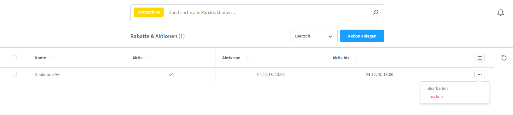

---

## Creating a new discount promotion

### 1. Allgemein (General)

The tab for the basic settings of the promotion.

#### General settings

| Field | Description |
|------|--------------|
| **Name** | Designation of the discount promotion |
| **Priorität** (Priority) | Order when several promotions apply at the same time (higher value = higher priority) |
| **Gültig ab** (Valid from) | Start time (optional) |
| **Gültig bis** (Valid until) | End time (optional) |
| **Gesamtnutzung** (Total usage) | How often the promotion may be used in total |
| **Nutzung je Kunde** (Usage per customer) | How often an individual customer may use the promotion |
| **Aktiv** (Active) | Toggle for activating/deactivating the promotion |

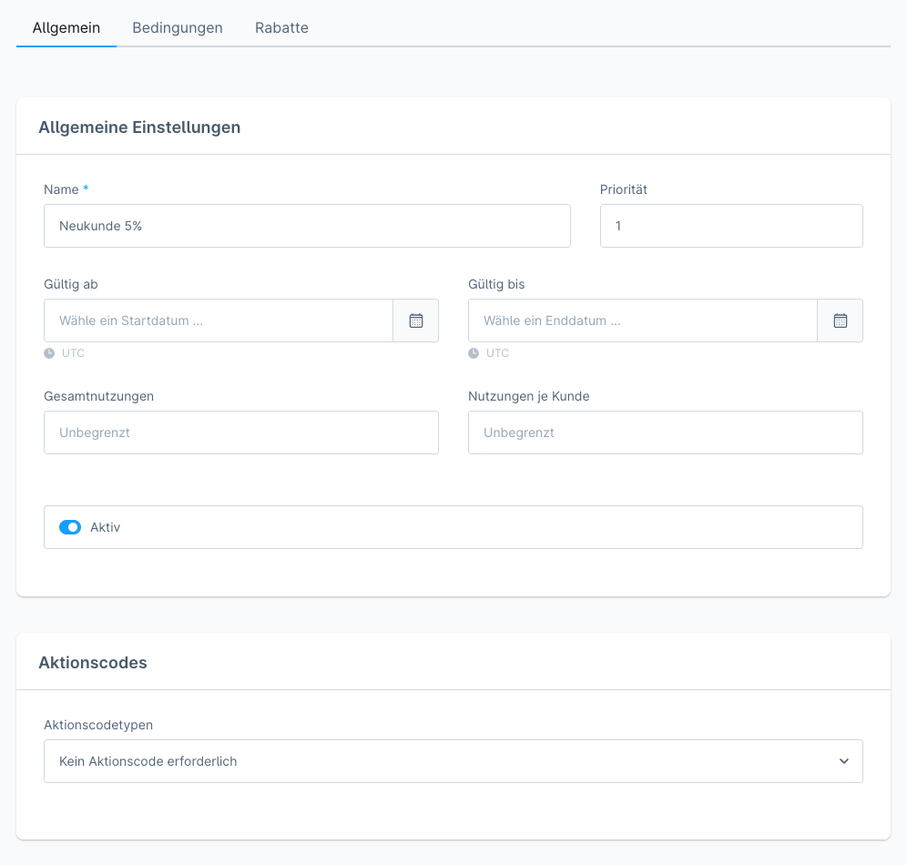

> **Note:** with several simultaneously valid promotions, the field "Priorität" decides which is applied first.

---

### 2. Aktionscodes (Promotion codes)

Three variants for activating a promotion:

#### Kein Aktionscode erforderlich (No promotion code required)
The promotion is applied automatically to all applicable carts. No code is necessary.

#### Festgelegter Aktionscode (Fixed promotion code)
One uniform code that several customers can use.

- The code is defined by the merchant (e.g. `SOMMER20`)
- Can be redeemed multiple times (limited by the total usage/usage per customer)


#### Individuelle Aktionscodes (Individual promotion codes)
Single-use codes for individual customers.

- Codes are generated manually or automatically
- Every code can be redeemed only once
- Suitable for newsletter promotions or personalised offers


> **Note:** it is not possible to apply several different individual codes from one single promotion at the same time.

---

### 3. Bedingungen (Conditions)

Defines for whom and under what circumstances the promotion applies.

#### Voraussetzungen (Prerequisites)

Determines whether customers have to meet certain prerequisites.

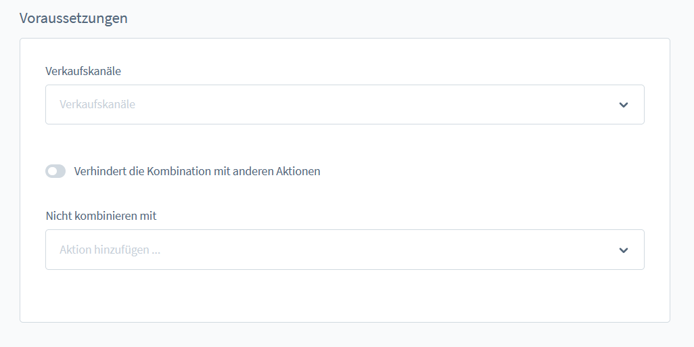

#### Regelbasierte Bedingungen (Rule-based conditions)

Four rule types are available:

| Rule type | Description |
|----------|--------------|
| **Kunden-Regeln** (Customer rules) | Narrow down the target group (e.g. customer group, newsletter status) |
| **Warenkorb-Regeln** (Cart rules) | Set cart conditions (e.g. a minimum order value) |
| **Aktion auf Produkt-Sets** (Promotion on product sets) | Complex product combinations with set groups |
| **Bestellungsregeln** (Order rules) | Payment or shipping method restrictions |

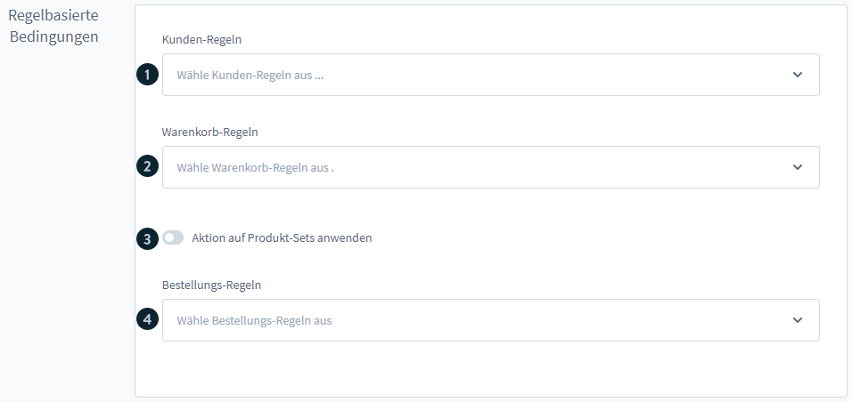
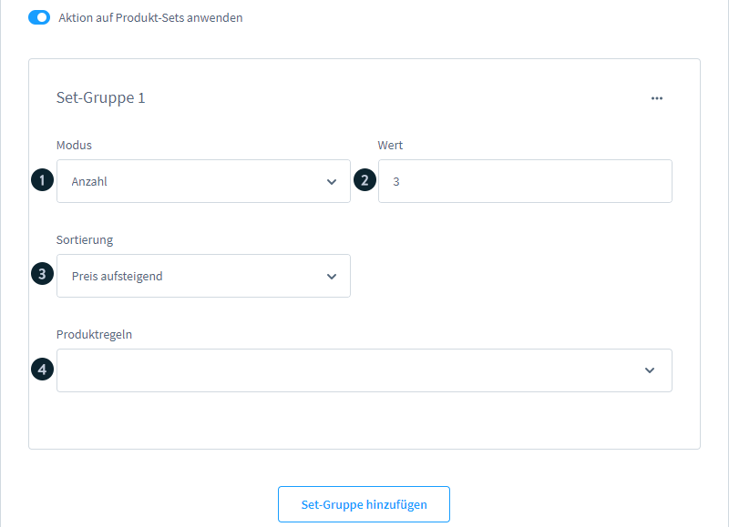

##### Set group properties

| Property | Description |
|-------------|--------------|
| **Modus** (Mode) | Quantity, gross price or net price |
| **Wert** (Value) | Quantity/amount for meeting the condition |
| **Sortierung** (Sorting) | Ascending or descending by purchase price |
| **Produktregeln** (Product rules) | Rule Builder conditions for the product selection |

#### Erweiterte Auswahl (Advanced selection)

Via the advanced selection, further rules for products within the promotion can be defined.

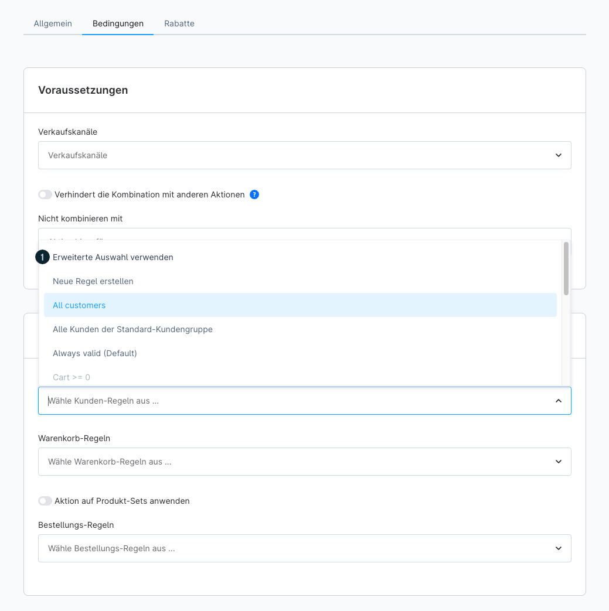
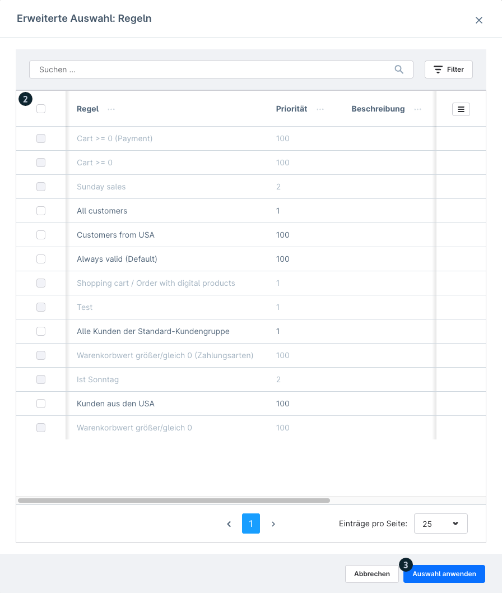

---

### 4. Rabatte (Discounts)

Configuration of the actual discount.

#### "Anwenden auf" (Apply to) categories

| Option | Description |
|--------|--------------|
| **Gesamter Warenkorb** (Entire cart) | Discount on the entire cart value |
| **Versandkosten** (Shipping costs) | Discount on the shipping costs only |
| **Gesamtes Produktset** (Entire product set) | Discount on a defined product set |
| **Spezifische Set-Gruppen** (Specific set groups) | Discount on selected set groups only |

#### Discount types

| Type | Description |
|-----|--------------|
| **Absolut** (Absolute) | Fixed amount (e.g. €10 discount) |
| **Prozentual** (Percentage) | Percentage deduction (with an optional upper limit in €) |
| **Festpreis / Stückpreis** (Fixed price / unit price) | The product is set to a defined price |

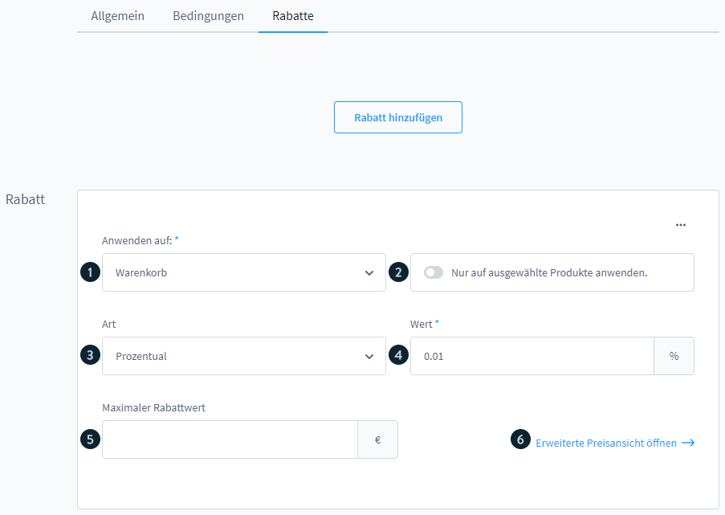

---

## Storefront application

### Entering a voucher code

Customers can enter promotion codes in the cart or in the off-canvas cart:

1. Open the field "Gutschein-Code eingeben" (Enter voucher code)
2. Enter the code
3. Click the confirmation

After entry, discounts are shown in the item overview.

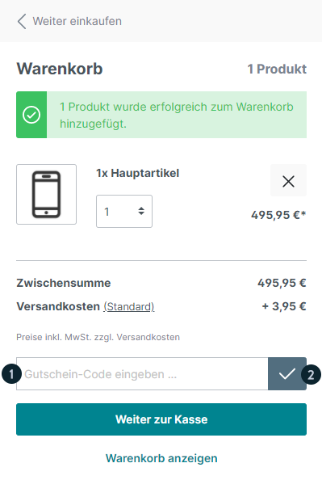
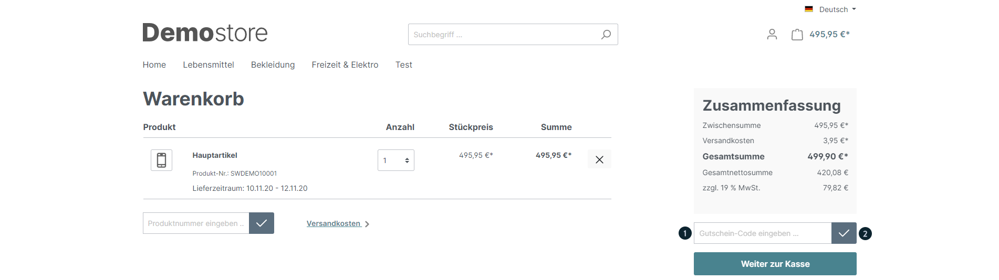
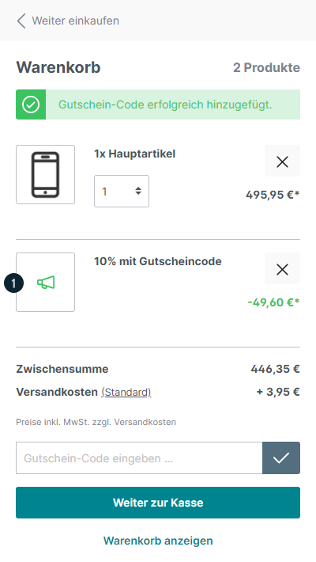
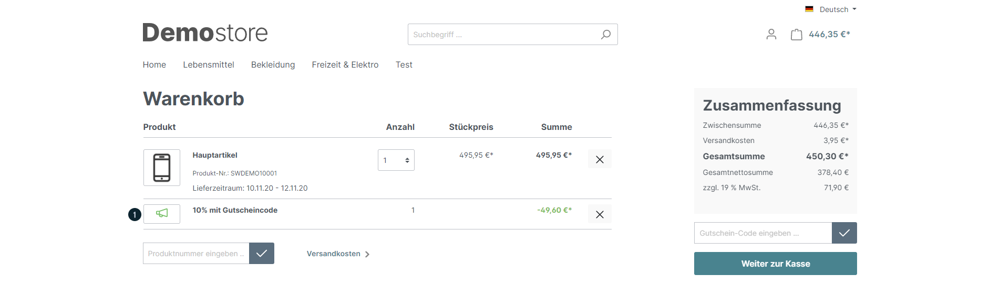

### Presentation of redeemed voucher codes

**Individual code:**
- Visible in Marketing > Rabatte & Aktionen
- Filtering in the order overview by "Aktionscode" is possible

**Fixed code:**
- Can be used multiple times
- Filterable in the order overview by code


---

## 15 practical application examples

### Example 1: free shipping

**Goal:** all customers get free shipping without a code.

| Setting | Value |
|-------------|------|
| Aktionscode | No code required |
| Anwenden auf | Versandkosten |
| Discount type | Prozentual: 100% |

### Example 2: 25% discount on all items

| Setting | Value |
|-------------|------|
| Aktionscode | Fixed: `2022_25` |
| Anwenden auf | Gesamter Warenkorb |
| Discount type | Prozentual: 25% |

### Example 3: fixed price for certain items

| Setting | Value |
|-------------|------|
| Aktionscode | `ALLfor10` |
| Product rule | Rule Builder: the desired products |
| Discount type | Festpreis: €10 |

### Example 4: combining multiple discounts

Combine several discounts in one promotion, e.g.:
- 100% shipping cost discount
- 25% cart discount

### Example 5: VIP customer discount

| Setting | Value |
|-------------|------|
| Kunden-Regel | At least 100 completed orders |
| Aktionscode | No code required |
| Discount type | Prozentual: 5% |

### Example 6: packages

Buy 3 particular items and get each of them for €10 instead of €20:
- Product group: 3 items (set group)
- Fixed price per item: €10

### Example 7: bundles

Combine two product groups (e.g. trousers + T-shirt) with a fixed package price:
- Set group 1: trousers
- Set group 2: T-shirt
- Fixed price for the bundle

### Example 8: buy 3, pay 2

**Goal:** when buying 3 T-shirts the cheapest one is free.

| Setting | Value |
|-------------|------|
| Aktionscode | `kauf3` |
| Set group | Modus: quantity, Wert: 3, Sortierung: ascending by price |
| Anwenden auf | 1st product of the set group |
| Discount type | Prozentual: 100% |

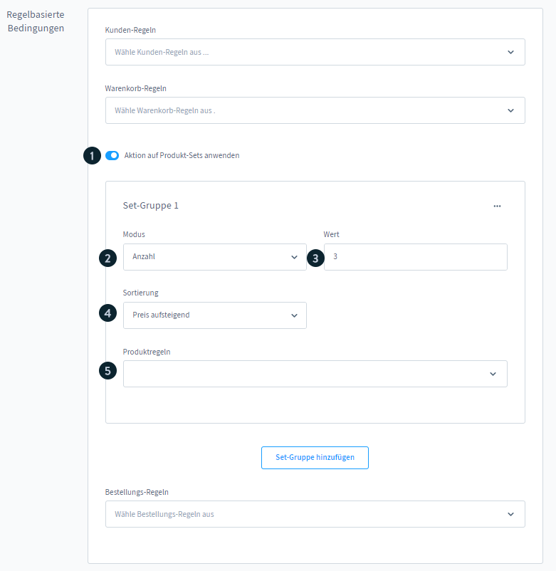

### Example 9: newsletter recipient discount

| Setting | Value |
|-------------|------|
| Kunden-Regel | Kunde ist Newsletter-Empfänger (customer is a newsletter recipient) |
| Discount type | Prozentual: 10%, max. €150 |

### Example 10: customer group discount

| Setting | Value |
|-------------|------|
| Kunden-Regel | A particular customer group |
| Aktionscode | No code required |
| Discount type | Prozentual: X% |

### Example 11: free shipping above a cart value

| Setting | Value |
|-------------|------|
| Warenkorb-Regel | Sum of all line items ≥ €50 |
| Anwenden auf | Versandkosten |
| Discount type | Prozentual: 100% |

> **Tip:** tiering is possible: 50% from €25, 100% from €100 (create separate promotions).

### Example 12: category-specific discounts

Rule Builder condition:
```
Position in Kategorie | Mind. eine | ist eine von | [gewählte Kategorie]
```

### Example 13: manufacturer-specific discounts

Rule Builder condition:
```
Position mit Hersteller | Mind. eine | ist eine von | [Hersteller]
```

### Example 14: free items

1. Mark the items with the tag "gratis"
2. Create a dynamic product group for the "gratis" tag
3. Use the cross-selling function to display the items
4. Discount: 100% on the items of the product group

### Example 15: single product discounts

Rule Builder: select a single product, then configure a percentage discount on the cart with a product rule.

---

## Further notes

- **Priorität:** when using several promotions at the same time, the priority decides the order of application.
- **Verkaufskanäle** (Sales channels)**:** promotions can be restricted to particular sales channels.
- **Rule Builder:** for complex conditions use the Rule Builder under Einstellungen > Automatisierung > Rule Builder. See `sw-merchant-marketing-rule-builder`.
